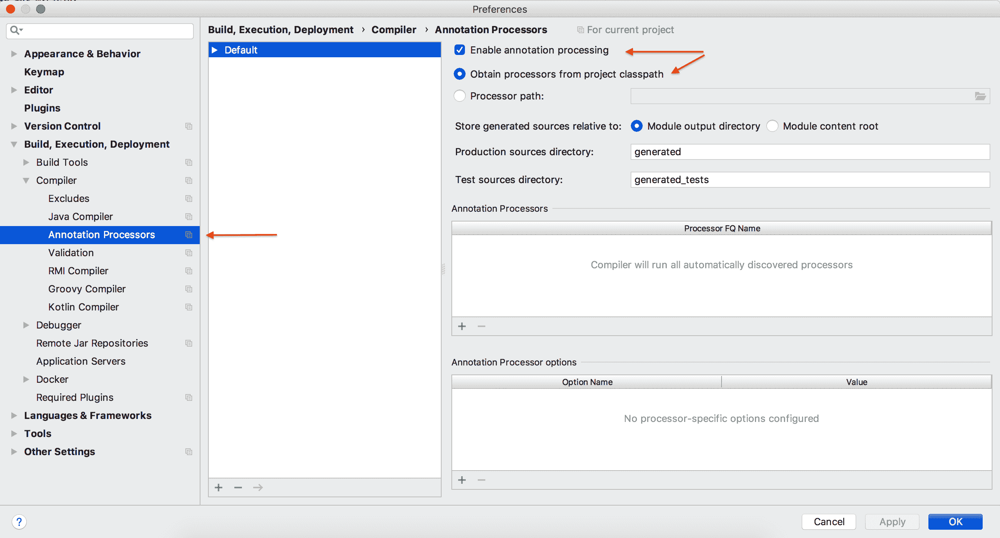
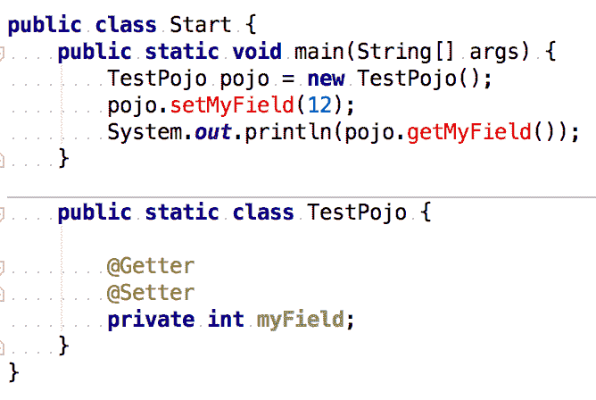
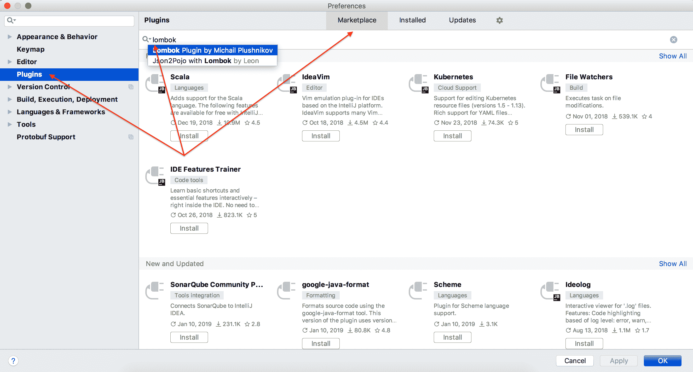
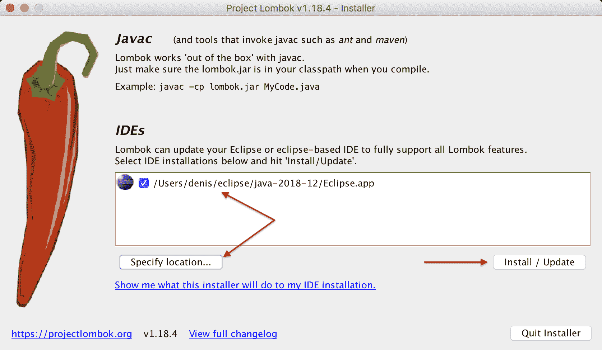
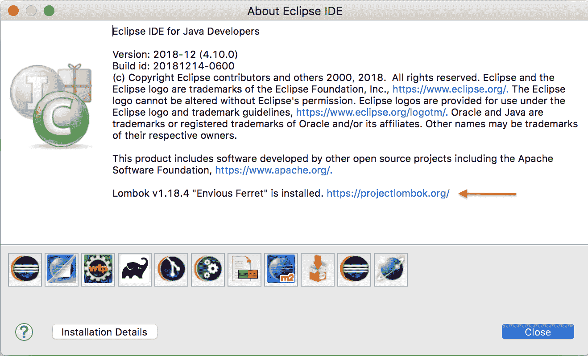

# 用 Eclipse 和 Intellij 设置 Lombok

> 原文：<https://web.archive.org/web/20220930061024/https://www.baeldung.com/lombok-ide>

## 1。概述

[Lombok](/web/20220726143610/https://www.baeldung.com/intro-to-project-lombok) 是一个方便许多繁琐任务并减少 Java 源代码冗长的库。

当然，我们通常希望能够在 IDE 中使用该库，这需要额外的设置。

在本教程中，我们将讨论在两个最流行的 Java IDEs 中配置 Lombok——IntelliJ IDEA 和 Eclipse。

## 延伸阅读:

## [使用 Lombok 的@Builder 注释](/web/20220726143610/https://www.baeldung.com/lombok-builder)

Learn how the @Builder annotation in Project Lombok can help you reduce boilerplate code when implementing the builder pattern to create instances of your Java classes.[Read more](/web/20220726143610/https://www.baeldung.com/lombok-builder) →

## [龙目岛项目简介](/web/20220726143610/https://www.baeldung.com/intro-to-project-lombok)

A comprehensive and very practical introduction to many useful usecases of Project Lombok on standard Java code.[Read more](/web/20220726143610/https://www.baeldung.com/intro-to-project-lombok) →

## 2。IntelliJ IDEA 中的 lombok

从 IntelliJ 版本 [2020.3](https://web.archive.org/web/20220726143610/https://www.jetbrains.com/idea/whatsnew/2020-3/#other) 开始，我们不再需要配置 IDE 来使用 Lombok。IDE 与插件捆绑在一起。此外，注释处理将自动启用。

在 IntelliJ 的早期版本中，我们需要执行以下步骤来使用 Lombok。此外，如果我们使用最新版本，而 IDE 无法识别 Lombok 注释，我们需要验证以下配置没有被手动禁用。

### 2.1。启用注释处理

Lombok 通过 [APT](https://web.archive.org/web/20220726143610/https://docs.oracle.com/javase/7/docs/technotes/guides/apt/GettingStarted.html) 使用注释处理。因此，当编译器调用它时，该库根据原始文件中的注释生成新的源文件。

然而，默认情况下，注释处理是不启用的。

因此，首先要做的是在我们的项目中启用注释处理。

我们需要前往`Preferences | Build, Execution, Deployment | Compiler | Annotation Processors`并确保以下事项:

*   `Enable annotation processing`框被选中
*   `Obtain processors from project classpath`选项被选中

[](/web/20220726143610/https://www.baeldung.com/wp-content/uploads/2019/01/lombok1.png)

### 2.2。安装 IDE 插件

虽然 Lombok 只在编译期间生成代码，但 IDE 会突出显示原始源代码中的错误:

[](/web/20220726143610/https://www.baeldung.com/wp-content/uploads/2019/01/lobom2.png)

有一个专门的插件可以让 IntelliJ 知道将要生成的源代码。**安装后，错误消失，常规功能如`Find Usages`和`Navigate To`开始工作。**

我们需要转到`Preferences | Plugins`，打开`Marketplace`选项卡，键入“lombok”并选择`Lombok Plugin by Michail Plushnikov`:

[](/web/20220726143610/https://www.baeldung.com/wp-content/uploads/2019/01/lombok3.png)

接下来，点击插件页面上的`Install`按钮:

[](/web/20220726143610/https://www.baeldung.com/wp-content/uploads/2019/01/lombok4.png)

安装完成后，点击`Restart IDE`按钮:

[](/web/20220726143610/https://www.baeldung.com/wp-content/uploads/2019/01/lombok5.png)

## 3。日蚀中的龙目岛

如果我们使用 Eclipse IDE，我们需要首先获得 Lombok jar。最新版本位于 [Maven 中央](https://web.archive.org/web/20220726143610/https://search.maven.org/search?q=g:org.projectlombok%20AND%20a:lombok&core=gav)。

对于我们的例子，我们使用的是 [lombok-1.18.4.jar](https://web.archive.org/web/20220726143610/https://search.maven.org/remotecontent?filepath=org/projectlombok/lombok/1.18.4/lombok-1.18.4.jar) 。

接下来，我们可以通过`java -jar`命令运行 jar，一个安装程序 UI 将会打开。这将尝试自动检测所有可用的 Eclipse 安装，但是也可以手动指定位置。

一旦我们选择了安装，我们按下`Install/Update`按钮:

[](/web/20220726143610/https://www.baeldung.com/wp-content/uploads/2019/01/lombok6.png)

如果安装成功，我们可以退出安装程序。

安装插件后，我们需要重启 IDE 并确保 Lombok 配置正确。我们可以在`About`对话框中检查:

[](/web/20220726143610/https://www.baeldung.com/wp-content/uploads/2019/01/lombok7.png)

## 4。将 Lombok 添加到编译类路径

剩下的最后一部分是确保 Lombok 二进制文件在编译器类路径上。使用 Maven，我们可以将依赖关系添加到`pom.xml`:

```
<dependencies>
    <dependency>
        <groupId>org.projectlombok</groupId>
        <artifactId>lombok</artifactId>
        <version>1.18.20</version>
        <scope>provided</scope>
    </dependency>
</dependencies>
```

最新版本位于 [Maven Central](https://web.archive.org/web/20220726143610/https://search.maven.org/search?q=g:org.projectlombok%20AND%20a:lombok&core=gav) 上。

现在一切应该都好了。源代码应该在 IDE 中正确编译和执行，没有错误:

```
public class UserIntegrationTest {

    @Test
    public void givenAnnotatedUser_thenHasGettersAndSetters() {
        User user = new User();
        user.setFirstName("Test");
        assertEquals(user.gerFirstName(), "Test");
    }

    @Getter @Setter
    class User {
        private String firstName;
    }
}
```

## 5。结论

Lombok 在减少 Java 冗长和掩盖样板文件方面做得很好。在本文中，我们检查了如何为两种最流行的 Java IDEs 配置该工具。

GitHub 上的[提供了示例的源代码。](https://web.archive.org/web/20220726143610/https://github.com/eugenp/tutorials/tree/master/lombok-modules/lombok)