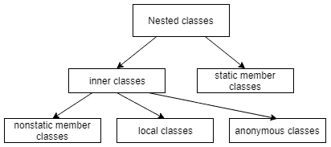

# Java 中的匿名类

> 原文:[https://web . archive . org/web/20220930061024/https://www . bael dung . com/Java-anonymous-classes](https://web.archive.org/web/20220930061024/https://www.baeldung.com/java-anonymous-classes)

## 1.介绍

在本教程中，我们将考虑 Java 中的匿名类。

我们将描述如何声明和创建它们的实例。我们还将简要讨论它们的属性和局限性。

## 2.匿名类声明

匿名类是没有名字的内部类。由于它们没有名字，我们不能使用它们来创建匿名类的实例。因此，我们必须在使用时用一个表达式来声明和实例化匿名类。

我们可以扩展一个现有的类或者实现一个接口。

### 2.1.扩展一个类

当我们从一个现有的匿名类实例化一个匿名类时，我们使用下面的语法:

[](/web/20221107160807/https://www.baeldung.com/wp-content/uploads/2019/04/AnonymousClass-InstantiateFromClass.png)

在括号中，我们指定了我们正在扩展的类的构造函数所需的参数:

```
new Book("Design Patterns") {
    @Override
    public String description() {
        return "Famous GoF book.";
    }
}
```

当然，如果父类构造函数不接受任何参数，我们应该将括号留空。

### 2.2.实现一个接口

我们也可以从接口实例化一个匿名类:

[](/web/20221107160807/https://www.baeldung.com/wp-content/uploads/2019/04/AnonymousClass-InstantiateFromInterface.png)

显然，Java 的接口没有构造函数，所以括号总是空的。这是我们实现接口方法的唯一方式:

```
new Runnable() {
    @Override
    public void run() {
        ...
    }
}
```

一旦我们实例化了一个匿名类，我们可以将该实例赋给一个变量，以便能够在以后的某个地方引用它。

我们可以使用 Java 表达式的标准语法来做到这一点:

```
Runnable action = new Runnable() {
    @Override
    public void run() {
        ...
    }
};
```

正如我们已经提到的，**匿名类声明是一个表达式，因此它必须是语句**的一部分。这解释了为什么我们在语句的末尾加了一个分号。

显然，如果我们以内联方式创建实例，就可以避免将实例赋给变量:

```
List<Runnable> actions = new ArrayList<Runnable>();
actions.add(new Runnable() {
    @Override
    public void run() {
        ...
    }
});
```

我们应该非常小心地使用这个语法，因为它可能很容易影响代码的可读性，尤其是当`run()`方法的实现占用了大量空间的时候。

## 3.匿名类属性

相对于通常的顶级类，使用匿名类有一些特殊性。这里我们简要地谈一下最实际的问题。为了获得最精确和最新的信息，我们可以经常查看 Java 语言规范。

### 3.1.构造器

匿名类的语法不允许我们让它们实现多个接口。在构造过程中，**可能恰好存在一个匿名类**的实例。因此，它们永远不可能是抽象的。既然它们没有名字，我们就不能扩展它们。出于同样的原因，匿名类不能有显式声明的构造函数。

事实上，缺少构造函数对我们来说并不代表任何问题，原因如下:

1.  我们在声明匿名类实例的同时创建它们
2.  从匿名类实例中，我们可以访问局部变量和封闭类的成员

### 3.2.静态成员

匿名类不能有任何静态成员，常量成员除外。

例如，这不会编译:

```
new Runnable() {
    static final int x = 0;
    static int y = 0; // compilation error!

    @Override
    public void run() {...}
};
```

相反，我们将得到以下错误:

```
The field y cannot be declared static in a non-static inner type, unless initialized with a constant expression
```

### 3.3.变量的范围

匿名类捕获我们声明该类的块范围内的局部变量:

```
int count = 1;
Runnable action = new Runnable() {
    @Override
    public void run() {
        System.out.println("Runnable with captured variables: " + count);
    }           
}; 
```

正如我们所见，局部变量`count`和*动作*被定义在同一个块中。因此，我们可以从类声明中访问`count`。

**注意，为了能够使用局部变量，它们必须是有效的 final。**从 JDK 8 开始，我们不再需要用关键字`final`声明变量。然而，那些变量必须是`final`。否则，我们会得到一个编译错误:

```
[ERROR] local variables referenced from an inner class must be final or effectively final
```

为了让编译器决定一个变量实际上是不可变的，在代码中，应该只有一个地方我们给它赋值。我们可能会在文章"[中找到更多关于有效最终变量的信息，为什么 Lambdas 中使用的局部变量必须是最终的或有效最终的？](/web/20221107160807/https://www.baeldung.com/java-lambda-effectively-final-local-variables)

让我们提一下，作为每个内部类，**一个匿名类可以访问它的封闭类**的所有成员。

## 4.匿名类用例

匿名类的应用可能有很多种。让我们探索一些可能的用例。

### 4.1.类层次结构和封装

我们应该在一般用例中使用内部类，在非常特殊的用例中使用匿名类，以便在我们的应用程序中实现更清晰的类层次结构。当使用内部类时，我们可以更好地封装封闭类的数据。如果我们在顶级类中定义了内部类的功能，那么封闭类应该有一些成员的`public`或`package`可见性。自然也有不太被欣赏甚至不被接受的情况。

### 4.2.更清洁的项目结构

当我们必须修改某些类的方法的实现时，我们通常使用匿名类。在这种情况下，我们可以避免为了定义顶级类而向项目中添加新的`*.java`文件。如果这个顶级类只使用一次，那就更是如此。

### 4.3.UI 事件侦听器

在具有图形界面的应用程序中，匿名类最常见的用例是创建各种事件侦听器。例如，在下面的代码片段中:

```
button.addActionListener(new ActionListener() {
    public void actionPerformed(ActionEvent e) {
        ...
    }
}
```

我们创建了一个匿名类的实例，它实现了接口`ActionListener.`，当用户点击按钮时，它的`actionPerformed`方法被触发。

自从 Java 8 以来，lambda 表达式似乎是更受欢迎的方式。

## 5.概貌

我们上面考虑的匿名类只是嵌套类的一个特例。一般来说，**嵌套类是** **在另一个类或接口**内声明的类:

[](/web/20221107160807/https://www.baeldung.com/wp-content/uploads/2019/04/nested-classes.png)

查看该图，我们看到匿名类与`local`和`nonstatic member ones`一起形成了所谓的`inner classes`。它们和`static member`类一起构成了嵌套类。

## 6.结论

在本文中，我们考虑了 Java 匿名类的各个方面。我们还描述了嵌套类的一般层次结构。

和往常一样，完整的代码可以在我们的 GitHub 库的[中找到。](https://web.archive.org/web/20221107160807/https://github.com/eugenp/tutorials/tree/master/core-java-modules/core-java-lang-oop-inheritance)