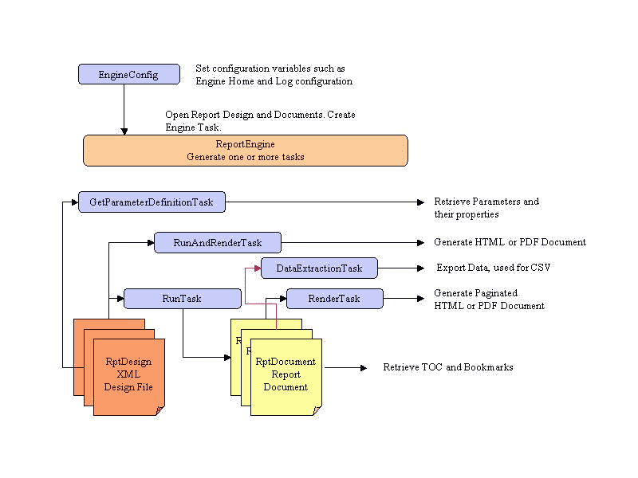

# BIRT 在 Spring Boot 报道

> 原文：<https://web.archive.org/web/20220930061024/https://www.baeldung.com/birt-reports-spring-boot>

## 1.介绍

在本教程中，我们将集成 BIRT(商业智能和报告工具)与 Spring Boot MVC，以提供 HTML 和 PDF 格式的静态和动态报告。

## 2.什么是`BIRT`？

BIRT 是一个创建数据可视化的开源引擎，可以集成到 Java 网络应用中。

它是 Eclipse Foundation 中的顶级软件项目，利用了 IBM 和 Innovent Solutions 的贡献。它由安讯于 2004 年底发起并赞助。

该框架允许创建与各种数据源集成的报告。

## 3.Maven 依赖性

BIRT 有两个主要组件:创建报表设计文件的可视化报表设计器，以及解释和呈现这些设计的运行时组件。

在我们的示例 web 应用程序中，我们将在 Spring Boot 上使用这两者。

### 3.1.BIRT 框架依赖项

由于我们习惯于从依赖性管理的角度来考虑，第一选择将是在 Maven Central 中寻找 BIRT。

不过，**目前可用的核心库最新正式版本是 2016** 起的 [4.6，而在](https://web.archive.org/web/20220524054316/https://search.maven.org/search?q=a:org.eclipse.birt.runtime) [Eclipse 下载页面](https://web.archive.org/web/20220524054316/https://download.eclipse.org/birt/downloads/build_list.php)上，我们可以找到至少两个更新版本的链接(**当前为 4.8** )。

如果我们选择官方版本，让代码运行起来最简单的方法就是下载 [BIRT 报告引擎](https://web.archive.org/web/20220524054316/https://www.eclipse.org/downloads/download.php?file=/birt/downloads/drops/R-R1-4.8.0-201806261756/birt-runtime-4.8.0-20180626.zip)包，这是一个完整的网络应用程序，对学习也很有用。然后我们需要将它的`lib`文件夹复制到我们的项目中(大约 68MB 大小),并告诉 IDE 将所有的 jar 都包含在其中。

不言而喻，使用这种方法，**我们将只能通过 IDE** 进行编译，因为 Maven 不会找到那些 jar，除非我们手动配置和安装它们(超过 100 个文件！)在我们当地回购。

幸运的是， **Innovent Solutions 已经决定接手此事，[在 Maven Central 上发布了它自己构建的最新 BIRT 依赖项](https://web.archive.org/web/20220524054316/https://search.maven.org/search?q=a:%20org.eclipse.birt.runtime_4.8.0-20180626)** ，这很棒，因为它为我们管理了所有需要的依赖项。

通过阅读在线论坛中的评论，不清楚这些工件是否已经准备好投入生产，但是 Innovent Solutions 从一开始就在 Eclipse 团队旁边工作，所以我们的项目依赖于它们。

包括 BIRT 现在非常容易:

```
<dependency>
    <groupId>com.innoventsolutions.birt.runtime</groupId>
    <artifactId>org.eclipse.birt.runtime_4.8.0-20180626</artifactId>
    <version>4.8.0</version>
</dependency>
```

### 3.2.Spring Boot 属地

既然 BIRT 已经导入到我们的项目中，我们只需要在 pom 文件中添加标准的 Spring Boot 依赖项。

但是有一个陷阱，因为 BIRT jar 包含自己的`Slf4J`实现，它与`Logback`不兼容，并在启动时抛出一个冲突异常。

因为我们不能从 jar 中删除它，为了解决这个问题，**我们需要排除 Logback** :

```
<dependency>
    <groupId>org.springframework.boot</groupId>
    <artifactId>spring-boot-starter-logging</artifactId>
    <exclusions>
        <exclusion>
            <groupId>ch.qos.logback</groupId>
            <artifactId>logback-classic</artifactId>
        </exclusion>
    </exclusions>
</dependency>
```

现在我们终于准备好开始了！

## 4.BIRT 报道

在 BIRT 框架中，**报告是一个长的 XML 配置文件**，由扩展名`rptdesign`标识。

**它告诉引擎要画什么和在哪里画**，从标题的样式到连接数据源所需的属性。

对于一个基本的动态报告，我们需要配置三样东西:

1.  数据源(在我们的例子中，我们使用一个本地 CSV 文件，但是它也可以是一个数据库表)
2.  我们想要显示的元素(图表、表格等)
3.  页面设计

报告的结构类似于 HTML 页面，有页眉、正文、页脚、脚本和样式。

**该框架提供了一组广泛的组件供您选择，包括与主流数据源、布局、图表和表格的集成。并且，我们可以扩展它来添加我们自己的！**

生成报告文件有两种方式:可视化方式或编程方式。

## 5.Eclipse 报表设计器

为了简化报告的创建，**Eclipse 团队为其流行的 IDE 构建了一个报告设计工具**插件。

**这个工具的特点是从左边的`Palette`中轻松拖拽&拖放界面**，它会自动为我们添加到页面的新组件打开设置窗口。我们还可以通过在页面上单击组件，然后单击`Property Editor`按钮(在下图中突出显示)来查看每个组件的所有可用定制。

要在树形视图中可视化整个页面结构，我们只需点击`Outline`按钮。

**`Data Explorer`页签还包含为我们的报表定义的数据源:**


图中显示的报表样本可以在`<project_root>/reports/csv_data_report.rptdesign`路径下找到

使用可视化设计器的另一个优势是在线文档，在线文档更侧重于这个工具，而不是编程方法。

如果我们已经在使用 Eclipse，我们只需要安装 BIRT 报表设计插件，它包括一个预定义的透视图和可视化编辑器。

**对于那些目前没有使用 Eclipse** 并且不想转换的开发者来说，**有一个 [Eclipse 报告设计器](https://web.archive.org/web/20220524054316/https://www.eclipse.org/downloads/download.php?file=/birt/downloads/drops/R-R1-4.8.0-201806261756/birt-report-designer-all-in-one-4.8.0-20180626-win32.win32.x86_64.zip)包**，它由一个预先安装了 BIRT 插件的可移植 Eclipse 安装包组成。

一旦报告文件完成，我们可以将它保存在我们的项目中，并在我们首选的环境中继续编码。

## 6.规划方法

我们也可以**只使用代码**来设计一个报告，但是由于可用的文档很少，这种方法要困难得多，所以要准备好钻研源代码和在线论坛。

同样值得考虑的是，所有的**繁琐的设计细节**像尺寸、长度和网格位置**使用设计器**会更容易处理。

为了证明这一点，这里有一个如何定义一个简单的带有图像和文本的静态页面的例子:

```
DesignElementHandle element = factory.newSimpleMasterPage("Page Master");
design.getMasterPages().add(element);

GridHandle grid = factory.newGridItem(null, 2, 1);
design.getBody().add(grid);

grid.setWidth("100%"); 

RowHandle row0 = (RowHandle) grid.getRows().get(0);

ImageHandle image = factory.newImage(null);
CellHandle cell = (CellHandle) row0.getCells().get(0);
cell.getContent().add(image);
image.setURL("\"https://www.baeldung.com/wp-content/themes/baeldung/favicon/favicon-96x96.png\"");

LabelHandle label = factory.newLabel(null);
cell = (CellHandle) row0.getCells().get(1);
cell.getContent().add(label);
label.setText("Hello, Baeldung world!");
```

这段代码将生成一个简单(并且难看)的报告:


上图中显示的报表样本可以在以下路径找到:`<project_root>/reports/static_report.rptdesign.`

一旦我们编写了报告应该是什么样子以及应该显示什么数据，我们就可以通过运行我们的`ReportDesignApplication`类来生成 XML 文件。

## 7.附加数据源

我们前面提到过，BIRT 支持许多不同的数据源。

对于我们的示例项目，我们使用了一个包含三个条目的简单 CSV 文件。它可以在`reports`文件夹中找到，由三行简单的数据和标题组成:

```
Student, Math, Geography, History
Bill, 10,3,8
Tom, 5,6,5
Anne, 7, 4,9
```

### 7.1.配置数据源

为了让 BIRT 使用我们的文件(或任何其他类型的源文件)，**我们必须配置一个`Data Source`** 。

对于我们的文件，我们用报表设计器创建了一个`Flat File Data Source`，所有这些只需要几个步骤:

1.  打开 designer 透视图，查看右边的`outline`。
2.  右击`Data Sources`图标。
3.  选择所需的源类型(在我们的例子中是平面文件源)。
4.  我们现在可以选择加载整个文件夹或只加载一个文件。我们使用了第二个选项(如果我们的数据文件是 CSV 格式的，我们希望确保使用第一行作为列名指示器)。
5.  测试连接以确保路径正确。

我们附上了一些图片来展示每个步骤:

[](https://web.archive.org/web/20220524054316/https://www.baeldung.com/wp-content/uploads/2019/04/birt_gallery_1.png)

[](https://web.archive.org/web/20220524054316/https://www.baeldung.com/wp-content/uploads/2019/04/birt_gallery_2.png)

[](https://web.archive.org/web/20220524054316/https://www.baeldung.com/wp-content/uploads/2019/04/birt_gallery_3.png)

[](https://web.archive.org/web/20220524054316/https://www.baeldung.com/wp-content/uploads/2019/04/birt_gallery_4.png)

### 7.2.数据集

数据源已经准备好了，但是我们仍然需要定义我们的`Data Set`，它是我们的报告中显示的实际数据:

1.  打开 designer 透视图，查看右边的`outline`。
2.  右击`Data Sets` 图标。
3.  选择所需的`Data Source`和类型(在我们的例子中只有一种类型)。
4.  下一个屏幕取决于我们选择的数据源和数据集的类型:在我们的例子中，我们看到一个页面，我们可以在其中选择要包含的列。
5.  设置完成后，我们可以通过双击数据集随时打开配置。
6.  在`Output Columns`中，我们可以设置显示数据的正确类型。
7.  然后我们可以点击`Preview Results.`查看预览

再次用一些图片来阐明这些步骤:

[](https://web.archive.org/web/20220524054316/https://www.baeldung.com/wp-content/uploads/2019/04/birt_gallery_5.png)

[](https://web.archive.org/web/20220524054316/https://www.baeldung.com/wp-content/uploads/2019/04/birt_gallery_6.png)

[](https://web.archive.org/web/20220524054316/https://www.baeldung.com/wp-content/uploads/2019/04/birt_gallery_7.png)

[](https://web.archive.org/web/20220524054316/https://www.baeldung.com/wp-content/uploads/2019/04/birt_gallery_8.png)

### 7.3.其他数据源类型

如`Data Set`配置的第 4 步所述，可用的选项可能会根据参考的`Data Source`而变化。

对于我们的 CSV 文件，BIRT 给出了与要显示哪些列、数据类型以及是否要加载整个文件相关的选项。另一方面，如果我们有一个 JDBC 数据源，我们可能必须编写一个 SQL 查询或存储过程。

从`Data Sets`菜单中，**我们还可以将两个或多个数据集加入一个新的数据集**。

## 8.呈现报告

一旦报告文件准备好了，我们必须将它传递给引擎进行渲染。要做到这一点，有几件事情需要实现。

### 8.1.初始化引擎

解释设计文件并生成最终结果的`ReportEngine`类是 BIRT 运行时库的一部分。

它使用一堆助手和任务来完成这项工作，这使得它非常耗费资源:



图片来源:Eclipse BIRT 文档

**创建一个引擎实例**会有很大的开销，主要是加载扩展的开销。因此，**我们应该只创建一个`ReportEngine`实例，并用它来运行多个报告**。

报告引擎是通过由`Platform`提供的工厂创建的。在创建引擎之前，我们必须启动`Platform`，它将加载适当的插件:

```
@PostConstruct
protected void initialize() throws BirtException {
    EngineConfig config = new EngineConfig();
    config.getAppContext().put("spring", this.context);
    Platform.startup(config);
    IReportEngineFactory factory = (IReportEngineFactory) Platform
      .createFactoryObject(IReportEngineFactory.EXTENSION_REPORT_ENGINE_FACTORY);
    birtEngine = factory.createReportEngine(config);
    imageFolder = System.getProperty("user.dir") + File.separatorChar + reportsPath + imagesPath;
    loadReports();
}
```

当我们不再需要它时，我们可以销毁它:

```
@Override
public void destroy() {
    birtEngine.destroy();
    Platform.shutdown();
}
```

### 8.2.实现输出格式

**BIRT 已经支持多种输出格式:** **HTML、PDF、PPT、ODT** 等等。

对于示例项目，我们用方法`generatePDFReport`和`generateHTMLReport`实现了其中的两个。

根据所需的特定属性，如输出格式和图像处理程序，它们略有不同。

事实上，pdf 将图像和文本嵌入在一起，而 HTML 报告需要生成它们和/或链接它们。

因此，**PDF 渲染功能非常简单**:

```
private void generatePDFReport(IReportRunnable report, HttpServletResponse response, 
  HttpServletRequest request) {
    IRunAndRenderTask runAndRenderTask = birtEngine.createRunAndRenderTask(report);
    response.setContentType(birtEngine.getMIMEType("pdf"));
    IRenderOption options = new RenderOption();
    PDFRenderOption pdfRenderOption = new PDFRenderOption(options);
    pdfRenderOption.setOutputFormat("pdf");
    runAndRenderTask.setRenderOption(pdfRenderOption);
    runAndRenderTask.getAppContext().put(EngineConstants.APPCONTEXT_PDF_RENDER_CONTEXT, request);

    try {
        pdfRenderOption.setOutputStream(response.getOutputStream());
        runAndRenderTask.run();
    } catch (Exception e) {
        throw new RuntimeException(e.getMessage(), e);
    } finally {
        runAndRenderTask.close();
    }
}
```

**而 HTML 渲染功能需要更多设置:**

```
private void generateHTMLReport(IReportRunnable report, HttpServletResponse response, 
  HttpServletRequest request) {
    IRunAndRenderTask runAndRenderTask = birtEngine.createRunAndRenderTask(report);
    response.setContentType(birtEngine.getMIMEType("html"));
    IRenderOption options = new RenderOption();
    HTMLRenderOption htmlOptions = new HTMLRenderOption(options);
    htmlOptions.setOutputFormat("html");
    htmlOptions.setBaseImageURL("/" + reportsPath + imagesPath);
    htmlOptions.setImageDirectory(imageFolder);
    htmlOptions.setImageHandler(htmlImageHandler);
    runAndRenderTask.setRenderOption(htmlOptions);
    runAndRenderTask.getAppContext().put(
      EngineConstants.APPCONTEXT_BIRT_VIEWER_HTTPSERVET_REQUEST, request);

    try {
        htmlOptions.setOutputStream(response.getOutputStream());
        runAndRenderTask.run();
    } catch (Exception e) {
        throw new RuntimeException(e.getMessage(), e);
    } finally {
        runAndRenderTask.close();
    }
}
```

最值得注意的是，**我们设置了`HTMLServerImageHandler`** 而不是保留默认的处理程序。这个微小的差异对生成的`img`标签有很大的影响:

*   **默认处理程序将`img`标签链接到文件系统路径**，出于安全考虑，许多浏览器都阻止了该路径
*   **`HTMLServerImageHandler`链接到服务器的网址**

使用`setImageDirectory`方法，我们指定引擎将保存生成的图像文件的位置。

默认情况下，处理程序在每次请求时都会生成一个新文件，因此**我们可以添加一个缓存层或删除策略**。

### 8.3.发布图像

在 HTML 报告的情况下，图像文件是外部的，所以它们需要在服务器路径上可访问。

在上面的代码中，通过`setBaseImageURL`方法，我们告诉引擎应该在`img`标签链接中使用什么相对路径，所以我们需要确保该路径实际上是可访问的！

出于这个原因，在我们的`ReportEngineApplication`中，我们配置 Spring 来发布`images`文件夹:

```
@SpringBootApplication
@EnableWebMvc
public class ReportEngineApplication implements WebMvcConfigurer {
    @Value("${reports.relative.path}")
    private String reportsPath;
    @Value("${images.relative.path}")
    private String imagesPath;

    ...

    @Override
    public void addResourceHandlers(ResourceHandlerRegistry registry) {
        registry
          .addResourceHandler(reportsPath + imagesPath + "/**")
          .addResourceLocations("file:///" + System.getProperty("user.dir") + "/" 
            + reportsPath + imagesPath);
    }
}
```

无论我们选择什么路径，我们都必须确保在这里和前面代码片段的`htmlOptions`中使用相同的路径，否则我们的报告将无法显示图像。

## 9.显示报告

让我们的应用程序做好准备的最后一个组件是一个返回渲染结果的`Controller`:

```
@RequestMapping(method = RequestMethod.GET, value = "/report/{name}")
@ResponseBody
public void generateFullReport(HttpServletResponse response, HttpServletRequest request,
  @PathVariable("name") String name, @RequestParam("output") String output) 
  throws EngineException, IOException {
    OutputType format = OutputType.from(output);
    reportService.generateMainReport(name, format, response, request);
}
```

使用`output`参数，我们可以让用户选择想要的格式——HTML 或 PDF。

## 10.测试报告

我们可以通过运行`ReportEngineApplication`类来启动应用程序。

在启动过程中，`BirtReportService`类将加载在`<project_root>/reports`文件夹中找到的所有报告。

要查看我们的报告，我们只需将浏览器指向:

*   /report/csv_data_report？输出=pdf
*   /report/csv_data_report？输出=html
*   /report/static_report？输出=pdf
*   /report/static_report？输出=html

下面是`csv_data_report`报告的样子:


要在更改设计文件后重新加载报告，我们只需将浏览器指向`/report/reload.`

## 11.结论

在本文中，我们将 BIRT 与 Spring Boot 结合起来，探讨了它的缺陷和挑战，以及它的力量和灵活性。

这篇文章的源代码可以在 GitHub 的[上找到。](https://web.archive.org/web/20220524054316/https://github.com/eugenp/tutorials/tree/master/spring-boot-modules/spring-boot-mvc-birt)