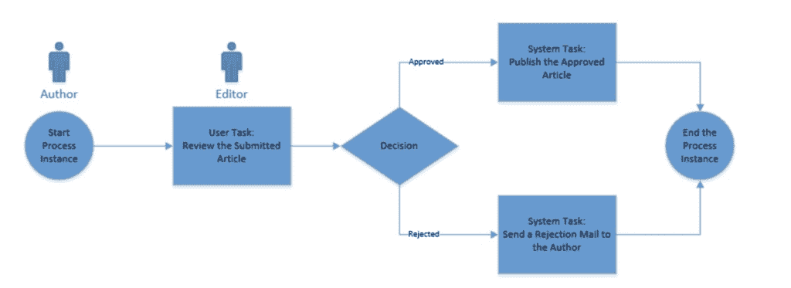

# 易流动简介

> 原文：<https://web.archive.org/web/20220930061024/https://www.baeldung.com/flowable>

## 1.概观

[Flowable](https://web.archive.org/web/20220630010854/https://www.flowable.org/) 是用 Java 编写的业务流程引擎。在本教程中，我们将详细介绍业务流程，并理解如何利用可流动的 Java API 来创建和部署一个示例业务流程。

## 2.了解业务流程

简单地说，**业务流程是一组任务，一旦按照定义的顺序完成，就完成了定义的目标**。业务流程中的每个任务都有明确定义的输入和输出。这些任务可能需要人工干预，也可能完全自动化。

**OMG(对象管理小组)定义了一个名为[业务流程模型和符号(BPMN)](https://web.archive.org/web/20220630010854/http://www.bpmn.org/) 的标准，供企业定义和交流他们的流程**。BPMN 已经得到了业界的广泛支持和接受。可流动 API 完全支持创建和部署 BPMN 2.0 过程定义。

## 3.创建过程定义

让我们假设我们有一个简单的过程，在文章发表前进行审查。

这个过程的要点是作者提交一篇文章，编辑要么接受要么拒绝。如果被接受，文章立即发表；但是，如果被拒绝，作者会收到电子邮件通知:

[](/web/20220630010854/https://www.baeldung.com/wp-content/uploads/2019/04/Screenshot-2019-04-15-at-05.49.51.png)

**我们使用 BPMN 2.0 XML 标准创建 XML 文件形式的过程定义。**

让我们根据 BPMN 2.0 标准来定义我们的简单流程:

```
<?xml version="1.0" encoding="UTF-8"?>
<definitions

    xmlns:xsi="http://www.w3.org/2001/XMLSchema-instance"
    xmlns:xsd="http://www.w3.org/2001/XMLSchema"
    xmlns:bpmndi="http://www.omg.org/spec/BPMN/20100524/DI"
    xmlns:omgdc="http://www.omg.org/spec/DD/20100524/DC"
    xmlns:omgdi="http://www.omg.org/spec/DD/20100524/DI"
    xmlns:flowable="http://flowable.org/bpmn"
    typeLanguage="http://www.w3.org/2001/XMLSchema"
    expressionLanguage="http://www.w3.org/1999/XPath"
    targetNamespace="http://www.flowable.org/processdef">
    <process id="articleReview"
      name="A simple process for article review." isExecutable="true">
        <startEvent id="start" />
        <sequenceFlow sourceRef="start" targetRef="reviewArticle" />
        <userTask id="reviewArticle" name="Review the submitted tutorial"
          flowable:candidateGroups="editors" />
        <sequenceFlow sourceRef="reviewArticle" targetRef="decision" />
        <exclusiveGateway id="decision" />
        <sequenceFlow sourceRef="decision" targetRef="tutorialApproved">
            <conditionExpression xsi:type="tFormalExpression">
                <![CDATA[${approved}]]>
            </conditionExpression>
        </sequenceFlow>
        <sequenceFlow sourceRef="decision" targetRef="tutorialRejected">
            <conditionExpression xsi:type="tFormalExpression">
                <![CDATA[${!approved}]]>
            </conditionExpression>
        </sequenceFlow>
        <serviceTask id="tutorialApproved" name="Publish the approved tutorial."
          flowable:class="com.baeldung.service.PublishArticleService" />
        <sequenceFlow sourceRef="tutorialApproved" targetRef="end" />
        <serviceTask id="tutorialRejected" name="Send out rejection email"
          flowable:class="com.baeldung.service.SendMailService" />
        <sequenceFlow sourceRef="tutorialRejected" targetRef="end" />
        <endEvent id="end" />
    </process>
</definitions>
```

现在，这里有相当多的元素是标准的 XML 内容，而其他的则是 BPMN 2.0 特有的:

*   **整个流程被包装在一个名为“process”的标签中，**则是名为“definitions”的标签的一部分
*   流程由事件、流、任务和网关组成
*   事件可以是开始事件，也可以是结束事件
*   一个流(在这个例子中，是一个序列流)连接了其他元素，比如事件和任务
*   任务是完成实际工作的地方；这些可以是“用户任务”或“服务任务”等
*   用户任务要求人类用户与可流动 API 交互并采取行动
*   服务任务代表一个自动任务，可以是对 Java 类的调用，甚至是 HTTP 调用
*   网关基于属性“批准”执行；这被称为过程变量，我们将在后面看到如何设置它们

虽然我们可以在任何文本编辑器中创建过程定义文件，但这并不总是最方便的方式。不过幸运的是，Flowable 还附带了用户界面选项，可以使用一个 [Eclipse 插件](https://web.archive.org/web/20220630010854/https://www.flowable.org/docs/userguide/index.html#flowableDesigner)或一个[网络应用](https://web.archive.org/web/20220630010854/https://www.flowable.org/docs/userguide/index.html#flowableApps)来完成这项工作。如果你使用 IntelliJ，也有一个 [IntelliJ 插件](https://web.archive.org/web/20220630010854/https://plugins.jetbrains.com/plugin/14318-flowable-bpmn-visualizer)可用。

## 4.使用可流动 API

既然我们已经按照 BPMN 2.0 标准在 XML 文件中定义了简单的流程，我们需要一种提交和运行它的方法。**可流动提供流程引擎 API 与可流动引擎**交互。Flowable 非常灵活，提供了几种部署这个 API 的方法。

假设 Flowable 是一个 Java API，我们可以通过简单地包含必需的 JAR 文件，在任何 Java 应用程序中包含流程引擎。我们可以很好地利用 Maven 来管理这些依赖性。

此外，Flowable 附带了捆绑的 API，可以通过 HTTP 与 Flowable 进行交互。我们可以使用这些 API 通过可流动的 API 做几乎任何事情。

最后，**易流对与春天和 Spring Boot 的集成有极好的支持！**我们将在教程中使用可流动和 Spring Boot 积分。

## 5.使用流程引擎创建演示应用程序

现在，让我们创建一个简单的应用程序，该应用程序将流程引擎从 infralized 中包装出来，并提供一个基于 HTTP 的 API 来与 infralized API 进行交互。在 API 之上可能还有一个 web 或移动应用程序来改善体验，但是在本教程中我们将跳过这个。

我们将把我们的演示创建为一个 Spring Boot 应用程序。

### 5.1.属国

首先，让我们看看我们需要从 Maven 获取的依赖项:

```
<dependency>
    <groupId>org.springframework.boot</groupId>
    <artifactId>spring-boot-starter-web</artifactId>
</dependency>
<dependency>
    <groupId>org.flowable</groupId>
    <artifactId>flowable-spring-boot-starter</artifactId>
    <version>6.4.1</version>
</dependency>
<dependency>
    <groupId>com.h2database</groupId>
    <artifactId>h2</artifactId>
    <scope>runtime</scope>
</dependency>
```

我们需要的依赖项都可以在 Maven Central 上找到:

*   [Spring Boot 网络启动器](https://web.archive.org/web/20220630010854/https://search.maven.org/search?q=g:org.springframework.boot%20AND%20a:spring-boot-starter-web) —这是 Spring Boot 的标准启动器
*   [Spring Boot 的可流动启动器](https://web.archive.org/web/20220630010854/https://search.maven.org/search?q=g:org.flowable%20AND%20a:flowable-spring-boot-starter)——这是 Spring Boot 可流动引擎所需要的
*   [H2 数据库](https://web.archive.org/web/20220630010854/https://search.maven.org/search?q=g:com.h2database%20AND%20a:h2)—flowerable 需要一个数据库来存储数据，H2 是默认的内存数据库

### 5.2.过程定义

当我们启动我们的 Spring Boot 应用程序时，它试图自动加载“资源/进程”文件夹下的所有进程定义。因此，让我们用上面创建的流程定义创建一个 XML 文件，名为“article-workflow.bpmn20.xml”，并将其放在该文件夹中。

### 5.3.配置

正如我们所知，Spring Boot 对应用程序配置采取了非常固执的态度，作为 Spring Boot 的一部分，Flowable 也是如此。例如，**检测到 H2 是类路径上唯一的数据库驱动程序，Flowable 自动配置它以供使用**。

显然，每个可配置的方面都可以通过[应用程序属性](https://web.archive.org/web/20220630010854/https://www.flowable.org/docs/userguide/index.html#springBootFlowableProperties)以定制的方式进行配置。然而，对于本教程，我们将坚持使用默认值！

### 5.4.Java 委托

在我们的流程定义中，我们使用了几个 Java 类，它们应该作为服务任务的一部分被调用。**这些类实现了`JavaDelegate`接口，在可流动的**中被称为 Java 代理。我们现在将为这些 Java 委托定义虚拟类:

```
public class PublishArticleService implements JavaDelegate {
    public void execute(DelegateExecution execution) {
        System.out.println("Publishing the approved article.");
    }
}
```

```
public class SendMailService implements JavaDelegate {
    public void execute(DelegateExecution execution) {
        System.out.println("Sending rejection mail to author.");
    }
}
```

显然，我们必须用实际的服务替换这些虚拟类来发表文章或发送电子邮件。

### 5.5.HTTP APIs

最后，让我们创建一些端点来与流程引擎交互，并使用我们定义的流程。

我们将从定义一个公开三个端点的控制器开始:

```
@RestController
public class ArticleWorkflowController {
    @Autowired
    private ArticleWorkflowService service;

    @PostMapping("/submit")
    public void submit(@RequestBody Article article) {
        service.startProcess(article);
    }

    @GetMapping("/tasks")
    public List<Article> getTasks(@RequestParam String assignee) {
        return service.getTasks(assignee);
    }

    @PostMapping("/review")
    public void review(@RequestBody Approval approval) {
        service.submitReview(approval);
    }
}
```

我们的控制器公开了端点来提交文章以供审阅，获取文章列表以供审阅，最后提交文章的审阅。`Article`和`Approval`是可以在存储库中找到的标准 POJOs。

**我们实际上把大部分工作委托给了`ArticleWorkflowService` :**

```
@Service
public class ArticleWorkflowService {
    @Autowired
    private RuntimeService runtimeService;

    @Autowired
    private TaskService taskService;

    @Transactional
    public void startProcess(Article article) {
        Map<String, Object> variables = new HashMap<>();
        variables.put("author", article.getAuthor());
        variables.put("url", article.getUrl());
        runtimeService.startProcessInstanceByKey("articleReview", variables);
    }

    @Transactional
    public List<Article> getTasks(String assignee) {
        List<Task> tasks = taskService.createTaskQuery()
          .taskCandidateGroup(assignee)
          .list();
        return tasks.stream()
          .map(task -> {
              Map<String, Object> variables = taskService.getVariables(task.getId());
              return new Article(task.getId(), (String) variables.get("author"), (String) variables.get("url"));
          })
          .collect(Collectors.toList());
    }

    @Transactional
    public void submitReview(Approval approval) {
        Map<String, Object> variables = new HashMap<String, Object>();
        variables.put("approved", approval.isStatus());
        taskService.complete(approval.getId(), variables);
    }
}
```

现在，这里的大部分代码都很直观，但是让我们来理解其中的要点:

*   `RuntimeService`实例化特定提交的流程
*   `TaskService`查询和更新任务
*   **将所有数据库调用包装在 Spring 支持的事务中**
*   将作者和 URL 等详细信息存储在一个`Map`中，并与流程实例一起保存；**这些被称为流程变量，我们可以在流程定义**中访问它们，正如我们前面看到的

现在，我们准备测试我们的应用程序和流程引擎。一旦我们启动了应用程序，我们可以简单地使用`curl`或任何 REST 客户端(如 Postman)与我们创建的端点进行交互。

## 6.单元测试过程

为了创建业务流程的单元测试，Flowable 支持不同版本的 JUnit，包括 JUnit 5。与弹簧的可流动集成对此也有合适的支持。让我们看看 Spring 中一个典型的流程单元测试:

```
@ExtendWith(FlowableSpringExtension.class)
@ExtendWith(SpringExtension.class)
public class ArticleWorkflowUnitTest {
    @Autowired
    private RuntimeService runtimeService;

    @Autowired
    private TaskService taskService;

    @Test
    @Deployment(resources = { "processes/article-workflow.bpmn20.xml" })
    void articleApprovalTest() {
        Map<String, Object> variables = new HashMap<>();
        variables.put("author", "[[email protected]](/web/20220630010854/https://www.baeldung.com/cdn-cgi/l/email-protection)");
        variables.put("url", "http://baeldung.com/dummy");

        runtimeService.startProcessInstanceByKey("articleReview", variables);
        Task task = taskService.createTaskQuery().singleResult();

        assertEquals("Review the submitted tutorial", task.getName());

        variables.put("approved", true);
        taskService.complete(task.getId(), variables);

        assertEquals(0, runtimeService.createProcessInstanceQuery().count());
    }
}
```

这看起来应该很像 Spring 中的标准单元测试，除了一些像`@Deployment`这样的注释。现在,`@Deployment`注释由 Flowable 提供，用于创建和删除测试方法周围的流程部署。

## 7.了解流程的部署

虽然我们不会在本教程中讨论流程部署的细节，但是讨论一些重要的方面是值得的。

通常，**流程被归档为业务归档(BAR ),并部署在应用程序**中。在部署时，对该归档进行扫描，以查找工件(如过程定义)并进行处理。您可能已经注意到流程定义文件以`“.bpmn20.xml”.`结尾的约定

虽然我们在教程中使用了默认的内存中的 H2 数据库，但这实际上不能在现实应用程序中使用，原因很简单，内存中的数据库不会跨初创企业保留任何数据，并且实际上不可能在集群环境中使用！因此，**我们必须使用生产级关系数据库，并在应用程序**中提供所需的配置。

虽然 BPMN 2.0 本身没有任何版本控制的概念，但是**flowerable 为流程创建了一个版本属性，该属性部署在数据库**中。如果部署了由属性“id”标识的同一流程的更新版本，则创建一个新条目，并且版本递增。当我们试图通过“id”启动一个流程时，流程引擎获取所部署的流程定义的最新版本。

如果我们使用前面讨论过的设计器之一来创建流程定义，我们已经有了流程的可视化。我们可以将流程图导出为图像，并将其与 XML 流程定义文件放在一起。如果我们坚持由 flow 提出的标准[命名约定](https://web.archive.org/web/20220630010854/https://www.flowable.org/docs/userguide/index.html#providingProcessDiagram)，这个图像将由流程引擎和流程本身一起处理。此外，我们还可以通过 API 获取该图像！

## 8.浏览流程实例的历史记录

对于业务流程来说，理解过去发生的事情通常是非常重要的。我们可能需要它来进行简单的调试或复杂的法律审计。

**flow 记录流程执行过程中发生的事情，并保存在数据库中。**此外，Flowable 通过 API 可以查询和分析这些历史记录。flow 在六个实体下记录了这些，并且`HistoryService`有方法来查询它们。

让我们看一个简单的查询来获取完成的流程实例:

```
HistoryService historyService = processEngine.getHistoryService();
List<HistoricActivityInstance> activities = historyService
  .createHistoricActivityInstanceQuery()
  .processInstanceId(processInstance.getId())
  .finished()
  .orderByHistoricActivityInstanceEndTime()
  .asc()
  .list();
```

正如我们所见，**查询记录数据的 API 是非常可组合的。**在本例中，我们通过 ID 查询已完成的流程实例，并按照结束时间的升序对它们进行排序。

## 9.监控流程

监控是任何业务关键型应用程序的一个关键方面，对于处理组织业务流程的应用程序来说更是如此。可流动有几个选项，让我们实时监控过程。

**Flowable 提供了特定的 MBeans，我们可以通过 JMX** 访问这些 MBeans，不仅可以收集数据进行监控，还可以执行许多其他活动。我们可以将它与任何标准的 JMX 客户端集成，包括与标准 Java 发行版一起出现的`jconsole`。

使用 JMX 进行监控提供了许多选择，但相对复杂且耗时。然而，由于我们使用 Spring Boot，我们很幸运！

[Spring Boot 提供执行器端点](/web/20220630010854/https://www.baeldung.com/spring-boot-actuators)通过 HTTP 收集应用指标。我们可以将它与像[普罗米修斯和 Grafana](https://web.archive.org/web/20220630010854/https://prometheus.io/docs/visualization/grafana/) 这样的工具堆栈无缝集成，以最小的努力创建一个生产级监控工具。

**可流动提供了一个额外的执行器端点，暴露了关于运行过程的信息。**这不如通过 JMX 收集信息，但它快速、简单，最重要的是，它足够了。

## 10.结论

在本教程中，我们讨论了业务流程以及如何在 BPMN 2.0 标准中定义它们。然后，我们讨论了可流动流程引擎和 API 部署和执行流程的能力。我们看到了如何将它集成到 Java 应用程序中，特别是在 Spring Boot。

接下来，我们讨论了流程的其他重要方面，如部署、可视化和监控。不用说，我们只是触及了业务流程和强大引擎(如 flow)的表面。可流动有一个非常丰富的 API，有足够的文档可用。然而，这个教程应该已经激起了我们对这个主题的兴趣！

和往常一样，这些例子的代码可以在 GitHub 的[上找到。](https://web.archive.org/web/20220630010854/https://github.com/eugenp/tutorials/tree/master/spring-boot-modules/spring-boot-flowable)