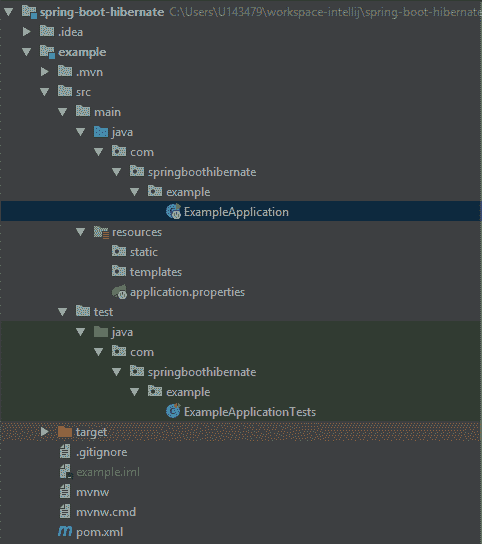

# Spring Boot 与冬眠

> 原文：<https://web.archive.org/web/20220930061024/https://www.baeldung.com/spring-boot-hibernate>

## **1。概述**

在本教程中，我们将学习如何在 Hibernate 中使用 Spring Boot。

我们将构建一个简单的 Spring Boot 应用程序，并演示将其与 Hibernate 集成是多么容易。

## **2。引导应用程序**

我们将使用 [Spring Initializr](https://web.archive.org/web/20221206182734/https://start.spring.io/) 来引导我们的 Spring Boot 应用程序。对于这个例子，我们将只使用所需的配置和依赖来集成 Hibernate，添加`Web`、`JPA,` 和 `H2`依赖。我们将在下一节解释这些依赖性。

现在让我们生成项目并在 IDE 中打开它。我们可以检查生成的项目结构，并确定我们将需要的配置文件。

这是项目结构的样子:

[](/web/20221206182734/https://www.baeldung.com/wp-content/uploads/2019/03/spring_boot_hibernate_project.png)

## **3。Maven 依赖关系**

如果我们打开`pom.xml`，我们会看到`spring-boot-starter-web`和`spring-boot-starter-test`是 maven 的依赖项。顾名思义，这些是 Spring Boot 的起始属地。

让我们快速看一下引入 JPA 的依赖关系:

```
<dependency>
    <groupId>org.springframework.boot</groupId>
    <artifactId>spring-boot-starter-data-jpa</artifactId>
</dependency>
```

这个依赖包括 JPA API、JPA 实现、JDBC 和其他必要的库。因为默认的 JPA 实现是 Hibernate，所以这种依赖性实际上也足以将其引入。

最后，对于这个例子，我们将使用`H2`作为一个非常轻量级的数据库:

```
<dependency>
    <groupId>com.h2database</groupId>
    <artifactId>h2</artifactId>
    <scope>runtime</scope>
</dependency>
```

我们可以使用 H2 控制台来检查数据库是否启动并运行，还可以使用用户友好的 GUI 来输入数据。我们将在`application.properites`中启用它:

```
spring.h2.console.enabled=true
```

这是我们需要配置的所有东西，以便在我们的例子中包含 Hibernate 和 H2。当我们启动 Spring Boot 应用程序时，我们可以在日志上检查配置是否成功:

`HHH000412: Hibernate Core {#Version}`

`HHH000206: hibernate.properties not found`

`HCANN000001: Hibernate Commons Annotations {#Version}`

`HHH000400: Using dialect: org.hibernate.dialect.H2Dialect`

我们现在可以访问本地主机`[http://localhost:8080/h2-console/](https://web.archive.org/web/20221206182734/http://localhost:8080/h2-console/)`上的 H2 控制台。

## **4。创建实体**

为了检查我们的 H2 是否正常工作，我们将首先在一个新的`models`文件夹中创建一个 JPA 实体:

```
@Entity
public class Book {

    @Id
    @GeneratedValue
    private Long id;
    private String name;

    // standard constructors

    // standard getters and setters
}
```

我们现在有了一个基本实体，H2 可以从中创建一个表。重启应用程序并检查 H2 控制台，将创建一个名为`Book`的新表。

为了向我们的应用程序添加一些初始数据，我们需要用一些 insert 语句创建一个新的 SQL 文件，并把它放在我们的`resources`文件夹中。**我们可以使用`import.sql` (Hibernate 支持)或者`data.sql` (Spring JDBC 支持)文件来加载数据。**

以下是我们的示例数据:

```
insert into book values(1, 'The Tartar Steppe');
insert into book values(2, 'Poem Strip');
insert into book values(3, 'Restless Nights: Selected Stories of Dino Buzzati');
```

同样，我们可以重启 Spring Boot 应用程序并检查 H2 控制台；数据现在在`Book`表中。

## **5。创建存储库和服务**

为了测试我们的应用程序，我们将继续创建基本组件。首先，我们将 JPA 存储库添加到一个新的`repositories`文件夹中:

```
@Repository
public interface BookRepository extends JpaRepository<Book, Long> {
}
```

我们可以使用 Spring 框架的`JpaRepository`接口，它为基本的`CRUD`操作提供了一个默认的实现。

接下来，我们将把`BookService`添加到新的`services`文件夹中:

```
@Service
public class BookService {

    @Autowired
    private BookRepository bookRepository;

    public List<Book> list() {
        return bookRepository.findAll();
    }
}
```

为了测试我们的应用程序，我们需要检查创建的数据是否可以从服务的`list()`方法中获取。

我们将编写下面的`SpringBootTest`:

```
@RunWith(SpringRunner.class)
@SpringBootTest
public class BookServiceUnitTest {

    @Autowired
    private BookService bookService;

    @Test
    public void whenApplicationStarts_thenHibernateCreatesInitialRecords() {
        List<Book> books = bookService.list();

        Assert.assertEquals(books.size(), 3);
    }
}
```

通过运行这个测试，我们可以检查 Hibernate 是否创建了`Book`数据，然后这些数据被我们的服务成功获取。就这样，Hibernate 和 Spring Boot 一起运行。

## **6。大写表格名称**

有时，我们可能需要用大写字母书写数据库中的表名。正如我们已经知道的， **Hibernate 会默认生成小写字母的表名**。

我们可以尝试显式设置表名:

```
@Entity(name="BOOK")
public class Book {
    // members, standard getters and setters
}
```

然而，那是不行的。我们需要在`application.properties`中设置这个属性:

```
spring.jpa.hibernate.naming.physical-strategy=org.hibernate.boot.model.naming.PhysicalNamingStrategyStandardImpl
```

然后，我们可以在数据库中检查这些表是否是用大写字母成功创建的。

## **7。结论**

在本文中，我们发现集成 Hibernate 和 Spring Boot 是多么容易。我们使用 H2 数据库作为一个非常轻量级的内存解决方案。

我们给出了使用所有这些技术的应用程序的完整示例。然后我们给出了一个小提示，如何在我们的数据库中设置大写的表名。

和往常一样，本文中提到的所有代码片段都可以在我们的 GitHub 库中找到[。](https://web.archive.org/web/20221206182734/https://github.com/eugenp/tutorials/tree/master/persistence-modules/spring-boot-persistence)