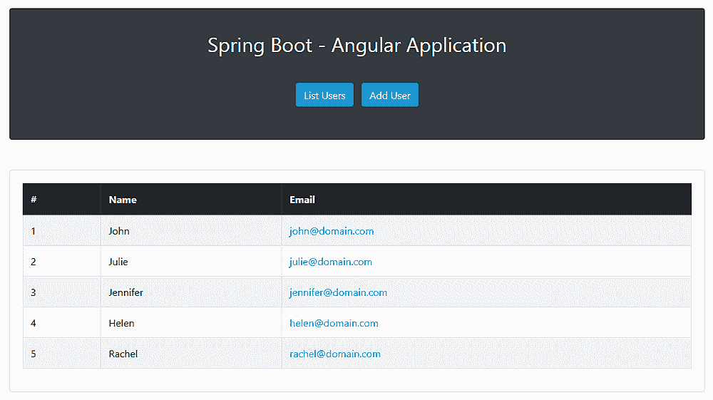
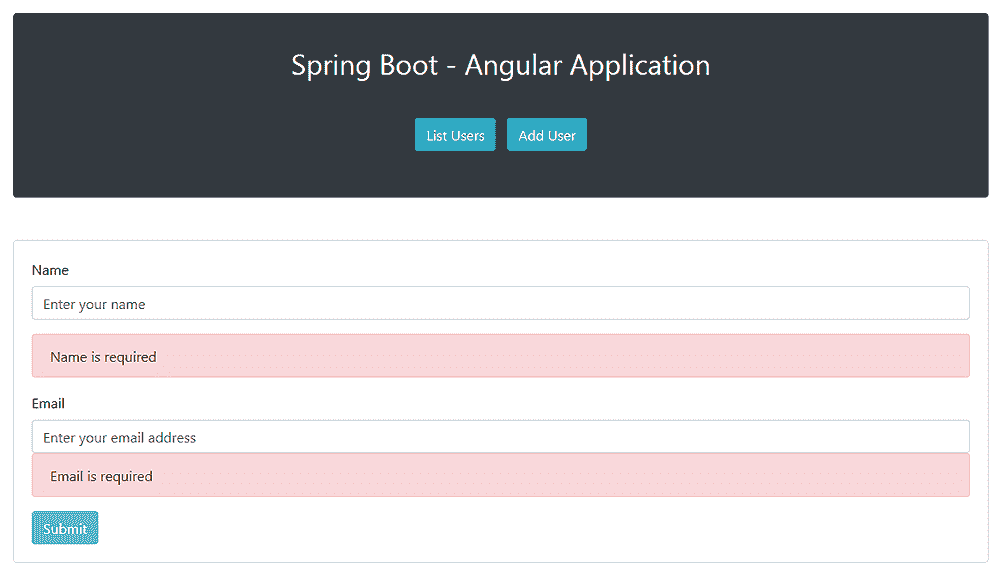

# 用 Spring Boot 和 Angular 构建 Web 应用程序

> 原文:[https://web . archive . org/web/20220930061024/https://www . bael dung . com/spring-boot-angular-web](https://web.archive.org/web/20220930061024/https://www.baeldung.com/spring-boot-angular-web)

## **1。概述**

Spring Boot 和 T2【Angular】组成了一个强大的组合，非常适合以最小的占用空间开发 web 应用程序。

在本教程中，**我们将使用 [Spring Boot](/web/20220923002451/https://www.baeldung.com/spring-boot) 来实现 RESTful 后端，使用 [Angular](https://web.archive.org/web/20220923002451/https://angular.io/) 来创建基于 JavaScript 的前端。**

## 延伸阅读:

## [Spring 中的接口驱动控制器](/web/20220923002451/https://www.baeldung.com/spring-interface-driven-controllers)

Learn how to create controllers using Spring MVC request annotation on Java interfaces.[Read more](/web/20220923002451/https://www.baeldung.com/spring-interface-driven-controllers) →

## [弹簧座 API + OAuth2 +角度](/web/20220923002451/https://www.baeldung.com/rest-api-spring-oauth2-angular)

Learn how to set up OAuth2 for a Spring REST API using Spring Security 5 and how to consume that from an Angular client.[Read more](/web/20220923002451/https://www.baeldung.com/rest-api-spring-oauth2-angular) →

## **2。Spring Boot 应用**

我们的演示 web 应用程序的功能将会非常简单。它将缩小到从内存中的 [H2 数据库](/web/20220923002451/https://www.baeldung.com/java-in-memory-databases)获取并显示 JPA 实体的`List`，并通过一个普通的 HTML 表单保存新的实体。

### **2.1。美芬依赖**

以下是我们 Spring Boot 项目的依赖项:

```
<dependency> 
    <groupId>org.springframework.boot</groupId> 
    <artifactId>spring-boot-starter-web</artifactId> 
</dependency>
<dependency> 
    <groupId>org.springframework.boot</groupId> 
    <artifactId>spring-boot-starter-data-jpa</artifactId> 
</dependency>
<dependency>
    <groupId>com.h2database</groupId>
    <artifactId>h2</artifactId>
    <scope>runtime</scope>
</dependency>
```

注意，我们包含了`[spring-boot-starter-web](https://web.archive.org/web/20220923002451/https://search.maven.org/search?q=g:org.springframework.boot%20AND%20a:spring-boot-starter-web)`，因为我们将使用它来创建 REST 服务，而`[spring-boot-starter-jpa](https://web.archive.org/web/20220923002451/https://search.maven.org/search?q=g:org.springframework.boot%20AND%20a:spring-boot-starter-data-jpa)`用于实现持久层。

[H2 数据库](https://web.archive.org/web/20220923002451/https://search.maven.org/search?q=g:com.h2database%20AND%20a:h2)版本也由 Spring Boot 母公司管理。

### **2.2。JPA 实体类**

为了快速原型化我们的应用程序的域层，让我们定义一个简单的 JPA 实体类，它将负责建模用户:

```
@Entity
public class User {

    @Id
    @GeneratedValue(strategy = GenerationType.AUTO)
    private long id;
    private final String name;
    private final String email;

    // standard constructors / setters / getters / toString
} 
```

### **2.3。`UserRepository`界面**

由于我们将需要在`User`实体上的基本 CRUD 功能，我们还必须定义一个`UserRepository`接口:

```
@Repository
public interface UserRepository extends CrudRepository<User, Long>{} 
```

### **2.4。休息控制器**

现在让我们实现 REST API。在这种情况下，它只是一个简单的 REST 控制器:

```
@RestController
@CrossOrigin(origins = "http://localhost:4200")
public class UserController {

    // standard constructors

    private final UserRepository userRepository;

    @GetMapping("/users")
    public List<User> getUsers() {
        return (List<User>) userRepository.findAll();
    }

    @PostMapping("/users")
    void addUser(@RequestBody User user) {
        userRepository.save(user);
    }
} 
```

在`UserController`类的定义中没有什么固有的复杂性。

当然，这里值得注意的实现细节是**[`@CrossOrigin`](https://web.archive.org/web/20220923002451/https://docs.spring.io/spring-framework/docs/current/javadoc-api/org/springframework/web/bind/annotation/CrossOrigin.html)注释**的使用。顾名思义，该注释支持服务器上的[跨源资源共享](/web/20220923002451/https://www.baeldung.com/spring-cors) (CORS)。

**这一步并不总是必要的，**但是因为我们将我们的 Angular 前端部署到 [`http://localhost:4200`](https://web.archive.org/web/20220923002451/http://localhost:4200/) ，将我们的引导后端部署到[`http://localhost:8080`](https://web.archive.org/web/20220923002451/http://localhost:8080/)**，否则浏览器会拒绝从一个到另一个的请求。**

关于控制器方法，`getUser()`从数据库中获取所有的`User`实体。类似地，`addUser()`方法在数据库中持久化一个新实体，该实体在[请求体](/web/20220923002451/https://www.baeldung.com/spring-request-response-body)中传递。

为了简单起见，我们故意省略了在持久化实体之前触发 [Spring Boot 验证](/web/20220923002451/https://www.baeldung.com/spring-boot-bean-validation)的控制器实现。然而，在生产中，我们不能只相信用户输入，所以服务器端验证应该是一个强制特性。

### **2.5。引导 Spring Boot 应用程序**

最后，让我们创建一个标准的 Spring Boot 引导类，并用几个`User`实体填充数据库:

```
@SpringBootApplication
public class Application {

    public static void main(String[] args) {
        SpringApplication.run(Application.class, args);
    }

    @Bean
    CommandLineRunner init(UserRepository userRepository) {
        return args -> {
            Stream.of("John", "Julie", "Jennifer", "Helen", "Rachel").forEach(name -> {
                User user = new User(name, name.toLowerCase() + "@domain.com");
                userRepository.save(user);
            });
            userRepository.findAll().forEach(System.out::println);
        };
    }
}
```

现在让我们运行应用程序。正如预期的那样，我们应该在启动时看到控制台上打印出的`User`实体列表:

```
User{id=1, name=John, [[email protected]](/web/20220923002451/https://www.baeldung.com/cdn-cgi/l/email-protection)}
User{id=2, name=Julie, [[email protected]](/web/20220923002451/https://www.baeldung.com/cdn-cgi/l/email-protection)}
User{id=3, name=Jennifer, [[email protected]](/web/20220923002451/https://www.baeldung.com/cdn-cgi/l/email-protection)}
User{id=4, name=Helen, [[email protected]](/web/20220923002451/https://www.baeldung.com/cdn-cgi/l/email-protection)}
User{id=5, name=Rachel, [[email protected]](/web/20220923002451/https://www.baeldung.com/cdn-cgi/l/email-protection)}
```

## **3。角度应用**

随着我们的演示 Spring Boot 应用程序的启动和运行，我们现在可以创建一个能够使用 REST 控制器 API 的简单 Angular 应用程序。

### **3.1。角度 CLI 安装**

我们将使用功能强大的命令行实用程序 [Angular CLI](https://web.archive.org/web/20220923002451/https://cli.angular.io/) 来创建我们的 Angular 应用程序。

Angular CLI 是一个非常有价值的工具，因为**它允许我们从头开始创建一个完整的 Angular 项目，只需要几个命令**就可以生成组件、服务、类和接口。

一旦我们安装了 [npm](https://web.archive.org/web/20220923002451/https://www.npmjs.com/) (节点包管理器)，我们将打开一个命令控制台并键入命令:

```
npm install -g @angular/[[email protected]](/web/20220923002451/https://www.baeldung.com/cdn-cgi/l/email-protection)
```

就是这样。以上命令将安装最新版本的 Angular CLI。

### 3.2.使用 Angular CLI 的项目脚手架

我们可以从头开始生成我们的角度应用程序结构，但老实说，这是一个容易出错且耗时的任务，我们在任何情况下都应该避免。

相反，我们将让 Angular CLI 为我们做这些困难的工作。因此，我们可以打开一个命令控制台，然后导航到要创建应用程序的文件夹，并键入命令:

```
ng new angularclient
```

`new`命令将在`angularclient`目录中生成整个应用程序结构。

### **3.3。角度应用的入口点**

如果我们查看`angularclient`文件夹，我们会发现 Angular CLI 已经为我们创建了一个完整的项目。

**Angular 的应用文件使用 [TypeScript](https://web.archive.org/web/20220923002451/https://www.typescriptlang.org/) [，](https://web.archive.org/web/20220923002451/https://www.typescriptlang.org/)一个编译成普通 JavaScript 的 JavaScript 类型化超集。**然而，任何 Angular 应用程序的入口点都是一个普通的旧`index.html`文件。

让我们编辑这个文件:

```
<!doctype html>
<html lang="en">
<head>
  <meta charset="utf-8">
  <title>Spring Boot - Angular Application</title>
  <base href="/">
  <meta name="viewport" content="width=device-width, initial-scale=1">
  <link rel="icon" type="image/x-icon" href="favicon.ico">
  <link rel="stylesheet" 
    href="https://maxcdn.bootstrapcdn.com/bootstrap/4.0.0/css/bootstrap.min.css" 
    integrity="sha384-Gn5384xqQ1aoWXA+058RXPxPg6fy4IWvTNh0E263XmFcJlSAwiGgFAW/dAiS6JXm"
    crossorigin="anonymous">
</head>
<body>
  <app-root></app-root>
</body>
</html>
```

正如我们在上面看到的，我们包含了 [Bootstrap 4](https://web.archive.org/web/20220923002451/https://getbootstrap.com/) ，这样我们可以给我们的应用程序 UI 组件一个更漂亮的外观。当然，也可以从现有的一堆 UI 套件中挑选另一个。

请注意`<body>`部分中的自定义`<app-root></app-root>`标签。乍一看，它们看起来很奇怪，因为`<app-root>`不是标准的 HTML 5 元素。

我们将保留它们，因为 **`<app-root>`是 Angular 用来呈现应用程序根组件**的根选择器。

### **3.4。`app.component.ts`根构件**

为了更好地理解 Angular 如何将 HTML 模板绑定到组件，让我们转到`src/app`目录并编辑`app.component.ts` TypeScript 文件，根组件:

```
import { Component } from '@angular/core';

@Component({
  selector: 'app-root',
  templateUrl: './app.component.html',
  styleUrls: ['./app.component.css']
})
export class AppComponent {

  title: string;

  constructor() {
    this.title = 'Spring Boot - Angular Application';
  }
}
```

出于显而易见的原因，我们不会深入学习 TypeScript。尽管如此，我们注意到文件定义了一个`AppComponent` 类，它声明了一个`string`类型的字段`title`(小写)。毫无疑问，它是 JavaScript 类型的。

此外，构造函数用一个 `string`值初始化字段，这与我们在 Java 中所做的非常相似。

最相关的部分是**`@Component`元数据标记或装饰**，它定义了三个元素:

1.  `selector`–用于将组件绑定到 HTML 模板文件的 HTML 选择器
2.  `templateUrl`–与组件相关联的 HTML 模板文件
3.  `styleUrls`–一个或多个与组件相关联的 CSS 文件

正如所料，我们可以使用`app.component.html`和`app.component.css`文件来定义 HTML 模板和根组件的 CSS 样式。

最后，`selector`元素将整个组件绑定到包含在`index.html` 文件中的`<app-root>`选择器。

### **3.5。`app.component.html`文件**

由于`app.component.html`文件允许我们**定义根组件的 HTML 模板，**定义`AppComponent` 类，我们将使用它来创建一个带有两个按钮的基本导航栏。

如果我们点击第一个按钮，Angular 将显示一个包含数据库中存储的`User`实体列表的表格。类似地，如果我们单击第二个按钮，它将呈现一个 HTML 表单，我们可以用它向数据库添加新的实体:

```
<div class="container">
  <div class="row">
    <div class="col-md-12">
      <div class="card bg-dark my-5">
        <div class="card-body">
          <h2 class="card-title text-center text-white py-3">{{ title }}</h2>
          <ul class="text-center list-inline py-3">
            <li class="list-inline-item">
              <a routerLink="/users" class="btn btn-info">List Users</a>
                </li>
            <li class="list-inline-item">
              <a routerLink="/adduser" class="btn btn-info">Add User</a>
                </li>
          </ul>
        </div>
      </div>
      <router-outlet></router-outlet>
    </div>
  </div>
</div>
```

文件的大部分是标准的 HTML，有一些值得注意的地方。

**第一个是`{{ title }}`表情。双花括号`{{ variable-name }}`是 Angular 用于执行变量插值**的占位符。

让我们记住，`AppComponent` 类用值`Spring Boot – Angular Application`初始化了`title`字段。因此，Angular 将在模板中显示该字段的值。同样，更改构造函数中的值也会反映在模板中。

**第二个要注意的是`routerLink`属性**。

**Angular 使用这个属性通过它的路由模块**路由请求(稍后将详细介绍)。现在，知道模块将向特定组件的`/users`路径发送一个请求，向另一个组件的`/adduser`发送一个请求就足够了。

在每种情况下，与匹配组件相关联的 HTML 模板将在`<router-outlet></router-outlet>`占位符中呈现。

### 3.6.`User`类

因为我们的 Angular 应用程序将从数据库中获取并持久存储`User`实体，所以让我们用 TypeScript 实现一个简单的域模型。

让我们打开终端控制台并创建一个`model`目录:

```
ng generate class user
```

Angular CLI 将生成一个空的`User`类，所以让我们用几个字段填充它:

```
export class User {
    id: string;
    name: string;
    email: string;
}
```

### 3.7.`UserService`服务

已经设置了客户端域`User`类，我们现在可以实现一个服务类，该服务类执行对[http://localhost:8080/users](https://web.archive.org/web/20220923002451/http://localhost:8080/users)端点的 GET 和 POST 请求。

这将允许我们将对 REST 控制器的访问封装在一个类中，我们可以在整个应用程序中重用这个类。

让我们打开一个控制台终端，然后创建一个`service`目录，并在该目录中发出以下命令:

```
ng generate service user-service
```

现在让我们打开 Angular CLI 刚刚创建的`user.service.ts`文件并重构它:

```
import { Injectable } from '@angular/core';
import { HttpClient, HttpHeaders } from '@angular/common/http';
import { User } from '../model/user';
import { Observable } from 'rxjs/Observable';

@Injectable()
export class UserService {

  private usersUrl: string;

  constructor(private http: HttpClient) {
    this.usersUrl = 'http://localhost:8080/users';
  }

  public findAll(): Observable<User[]> {
    return this.http.get<User[]>(this.usersUrl);
  }

  public save(user: User) {
    return this.http.post<User>(this.usersUrl, user);
  }
}
```

我们不需要扎实的 TypeScript 背景知识来理解`UserService`类是如何工作的。简而言之，它在一个可重用的组件**中封装了消费 REST 控制器 API 所需的所有功能，这是我们在 Spring Boot**之前实现的。

`findAll()`方法通过 [Angular 的`HttpClient`](https://web.archive.org/web/20220923002451/https://angular.io/guide/http) 对[HTTP://localhost:8080/users](https://web.archive.org/web/20220923002451/http://localhost:8080/users)端点执行 GET HTTP 请求。该方法返回一个保存一组 `User`对象的`[Observable](https://web.archive.org/web/20220923002451/https://angular.io/guide/observables)`实例。

同样，`save()`方法对[HTTP://localhost:8080/users](https://web.archive.org/web/20220923002451/http://localhost:8080/users)端点执行一个 POST HTTP 请求。

通过在`HttpClient`的请求方法中指定类型`User`，我们可以以一种更容易和更有效的方式使用后端响应。

最后，让我们**注意一下 [`@Injectable()`](https://web.archive.org/web/20220923002451/https://angular.io/api/core/Injectable) 元数据标记的使用。这表明服务应该通过 [Angular 的依赖注入器](https://web.archive.org/web/20220923002451/https://angular.io/guide/dependency-injection)** 来创建和注入。

### **3.8。`UserListComponent`分量**

在这种情况下，`UserService`类是 REST 服务和应用程序表示层之间的中间层。因此，我们需要定义一个组件，负责呈现数据库中持久化的`User`实体的列表。

让我们打开一个终端控制台，然后创建一个`user-list`目录，并生成一个用户列表组件:

```
ng generate component user-list
```

Angular CLI 将生成一个实现`[ngOnInit](https://web.archive.org/web/20220923002451/https://angular.io/api/core/OnInit)`接口的空组件类。该接口声明了一个 hook `ngOnInit()`方法，Angular 在完成实例化实现类以及调用其构造函数之后调用该方法。

让我们重构这个类，以便它可以在构造函数中接受一个`UserService`实例:

```
import { Component, OnInit } from '@angular/core';
import { User } from '../model/user';
import { UserService } from '../service/user.service';

@Component({
  selector: 'app-user-list',
  templateUrl: './user-list.component.html',
  styleUrls: ['./user-list.component.css']
})
export class UserListComponent implements OnInit {

  users: User[];

  constructor(private userService: UserService) {
  }

  ngOnInit() {
    this.userService.findAll().subscribe(data => {
      this.users = data;
    });
  }
} 
```

`UserListComponent`类的实现是不言自明的。它只是使用`UserService's findAll()`方法来获取数据库中持久化的所有实体，并将它们存储在`users`字段中。

此外，我们需要编辑组件的 HTML 文件，`user-list.component.html,`来创建显示实体列表的表格:

```
<div class="card my-5">
  <div class="card-body">
    <table class="table table-bordered table-striped">
      <thead class="thead-dark">
        <tr>
          <th scope="col">#</th>
          <th scope="col">Name</th>
          <th scope="col">Email</th>
        </tr>
      </thead>
      <tbody>
        <tr *ngFor="let user of users">
          <td>{{ user.id }}</td>
          <td>{{ user.name }}</td>
          <td><a href="mailto:{{ user.email }}">{{ user.email }}</a></td>
        </tr>
      </tbody>
    </table>
  </div>
</div>
```

**我们要注意 [`*ngFor`](https://web.archive.org/web/20220923002451/https://angular.io/guide/structural-directives) 指令的使用。**这个指令叫做`repeater`，我们可以用它来迭代一个变量的内容，并迭代地呈现 HTML 元素。在本例中，我们使用它来动态呈现表格的行。

此外，我们使用变量插值来显示每个用户的`id,` `name`和`email`。

### **3.9。`UserFormComponent`分量**

类似地，我们需要创建一个组件，允许我们在数据库中持久化一个新的`User`对象。

让我们创建一个`user-form`目录，并键入以下内容:

```
ng generate component user-form 
```

接下来让我们打开`user-form.component.ts`文件，并向`UserFormComponent`类添加一个保存`User`对象的方法:

```
import { Component } from '@angular/core';
import { ActivatedRoute, Router } from '@angular/router';
import { UserService } from '../service/user.service';
import { User } from '../model/user';

@Component({
  selector: 'app-user-form',
  templateUrl: './user-form.component.html',
  styleUrls: ['./user-form.component.css']
})
export class UserFormComponent {

  user: User;

  constructor(
    private route: ActivatedRoute, 
      private router: Router, 
        private userService: UserService) {
    this.user = new User();
  }

  onSubmit() {
    this.userService.save(this.user).subscribe(result => this.gotoUserList());
  }

  gotoUserList() {
    this.router.navigate(['/users']);
  }
}
```

在这种情况下，`UserFormComponent`还在构造函数中获取一个`UserService`实例，`onSubmit()`方法用它来保存提供的`User`对象。

因为我们需要在保存新的实体后重新显示更新后的实体列表，所以我们在插入后调用`gotoUserList()`方法，该方法将用户重定向到`/users`路径。

此外，我们需要编辑`user-form.component.html`文件，并创建用于在数据库中持久化新用户的 HTML 表单:

```
<div class="card my-5">
  <div class="card-body">
    <form (ngSubmit)="onSubmit()" #userForm="ngForm">
      <div class="form-group">
        <label for="name">Name</label>
        <input type="text" [(ngModel)]="user.name" 
          class="form-control" 
          id="name" 
          name="name" 
          placeholder="Enter your name"
          required #name="ngModel">
      </div>
      <div [hidden]="!name.pristine" class="alert alert-danger">Name is required</div>
      <div class="form-group">
        <label for="email">Email</label>
        <input type="text" [(ngModel)]="user.email" 
          class="form-control" 
          id="email" 
          name="email" 
          placeholder="Enter your email address"
          required #email="ngModel">
        <div [hidden]="!email.pristine" class="alert alert-danger">Email is required</div>
      </div>
      <button type="submit" [disabled]="!userForm.form.valid" 
        class="btn btn-info">Submit</button>
    </form>
  </div>
</div> 
```

乍一看，这个表单看起来很标准，但是它在幕后封装了 Angular 的许多功能。

让我们注意一下**[`ngSubmit`](https://web.archive.org/web/20220923002451/https://angular.io/guide/forms)指令的使用，当表单被提交**时，它调用`onSubmit()`方法。

接下来我们定义了**模板变量`#userForm`，所以 Angular 自动添加了一个 [`NgForm`](https://web.archive.org/web/20220923002451/https://angular.io/api/forms/NgForm) 指令，它允许我们跟踪整个表单**。

`NgForm`指令包含我们为表单元素创建的控件，这些控件带有一个 [`ngModel`](https://web.archive.org/web/20220923002451/https://angular.io/api/forms/NgModel) 指令和一个`name`属性。它还监视它们的属性，包括它们的状态。

**`ngModel`指令给了我们[表单控件和客户端域模型之间的双向数据绑定](https://web.archive.org/web/20220923002451/https://angular.io/guide/template-syntax#ngModel)功能，即`User`类**。

这意味着在表单输入字段中输入的数据将流向模型，反之亦然。这两个元素的变化将通过 DOM 操作立即反映出来。

此外，`ngModel`允许我们跟踪每个表单控件的状态，并通过向每个控件添加不同的 CSS 类和 DOM 属性来执行[客户端验证](https://web.archive.org/web/20220923002451/https://angular.io/guide/form-validation)。

在上面的 HTML 文件中，我们使用了应用于表单控件的属性，只是为了在表单中的值被更改时显示一个警告框。

### **3.10。`app-routing.module.ts`文件**

尽管这些组件是独立运行的，但我们仍然需要使用一种机制，在用户单击导航栏中的按钮时调用它们。

这就是 [`RouterModule`](https://web.archive.org/web/20220923002451/https://angular.io/api/router/RouterModule) 发挥作用的地方。让我们打开`app-routing.module.ts`文件并配置模块，这样它就可以向匹配的组件发送请求:

```
import { NgModule } from '@angular/core';
import { Routes, RouterModule } from '@angular/router';
import { UserListComponent } from './user-list/user-list.component';
import { UserFormComponent } from './user-form/user-form.component';

const routes: Routes = [
  { path: 'users', component: UserListComponent },
  { path: 'adduser', component: UserFormComponent }
];

@NgModule({
  imports: [RouterModule.forRoot(routes)],
  exports: [RouterModule]
})
export class AppRoutingModule { } 
```

正如我们在上面看到的，**`Routes`数组指示路由器当用户点击一个链接或者在浏览器地址栏中指定一个 URL 时显示哪个组件。**

路线由两部分组成:

1.  `Path –` 一个`string`匹配浏览器地址栏中的 URL
2.  `Component`–当路线激活(导航)时创建的组件

如果用户点击链接到`/users`路径的`List Users`按钮，或者在浏览器地址栏中输入 URL，路由器将在`<router-outlet>`占位符中呈现`UserListComponent`组件的模板文件。

同样，如果他们点击`Add User`按钮，就会呈现出`UserFormComponent`组件。

### 3.11.`app.module.ts`文件

接下来我们需要编辑`app.module.ts`文件，这样 Angular 就可以导入所有需要的模块、组件和服务。

此外，我们需要指定我们将使用哪个提供者来创建和注入`UserService`类。否则，Angular 将无法将其注入组件类:

```
import { BrowserModule } from '@angular/platform-browser';
import { NgModule } from '@angular/core';
import { AppRoutingModule } from './app-routing.module';
import { FormsModule } from '@angular/forms';
import { HttpClientModule } from '@angular/common/http';
import { AppComponent } from './app.component';
import { UserListComponent } from './user-list/user-list.component';
import { UserFormComponent } from './user-form/user-form.component';
import { UserService } from './service/user.service';

@NgModule({
  declarations: [
    AppComponent,
    UserListComponent,
    UserFormComponent
  ],
  imports: [
    BrowserModule,
    AppRoutingModule,
    HttpClientModule,
    FormsModule
  ],
  providers: [UserService],
  bootstrap: [AppComponent]
})
export class AppModule { }
```

## **4。运行应用程序**

最后，我们准备运行我们的应用程序。

为了实现这一点，我们将首先运行 Spring Boot 应用程序，这样 REST 服务就处于活动状态并监听请求。

一旦 Spring Boot 应用程序启动，我们将打开一个命令控制台，并键入以下命令:

```
ng serve --open
```

**这将启动 Angular 的 live development server，同时打开浏览器 http://localhost:4200** 。

我们应该看到导航栏，它带有列出现有实体和添加新实体的按钮。如果我们单击第一个按钮，我们应该在导航栏下面看到一个表，其中列出了数据库中保存的实体:
[](/web/20220923002451/https://www.baeldung.com/wp-content/uploads/2019/03/user-list.png) 
类似地，单击第二个按钮将显示保存新实体的 HTML 表单:

[](/web/20220923002451/https://www.baeldung.com/wp-content/uploads/2019/03/user-form.png)

## **5。结论**

在本文中，**我们学习了如何用 Spring Boot 和 Angular** 构建一个基本的 web 应用程序。

像往常一样，本文中显示的所有代码示例都可以在 GitHub 上的[处获得。](https://web.archive.org/web/20220923002451/https://github.com/eugenp/tutorials/tree/master/spring-boot-modules/spring-boot-angular)