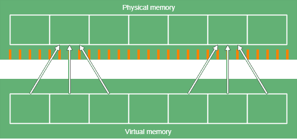
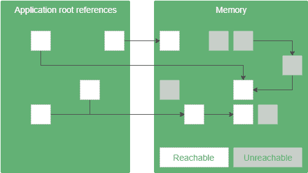

# ZGC 简介:一个可伸缩的实验性低延迟 JVM 垃圾收集器

> 原文：<https://web.archive.org/web/20220930061024/https://www.baeldung.com/jvm-zgc-garbage-collector>

## 1.介绍

如今，应用程序同时为数千甚至数百万用户提供服务并不罕见。这样的应用程序需要大量的内存。然而，管理所有这些内存很容易影响应用程序的性能。

为了解决这个问题，Java 11 引入了 [Z 垃圾收集器](https://web.archive.org/web/20220525132937/https://docs.oracle.com/en/java/javase/11/gctuning/z-garbage-collector1.html) (ZGC)作为实验性的垃圾收集器(GC)实现。

在本教程中，我们将看到**ZGC 如何设法保持低暂停时间，即使是在多 TB 的堆上**。

## 2.主要概念

为了理解 ZGC 是如何工作的，我们需要理解[内存管理](/web/20220525132937/https://www.baeldung.com/java-memory-management-interview-questions)和[垃圾收集器](/web/20220525132937/https://www.baeldung.com/jvm-garbage-collectors)背后的基本概念和术语。

### 2.1.内存管理

物理内存是我们的硬件提供的 RAM。

操作系统(OS)为每个应用分配[虚拟内存](/web/20220525132937/https://www.baeldung.com/cs/virtual-memory)空间。

当然，**我们把虚拟内存存储在物理内存中，OS 负责维护两者之间的映射。**这种映射通常涉及硬件加速。

### 2.2.多重映射

多映射是指虚拟内存中有特定的地址，指向物理内存中的同一个地址。由于应用程序通过虚拟内存访问数据，它们对这种机制一无所知(也不需要了解)。

**实际上，我们将虚拟内存的多个范围映射到物理内存的同一个范围:**

乍一看，它的用例并不明显，但是我们稍后会看到，ZGC 需要它来施展它的魔法。此外，它还提供了一些安全性，因为它分隔了应用程序的内存空间。

### 2.3.重新安置

由于我们使用动态内存分配，一个普通应用程序的内存会随着时间的推移而变得碎片化。这是因为当我们在内存中间释放一个对象时，会有一个空闲空间的间隙留在那里。随着时间的推移，这些空白累积起来，我们的记忆看起来就像一个由空闲和已用空间交替区域组成的棋盘。

当然，我们可以尝试用新的物体来填补这些空白。要做到这一点，我们应该扫描内存，寻找足够容纳对象的空闲空间。这样做是一个昂贵的操作，尤其是当我们每次想要分配内存时都必须这样做。此外，内存仍然会是碎片，因为我们可能无法找到一个完全符合我们需要的自由空间。因此，对象之间会有间隙。当然，这些差距更小。此外，我们可以尽量减少这些差距，但它使用更多的处理能力。

另一个策略是频繁地**将对象从碎片化的内存区域重新定位到更紧凑格式的空闲区域**。为了更有效，我们将内存空间分成块。我们重新定位一个块中的所有对象，或者一个都不重新定位。这样，内存分配将会更快，因为我们知道内存中有完整的空块。

### 2.4.碎片帐集

当我们创建一个 Java 应用程序时，我们不必释放我们分配的内存，因为垃圾收集器会为我们做这件事。总的来说， **GC 通过一个引用链来监视我们的应用程序可以访问哪些对象，并释放那些我们不能访问的对象**。

GC 需要跟踪堆空间中对象的状态来完成它的工作。例如，一种可能的状态是可达的。这意味着应用程序持有对该对象的引用。此引用可能是可传递的。唯一重要的是应用程序可以通过引用访问这些对象。另一个例子是可终结的:我们不能访问的对象。这些是我们认为是垃圾的物体。

为了实现这一点，垃圾收集器有多个阶段。

### 2.5.GC 相属性

GC 相可以有不同的属性:

*   一个**并行**阶段可以在多个 GC 线程上运行
*   一个**序列**阶段在一个线程上运行
*   一个**停止世界**阶段不能与应用程序代码同时运行
*   当我们的应用程序完成它的工作时，一个并发的阶段可以在后台运行
*   一个**增量**阶段可以在完成所有工作之前终止，稍后继续

请注意，以上所有技术都有各自的优点和缺点。例如，假设我们有一个阶段可以与我们的应用程序同时运行。此阶段的串行实现需要 1%的整体 CPU 性能，并运行 1000 毫秒。相比之下，并行实现利用 30%的 CPU，并在 50 毫秒内完成工作。

在这个例子中，**并行解决方案总体上使用了更多的 CPU，因为它可能更复杂，并且必须同步线程**。对于 CPU 繁重的应用程序(例如，批处理作业)，这是一个问题，因为我们做有用工作的计算能力更少。

当然，这个例子有虚构的数字。但是，很明显，所有的应用程序都有自己的特点，所以它们有不同的 GC 需求。

更多详细描述，请访问[我们关于 Java 内存管理的文章](/web/20220525132937/https://www.baeldung.com/java-memory-management-interview-questions)。

## 3.ZGC 概念

ZGC 打算提供尽可能短的停止世界的阶段。它以这样一种方式实现了这一点，即这些暂停时间的持续时间不会随着堆的大小而增加。这些特性使 ZGC 非常适合服务器应用程序，在这些应用程序中，大堆是常见的，并且需要快速的应用程序响应时间。

在久经考验的 GC 技术之上，ZGC 引入了新的概念，我们将在接下来的章节中讨论。

但是现在，让我们来看看 ZGC 是如何运作的。

### 3.1.特种宽银幕电影

ZGC 有一个叫做标记的阶段，在这个阶段我们找到可触及的物体。GC 可以用多种方式存储对象状态信息。例如，我们可以创建一个`Map,`，其中键是内存地址，值是该地址上对象的状态。这很简单，但是需要额外的内存来存储这些信息。此外，维护这样一个地图可能具有挑战性。

ZGC 使用了一种不同的方法:它将引用状态存储为引用的位。这叫参考着色。但是这样我们就有了新的挑战。设置引用的位来存储关于对象的元数据意味着多个引用可以指向同一个对象，因为状态位不保存关于对象位置的任何信息。多地图救援！

我们还希望减少内存碎片。ZGC 利用搬迁来实现这一目标。但是对于大堆，重新定位是一个缓慢的过程。由于 ZGC 不想要长时间的暂停，它会在应用程序运行的同时进行大部分的重新定位。但这又引入了一个新问题。

假设我们引用了一个对象。ZGC 重新定位它，发生上下文切换，应用程序线程运行并试图通过它的旧地址访问这个对象。ZGC 使用负载障碍来解决这个问题。**加载屏障是当线程从堆**加载引用时运行的一段代码——例如，当我们访问一个对象的非原语字段时。

在 ZGC，加载障碍检查引用的元数据位。根据这些位， **ZGC 可能会在我们得到它之前对引用执行一些处理。**因此，它可能会产生完全不同的引用。我们称之为重新映射。

### 3.2.标记

ZGC 将标记分为三个阶段。

第一阶段是停止世界阶段。在这个阶段，我们寻找根引用并标记它们。**根引用是到达堆**中对象的起点，例如局部变量或静态字段。因为根引用的数量通常很少，所以这个阶段很短。

下一阶段是并行的。在这个阶段，**我们遍历对象图，从根引用开始。我们标记每一个我们接触到的物体。**此外，当负载屏障检测到未标记的引用时，它也会对其进行标记。

最后一个阶段也是一个停止阶段，用来处理一些边缘情况，比如弱引用。

在这一点上，我们知道我们可以达到哪些目标。

ZGC 使用`marked0`和`marked1`元数据位进行标记。

### 3.3.参考色

引用代表一个字节在虚拟内存中的位置。然而，我们不必使用引用的所有位来做到这一点——**一些位可以代表引用的属性**。这就是我们所说的参考色。

有了 32 位，我们可以寻址 4 千兆字节。由于现在计算机拥有比这更多的内存是很普遍的，我们显然不能使用这 32 位中的任何一位来着色。因此，ZGC 使用 64 位引用。这意味着 **ZGC 仅在 64 位平台上可用:**

ZGC 引用使用 42 位来表示地址本身。因此，ZGC 引用可以寻址 4tb 的内存空间。

最重要的是，我们有 4 位来存储参考状态:

*   **`finalizable`** 位–该对象只能通过终结器访问
*   **`remap`** 位–引用是最新的，指向对象的当前位置(见重定位)
*   **`marked0`** 和 **`marked1`** 位——这些用来标记可到达的对象

我们也称这些位为元数据位。在 ZGC，确切地说，这些元数据中有一位是 1。

### 3.4.重新安置

在 ZGC，搬迁包括以下几个阶段:

1.  一个并发阶段，寻找我们想要重新定位的数据块，并将它们放入重新定位集中。
2.  停止阶段重定位重定位集中的所有根引用，并更新它们的引用。
3.  并发阶段重定位重定位集中的所有剩余对象，并将新旧地址之间的映射存储在转发表中。
4.  剩余参考文献的重写发生在下一个标记阶段。这样，我们就不必遍历对象树两次。或者，负载屏障也可以做到这一点。

### 3.5.重新映射和负载屏障

注意，在重定位阶段，我们没有重写对重定位地址的大部分引用。因此，使用这些引用，我们不会访问我们想要访问的对象。更糟糕的是，我们可以访问垃圾。

ZGC 使用负载障碍来解决这个问题。加载屏障用一种叫做重映射的技术来固定指向重定位对象的引用。

当应用程序加载引用时，它会触发加载屏障，然后按照以下步骤返回正确的引用:

1.  检查`remap`位是否设置为 1。如果是，这意味着引用是最新的，所以我们可以安全地返回它。
2.  然后我们检查被引用的对象是否在重定位集中。如果不是，那意味着我们不想重新安置它。为了在下次加载该参考时避免这种检查，我们将`remap`位设为 1，并返回更新后的参考。
3.  现在我们知道我们想要访问的对象是重定位的目标。唯一的问题是搬迁到底有没有发生？如果对象已经被重新定位，我们跳到下一步。否则，我们现在重新定位它，并在转发表中创建一个条目，该条目存储每个重新定位的对象的新地址。在这之后，我们继续下一步。
4.  现在我们知道物体被重新定位了。无论是由 ZGC，我们在前面的步骤，或负载障碍在较早的打击这个对象。我们将这个引用更新到对象的新位置(或者用上一步的地址，或者在转发表中查找)，设置`remap`位，并返回引用。

就这样，通过上面的步骤，我们确保了每次我们试图访问一个对象时，我们都获得了对它的最新引用。因为每次我们加载一个引用，都会触发加载屏障。因此，它降低了应用程序的性能。尤其是我们第一次访问一个重定位的对象时。但是如果我们想要短的暂停时间，这是我们必须付出的代价。由于这些步骤相对较快，因此不会显著影响应用程序的性能。

## 4.如何启用 ZGC？

运行应用程序时，我们可以使用以下命令行选项来启用 ZGC:

[PRE0]

请注意，由于 ZGC 是一个实验性的 GC，要得到官方支持还需要一段时间。

## 5.结论

在本文中，我们看到 ZGC 打算支持大堆大小和低应用程序暂停时间。

为了达到这个目标，它使用了一些技术，包括彩色 64 位引用、负载屏障、重定位和重映射。