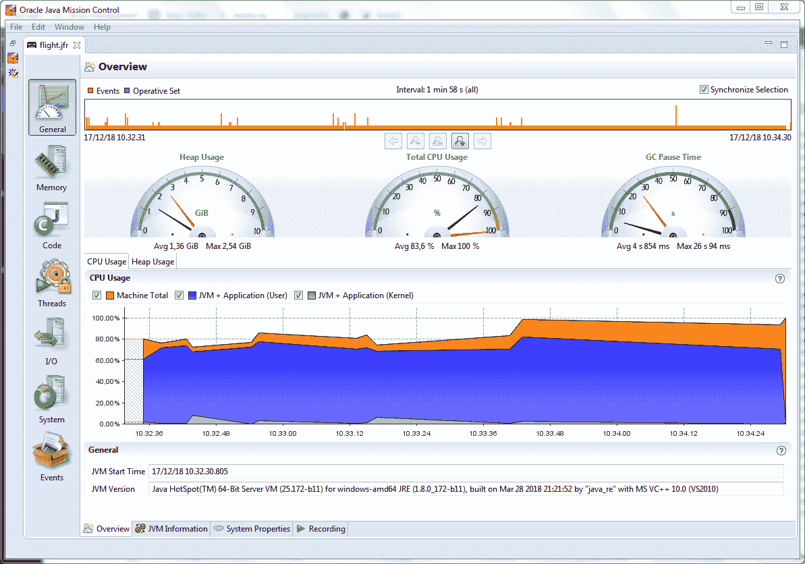
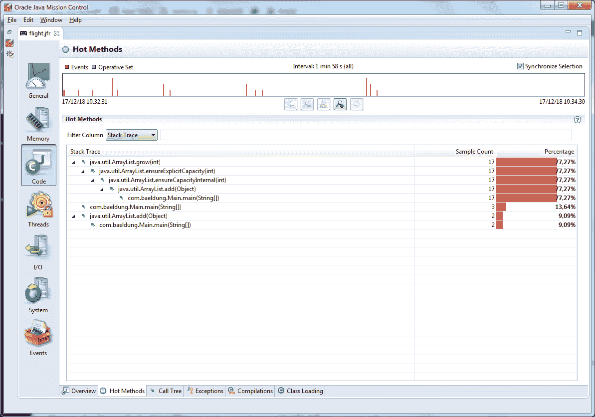

# 用飞行记录器监控 Java 应用程序

> 原文:[https://web . archive . org/web/20220930061024/https://www . baeldung . com/Java-flight-recorder-monitoring](https://web.archive.org/web/20220930061024/https://www.baeldung.com/java-flight-recorder-monitoring)

## 1.概观

在本教程中，我们将研究 Java 飞行记录器，它的概念，它的基本命令，以及如何使用它。

## 2.Java 监控实用程序

Java 不仅仅是一种编程语言，而且是一个拥有大量工具的非常丰富的生态系统。JDK 包含的程序允许我们编译自己的程序，以及在程序执行的整个生命周期中监控它们的状态和 Java 虚拟机的状态。

JDK 发行版的`bin`文件夹包含以下程序，这些程序可用于分析和监控:

*   Java visual VM(jvisualvm.exe)
*   JConsole(jconsole.exe)
*   Java 任务控制(jmc.exe)
*   **诊断命令工具**(jcmd.exe)

我们建议浏览该文件夹的内容，以了解我们拥有哪些工具。请注意，Java VisualVM 过去是 Oracle 和开放 JDK 发行版的一部分。然而，**从 Java 9 开始，JDK 发行版不再附带 Java VisualVM** 。所以要从 [VisualVM 开源项目网站](https://web.archive.org/web/20220927082854/https://visualvm.github.io/)单独下载。

在本教程中，我们将关注 Java 飞行记录器。这在上面提到的工具中不存在，因为它不是一个独立的程序。它的使用与上面的两个工具密切相关——Java Mission Control 和诊断命令工具。

## 3.Java 飞行记录器及其基本概念

Java 飞行记录器(JFR)是一个监控工具，**在 Java 应用程序**执行期间收集关于 Java 虚拟机(JVM)中事件的信息。JFR 是 JDK 发行版的一部分，它被集成到 JVM 中。

JFR 被设计成尽可能不影响正在运行的应用程序的性能。

为了使用 JFR，我们应该激活它。我们可以通过两种方式实现这一目标:

1.  当启动 Java 应用程序时
2.  当 Java 应用程序已经运行时，传递`the jcmd`工具的诊断命令

JFR 没有独立的工具。我们使用 Java Mission Control (JMC)，它包含一个插件，允许我们可视化 JFR 收集的数据。

这三个组件——`JFR`、`jcmd`和`JMC`——形成了一个完整的套件，用于收集正在运行的 Java 程序的底层运行时信息。我们可能会发现这些信息在优化我们的程序时非常有用，或者在出现问题时进行诊断时非常有用。

如果我们的计算机上安装了各种版本的 Java，那么**确保 Java 编译器(`javac`)、Java 启动器(`java`)和上述工具(JFR、jcmd 和 JMC)来自同一个 Java 发行版**是很重要的。否则，会有看不到任何有用数据的风险，因为不同版本的 JFR 数据格式可能不兼容。

JFR 有两个主要概念:事件和数据流。我们来简单讨论一下。

### 3.1.事件

JFR 收集 Java 应用程序运行时 JVM 中发生的事件。这些事件与 JVM 本身的状态或程序的状态有关。事件有名称、时间戳和附加信息(如线程信息、执行堆栈和堆状态)。

JFR 收集了三种类型的事件:

*   **即时事件**一旦发生就会立即被记录
*   **如果持续时间超过指定阈值，则记录持续时间事件**
*   **采样事件**用于对系统活动进行采样

### 3.2.数据流

JFR 收集的事件包含大量数据。出于这个原因，按照设计，JFR 足够快，不会妨碍程序。

JFR 将事件数据保存在一个输出文件中，`flight.jfr. `

正如我们所知，磁盘 I/O 操作是相当昂贵的。因此，在将数据块刷新到磁盘之前，JFR 使用各种缓冲区来存储收集的数据。事情可能会变得稍微复杂一点，因为在同一时刻，一个程序可能有多个带有不同选项的注册进程。

因此，**我们可能会在输出文件中找到比请求更多的数据，或者它可能不是按时间顺序排列的**。如果我们使用 JMC，我们甚至可能不会注意到这个事实，因为它按照时间顺序将事件可视化。

**在一些罕见的情况下，JFR 可能无法刷新数据**(例如，当事件太多或停电时)。如果出现这种情况，JFR 会尝试通知我们输出文件可能丢失了一部分数据。

## 4.如何使用 Java 飞行记录器

JFR 是一个实验性的功能，因此它的使用可能会发生变化。事实上，在早期的发行版中，为了在生产中使用它，我们必须激活商业特性。然而，从 JDK 11 开始，我们可以不用激活任何东西就可以使用它。我们可以随时查阅官方的 Java 发行说明来检查如何使用这个工具。

对于 JDK 8，为了能够激活 JFR，我们应该用选项`+UnlockCommercialFeatures`和`+FlightRecorder`启动 JVM。

正如我们上面提到的，有两种方法可以激活 JFR。当我们在启动应用程序的同时激活它时，我们是从命令行进行的。当应用程序已经在运行时，我们使用诊断命令工具。

### 4.1.命令行

首先，我们使用标准的 java 编译器`javac`将程序的`*.java`文件编译成`*.class`。

一旦编译成功，我们可以使用以下选项启动程序:

```
java -XX:+UnlockCommercialFeatures -XX:+FlightRecorder 
  -XX:StartFlightRecording=duration=200s,filename=flight.jfr path-to-class-file
```

其中`path-to-class-file`是应用程序的入口点`*.class`文件。

该命令启动应用程序并激活录制，录制会立即开始，持续时间不超过 200 秒。收集的数据保存在输出文件`flight.jfr`中。我们将在下一节更详细地描述其他选项。

### 4.2.诊断命令工具

我们也可以通过使用`jcmd`工具开始注册事件。例如:

```
jcmd 1234 JFR.start duration=100s filename=flight.jfr
```

在 JDK 11 之前，为了能够以这种方式激活 JFR，我们应该使用解锁的商业功能启动应用程序:

```
java -XX:+UnlockCommercialFeatures -XX:+FlightRecorder -cp ./out/ com.baeldung.Main
```

应用程序运行后，我们使用其进程 id 来执行各种命令，这些命令采用以下格式:

```
jcmd <pid|MainClass> <command> [parameters]
```

以下是诊断命令的完整列表:

*   **jfr . start**–开始新的 JFR 录音
*   **jfr . check**–检查正在运行的 JFR 记录
*   **jfr . stop**–停止特定的 JFR 录音
*   **jfr . dump**–将 JFR 录音的内容复制到文件中

每个命令都有一系列参数。例如，`JFR.start`命令有以下参数:

*   **名称**–录像的名称；它的作用是能够在以后用其他命令引用这个记录
*   **延迟**–记录开始时间延迟的尺寸参数，默认值为 0s
*   **持续时间**–记录持续时间的时间间隔的尺寸参数；默认值为 0s，表示无限制
*   **文件名**–包含采集数据的文件的名称
*   **maxage**–采集数据最大年龄的维度参数；默认值为 0s，表示无限制
*   **maxsize**–采集数据的最大缓冲区大小，以字节为单位；默认值为 0，这意味着没有最大大小

我们已经在本节开始时看到了这些参数的用法示例。关于参数的完整列表，我们可以随时查阅 [Java 飞行记录官方文档](https://web.archive.org/web/20220927082854/https://docs.oracle.com/javacomponents/jmc-5-4/jfr-runtime-guide/comline.htm#JFRUH190)。

尽管 JFR 被设计成对 JVM 和应用程序的性能影响尽可能小，但最好通过设置至少一个参数来限制收集的最大数据量:`duration`、`maxage`或`maxsize`。

## 5.运行中的 Java 飞行记录器

现在让我们通过使用一个示例程序来演示 JFR 的运行。

### 5.1.示例程序

我们的程序将对象插入到一个列表中，直到一个`OutOfMemoryError`发生。然后程序休眠一秒钟:

```
public static void main(String[] args) {
    List<Object> items = new ArrayList<>(1);
    try {
        while (true){
            items.add(new Object());
        }
    } catch (OutOfMemoryError e){
        System.out.println(e.getMessage());
    }
    assert items.size() > 0;
    try {
        Thread.sleep(1000);
    } catch (InterruptedException e) {
        System.out.println(e.getMessage());
    }
}
```

如果不执行这段代码，我们可以发现一个潜在的缺点:`while`循环将导致高 CPU 和内存使用率。让我们用 JFR 来看看这些缺点，或许还能找到其他缺点。

### 5.2.开始注册

首先，我们通过从命令行执行以下命令来编译我们的程序:

```
javac -d out -sourcepath src/main src/main/com/baeldung/flightrecorder/FlightRecorder.java
```

此时，我们应该会在`out/com/baeldung/flightrecorder`目录中找到一个文件`FlightRecorder.class`。

现在，我们将使用以下选项启动程序:

```
java -XX:+UnlockCommercialFeatures -XX:+FlightRecorder 
  -XX:StartFlightRecording=duration=200s,filename=flight.jfr 
  -cp ./out/ com.baeldung.flightrecorder.FlightRecorder
```

### 5.3.可视化数据

现在，我们将文件`flight.jfr`传送给 **Java Mission Control** ，它是 JDK 发行版的一部分。它有助于我们以一种良好而直观的方式将事件数据可视化。

它的主屏幕向我们显示了程序在执行过程中如何使用 CPU 的信息。我们看到 CPU 负载很重，由于`while`循环，这是很正常的:

[](/web/20220927082854/https://www.baeldung.com/wp-content/uploads/2019/01/main-screen.png)

在视图的左侧，我们可以看到`General`、`Memory`、`Code`和 `Threads`等部分。每个部分都包含各种选项卡，其中包含详细信息。例如，`Code `部分的`Hot Methods`选项卡包含方法调用的统计信息:

[](/web/20220927082854/https://www.baeldung.com/wp-content/uploads/2019/01/code-screen-hot-methods.png)

在这个选项卡中，我们可以发现示例程序的另一个缺点:方法`java.util.ArrayList.grow(int)`被调用了 17 次，以便在每次没有足够的空间添加对象时扩大数组容量。

在更现实的程序中，我们可能会看到许多其他有用的信息:

*   垃圾收集器创建和销毁已创建对象的统计信息
*   关于线程年表的详细报告，当它们被锁定或活动时
*   应用程序正在执行哪些 I/O 操作

## 6.结论

在本文中，我们介绍了使用 Java Flight Recorder 监控和分析 Java 应用程序的主题。这个工具仍然是实验性的，所以我们应该咨询它的官方网站以获得更完整和最新的信息。

和往常一样，代码片段可以在我们的 Github 库[上找到。](https://web.archive.org/web/20220927082854/https://github.com/eugenp/tutorials/tree/master/core-java-modules/core-java-perf)