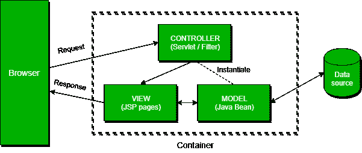

# 春季 MVC 面试问题

> 原文：<https://web.archive.org/web/20220930061024/https://www.baeldung.com/spring-mvc-interview-questions>

## 1.介绍

Spring MVC 是 Spring 基于 Servlet API 构建的原始 web 框架。它提供了模型-视图-控制器架构，可用于开发灵活的 web 应用程序。

在本教程中，我们将重点讨论与之相关的问题，因为这通常是春季开发人员面试中的一个话题。

关于 Spring 框架的更多问题，可以查看我们[面试问题系列](/web/20221208143837/https://www.baeldung.com/tag/interview/)的另一篇 Spring 相关文章。

## 2.基本的 Spring MVC 问题

### Q1。为什么要用 Spring MVC？

Spring MVC 实现了清晰的关注点分离，使我们能够轻松地开发和单元测试我们的应用程序。

像这样的概念:

*   调度程序 Servlet
*   控制器
*   查看解析器
*   视图，模型
*   `ModelAndView`
*   模型和会话属性

彼此完全独立，只负责一件事。

所以， **MVC 给了我们相当大的灵活性**。它基于接口(带有提供的实现类)，我们可以通过使用自定义接口来配置框架的每个部分。

**另一件重要的事情是，我们并不局限于特定的视图技术(例如，JSP)，但是我们可以选择我们最喜欢的视图技术**。

此外，**我们不仅在 web 应用程序开发中使用 Spring MVC，在 RESTful web 服务的创建中也使用它**。

### **Q2。`@Autowired`标注的作用是什么？**

**`@Autowired`注释可以用于通过类型**注入 bean 的字段或方法。该注释允许 Spring 解析协作 bean 并将其注入到您的 bean 中。

更多详情请参考春季 [`@Autowired`教程。](/web/20221208143837/https://www.baeldung.com/spring-autowire)

### Q3。解释模型属性

`@ModelAttribute`注释是 Spring MVC 中最重要的注释之一。**它将一个方法参数或者一个方法返回值绑定到一个命名的模型属性，然后将其暴露给一个 web 视图**。

如果我们在方法级别使用它，它表明该方法的目的是添加一个或多个模型属性。

另一方面，当用作方法参数时，它表示应该从模型中检索参数。当不存在时，我们应该首先实例化它，然后将其添加到模型中。一旦出现在模型中，我们应该从所有具有匹配名称的请求参数中填充 arguments 字段。

关于这个注释的更多信息可以在我们与`@ModelAttribute`注释相关的[文章中找到。](/web/20221208143837/https://www.baeldung.com/spring-mvc-and-the-modelattribute-annotation)

### Q4。解释一下`@Controller`和`@RestController`的区别？

`@Controller`和`@RestController`注释的主要区别在于**`@ResponseBody`注释自动包含在`@RestController`** 中。这意味着我们不需要用`@ResponseBody`来注释我们的处理程序方法。如果我们想将响应类型直接写入 HTTP 响应体，我们需要在`@Controller`类中这样做。

### Q5。描述一个`PathVariable`

**我们可以使用`@PathVariable`注释作为处理程序方法参数，以便提取 URI 模板变量**的值。

例如，如果我们想通过 id 从`www.mysite.com/user/123`中获取一个用户，我们应该将控制器中的方法映射为`/user/{id}`:

```
@RequestMapping("/user/{id}")
public String handleRequest(@PathVariable("id") String userId, Model map) {}
```

**`@PathVariable`只有一个名为`value`的元素。它是可选的，我们用它来定义 URI 模板变量名**。如果我们省略了 value 元素，那么 URI 模板变量名必须与方法参数名相匹配。

也允许有多个`@PathVariable`注释，或者通过一个接一个地声明它们:

```
@RequestMapping("/user/{userId}/name/{userName}")
public String handleRequest(@PathVariable String userId,
  @PathVariable String userName, Model map) {}
```

或者将它们都放在一个`Map<String, String>`或`MultiValueMap<String, String>`中:

```
@RequestMapping("/user/{userId}/name/{userName}")
public String handleRequest(@PathVariable Map<String, String> varsMap, Model map) {}
```

### Q6。使用 Spring MVC 进行验证

默认情况下，Spring MVC 支持 JSR-303 规范。我们需要将 JSR-303 及其实现依赖项添加到我们的 Spring MVC 应用程序中。例如，Hibernate Validator 是我们可以使用的 JSR-303 实现之一。

JSR-303 是用于 bean 验证的 Java API 的规范，是 Jakarta EE 和 JavaSE 的一部分，它使用诸如`@NotNull`、`@Min`和`@Max`的注释来确保 bean 的属性满足特定的标准。关于验证的更多信息可以在 [Java Bean 验证基础知识](/web/20221208143837/https://www.baeldung.com/javax-validation)一文中找到。

**Spring 提供了`@Validator`注释和`BindingResult`类**。当我们有无效数据时，`Validator`实现将在控制器请求处理程序方法中引发错误。然后我们可以使用`BindingResult`类来获取这些错误。

除了使用现有的实现，我们还可以创建自己的实现。为此，我们首先创建一个符合 JSR-303 规范的注释。然后，我们实现了`Validator`类。另一种方法是实现 Spring 的`[Validator](https://web.archive.org/web/20221208143837/https://docs.spring.io/spring-framework/docs/current/javadoc-api/org/springframework/validation/Validator.html)` 接口，并通过`Controller`类中的`@InitBinder`注释将其设置为验证器。

要了解如何实现和使用您自己的验证，请参见关于 Spring MVC 中的[自定义验证的教程。](/web/20221208143837/https://www.baeldung.com/spring-mvc-custom-validator)

### Q7。什么是`@RequestBody`和`@ResponseBody` 标注？

**`@RequestBody`注释用作处理程序方法参数，将 HTTP 请求体绑定到传输或域对象**。Spring 使用 Http 消息转换器自动将传入的 HTTP 请求反序列化为 Java 对象。

**当我们在 Spring MVC 控制器中的一个 handler 方法上使用`@ResponseBody`注释时，它表示我们将把该方法的返回类型直接写入 HTTP 响应体**。我们不会把它放在一个`Model`中，Spring 也不会解释为一个视图名。

请查看关于 [`@RequestBody`和`@ResponseBody`](/web/20221208143837/https://www.baeldung.com/spring-request-response-body) 的文章，以了解关于这些注释的更多细节。

### Q8。解释一下`Model`、`ModelMap`、`ModelAndView`？

**`Model`接口定义了模型属性**的容器。**`ModelMap`有类似的目的，能够传递一组值**。然后，它将这些值视为在一个`Map`内。我们要注意，在`Model` ( `ModelMap`)中我们只能存储数据。我们输入数据并返回一个视图名。

另一方面，**与`ModelAndView`一起，我们返回对象本身**。我们在返回的对象中设置了所有必需的信息，比如数据和视图名称。

你可以在关于 [`Model, ModelMap`和`ModelView`](/web/20221208143837/https://www.baeldung.com/spring-mvc-model-model-map-model-view) 的文章中找到更多细节。

### Q9。解释`SessionAttributes`和`SessionAttribute`

**`@SessionAttributes`注释用于存储用户会话中的模型属性。**我们在控制器类级别使用它，如我们关于 Spring MVC 中[会话属性的文章所示:](/web/20221208143837/https://www.baeldung.com/spring-mvc-session-attributes)

```
@Controller
@RequestMapping("/sessionattributes")
@SessionAttributes("todos")
public class TodoControllerWithSessionAttributes {

    @GetMapping("/form")
    public String showForm(Model model,
      @ModelAttribute("todos") TodoList todos) {
        // method body
        return "sessionattributesform";
    }

    // other methods
}
```

在前面的例子中，如果`@ModelAttribute`和`@SessionAttributes`具有相同的名称属性，那么模型属性“`todos`”将被添加到会话中。

**如果我们想从全局管理的会话中检索现有属性，我们将使用`@SessionAttribute`注释作为方法参数**:

```
@GetMapping
public String getTodos(@SessionAttribute("todos") TodoList todos) {
    // method body
    return "todoView";
}
```

### Q10。`@EnableWebMVC`的目的是什么？

**`@EnableWebMvc`注释的目的是通过 Java 配置**启用 Spring MVC。它相当于 XML 配置中的`<mvc: annotation-driven>`。该注释从`WebMvcConfigurationSupport`导入 Spring MVC 配置。它支持使用`@RequestMapping`将传入请求映射到处理程序方法的`@Controller`注释类。

你可以在我们的[弹簧指南`@Enable`注释](/web/20221208143837/https://www.baeldung.com/spring-enable-annotations)中了解更多关于这个和类似的注释。

### **Q11。春天的`ViewResolver`是什么？**

**`ViewResolver`使应用程序能够在浏览器**中渲染模型——无需将实现绑定到特定的视图技术——**通过将视图名称映射到实际视图**。

关于`ViewResolver`的更多细节，请看我们的[Spring MVC](/web/20221208143837/https://www.baeldung.com/spring-mvc-view-resolver-tutorial)中的 ViewResolver 指南。

### Q12。什么是`BindingResult`？

**`BindingResult`是来自`org.springframework.validation`包的接口，表示绑定结果。我们可以用它来检测和报告提交的表单**中的错误。它很容易调用——我们只需要确保将它作为参数放在我们正在验证的表单对象之后。可选的`Model`参数应该在`BindingResult`之后，这可以在[自定义验证器教程](/web/20221208143837/https://www.baeldung.com/spring-mvc-custom-validator)中看到:

```
@PostMapping("/user")
public String submitForm(@Valid NewUserForm newUserForm, 
  BindingResult result, Model model) {
    if (result.hasErrors()) {
        return "userHome";
    }
    model.addAttribute("message", "Valid form");
    return "userHome";
}
```

**当 Spring 看到`@Valid` 注释时，它会首先尝试找到被验证对象的验证器。**然后它将获取验证注释并调用验证器。最后，它将把发现的错误放在`BindingResult`中，并将后者添加到视图模型中。

### Q13。什么是表单支持对象？

**表单支持对象或命令对象只是一个从我们提交的表单**中收集数据的 POJO。

我们应该记住，它不包含任何逻辑，只有数据。

要了解如何在 Spring MVC 中使用表单支持对象，请看看我们关于 Spring MVC 中[表单的文章。](/web/20221208143837/https://www.baeldung.com/spring-mvc-form-tutorial)

### **Q14。`@Qualifier`标注的作用是什么？**

**它与`@Autowired`注释同时使用，以避免在出现一个 bean 类型的多个实例时产生混淆**。

让我们看一个例子。我们在 XML 配置中声明了两个相似的 beans:

```
<bean id="person1" class="com.baeldung.Person" >
    <property name="name" value="Joe" />
</bean>
<bean id="person2" class="com.baeldung.Person" >
    <property name="name" value="Doe" />
</bean>
```

当我们试图连接 bean 时，我们将得到一个`org.springframework.beans.factory.NoSuchBeanDefinitionException.`来修复它，我们需要使用`@Qualifier`来告诉 Spring 应该连接哪个 bean:

```
@Autowired
@Qualifier("person1")
private Person person;
```

### **Q15。`@Required`标注的作用是什么？**

**`@Required`注释用在 setter 方法上，它表示具有该注释的 bean 属性必须在配置时填充。否则，Spring 容器将抛出一个`BeanInitializationException`异常。**

此外，`@Required`与`@Autowired`不同，因为它仅限于一个 setter，而`@Autowired`不是。`@Autowired`可以用来连接构造函数和字段，而`@Required`只检查属性是否被设置。

让我们看一个例子:

```
public class Person {
    private String name;

    @Required
    public void setName(String name) {
        this.name = name;
    }
}
```

现在，`Person` bean 的`name`需要像这样在 XML config 中设置:

```
<bean id="person" class="com.baeldung.Person">
    <property name="name" value="Joe" />
</bean>
```

请注意 **`@Required`默认情况下**不支持基于 Java 的`@Configuration`类。如果您需要确保您的所有属性都已设置，您可以在用`@Bean`带注释的方法创建 bean 时这样做。

### Q16。描述前端控制器模式

**在前端控制器模式中，所有请求将首先发送到前端控制器，而不是 servlet** 。**它将确保响应已准备好，并将它们发送回浏览器。这样我们就有了一个地方来控制来自外界的一切。**

前端控制器将识别应该首先处理请求的 servlet。然后，当它从 servlet 获得数据时，它将决定呈现哪个视图，最后，它将把呈现的视图作为响应发送回来:

[](/web/20221208143837/https://www.baeldung.com/wp-content/uploads/2018/12/front_end_controller.png)

要查看实现细节，请查看我们的[Java](/web/20221208143837/https://www.baeldung.com/java-front-controller-pattern)前端控制器模式指南。

### **Q17。什么是模型 1 和模型 2 架构？**

在设计 Java Web 应用程序时，模型 1 和模型 2 代表了两种常用的设计模型。

**在模型 1 中，一个请求到达一个 servlet 或 JSP，请求在那里被处理**。servlet 或 JSP 处理请求，处理业务逻辑，检索和验证数据，并生成响应:

[](/web/20221208143837/https://www.baeldung.com/wp-content/uploads/2018/12/Model_1-1.png)

由于这种架构易于实现，我们通常在小型简单的应用程序中使用它。

另一方面，它对于大规模的 web 应用程序来说并不方便。在 JSP 中，业务逻辑和表示逻辑是耦合在一起的，这些功能通常是重复的。

模型 2 基于模型视图控制器设计模式，它将视图与操作内容的逻辑分离开来。

此外，我们可以区分 MVC 模式中的三个模块:模型、视图和控制器。该模型表示应用程序的动态数据结构。它负责数据和业务逻辑操作。视图负责显示数据，而控制器充当前两者之间的接口。

在模型 2 中，请求被传递给控制器，控制器处理所需的逻辑，以获得应该显示的正确内容。然后，控制器将内容放回请求中，通常作为 JavaBean 或 POJO。它还决定哪个视图应该呈现内容，并最终将请求传递给它。然后，视图呈现数据:

[](/web/20221208143837/https://www.baeldung.com/wp-content/uploads/2018/12/Model_2.png)

## 3.高级 Spring MVC 问题

### **Q18。春天里的`@Controller`、`@Component`、`@Repository,`、`@Service`注解有什么区别？**

根据 Spring 官方文档，`@Component`是任何 Spring 管理的组件的通用原型。`@Repository`、`@Service`和`@Controller`是`@Component`的专门化，用于更具体的用例，例如分别在持久层、服务层和表示层。

让我们来看看最后三种的具体使用案例:

*   **@`Controller`**–表示该类充当控制器的角色，并检测该类中的`@RequestMapping`注释
*   **@`Service`**–表示该类保存业务逻辑并调用存储库层中的方法
*   **@`Repository`**–表示该类定义了一个数据仓库；它的工作是捕捉特定于平台的异常，并将它们作为 Spring 统一的未检查异常之一重新抛出

### **Q19。什么是`DispatcherServlet`和`ContextLoaderListener`？**

简单地说，在前端控制器设计模式中，单个控制器负责将传入的`HttpRequests`指向应用程序的所有其他控制器和处理程序。

**Spring 的`DispatcherServlet`实现了这种模式，因此负责将`HttpRequests`正确地协调到正确的处理程序。**

另一方面，`ContextLoaderListener`启动并关闭 Spring 的根`WebApplicationContext`。它将`ApplicationContext`的生命周期与`ServletContext.` 的生命周期联系起来，我们可以用它来定义跨不同 Spring 上下文工作的共享 beans。

关于`DispatcherServlet`的更多细节，请参考本教程中的[。](/web/20221208143837/https://www.baeldung.com/spring-dispatcherservlet)

### **Q20。什么是 a `MultipartResolver`以及我们应该在什么时候使用它？**

**`MultipartResolver`界面用于上传文件**。Spring 框架提供了一个用于 Commons FileUpload 的`MultipartResolver`实现和另一个用于 Servlet 3.0 多部分请求解析的实现。

使用这些，我们可以在 web 应用程序中支持文件上传。

### **Q21。什么是 Spring MVC 拦截器，如何使用？**

Spring MVC 拦截器允许我们拦截一个客户机请求，并在三个地方处理它——处理之前、处理之后或请求完成之后(当呈现视图时)。

拦截器可用于横切关注点，并避免重复的处理程序代码，如日志记录、更改 Spring 模型中全局使用的参数等。

关于细节和各种实现，请看[Spring MVC handler interceptor 简介](/web/20221208143837/https://www.baeldung.com/spring-mvc-handlerinterceptor)一文。

### 问题 22。什么是初始化绑定器？

**用`@InitBinder`标注的方法用于定制请求参数、URI 模板和支持/命令对象**。我们在控制器中定义它，它有助于控制请求。**在这个方法中，我们注册并配置我们的自定义`PropertyEditor`，一个格式化程序，和验证程序**。

注释具有'`value`'元素。如果我们不设置它，每个 HTTP 请求都会调用`@InitBinder`带注释的方法。如果我们设置该值，这些方法将只应用于特定的命令/表单属性和/或请求参数，它们的名称对应于'【T2]'元素。

**重要的是要记住其中一个参数必须是`WebDataBinder.`** 其他参数可以是处理程序方法支持的任何类型，除了命令/表单对象和相应的验证结果对象。

### 问题 23。解释控制器建议

**`@ControllerAdvice`注释允许我们编写适用于多种控制器**的全局代码。我们可以将控制器的范围绑定到一个选定的包或一个特定的注释。

默认情况下， **`@ControllerAdvice`适用于标注有`@Controller`(或`@RestController` )** 的类。如果我们想更具体一点，我们还可以使用一些属性。

**如果我们想将适用的类限制在一个包中，我们应该将包的名称添加到注释**:

```
@ControllerAdvice("my.package")
@ControllerAdvice(value = "my.package")
@ControllerAdvice(basePackages = "my.package")
```

也可以使用多个包，但是这次我们需要使用一个数组来代替`String`。

除了通过名字限制包，我们还可以通过使用包中的一个类或接口来做到这一点:

```
@ControllerAdvice(basePackageClasses = MyClass.class)
```

“`assignableTypes`”元素将`@ControllerAdvice`应用于特定的类，而“`annotations`”则用于特定的注释。

**值得注意的是，我们应该将它与`@ExceptionHandler`** 一起使用。这种组合将使我们能够配置一个全局的和更具体的错误处理机制，而不需要每次为每个控制器类实现它。

### 问题 24。`@ExceptionHandler` 注释是做什么的？

**`@ExceptionHandler`注释允许我们定义一个方法来处理异常**。**我们可以单独使用注释，但是和`@ControllerAdvice`一起使用是更好的选择。因此，我们可以建立一个全局错误处理机制。通过这种方式，我们不需要在每个控制器**中编写异常处理的代码。

让我们来看看我们文章中关于用 Spring 对 REST 进行[错误处理的例子:](/web/20221208143837/https://www.baeldung.com/exception-handling-for-rest-with-spring)

```
@ControllerAdvice
public class RestResponseEntityExceptionHandler
  extends ResponseEntityExceptionHandler {

    @ExceptionHandler(value = { IllegalArgumentException.class,
      IllegalStateException.class })
    protected ResponseEntity<Object> handleConflict(RuntimeException ex,
      WebRequest request) {
        String bodyOfResponse = "This should be application specific";
        return handleExceptionInternal(ex, bodyOfResponse, new HttpHeaders(),
          HttpStatus.CONFLICT, request);
    }
}
```

我们还应该注意，这将为所有抛出`IllegalArgumentException`或`IllegalStateException`的控制器提供`@ExceptionHandler`方法。用`@ExceptionHandler`声明的异常应该与用作方法参数的异常相匹配。否则，异常解决机制将在运行时失败。

这里要记住的一件事是，为同一个异常定义多个`@ExceptionHandler`是可能的。我们不能在同一个类中这样做，因为 Spring 会抛出一个异常并在启动时失败。

另一方面，**如果我们在两个独立的类中定义它们，应用程序将启动，但是它将使用它找到的第一个处理程序，可能是错误的那个**。

### 问题 25。Web 应用程序中的异常处理

在 Spring MVC 中，我们有三个异常处理选项:

*   根据例外情况
*   每个控制器
*   全球的

如果在 web 请求处理过程中引发了未处理的异常，服务器将返回 HTTP 500 响应。为了防止这种情况，**我们应该用`@ResponseStatus`注释**来注释我们的任何自定义异常。**这种异常通过`HandlerExceptionResolver`和**来解决。

当控制器方法抛出我们的异常时，这将导致服务器返回一个带有指定状态代码的适当的 HTTP 响应。我们应该记住，为了让这种方法工作，我们不应该在其他地方处理我们的异常。

**处理异常的另一种方法是使用`@ExceptionHandler`注释**。我们向任何控制器添加`@ExceptionHandler`方法，并使用它们来处理从控制器内部抛出的异常。这些方法可以在没有`@ResponseStatus`注释的情况下处理异常，将用户重定向到专用的错误视图，或者构建完全自定义的错误响应。

我们还可以将与 servlet 相关的对象(`HttpServletRequest`、`HttpServletResponse`、`HttpSession`和`Principal`)作为处理程序方法的参数传入。但是，我们应该记住，我们不能把`Model`对象直接作为参数。

**处理错误的第三个选项是通过`@ControllerAdvice`类**。它将允许我们应用相同的技术，只是这次是在应用程序级别，而不仅仅是特定的控制器。为此，我们需要一起使用`@ControllerAdvice`和`@ExceptionHandler`。这样，异常处理程序将处理任何控制器抛出的异常。

关于这个主题的更多详细信息，请阅读 REST 和 Spring 的错误处理文章。

## **4。结论**

在本文中，我们探讨了一些与 Spring MVC 相关的问题，这些问题可能会在 Spring 开发人员的技术面试中出现。你应该把这些问题作为进一步研究的起点，因为这绝不是一个详尽的清单。

我们祝你在接下来的面试中好运！