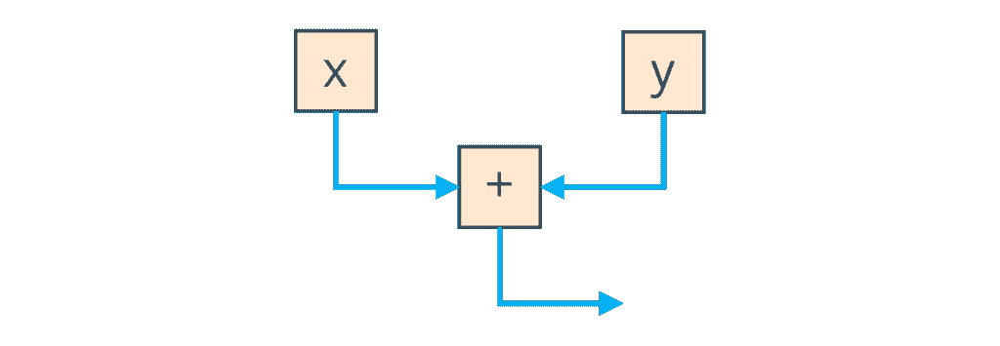
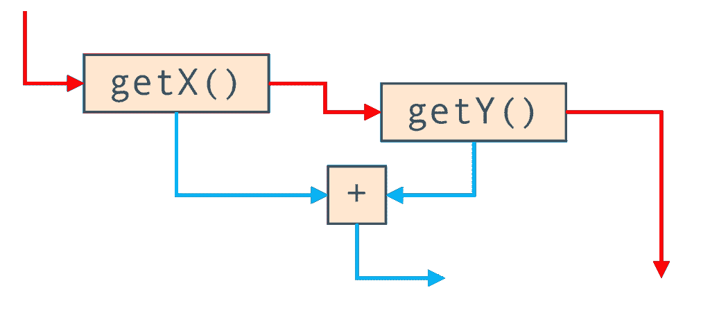
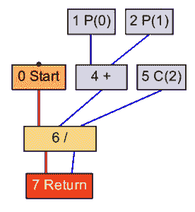
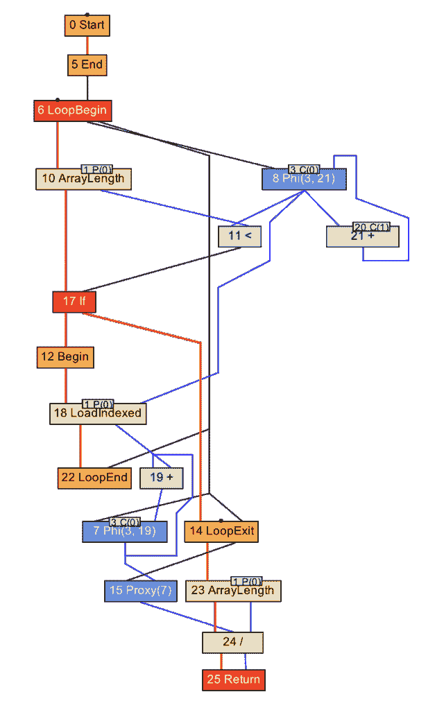

# 深入了解新的 Java JIT 编译器——Graal

> 原文：<https://web.archive.org/web/20220930061024/https://www.baeldung.com/graal-java-jit-compiler>

## **1。概述**

在本教程中，我们将深入了解新的 Java 实时(JIT)编译器 Graal。

我们将看到项目 [Graal](https://web.archive.org/web/20221014200950/https://github.com/oracle/graal) 是什么，并描述它的一个部分，一个高性能的动态 JIT 编译器。

## 2.什么是`JIT`编译器？

我们先解释一下 JIT 编译器是做什么的。

**当我们编译我们的 Java 程序时(例如，使用`javac`命令)，我们将最终把我们的源代码编译成我们代码的二进制表示——一个 JVM 字节码**。这种字节码比我们的源代码更简单、更紧凑，但我们计算机中的常规处理器无法执行它。

为了能够运行 Java 程序，JVM 解释字节码。因为解释器通常比在真实处理器上执行的本地代码慢很多，所以 **JVM 可以运行另一个编译器，该编译器现在将我们的字节码编译成处理器**可以运行的机器代码。这种所谓的实时编译器比`javac`编译器复杂得多，它运行复杂的优化来生成高质量的机器代码。

## 3.更详细地了解 JIT 编译器

Oracle 的 JDK 实现基于开源的 OpenJDK 项目。这包括从 Java 版本 1.3 开始可用的 **HotSpot 虚拟机**。它**包含两个传统的 JIT 编译器:客户端编译器，也称为 C1 和服务器编译器，称为光电或 C2** 。

C1 旨在运行更快，并产生较少优化的代码，而 C2，另一方面，需要更多的时间运行，但产生更好的优化代码。客户端编译器更适合桌面应用程序，因为我们不希望 JIT 编译有长时间的停顿。服务器编译器更适合长时间运行的服务器应用程序，这些应用程序会在编译上花费更多的时间。

### 3.1.分层编译

今天，Java 安装在正常的程序执行过程中使用这两种 JIT 编译器。

正如我们在上一节中提到的，我们的 Java 程序由`javac`编译，以解释模式开始执行。JVM 跟踪每个频繁调用的方法并编译它们。为此，它使用 C1 进行编译。但是，热点仍然关注这些方法的未来调用。如果调用次数增加，JVM 将再次重新编译这些方法，但是这次使用 C2。

这是热点使用的默认策略，称为**分层编译**。

### 3.2.服务器编译器

现在让我们稍微关注一下 C2，因为它是两者中最复杂的。C2 经过了极大的优化，产生的代码可以与 C++相媲美，甚至更快。服务器编译器本身是用特定的 C++语言编写的。

然而，它也带来了一些问题。由于 C++中可能的分段错误，它会导致虚拟机崩溃。此外，在过去的几年里，编译器没有进行重大改进。C2 的代码已经变得难以维护，所以我们不能指望当前的设计会有新的重大改进。记住这一点，在名为 GraalVM 的项目中创建新的 JIT 编译器。

## 4.GraalVM 项目

项目 [GraalVM](https://web.archive.org/web/20221014200950/https://www.graalvm.org/) 是甲骨文公司创建的一个研究项目。我们可以将 Graal 看作几个相互关联的项目:一个基于 HotSpot 的新 JIT 编译器和一个新的多语言虚拟机。它提供了一个全面的生态系统，支持大量的语言(Java 和其他基于 JVM 的语言；JavaScript、Ruby、Python、R、C/C++以及其他基于 LLVM 的语言)。

我们当然会关注 Java。

### 4.1.graal——用 Java 编写的 JIT 编译器

Graal 是一个高性能的 JIT 编译器。它接受 JVM 字节码并产生机器码。

用 Java 编写编译器有几个主要优点。首先，安全，意味着没有崩溃，只有异常，没有真正的内存泄漏。此外，我们将有一个良好的 IDE 支持，我们将能够使用调试器或分析器或其他方便的工具。此外，编译器可以独立于 HotSpot，并且能够生成更快的 JIT 编译版本。

Graal 编译器就是考虑到这些优点而创建的。它使用新的 JVM 编译器接口–JVMCI 与 VM 通信。为了能够使用新的 JIT 编译器，我们需要在从命令行运行 Java 时设置以下选项:

```
-XX:+UnlockExperimentalVMOptions -XX:+EnableJVMCI -XX:+UseJVMCICompiler
```

这意味着**我们可以用三种不同的方式运行一个简单的程序:用常规的分层编译器，用 Java 10 上 Graal 的 JVMCI 版本，或者用 GraalVM 本身**。

### 4.2.JVM 编译器接口

从 JDK 9 开始，JVMCI 就是 OpenJDK 的一部分，所以我们可以使用任何标准的 OpenJDK 或 Oracle JDK 来运行 Graal。

JVMCI 实际上允许我们做的是排除标准的分层编译，插入我们全新的编译器(即 Graal ),而不需要改变 JVM 中的任何东西。

界面相当简单。当 Graal 编译一个方法时，它会将该方法的字节码作为输入传递给 JVMCI。作为输出，我们将得到编译后的机器码。输入和输出都只是字节数组:

```
interface JVMCICompiler {
    byte[] compileMethod(byte[] bytecode);
}
```

在实际场景中，我们通常需要更多的信息，比如局部变量的数量、堆栈大小，以及从解释器中的分析收集的信息，以便我们知道代码实际上是如何运行的。

本质上，当调用`[JVMCICompiler](https://web.archive.org/web/20221014200950/https://github.com/md-5/OpenJDK/blob/master/src/jdk.internal.vm.ci/share/classes/jdk.vm.ci.runtime/src/jdk/vm/ci/runtime/JVMCICompiler.java)`接口的`compileMethod`()时，我们需要传递一个`CompilationRequest`对象。然后它将返回我们想要编译的 Java 方法，在这个方法中，我们将找到我们需要的所有信息。

### 4.3.行动中的 Graal

Graal 本身是由 VM 执行的，所以当它变热时，它将首先被解释和 JIT 编译。让我们来看一个例子，这个例子也可以在 [GraalVM 的官方网站](https://web.archive.org/web/20221014200950/https://www.graalvm.org/examples/java-performance-examples/)上找到:

```
public class CountUppercase {
    static final int ITERATIONS = Math.max(Integer.getInteger("iterations", 1), 1);

    public static void main(String[] args) {
        String sentence = String.join(" ", args);
        for (int iter = 0; iter < ITERATIONS; iter++) {
            if (ITERATIONS != 1) {
                System.out.println("-- iteration " + (iter + 1) + " --");
            }
            long total = 0, start = System.currentTimeMillis(), last = start;
            for (int i = 1; i < 10_000_000; i++) {
                total += sentence
                  .chars()
                  .filter(Character::isUpperCase)
                  .count();
                if (i % 1_000_000 == 0) {
                    long now = System.currentTimeMillis();
                    System.out.printf("%d (%d ms)%n", i / 1_000_000, now - last);
                    last = now;
                }
            }
            System.out.printf("total: %d (%d ms)%n", total, System.currentTimeMillis() - start);
        }
    }
}
```

现在，我们将编译并运行它:

```
javac CountUppercase.java
java -XX:+UnlockExperimentalVMOptions -XX:+EnableJVMCI -XX:+UseJVMCICompiler
```

这将导致类似如下的输出:

```
1 (1581 ms)
2 (480 ms)
3 (364 ms)
4 (231 ms)
5 (196 ms)
6 (121 ms)
7 (116 ms)
8 (116 ms)
9 (116 ms)
total: 59999994 (3436 ms)
```

我们可以看到**在开始**时需要更多的时间。预热时间取决于各种因素，例如应用程序中多线程代码的数量或虚拟机使用的线程数量。如果内核较少，预热时间可能会更长。

如果我们想查看 Graal 编译的统计数据，我们需要在执行程序时添加以下标志:

```
-Dgraal.PrintCompilation=true
```

这将显示与编译方法相关的数据、花费的时间、处理的字节码(也包括内联方法)、产生的机器码的大小以及编译期间分配的内存量。执行的输出占用了相当多的空间，所以我们不会在这里展示它。

### 4.4.与顶层编译器相比

现在让我们将上述结果与用顶层编译器编译的相同程序的执行进行比较。为此，我们需要告诉 VM 不要使用 JVMCI 编译器:

```
java -XX:+UnlockExperimentalVMOptions -XX:+EnableJVMCI -XX:-UseJVMCICompiler 
1 (510 ms)
2 (375 ms)
3 (365 ms)
4 (368 ms)
5 (348 ms)
6 (370 ms)
7 (353 ms)
8 (348 ms)
9 (369 ms)
total: 59999994 (4004 ms)
```

我们可以看到，个体时间之间的差异较小。这也导致更短的初始时间。

### 4.5.Graal 背后的数据结构

我们之前说过，Graal 基本上是把一个字节数组变成另一个字节数组。在这一节中，我们将重点关注这一过程背后的内容。下面的例子都是依赖于 [Chris Seaton 在 JokerConf 2017](https://web.archive.org/web/20221014200950/https://chrisseaton.com/truffleruby/jokerconf17/) 上的演讲。

一般来说，Basic 编译器的工作是执行我们的程序。这意味着它必须用适当的数据结构对其进行符号化。Graal 为此使用了一个图，即所谓的程序依赖图。

在一个简单的场景中，我们想要添加两个局部变量，即`x + y`、**，我们将有一个节点用于加载每个变量，另一个节点用于添加它们**。除此之外，**我们还有两条代表数据流的边**:

[](/web/20221014200950/https://www.baeldung.com/wp-content/uploads/2018/11/data-graph-x-p-y.png)

**数据流边缘显示为蓝色**。他们指出，当本地变量被加载时，结果进入加法运算。

现在让我们介绍另一种类型的边，描述控制流的边。为此，我们将通过调用方法来检索变量，而不是直接读取变量，从而扩展我们的示例。当我们这样做时，我们需要跟踪方法调用顺序。我们将用红色箭头表示该订单:

[](/web/20221014200950/https://www.baeldung.com/wp-content/uploads/2018/11/control-graph-getx-p-gety.png)

在这里，我们可以看到节点实际上没有改变，但是我们添加了控制流边缘。

### 4.6.实际图表

我们可以用 [IdealGraphVisualiser](https://web.archive.org/web/20221014200950/http://ssw.jku.at/General/Staff/TW/igv.html) 检查真实的 Graal 图。要运行它，我们使用`mx igv `命令。我们还需要通过设置`-Dgraal.Dump`标志来配置 JVM。

让我们看一个简单的例子:

```
int average(int a, int b) {
    return (a + b) / 2;
}
```

这有一个非常简单的数据流:

[](/web/20221014200950/https://www.baeldung.com/wp-content/uploads/2018/11/graph-average.png)

在上图中，我们可以清楚地看到我们的方法。参数 P(0)和 P(1)流入加法运算，加法运算以常数 C(2)进入除法运算。最后返回结果。

我们现在将改变前面的例子，使其适用于一组数字:

```
int average(int[] values) {
    int sum = 0;
    for (int n = 0; n < values.length; n++) {
        sum += values[n];
    }
    return sum / values.length;
}
```

我们可以看到，添加一个循环导致了更复杂的图形:

[](/web/20221014200950/https://www.baeldung.com/wp-content/uploads/2018/11/average-loop-detail.png)

这里我们可以注意到的**是:**

*   开始和结束循环节点
*   表示数组读数和数组长度读数的节点
*   数据和控制流边缘，就像以前一样。

这种数据结构有时被称为节点海，或者节点汤。我们需要提到的是，C2 编译器使用了类似的数据结构，所以这不是什么新东西，专为 Graal 创新的。

值得注意的是，Graal 通过修改上述数据结构来优化和编译我们的程序。我们可以看到为什么用 Java 编写 Graal JIT 编译器实际上是一个很好的选择:**一个图只不过是一组对象，通过引用将它们作为边连接起来。这种结构与面向对象语言完全兼容，在本例中是 Java** 。

### **4.7。提前编译模式**

还有一点很重要，那就是在 Java 10 中，我们也可以在提前编译模式下使用 Graal 编译器。正如我们已经说过的，Graal 编译器是从头开始编写的。它符合一个新的干净的接口，JVMCI，这使我们能够将其与 HotSpot 集成。但是，这并不意味着编译器被绑定到它。

使用编译器的一种方式是使用概要文件驱动的方法来只编译热方法，但是**我们也可以利用 Graal 在离线模式下完成所有方法的全部编译，而无需执行代码**。这就是所谓的“超前编译”， [JEP 295，](https://web.archive.org/web/20221014200950/https://openjdk.java.net/jeps/295)但是这里我们就不深究 AOT 编译技术了。

我们以这种方式使用 Graal 的主要原因是为了加快启动时间，直到 HotSpot 中常规的分层编译方法可以接管为止。

## 5.结论

在本文中，我们探索了作为项目 Graal 一部分的新 Java JIT 编译器的功能。

我们首先描述了传统的 JIT 编译器，然后讨论了 Graal 的新特性，尤其是新的 JVM 编译器接口。然后，我们举例说明了两个编译器的工作原理，并比较了它们的性能。

之后，我们讨论了 Graal 用来操作我们程序的数据结构，最后，讨论了 AOT 编译器模式作为使用 Graal 的另一种方式。

和往常一样，源代码可以在 GitHub 上找到[。请记住，JVM 需要配置特定的标志——在这里已经描述过了。](https://web.archive.org/web/20221014200950/https://github.com/eugenp/tutorials/tree/master/core-java-modules/core-java-10)