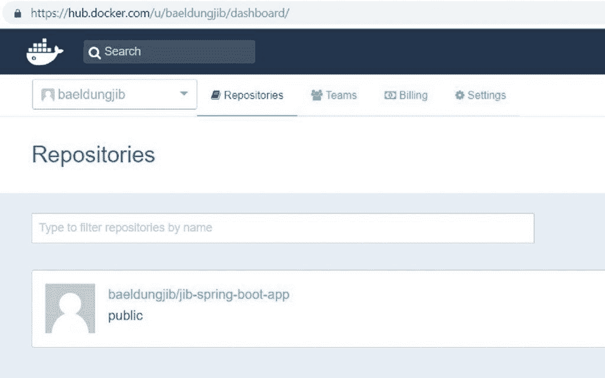

# 使用 Jib 对接 Java 应用程序

> 原文：<https://web.archive.org/web/20220930061024/https://www.baeldung.com/jib-dockerizing>

## **1。概述**

在本教程中，我们将看看 Jib 以及它如何简化 Java 应用程序的容器化。

我们将采用一个简单的 Spring Boot 应用程序，并使用 Jib 构建它的 Docker 映像。然后我们还会将图像发布到远程注册表。

另外，请务必参考我们的教程，了解如何使用`dockerfile`和`ocker`工具对接 [Spring Boot 应用程序。](/web/20220823060050/https://www.baeldung.com/dockerizing-spring-boot-application)

## **2。Jib 简介**

`Jib`是由 Google 维护的开源 Java 工具，用于构建 Java 应用程序的 Docker 映像。它简化了集装箱化既然有了它，**我们就不需要再写一个`dockerfile.`**

实际上，**我们甚至不需要安装`docker`**来创建和发布 docker 图片。

Google 将 Jib 发布为 Maven 和 Gradle 插件。这很好，因为这意味着 Jib 将在每次构建时捕捉我们对应用程序所做的任何更改。这为我们节省了单独的 docker 构建/推送命令，并简化了将其添加到 CI 管道的过程。

也有一些其他工具，比如 Spotify 的 [docker-maven-plugin](https://web.archive.org/web/20220823060050/https://github.com/spotify/docker-maven-plugin) 和 [dockerfile-maven](https://web.archive.org/web/20220823060050/https://github.com/spotify/dockerfile-maven) 插件，尽管前者现在已被否决，后者需要一个`dockerfile`。

## **3。一款简单的问候 App**

让我们来看一个简单的 spring-boot 应用程序，并使用 Jib 对其进行 dockerize。它将公开一个简单的 GET 端点:

```
http://localhost:8080/greeting
```

我们可以用 Spring MVC 控制器很简单地做到这一点:

```
@RestController
public class GreetingController {

    private static final String template = "Hello Docker, %s!";
    private final AtomicLong counter = new AtomicLong();

    @GetMapping("/greeting")
    public Greeting greeting(@RequestParam(value="name", 
        defaultValue="World") String name) {

        return new Greeting(counter.incrementAndGet(),
          String.format(template, name));
    }
} 
```

## 4。 **准备部署**

我们还需要在本地对自己进行设置，以便通过我们想要部署到的 Docker 存储库进行身份验证。

对于这个例子，我们将**向`.m2/settings.xml`** 提供我们的 DockerHub 凭证:

```
<servers>
    <server>
        <id>registry.hub.docker.com</id>
        <username><DockerHub Username></username>
        <password><DockerHub Password></password>
    </server>
</servers>
```

也有其他方式来提供凭证。**Google 推荐的方式是使用 helper 工具，可以将凭证以加密格式存储在文件系统中。在这个例子中，我们可以使用[docker-credential-helpers](https://web.archive.org/web/20220823060050/https://github.com/docker/docker-credential-helpers#available-programs)**而不是在`settings.xml`中存储纯文本凭证，这样更安全，尽管这超出了本教程的范围。

## **5。用起重臂部署到码头中心**

现在，我们可以用一个简单的命令来使用`jib-maven-plugin`，或者说[中的](https://web.archive.org/web/20220823060050/https://github.com/GoogleContainerTools/jib/tree/master/jib-gradle-plugin)、**到**、**来封装我们的应用程序:**

```
mvn compile com.google.cloud.tools:jib-maven-plugin:2.5.0:build -Dimage=$IMAGE_PATH
```

其中 IMAGE_PATH 是容器注册表中的目标路径。

例如，要将图像`baeldungjib/spring-jib-app`上传到`DockerHub`，我们需要:

```
export IMAGE_PATH=registry.hub.docker.com/baeldungjib/spring-jib-app
```

就是这样！这将构建我们的应用程序的 docker 映像，并将其推送到`DockerHub`。

[](/web/20220823060050/https://www.baeldung.com/wp-content/uploads/2018/10/JibDocker-1-1024x640-1.jpg)

**当然，我们可以通过** **将图片上传到[谷歌集装箱注册处](https://web.archive.org/web/20220823060050/https://cloud.google.com/container-registry/)或[亚马逊弹性集装箱注册处](https://web.archive.org/web/20220823060050/https://aws.amazon.com/ecr/)，方式与**相似。

## **6。简化 Maven 命令**

同样，我们可以通过在我们的`pom`中配置插件来缩短我们的初始命令，就像任何其他 maven 插件一样。

```
<project>
    ...
    <build>
        <plugins>
            ...
            <plugin>
                <groupId>com.google.cloud.tools</groupId>
                <artifactId>jib-maven-plugin</artifactId>
                <version>2.5.0</version>
                <configuration>
                    <to>
                        <image>${image.path}</image>
                    </to>
                </configuration>
            </plugin>
            ...
        </plugins>
    </build>
    ...
</project>
```

通过这一更改，我们可以简化 maven 命令:

```
mvn compile jib:build
```

## **7。定制 Docker 方面**

默认情况下， **Jib 会对我们想要的东西**做出一些合理的猜测，比如 FROM 和 ENTRYPOINT。

让我们对我们的应用程序做一些更符合我们需求的修改。

首先，Spring Boot 默认暴露端口 8080。

但是，比方说，我们想让我们的应用程序运行在端口 8082 上，并使它可以通过容器公开。

当然，我们将在 Boot 中进行适当的更改。之后，我们可以使用 Jib 使其在图像中可公开:

```
<configuration>
    ...
    <container>
        <ports>
            <port>8082</port>
        </ports>
    </container>
</configuration>
```

或者说，我们需要一个不同于。**默认情况下，Jib 使用[无发行版 java 镜像](https://web.archive.org/web/20220823060050/https://github.com/GoogleContainerTools/distroless/tree/master/java)** 。

如果我们想在不同的基础映像上运行我们的应用程序，比如 [alpine-java](https://web.archive.org/web/20220823060050/https://hub.docker.com/r/anapsix/alpine-java/) ，我们可以用类似的方式配置它:

```
<configuration>
    ...
    <from>                           
        <image>openjdk:alpine</image>
    </from>
    ...
</configuration>
```

我们以同样的方式配置标签、卷和其他几个 Docker 指令。

## **8。定制 Java 方面**

此外，通过关联，Jib 也支持许多 Java 运行时配置:

*   `jvmFlags `用于指示将什么启动标志传递给 JVM。
*   `mainClass `用于指示主类别，默认情况下 **Jib 将尝试自动推断。**
*   `args` 是我们指定传递给`main `方法的程序参数的地方。

当然，一定要查看 Jib 的文档，查看所有可用的配置属性。

## **9。结论**

在本教程中，我们看到了如何使用 Google 的 Jib 构建和发布 docker 映像，包括如何通过 Maven 访问 docker 指令和 Java 运行时配置。

和往常一样，这个例子的源代码可以在 Github 上的[处获得。](https://web.archive.org/web/20220823060050/https://github.com/eugenp/tutorials/tree/master/jib)