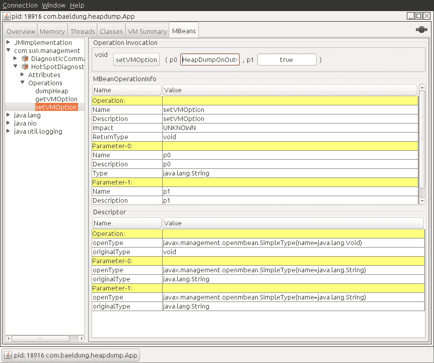
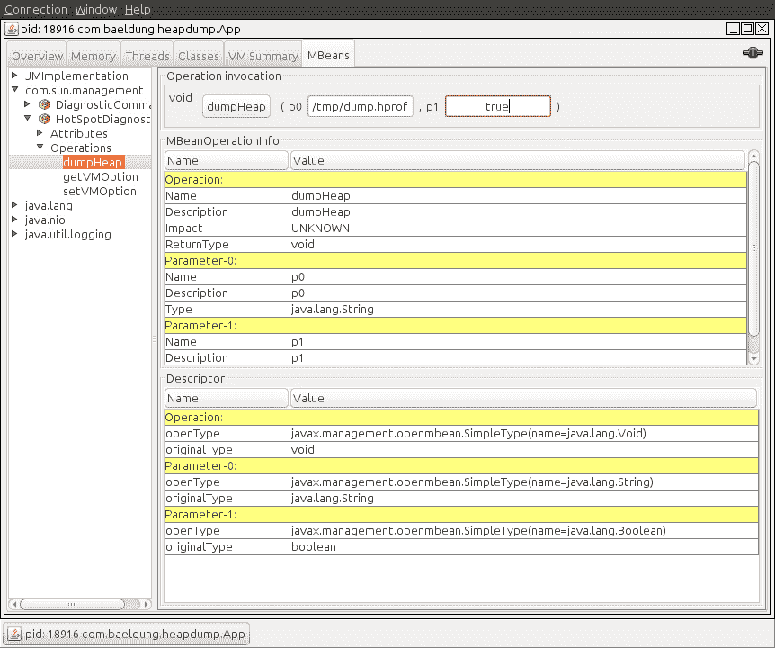

# 捕获 Java 堆转储的不同方法

> 原文:[https://web . archive . org/web/20220930061024/https://www . bael dung . com/Java-heap-dump-capture](https://web.archive.org/web/20220930061024/https://www.baeldung.com/java-heap-dump-capture)

## **1。简介**

在本教程中，我们将探索用 Java 捕获堆转储的不同方法。

堆转储是在某一时刻 JVM 内存中所有对象的快照。它们对于解决内存泄漏问题和优化 Java 应用程序中的内存使用非常有用。

堆转储通常存储在二进制格式的 hprof 文件中。我们可以使用 jhat 或 JVisualVM 之类的工具打开并分析这些文件。另外，对于 Eclipse 用户来说，使用 [MAT](https://web.archive.org/web/20220928134131/https://www.eclipse.org/mat/) 是很常见的。

在接下来的小节中，我们将通过多种工具和方法来生成堆转储，并且我们将展示它们之间的主要区别。

## **2。JDK 工具**

JDK 附带了几个以不同方式捕获堆转储的工具。**所有这些工具都位于 JDK 主目录**中的`bin`文件夹下。因此，只要这个目录包含在系统路径中，我们就可以从命令行启动它们。

在下一节中，我们将看看如何使用这些工具来捕获堆转储。

### **2.1。jmap**

jmap 是一个打印正在运行的 JVM 中的内存统计数据的工具。我们可以将它用于本地或远程进程。

**为了使用 jmap 捕获堆转储，我们需要使用`dump`选项:**

```
jmap -dump:[live],format=b,file=<file-path> <pid>
```

除了该选项，我们还应该指定几个参数:

*   `live`:如果设置，它只打印有活动引用的对象，并丢弃那些准备进行垃圾收集的对象。该参数是可选的。
*   `format=b`:指定转储文件为二进制格式。如果没有设置，结果是一样的。
*   `file`:转储将被写入的文件
*   `pid`:Java 进程的 id

一个例子是这样的:

```
jmap -dump:live,format=b,file=/tmp/dump.hprof 12587
```

记住，我们可以通过使用`jps`命令轻松获得 Java 进程的`pid`。

另外，请记住 jmap 在 JDK 是作为一个实验工具引入的，不受支持。因此，在某些情况下，最好使用其他工具。

### **2.2。jcmd**

jcmd 是一个非常完整的工具，它通过向 JVM 发送命令请求来工作。我们必须在运行 Java 进程的同一台机器上使用它。

**它的众多命令之一是` GC.heap_dump`** 。我们可以使用它来获得堆转储，只需指定进程的`pid`和输出文件路径:

```
jcmd <pid> GC.heap_dump <file-path>
```

我们可以使用之前使用的相同参数来执行它:

```
jcmd 12587 GC.heap_dump /tmp/dump.hprof
```

与 jmap 一样，生成的转储是二进制格式的。

### **2.3 .jvishavm**

JVisualVM 是一个带有图形用户界面的工具，它让我们能够监控、排除故障和分析 Java 应用程序。GUI 很简单，但是非常直观和易于使用。

它的许多选项之一允许我们捕获堆转储。如果我们右键单击一个 Java 进程并选择`“Heap Dump”`选项，该工具将创建一个堆转储并在一个新选项卡中打开它:

[](/web/20220928134131/https://www.baeldung.com/wp-content/uploads/2018/09/dump-menu-cropped-1.png)

注意，我们可以找到在`“Basic Info”`部分创建的文件的路径。

从 JDK 9 开始，Visual VM 不再包含在 Oracle JDK 和开放 JDK 发行版中。因此，如果我们使用比 Java 9 更新的东西，我们可以从 VisualVM 开源项目站点获得 JVM。

## **3。自动捕获堆转储**

我们在前面几节中展示的所有工具都是为了在特定时间手动捕获堆转储。在某些情况下，我们希望在发生`java.lang.OutOfMemoryError`时获得堆转储，以帮助我们调查错误。

对于这些情况， **Java 提供了`HeapDumpOnOutOfMemoryError`命令行选项，它在抛出`java.lang.OutOfMemoryError`时生成堆转储:**

```
java -XX:+HeapDumpOnOutOfMemoryError
```

**默认情况下，它将转储存储在我们运行应用程序的目录下的一个`java_pid<pid>.hprof`文件中。如果我们想指定另一个文件或目录，我们可以在`HeapDumpPath`选项中设置:**

```
java -XX:+HeapDumpOnOutOfMemoryError -XX:HeapDumpPath=<file-or-dir-path>
```

当我们的应用程序使用该选项耗尽内存时，我们将能够在日志中找到包含堆转储的已创建文件:

```
java.lang.OutOfMemoryError: Requested array size exceeds VM limit
Dumping heap to java_pid12587.hprof ...
Exception in thread "main" Heap dump file created [4744371 bytes in 0.029 secs]
java.lang.OutOfMemoryError: Requested array size exceeds VM limit
	at com.baeldung.heapdump.App.main(App.java:7)
```

在上面的例子中，它被写到`java_pid12587.hprof`文件中。

正如我们所看到的，这个选项非常有用，使用这个选项运行应用程序时没有开销。因此，强烈建议始终使用该选项，尤其是在生产中。

最后，**这个选项也可以在运行时通过使用`HotSpotDiagnostic` MBean** 来指定。为此，我们可以使用 JConsole 并将`HeapDumpOnOutOfMemoryError` VM 选项设置为`true`:

[](/web/20220928134131/https://www.baeldung.com/wp-content/uploads/2018/09/jconsole-setvmoption-1.png)

我们可以在这篇文章中找到更多关于 MBeans 和 JMX 的信息。

## **4。JMX**

我们将在本文中介绍的最后一种方法是使用 JMX。**我们将使用在上一节中简单介绍过的`HotSpotDiagnostic` MBean** 。**这个 MBean 提供了一个接受两个参数的`dumpHeap`方法**:

*   `outputFile`:转储文件的路径。这个文件应该有 hprof 扩展名。
*   `live`:如果设置为 true，它只转储内存中的活动对象，就像我们之前看到的 jmap 一样。

在接下来的小节中，我们将展示两种不同的方法来调用这个方法，以便捕获堆转储。

### **4.1。`JConsole`**

使用`HotSpotDiagnostic` MBean 最简单的方法是使用 JMX 客户端，比如 JConsole。

如果我们打开`JConsole`并连接到一个正在运行的 Java 进程**，我们可以导航到`MBeans`选项卡并在操作中找到** `**com.sun.management**. `下的`HotSpotDiagnostic`，我们可以找到我们之前描述的`dumpHeap`方法:

[](/web/20220928134131/https://www.baeldung.com/wp-content/uploads/2018/09/jconsole-dump-1.png)

如图所示，我们只需要将参数、`outputFile`和`live,`引入到`p0`和`p1`文本字段中，以便执行`dumpHeap`操作。

### **4.2。程序化方式**

使用`HotSpotDiagnostic` MBean 的另一种方式是从 Java 代码中以编程方式调用它。

为此，我们首先需要获得一个`MBeanServer`实例，以便获得在应用程序中注册的 MBean。之后，**我们只需要获得一个`HotSpotDiagnosticMXBean,`的实例，并调用它的`dumpHeap`方法**。

让我们看看它的代码:

```
public static void dumpHeap(String filePath, boolean live) throws IOException {
    MBeanServer server = ManagementFactory.getPlatformMBeanServer();
    HotSpotDiagnosticMXBean mxBean = ManagementFactory.newPlatformMXBeanProxy(
      server, "com.sun.management:type=HotSpotDiagnostic", HotSpotDiagnosticMXBean.class);
    mxBean.dumpHeap(filePath, live);
}
```

**注意，hprof 文件不能被覆盖。因此，在创建打印堆转储的应用程序时，我们应该考虑到这一点。如果我们没有这样做，我们将得到一个异常:**

```
Exception in thread "main" java.io.IOException: File exists
	at sun.management.HotSpotDiagnostic.dumpHeap0(Native Method)
	at sun.management.HotSpotDiagnostic.dumpHeap(HotSpotDiagnostic.java:60)
```

## **5。结论**

在本文中，我们学习了在 Java 中捕获堆转储的多种方法。

作为一条经验法则，当运行 Java 应用程序时，我们应该始终记住使用`HeapDumpOnOutOfMemoryError`选项。对于不同的目的，可以使用任何其他工具，只要我们记住 jmap 的不支持状态。

与往常一样，GitHub 上的[提供了示例的完整源代码。](https://web.archive.org/web/20220928134131/https://github.com/eugenp/tutorials/tree/master/core-java-modules/core-java-perf)