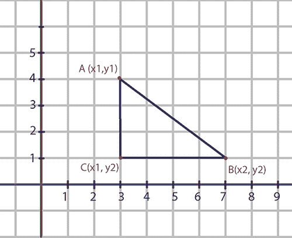

# 用 Java 计算两点之间的距离

> 原文：<https://web.archive.org/web/20220930061024/https://www.baeldung.com/java-distance-between-two-points>

## **1。概述**

在这个快速教程中，我们将展示如何用 Java 计算两点之间的距离。

## **2。距离的数学公式**

假设我们在一个平面上有两个点:第一个点 A 的坐标是(x1，y1)，第二个点 B 的坐标是(x2，y2)。我们要计算 AB，两点之间的距离。

首先，让我们用斜边 AB 做一个直角三角形:

[](/web/20220626075831/https://www.baeldung.com/wp-content/uploads/2018/09/triangle.png)

根据勾股定理，三角形各边长的平方和等于三角形斜边长的平方:`AB² = AC² + CB²`。

其次，我们来计算 AC 和 CB。

显然:

```
AC = y2 - y1
```

类似地:

```
BC = x2 - x1
```

让我们替换等式的各个部分:

```
distance * distance = (y2 - y1) * (y2 - y1) + (x2 - x1) * (x2 - x1)
```

最后，根据上面的等式，我们可以计算两点之间的距离:

```
distance = sqrt((y2 - y1) * (y2 - y1) + (x2 - x1) * (x2 - x1))
```

现在让我们转到实现部分。

## **3。Java 实现**

### **3.1。使用简单公式**

虽然` java.lang.Math`和`java.awt.geom.Point2D `包提供了现成的解决方案，但让我们先按原样实现上面的公式:

```
public double calculateDistanceBetweenPoints(
  double x1, 
  double y1, 
  double x2, 
  double y2) {       
    return Math.sqrt((y2 - y1) * (y2 - y1) + (x2 - x1) * (x2 - x1));
}
```

为了测试解决方案，我们拿有腿的三角形`3`和`4`(如上图所示)。很明显，`5`这个数字适合作为斜边的值:

```
3 * 3 + 4 * 4 = 5 * 5
```

让我们来看看解决方案:

```
@Test
public void givenTwoPoints_whenCalculateDistanceByFormula_thenCorrect() {
    double x1 = 3;
    double y1 = 4;
    double x2 = 7;
    double y2 = 1;

    double distance = service.calculateDistanceBetweenPoints(x1, y1, x2, y2);

    assertEquals(distance, 5, 0.001);
}
```

### **3.2。使用`java.lang.Math`包**

如果`calculateDistanceBetweenPoints()`方法中乘法的结果太大，可能会发生溢出。与此不同，`Math.hypot()`方法防止中间溢出或下溢:

```
public double calculateDistanceBetweenPointsWithHypot(
    double x1, 
    double y1, 
    double x2, 
    double y2) {

    double ac = Math.abs(y2 - y1);
    double cb = Math.abs(x2 - x1);

    return Math.hypot(ac, cb);
}
```

让我们像以前一样取相同的点，并检查距离是否相同:

```
@Test
public void givenTwoPoints_whenCalculateDistanceWithHypot_thenCorrect() {
    double x1 = 3;
    double y1 = 4;
    double x2 = 7;
    double y2 = 1;

    double distance = service.calculateDistanceBetweenPointsWithHypot(x1, y1, x2, y2);

    assertEquals(distance, 5, 0.001);
}
```

### **3.3。使用`java.awt.geom.Point2D`包**

最后，让我们用`Point2D.distance()`法计算距离:

```
public double calculateDistanceBetweenPointsWithPoint2D( 
    double x1, 
    double y1, 
    double x2, 
    double y2) {

    return Point2D.distance(x1, y1, x2, y2);
}
```

现在让我们以同样的方式测试这个方法:

```
@Test
public void givenTwoPoints_whenCalculateDistanceWithPoint2D_thenCorrect() {

    double x1 = 3;
    double y1 = 4;
    double x2 = 7;
    double y2 = 1;

    double distance = service.calculateDistanceBetweenPointsWithPoint2D(x1, y1, x2, y2);

    assertEquals(distance, 5, 0.001);
}
```

## **4。结论**

在本教程中，我们展示了几种用 Java 计算两点间距离的方法。

和往常一样，示例中使用的代码可以从 GitHub 上的[处获得。](https://web.archive.org/web/20220626075831/https://github.com/eugenp/tutorials/tree/master/core-java-modules/core-java-lang-math-2)