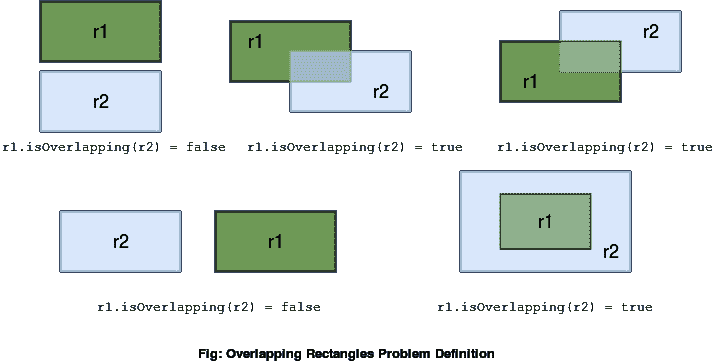
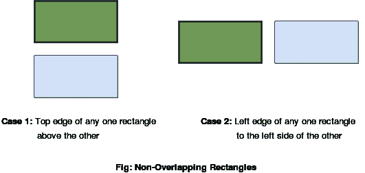

# 在 Java 中检查两个矩形是否重叠

> 原文：<https://web.archive.org/web/20220930061024/https://www.baeldung.com/java-check-if-two-rectangles-overlap>

## 1.概观

在这个快速教程中，我们将学习解决一个检查两个给定矩形是否重叠的算法问题。

我们将从查看问题定义开始，然后逐步构建解决方案。

最后，我们将用 Java 实现它。

## 2.问题定义

假设我们有两个给定的矩形——`r1`和`r2`。我们需要检查一下 `r1`和`r2`之间是否至少有一个共同点。如果是的话，这仅仅意味着这两个矩形重叠。

让我们来看一些例子:

如果我们注意到最后一种情况，矩形`r1`和`r2`没有相交的边界。尽管如此，它们仍然是重叠的矩形，因为`r1`中的每个点也是`r2`中的一个点。

## 3.初始设置

为了解决这个问题，我们应该首先通过编程定义一个矩形。**一个矩形可以很容易地用它的左下角和右上角坐标来表示:**

[PRE0]

其中`Point`是表示空间中的点 `(x,y)`的类:

[PRE1]

稍后我们将在我们的`Rectangle`类中定义`isOverlapping(Rectangle other)` 方法来检查它是否与另一个给定的矩形`other`重叠。

## 4.解决办法

如果以下任一条件为真，两个**给定矩形不会重叠:**

1.  两个矩形中的一个位于另一个矩形的上边缘上方
2.  两个矩形中的一个位于另一个矩形左边缘的左侧

对于所有其他情况，这两个矩形将彼此重叠。为了说服自己，我们总能举出几个例子。

## 5.Java 实现

现在我们已经了解了解决方案，让我们实现我们的`isOverlapping()`方法:

[PRE2]

如果其中一个矩形位于另一个矩形的上方或左侧，我们在`Rectangle`类中的`isOverlapping()`方法返回`false`，否则返回`true`。

为了找出一个矩形是否在另一个之上，我们比较它们的`y-coordinates`。同样，我们比较`x-coordinates`来检查一个矩形是否在另一个的左边。

## 6.结论

在这篇短文中，我们学习了如何解决一个算法问题，即找出两个给定的矩形是否相互重叠。它充当两个矩形对象的碰撞检测策略。

和往常一样，Github 上有完整的源代码。