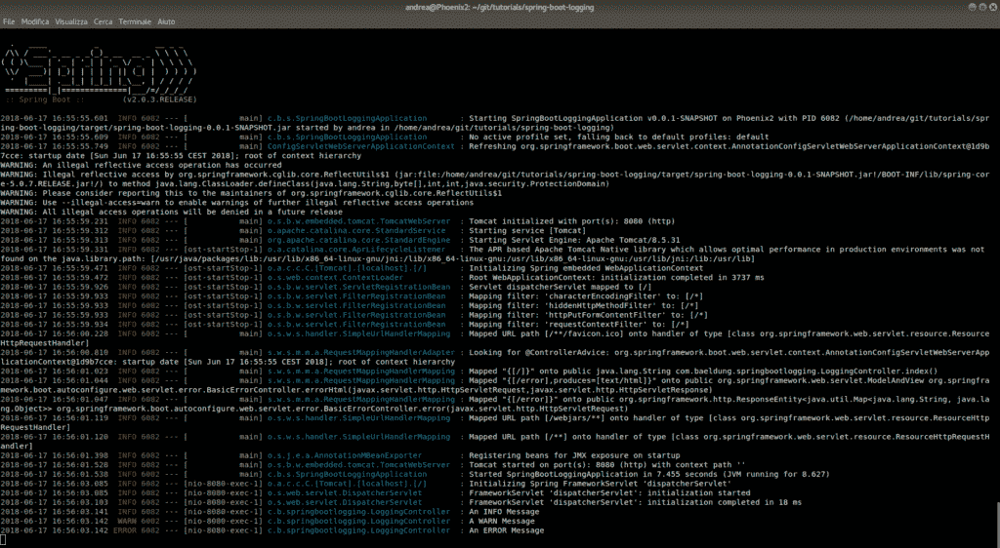
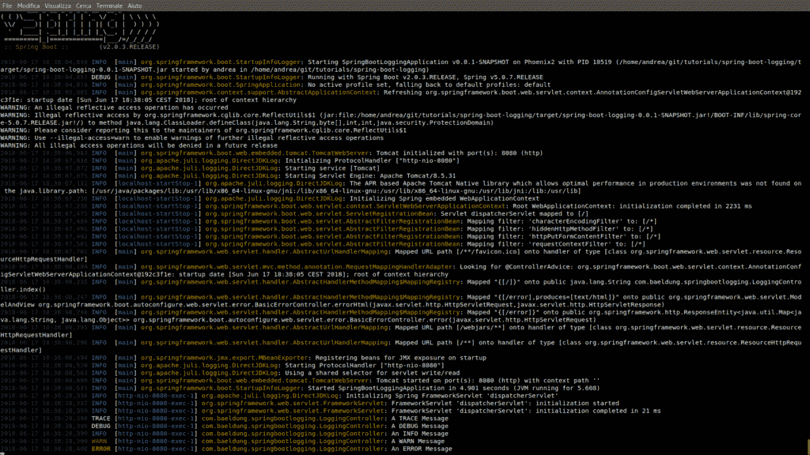
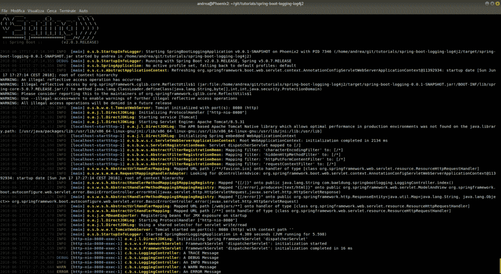

# Spring Boot 的伐木业

> 原文：<https://web.archive.org/web/20220930061024/https://www.baeldung.com/spring-boot-logging>

## **1。概述**

在这个简短的教程中，我们将探索 Spring Boot 可用的主要日志选项。

关于回退的更深入的信息可以在[回退指南](/web/20220923115304/https://www.baeldung.com/logback)中找到，而 Log4j2 在[log4j 2 简介——附加器、布局和过滤器](/web/20220923115304/https://www.baeldung.com/log4j2-appenders-layouts-filters)中介绍。

## 延伸阅读:

## [测试时在 Spring Boot 设置日志级别](/web/20220923115304/https://www.baeldung.com/spring-boot-testing-log-level)

For when you need to diagnose test failures by examining more detailed log output, here is how to reconfigure the logging in Spring apps at test time.[Read more](/web/20220923115304/https://www.baeldung.com/spring-boot-testing-log-level) →

## [在 Spring Boot 显示自动配置报告](/web/20220923115304/https://www.baeldung.com/spring-boot-auto-configuration-report)

Learn which beans are automatically configured in your Spring Boot application by generating an auto-configuration report during startup.[Read more](/web/20220923115304/https://www.baeldung.com/spring-boot-auto-configuration-report) →

## **2。初始设置**

让我们首先创建一个 Spring Boot 模块。推荐的方法是使用 [Spring Initializr](https://web.archive.org/web/20220923115304/https://start.spring.io/) ，我们会在 [Spring Boot 教程](/web/20220923115304/https://www.baeldung.com/spring-boot-start)中介绍。

现在让我们创建我们唯一的类文件，`LoggingController`:

[PRE0]

一旦我们加载了 web 应用程序，**我们将能够通过简单地访问`http://localhost:8080/`来触发那些日志行。**

## **3。零配置记录**

Spring Boot 是一个非常有用的框架。它允许我们忘记大部分的配置设置，其中许多是它自以为是地自动调整的。

在日志记录的情况下，唯一的强制依赖项是`Apache Commons Logging.`

我们只需要在使用 Spring 4.x ( [Spring Boot 1.x](https://web.archive.org/web/20220923115304/https://github.com/spring-projects/spring-boot/blob/1.5.x/spring-boot-dependencies/pom.xml#L154) )时导入，因为它是由 Spring 5 中 Spring Framework 的`**spring-jcl**`模块( [Spring Boot 2.x](https://web.archive.org/web/20220923115304/https://github.com/spring-projects/spring-boot/blob/2.0.x/spring-boot-project/spring-boot-dependencies/pom.xml#L154) )提供的。

**如果我们用的是 Spring Boot 首发**(我们几乎总是这样)，我们根本不应该担心进口`spring-jcl`。那是因为每一个首发，就像我们的`spring-boot-starter-web`，都依赖于已经为我们拉进`spring-jcl`的`spring-boot-starter-logging,`。

### 3.1.默认日志记录

**使用启动器时，默认使用 Logback 进行日志记录。**

Spring Boot 用图案和 ANSI 颜色对其进行了预配置，以使标准输出更具可读性。

现在让我们运行应用程序并访问`http://localhost:8080/`页面，看看控制台中发生了什么:

我们可以看到，**日志记录器的默认日志级别被预设为 INFO，这意味着** **`TRACE`和`DEBUG`消息是不可见的。**

为了在不改变配置的情况下激活它们，**我们可以在命令行**上传递`–debug`或`–trace`参数:

[PRE1]

### 3.2.日志级别

Spring Boot 还通过环境变量让我们访问更细粒度的日志级别设置。我们可以通过多种方式实现这一目标。

首先，我们可以在虚拟机选项中设置日志记录级别:

[PRE2]

或者，如果我们使用 Maven，我们可以通过命令行定义我们的日志设置:

[PRE3]

使用 Gradle 时，我们可以通过命令行传递日志设置。这将需要[设置`bootRun`任务](/web/20220923115304/https://www.baeldung.com/spring-boot-command-line-arguments#gradle)。

完成后，我们运行应用程序:

[PRE4]

如果我们想永久地改变详细程度，我们可以在`application.properties`文件中这样做，如[这里所描述的](https://web.archive.org/web/20220923115304/https://docs.spring.io/spring-boot/docs/current/reference/html/boot-features-logging.html#boot-features-custom-log-levels):

[PRE5]

最后，我们可以通过使用我们的日志框架配置文件来永久地改变日志级别。

我们提到过 Spring Boot 启动器默认使用 Logback。让我们来看看如何定义一个回退配置文件的片段，在该文件中我们为两个独立的包设置级别:

[PRE6]

记住**如果使用上述不同选项多次定义了一个包的日志级别**，但是使用了不同日志级别的**，将使用最低级别。**

因此，如果我们同时使用 Logback、Spring Boot 和环境变量设置日志级别，日志级别将是`TRACE`，因为它是请求级别中最低的。

## **4。回溯配置日志记录**

尽管默认配置很有用(例如，在概念验证或快速实验中可以零时间开始)，但它很可能不足以满足我们的日常需求。

让我们看看**如何包含一个回退配置**，它具有不同的颜色和日志记录模式，具有针对`console`和`file`输出的单独规范，以及一个体面的`rolling policy`，以避免生成巨大的日志文件。

首先，我们应该找到一个解决方案，允许单独处理我们的日志设置，而不是污染通常用于许多其他应用程序设置的`application.properties,`。

**当类路径中的文件具有下列名称之一时，Spring Boot 将自动加载它**覆盖默认配置:

*   `logback-spring.xml`
*   `logback.xml`
*   `logback-spring.groovy`
*   `logback.groovy`

**Spring 建议尽可能使用`-spring`变体**而不是普通的，如这里的所述。

让我们写一个简单的`logback-spring.xml`:

[PRE7]

当我们运行应用程序时，输出如下:

正如我们所看到的，它现在记录了`TRACE`和`DEBUG`消息，整个控制台模式在文本和色彩上都与以前不同。

它现在还可以登录到在当前路径下创建的`/logs`文件夹中的文件，并通过滚动策略对其进行归档。

## **5。Log4j2 配置日志**

虽然 Apache Commons 日志记录是核心，并且 Logback 是提供的参考实现，但是已经包含了到其他日志记录库的所有路由，以便于切换到它们。

为了使用除了 Logback 之外的任何日志库，我们需要将其从依赖项中排除。

对于每个像这样的启动器(在我们的例子中是唯一的，但是我们可以有很多这样的启动器):

[PRE8]

我们需要将它转换成一个精简版本，并(只一次)通过 starter 本身添加我们的备选库:

[PRE9]

此时，我们需要在类路径中放置一个名为以下名称之一的文件:

*   log4j2-spring.xml
*   log4j2.xml

我们将通过 log4j 2(SLF4J 上空)打印，无需进一步修改。

让我们写一个简单的`log4j2-spring.xml`:

[PRE10]

当我们运行应用程序时，输出如下:

正如我们所看到的，输出与 Logback 完全不同——这证明我们现在完全使用了 Log4j2。

除了 XML 配置之外，Log4j2 还允许我们使用 YAML 或 JSON 配置，如这里的[所述](https://web.archive.org/web/20220923115304/https://docs.spring.io/spring-boot/docs/current/reference/html/howto-logging.html#howto-configure-log4j-for-logging-yaml-or-json-config)。

## **6。不带 SLF4J 的 Log4j2】**

我们也可以在本地使用 Log4j2，而不需要经过 SLF4J。

为了做到这一点，我们简单地使用本地类:

[PRE11]

我们不需要对标准 Log4j2 Spring Boot 配置进行任何其他修改。

我们现在可以利用 Log4j2 的全新特性，而不会拘泥于旧的 SLF4J 界面。但是我们也绑定到这个实现，当切换到另一个日志框架时，我们需要重写我们的代码。

## 7.用 Lombok 记录日志

到目前为止，在我们看到的例子中，我们必须从我们的日志框架中声明一个日志记录器的实例。

这种样板代码可能很烦人。我们可以使用 Lombok 引入的各种注释来避免它。

我们首先需要在构建脚本中添加 Lombok 依赖项来使用它:

[PRE12]

### 7.1.`@Slf4j`和`@CommonsLog`

SLF4J 和 Apache Commons 日志 API 允许我们在不影响代码的情况下灵活地改变我们的日志框架。

我们可以**使用 Lombok 的`@Slf4j`和`@CommonsLog`注释**将正确的 logger 实例添加到我们的类中:`org.slf4j.Logger`用于 SLF4J，`org.apache.commons.logging.Log`用于 Apache Commons 日志记录。

为了查看这些注释，让我们创建一个类似于`LoggingController`的类，但是没有 logger 实例。我们将其命名为`LombokLoggingController`，并标注为`@Slf4j`:

[PRE13]

注意，我们对代码片段做了一点调整，使用`log`作为我们的 logger 实例。这是因为添加注释`@Slf4j`会自动添加一个名为`log`的字段。

使用**零配置日志记录**、**时，应用程序将使用底层日志记录实现 Logback** 进行日志记录。类似地，Log4j2 实现也用于 log4j 2-配置日志记录。

当我们用`@CommonsLog.`替换注释`@Slf4j`时，我们得到相同的行为

### 7.2.`@Log4j2`

我们可以使用注释`@Log4j2` 直接使用 Log4j2。因此，我们对`LombokLoggingController`做了一个简单的修改，用`@Log4j2`代替`@Slf4j`或`@CommonsLog`:

[PRE14]

除了日志记录之外，Lombok 还有其他注释可以帮助我们保持代码的整洁。关于它们的更多信息可以在[Lombok 项目简介](/web/20220923115304/https://www.baeldung.com/intro-to-project-lombok)中找到，我们也有一个关于[用 Eclipse 和 IntelliJ](/web/20220923115304/https://www.baeldung.com/lombok-ide) 设置 Lombok 的教程。

## **8。小心 Java Util 日志记录**

Spring Boot 也支持 JDK 日志，通过`logging.properties`配置文件。

不过，在有些情况下，使用它并不是一个好主意。从[文档](https://web.archive.org/web/20220923115304/https://docs.spring.io/spring-boot/docs/current/reference/html/boot-features-logging.html#boot-features-custom-log-configuration):

> Java Util 日志记录存在一些已知的类加载问题，这些问题会导致从“可执行 jar”运行时出现问题。我们建议您尽可能避免从“可执行 jar”运行。

使用 Spring 4 手动排除 pom.xml 中的`commons-logging`也是一个很好的实践，可以避免日志库之间的潜在冲突。相反，Spring 5 会自动处理它，所以我们在使用 Spring Boot 2 时不需要做任何事情。

## **9。Windows 上的 JANSI**

虽然 Linux 和 Mac OS X 等基于 Unix 的操作系统默认支持 ANSI 色码，但在 Windows 控制台上，一切都是令人遗憾的单色。

**Windows 可以通过一个名为 JANSI 的库获取 ANSI 颜色。**

然而，我们应该注意可能的类加载缺陷。

我们必须导入并在配置中显式激活它，如下所示:

[回退](https://web.archive.org/web/20220923115304/https://logback.qos.ch/manual/layouts.html#coloring):

[PRE15]

[Log4j2](https://web.archive.org/web/20220923115304/https://logging.apache.org/log4j/2.x/manual/layouts.html#enable-jansi) :

> 许多平台本身支持 ANSI 转义序列，但默认情况下 Windows 不支持。**要启用 ANSI 支持，将 Jansi jar 添加到我们的应用程序中，并将属性`log4j.skipJansi`设置为`false`。**这允许 Log4j 在写入控制台时使用 Jansi 添加 ansi 转义码。
> 
> 注意:在 Log4j 2.10 之前，默认情况下启用 Jansi。Jansi 需要本地代码的事实意味着 **Jansi 只能由单个类加载器**加载。对于 web 应用程序，这意味着**Jansi jar 必须在 web 容器的类路径中。**为了避免给 web 应用程序带来问题，从 Log4j 2.10 开始，Log4j 不再在没有显式配置的情况下自动尝试加载 Jansi。

它也一文不值:

*   [布局](https://web.archive.org/web/20220923115304/https://logging.apache.org/log4j/2.x/manual/layouts.html)文档页面在 **`highlight{pattern}{style}`** 部分包含有用的 Log4j2 JANSI 信息。
*   虽然 JANSI 可以给输出着色，但 Spring Boot 的横幅(本地的或通过`banner.txt`文件定制的)将保持单色。

## 10。结论

我们已经看到了在 Spring Boot 项目中与主要日志框架进行交互的主要方式。

我们还探讨了每个解决方案的主要优点和缺陷。

和往常一样，完整的源代码可以在 GitHub 上找到[。](https://web.archive.org/web/20220923115304/https://github.com/eugenp/tutorials/tree/master/spring-boot-modules/spring-boot-logging-log4j2)