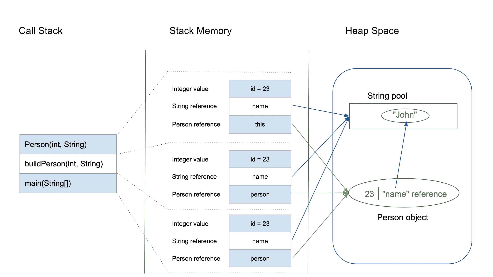

# Java 中的堆栈内存和堆空间

> 原文：<https://web.archive.org/web/20220930061024/https://www.baeldung.com/java-stack-heap>

## **1。简介**

为了以最佳方式运行应用程序，JVM 将内存分为堆栈和堆内存。**每当我们声明新的变量和对象，调用新的方法，声明一个`String,`或执行类似的操作，JVM 从堆栈内存或堆空间为这些操作指定内存。**

在本教程中，我们将检查这些内存模型。首先，我们将探索它们的主要特性。然后我们将学习它们是如何存储在 RAM 中的，以及在哪里使用它们。最后，我们将讨论它们之间的主要区别。

## **2。Java 中的堆栈内存**

**Java 中的堆栈内存用于静态内存分配和线程的执行。**它包含特定于方法的原始值，以及对堆中从该方法引用的对象的引用。

对该存储器的访问是按后进先出(LIFO)顺序进行的。每当我们调用一个新方法时，就会在栈顶创建一个新的块，其中包含该方法特有的值，比如原始变量和对对象的引用。

当该方法完成执行时，其对应的堆栈帧被刷新，流返回到调用方法，并且空间变得可用于下一个方法。

### **2.1。堆栈存储器的主要特性**

堆栈存储器的其他一些特性包括:

*   它会随着新方法的调用和返回而增长和收缩。
*   堆栈中的变量只在创建它们的方法运行时才存在。
*   当方法执行完毕时，它会被自动分配和释放。
*   如果这个内存满了，Java 抛出`java.lang.StackOverFlowError.`
*   与堆内存相比，对这种内存的访问更快。
*   这种内存是线程安全的，因为每个线程都在自己的堆栈中运行。

## **3。Java 中的堆空间**

**堆空间用于运行时 Java 对象和 JRE 类的动态内存分配**。新对象总是在堆空间中创建，对这些对象的引用存储在堆栈内存中。

这些对象具有全局访问权限，我们可以从应用程序中的任何地方访问它们。

我们可以将这个记忆模型分解成更小的部分，称为代，它们是:

1.  **年轻一代–**这是所有新对象被分配和老化的地方。当此空间填满时，会发生一次小的垃圾收集。
2.  **老一代或终身一代–**这是存储长期存活对象的地方。当对象存储在年轻代时，对象的年龄阈值被设置，当达到该阈值时，对象被移动到老代。
3.  **永久生成–**这包括运行时类和应用程序方法的 JVM 元数据。

这些不同的部分也在文章[JVM、JRE 和 JDK 之间的区别中讨论。](/web/20220701014948/https://www.baeldung.com/jvm-vs-jre-vs-jdk)

我们总是可以根据自己的需要来控制堆内存的大小。欲了解更多信息，请访问此[链接的 Baeldung 文章](/web/20220701014948/https://www.baeldung.com/jvm-parameters)。

### **3.1。Java 堆内存的主要特性**

堆空间的其他一些特性包括:

*   它是通过复杂的内存管理技术来访问的，包括年轻一代、年老或终身一代以及永久一代。
*   如果堆空间已满，Java 抛出`java.lang.OutOfMemoryError.`
*   对这种存储器的访问相对来说比堆栈存储器慢
*   与堆栈不同，这个内存不会自动释放。它需要垃圾收集器来释放未使用的对象，以保持内存使用的效率。
*   与堆栈不同，堆不是线程安全的，需要通过正确同步代码来保护。

## **4。示例**

基于我们到目前为止所学的内容，让我们分析一个简单的 Java 代码来评估如何管理内存:

```
class Person {
    int id;
    String name;

    public Person(int id, String name) {
        this.id = id;
        this.name = name;
    }
}

public class PersonBuilder {
    private static Person buildPerson(int id, String name) {
        return new Person(id, name);
    }

    public static void main(String[] args) {
        int id = 23;
        String name = "John";
        Person person = null;
        person = buildPerson(id, name);
    }
}
```

让我们一步步来分析这个问题:

1.  当我们进入`main()`方法时，会在堆栈内存中创建一个空间来存储该方法的原语和引用。
    *   堆栈存储器直接存储整数的原始值`id.`
    *   类型为`Person `的引用变量`person `也将在堆栈内存中创建，它将指向堆中的实际对象。
2.  从`main()`对参数化构造函数`Person(int, String)`的调用将在前一个堆栈之上分配更多的内存。这将存储:
    *   堆栈内存中调用对象的`this`对象引用
    *   堆栈存储器中的原始值`id `
    *   `String`参数`name,`的引用变量将指向堆内存中字符串池中的实际字符串
3.  `main`方法进一步调用了`buildPerson()`静态方法，对于这个静态方法，进一步的分配将发生在前一个方法之上的堆栈内存中。这将再次以上述方式存储变量。
4.  然而，堆内存将存储新创建的类型为`Person.`的对象`person` 的所有实例变量

让我们看看下图中的分配情况:



## **5。总结**

在结束本文之前，让我们快速总结一下堆栈内存和堆空间之间的区别:

| 参数 | 栈存储器 | 堆空间 |
| --- | --- | --- |
| 应用 | 堆栈是分部分使用的，在线程执行期间一次使用一部分 | 整个应用程序在运行时使用堆空间 |
| 大小 | 堆栈有大小限制，具体取决于操作系统，通常比堆小 | 堆没有大小限制 |
| 储存；储备 | 仅存储在堆空间中创建的原始变量和对象引用 | 所有新创建的对象都存储在这里 |
| 命令 | 它是使用后进先出(LIFO)内存分配系统访问的 | 这种存储器通过复杂的存储器管理技术来访问，包括年轻一代、年老或终身一代以及永久一代。 |
| 生活 | 堆栈内存只在当前方法运行时存在 | 只要应用程序运行，堆空间就存在 |
| 效率 | 与堆相比，分配速度快得多 | 与堆栈相比，分配速度较慢 |
| 分配/取消分配 | 当调用和返回一个方法时，这个内存被自动分配和释放 | 当创建新对象时分配堆空间，当不再引用新对象时由 Gargabe Collector 释放堆空间 |

## **6。结论**

堆栈和堆是 Java 分配内存的两种方式。在本文中，我们了解了它们是如何工作的，以及何时使用它们来开发更好的 Java 程序。

要了解更多关于 Java 内存管理的知识，请看这里的这篇文章。我们还提到了 JVM 垃圾收集器，这在本文中的[中有简要讨论。](/web/20220701014948/https://www.baeldung.com/jvm-garbage-collectors)