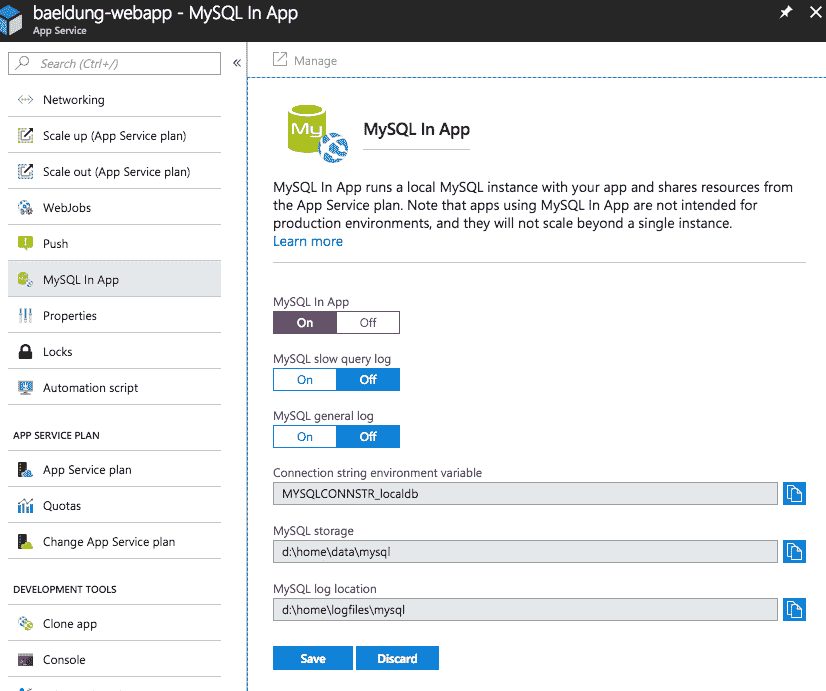
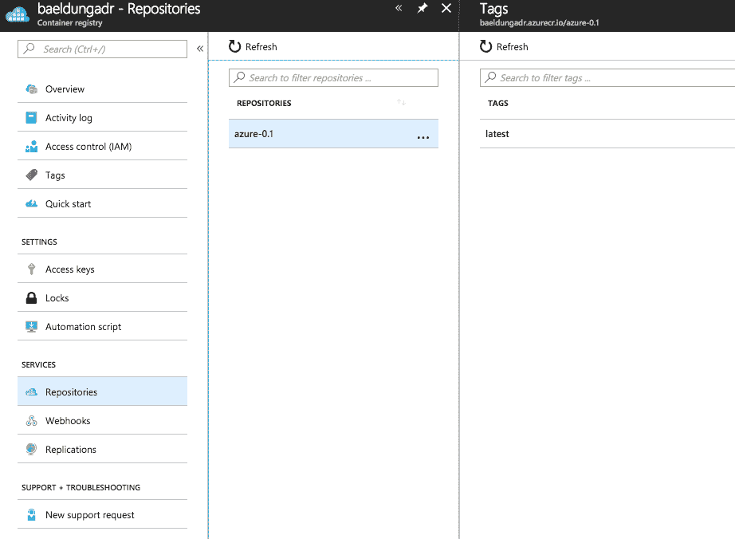
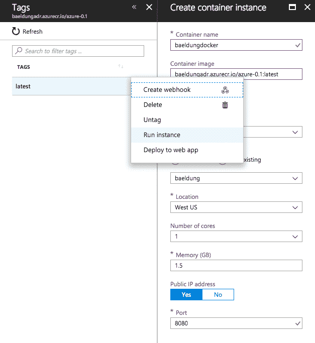

# 将 Spring Boot 应用部署到 Azure

> 原文：<https://web.archive.org/web/20220930061024/https://www.baeldung.com/spring-boot-azure>

## 1.介绍

微软 Azure 现在提供了非常可靠的 Java 支持。

在本教程中，我们将逐步演示如何让我们的 Spring Boot 应用程序在 Azure 平台上工作。

## 2.Maven 依赖性和配置

首先，**我们确实需要一个 Azure 订阅来使用那里的云服务**；目前，我们可以在这里注册一个免费账户[。](https://web.archive.org/web/20220630130149/https://azure.microsoft.com/en-us/free/)

接下来，登录平台并使用 [Azure CLI](https://web.archive.org/web/20220630130149/https://docs.microsoft.com/en-us/cli/azure/index?view=azure-cli-latest) 创建服务主体:

[PRE0]

[PRE1]

现在**我们在我们的 Maven [`settings.xml`](https://web.archive.org/web/20220630130149/https://maven.apache.org/settings.html)** 中配置 Azure 服务主体认证设置，借助于`<servers>`下的以下部分:

[PRE2]

**当使用`azure-webapp-maven-plugin`将我们的 Spring Boot 应用程序上传到微软平台时，我们将依赖上面的认证配置。**

让我们将下面的 Maven 插件添加到`pom.xml`中:

[PRE3]

我们可以在这里查看最新发布版本[。](https://web.archive.org/web/20220630130149/https://search.maven.org/classic/#search%7Cgav%7C1%7Cg%3A%22com.microsoft.azure%22%20AND%20a%3A%22azure-webapp-maven-plugin%22)

这个插件有许多可配置的属性，将在下面的介绍中介绍。

## 3.将 Spring Boot 应用部署到 Azure

现在我们已经设置好了环境，让我们试着将我们的 Spring Boot 应用程序部署到 Azure。

当我们访问“`/hello`”时，我们的应用程序回复“`hello azure!`”:

[PRE4]

该平台现在允许为 Tomcat 和 Jetty 部署 Java Web App。使用`azure-webapp-maven-plugin`，我们可以将我们的应用程序作为默认(根)应用程序直接部署到受支持的 web 容器，或者通过 FTP 部署。

注意，由于我们要将应用程序部署到 web 容器，我们应该将其打包为 WAR 档案。快速提醒一下，我们有一篇文章介绍了如何在 Tomcat 中部署 Spring Boot 战争。

### 3.1.Web 容器部署

如果我们打算在 Windows 实例上部署 Tomcat，我们将对`azure-webapp-maven-plugin`使用以下配置:

[PRE5]

对于 Linux 实例，请尝试以下配置:

[PRE6]

我们不要忘记 Azure 身份验证:

[PRE7]

当我们将应用程序部署到 Azure 时，我们会看到它以应用服务的形式出现。所以这里我们指定属性`<appName>`来命名应用服务。还有，App 服务作为一个资源，需要由一个[资源组容器](https://web.archive.org/web/20220630130149/https://docs.microsoft.com/en-us/azure/azure-resource-manager/resource-group-overview)持有，所以也需要`<resourceGroup>`。

**现在我们准备使用 azure-web app:deploy Maven target**扣动扳机，我们将看到输出:

[PRE8]

**现在我们可以访问`https://spring-baeldung.azurewebsites.net/hello`** 并看到响应:“你好 azure！”。

在部署过程中，Azure 自动为我们创建了一个应用服务计划。查看官方文件了解 Azure 应用服务计划的详细信息。如果我们已经有一个应用服务计划，我们可以设置属性`<appServicePlanName>`以避免创建新的:

[PRE9]

### 3.2.FTP 部署

要通过 FTP 进行部署，我们可以使用以下配置:

[PRE10]

在上面的配置中，我们让插件定位目录`${project.basedir}/target`中的 WAR 文件，并将其部署到 Tomcat 容器的`webapps`目录中。

假设我们的最终工件被命名为`azure-0.1.war,`，一旦我们开始部署，我们将看到如下输出:

[PRE11]

请注意，这里我们没有将我们的应用程序部署为 Tomcat 的默认 Web 应用程序，因此我们只能通过“https://spring-bael dung . azure websites . net/azure-0.1/hello”来访问它。服务器将响应“你好 azure！”不出所料。

## 4.使用自定义应用程序设置进行部署

大多数时候，我们的 Spring Boot 应用程序需要数据访问来提供服务。Azure 现在支持 SQL Server、MySQL、PostgreSQL 等数据库。

为了简单起见，我们将使用它的应用内 MySQL 作为我们的数据源，因为它的配置与其他 Azure 数据库服务非常相似。

### 4.1.在 Azure 上启用应用内 MySQL

由于没有一行程序可以创建启用了应用内 MySQL 的 web 应用，我们必须首先使用 CLI 创建 web 应用:

[PRE12]

然后**在** **门户**的 App 中启用 MySQL:

在应用内 MySQL 启用后，我们可以在文件系统的`/home/data/mysql`目录下的一个名为`MYSQLCONNSTR_xxx.txt`的文件中找到默认数据库、数据源 URL 和默认账户信息。

### 4.2.使用 Azure 应用内 MySQL 的 Spring Boot 应用

这里，为了演示的需要，我们创建了一个`User`实体和两个端点用于`register`和`list`

[PRE13]

我们将在本地环境中使用 H2 数据库，并将其切换到 Azure 上的 MySQL。通常，我们在`application.properties`文件中配置数据源属性:

[PRE14]

而对于 Azure 部署，**我们需要在** `**<appSettings>**:`中配置`azure-webapp-maven-plugin`

[PRE15]

现在我们可以开始部署了:

[PRE16]

我们可以从日志中看到部署已经完成。

让我们测试我们的新端点:

[PRE17]

服务器的响应说明了一切。有用！

## 5.将容器化的 Spring Boot 应用部署到 Azure

在前面的章节中，我们已经展示了如何将应用程序部署到 servlet 容器(在本例中是 Tomcat)。作为独立的可运行 jar 部署怎么样？

现在，我们可能需要将我们的 Spring Boot 应用程序容器化。具体来说，我们可以对其进行 dockerize，并将图像上传到 Azure。

我们已经有一篇关于[如何停靠 Spring Boot 应用](/web/20220630130149/https://www.baeldung.com/dockerizing-spring-boot-application)的文章，但是在这里**我们将使用另一个 maven 插件:`docker-maven-plugin`，为我们自动停靠:**

[PRE18]

最新版本可以在这里找到[。](https://web.archive.org/web/20220630130149/https://search.maven.org/classic/#search%7Cgav%7C1%7Cg%3A%22com.spotify%22%20AND%20a%3A%22docker-maven-plugin%22)

### 5.1.Azure 容器注册表

首先，**我们需要 Azure 上的容器注册中心来上传我们的 docker 图像。**

所以让我们创建一个:

[PRE19]

我们还需要容器注册中心的认证信息，这可以通过以下方式查询:

[PRE20]

然后在 Maven 的`settings.xml`中添加以下服务器认证配置:

[PRE21]

### 5.2.Maven 插件配置

让我们将下面的 Maven 插件配置添加到`pom.xml`中:

[PRE22]

在上面的配置中，我们指定了 docker 映像名称、注册表 URL 和一些类似于 FTP 部署的属性。

注意，插件将使用`<dockerDirectory>`中的值来定位`Dockerfile`。我们将`Dockerfile`放在`docker`目录中，其内容是:

[PRE23]

### 5.3.在 Docker 实例中运行 Spring Boot 应用程序

现在我们可以构建一个 Docker 映像并将其推送到 Azure 注册表:

[PRE24]

上传完成后，让我们检查一下`baeldungadr`注册表。我们将在存储库列表中看到该图像:

现在，我们准备运行图像的实例:

一旦实例启动，我们就可以通过它的公共 IP 地址访问应用程序提供的服务:

[PRE25]

### 5.4.码头集装箱部署

假设我们有一个容器注册中心，无论它来自 Azure、Docker Hub 还是我们的私有注册中心。

借助下面的`azure-webapp-maven-plugin`配置，我们还可以将我们的 Spring Boot web 应用程序部署到容器中:

[PRE26]

一旦我们运行`mvn azure-webapp:deploy`，插件将帮助我们将 web 应用程序归档部署到指定图像的实例中。

然后，我们可以通过实例的 IP 地址或 Azure 应用服务的 URL 来访问 web 服务。

## 6.结论

在本文中，我们介绍了如何将 Spring Boot 应用程序部署到 Azure，作为容器中可部署的 WAR 或可运行的 JAR。虽然我们已经介绍了`azure-webapp-maven-plugin`的大部分特性，但是还有一些丰富的特性有待探索。更多详情请点击查看[。](https://web.archive.org/web/20220630130149/https://github.com/Microsoft/azure-maven-plugins/tree/master/azure-webapp-maven-plugin)

与往常一样，代码示例的完整实现可以在 Github 上的[中找到。](https://web.archive.org/web/20220630130149/https://github.com/eugenp/tutorials/tree/master/azure)