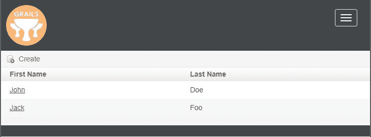

# 用 Grails 构建 MVC Web 应用程序

> 原文：<https://web.archive.org/web/20220930061024/https://www.baeldung.com/grails-mvc-application>

## **1。概述**

在本教程中，我们将学习如何使用 Grails 创建一个简单的 web 应用程序。

Grails(更准确地说是它的最新主要版本)是一个构建在 Spring Boot 项目之上的框架，使用 Apache Groovy 语言来开发 web 应用程序。

它的灵感来自于 Ruby 的 Rails 框架，而**是围绕“约定胜于配置”的理念构建的，这允许减少样板代码**。

## **2。设置**

首先，让我们前往官方页面准备环境。本教程发布时，最新版本是 3.3.3。

简单地说，有两种安装 Grails 的方法:通过 SDKMAN 或下载发行版并将二进制文件添加到 PATH 环境变量中。

我们不会一步一步地介绍这个设置，因为它在 Grails 文档中有很好的记录。

## **3。Grails 应用剖析**

在本节中，我们将更好地理解 Grails 应用程序的结构。正如我们前面提到的，Grails 更喜欢约定而不是配置，因此文件的位置定义了它们的用途。让我们看看`grails-app`目录中有什么:

*   **资产**–我们存储静态资产文件(如样式、javascript 文件或图像)的地方
*   **conf**–包含项目配置文件:
    *   `application.yml`包含标准的 web 应用程序设置，如数据源、mime 类型和其他 Grails 或 Spring 相关的设置
    *   `resources.groovy`包含春豆定义
    *   `logback.groovy`包含日志记录配置
*   **控制器**——负责处理请求和生成响应，或者将它们委托给视图。按照惯例，当文件名以`*Controller`结尾时，框架为控制器类中定义的每个动作创建一个默认的 URL 映射
*   **域**–包含 Grails 应用程序的业务模型。GORM 将这里的每个类映射到数据库表中
*   **i18n**–用于国际化支持
*   **init**–应用程序的入口点
*   **服务**–应用程序的业务逻辑将存在于此。按照惯例，Grails 将为每个服务创建一个 Spring singleton bean
*   **标签库**–定制标签库的地方
*   **视图**–包含视图和模板

## **4。一个简单的网络应用程序**

在本章中，我们将创建一个简单的 web 应用程序来管理学生。让我们首先调用 CLI 命令来创建应用程序框架:

```
grails create-app
```

当项目的基本结构生成后，让我们继续实现实际的 web 应用程序组件。

### **4.1。领域层**

因为我们正在实现一个处理学生的 web 应用程序，所以让我们从生成一个名为`Student`的域类开始:

```
grails create-domain-class com.baeldung.grails.Student
```

最后，让我们给它添加`firstName`和`lastName`属性:

```
class Student {
    String firstName
    String lastName
}
```

Grails 应用它的惯例，将为位于 `grails-app/domain`目录中的所有类建立一个对象关系映射。

此外，由于 [GormEntity](https://web.archive.org/web/20220926184557/http://gorm.grails.org/6.0.x/hibernate/api/org/grails/datastore/gorm/GormEntity.html) 特征，**所有的域类都可以访问所有的 CRUD 操作**，我们将在下一节中使用这些操作来实现服务。

### **4.2。服务层**

我们的应用程序将处理以下用例:

*   查看学生列表
*   创造新的学生
*   删除现有学生

让我们实现这些用例。我们将从生成一个服务类开始:

```
grails create-service com.baeldung.grails.Student
```

让我们转到`grails-app/services`目录，在适当的包中找到我们新创建的服务，并添加所有必要的方法:

```
@Transactional
class StudentService {

    def get(id){
        Student.get(id)
    }

    def list() {
        Student.list()
    }

    def save(student){
        student.save()
    }

    def delete(id){
        Student.get(id).delete()
    }
}
```

**注意服务默认不支持交易**。我们可以通过向类添加`@Transactional`注释来启用这个特性。

### **4.3。控制器层**

为了使业务逻辑对 UI 可用，让我们通过调用以下命令来创建一个`StudentController` :

```
grails create-controller com.baeldung.grails.Student
```

默认情况下， **Grails 通过名称**注入 beans。这意味着我们可以通过声明一个名为`studentsService`的实例变量，轻松地将`StudentService`单例实例注入到控制器中。

我们现在可以定义读取、创建和删除学生的操作。

```
class StudentController {

    def studentService

    def index() {
        respond studentService.list()
    }

    def show(Long id) {
        respond studentService.get(id)
    }

    def create() {
        respond new Student(params)
    }

    def save(Student student) {
        studentService.save(student)
        redirect action:"index", method:"GET"
    }

    def delete(Long id) {
        studentService.delete(id)
        redirect action:"index", method:"GET"
    }
}
```

按照惯例，来自这个控制器的**的`index()`动作将被映射到 URI 的**`**/student/index**,` `show()`动作到`/student/show`等等。

### 4.4。视图层

设置好控制器动作后，我们现在可以开始创建 UI 视图了。我们将创建三个 Groovy 服务器页面，用于列出、创建和删除学生。

按照惯例，Grails 将基于控制器名称和动作呈现一个视图。例如， `**the index()**` **动作从`StudentController`会解析到`/grails-app/views/student/index.gsp`**

让我们从实现视图`/grails-app/` `views/student/index.gsp`开始，它将显示学生列表。我们将使用标签`<f:table/>`创建一个 HTML 表，显示从控制器中的`index()`动作返回的所有学生。

按照惯例，当我们响应一个对象列表时， **Grails 会在模型名**后面加上“列表”后缀，这样我们就可以用变量`studentList`访问学生对象列表:

```
<!DOCTYPE html>
<html>
    <head>
        <meta name="layout" content="main" />
    </head>
    <body>
        <div class="nav" role="navigation">
            <ul>
                <li><g:link class="create" action="create">Create</g:link></li>
            </ul>
        </div>
        <div id="list-student" class="content scaffold-list" role="main">
            <f:table collection="${studentList}" 
                properties="['firstName', 'lastName']" />
        </div>
    </body>
</html>
```

我们现在将进入视图`/grails-app/` `views/` `student/create.gsp,` ，它允许用户创建新的学生。我们将使用内置的`<f:all/>`标记，它显示给定 bean 的所有属性的表单:

```
<!DOCTYPE html>
<html>
    <head>
        <meta name="layout" content="main" />
    </head>
    <body>
        <div id="create-student" class="content scaffold-create" role="main">
            <g:form resource="${this.student}" method="POST">
                <fieldset class="form">
                    <f:all bean="student"/>
                </fieldset>
                <fieldset class="buttons">
                    <g:submitButton name="create" class="save" value="Create" />
                </fieldset>
            </g:form>
        </div>
    </body>
</html>
```

最后，让我们创建视图`/grails-app/` `views/` `student/show.gsp`来查看并最终删除学生。

在其他标签中，我们将利用`<f:display/>`，它将一个 bean 作为参数，并显示它的所有字段:

```
<!DOCTYPE html>
<html>
    <head>
        <meta name="layout" content="main" />
    </head>
    <body>
        <div class="nav" role="navigation">
            <ul>
                <li><g:link class="list" action="index">Students list</g:link></li>
            </ul>
        </div>
        <div id="show-student" class="content scaffold-show" role="main">
            <f:display bean="student" />
            <g:form resource="${this.student}" method="DELETE">
                <fieldset class="buttons">
                    <input class="delete" type="submit" value="delete" />
                </fieldset>
            </g:form>
        </div>
    </body>
</html>
```

### **4.5。单元测试**

Grails 主要利用 [Spock](https://web.archive.org/web/20220926184557/http://spockframework.org/) 进行测试。如果你不熟悉 Spock，我们强烈推荐你先阅读[这篇教程](/web/20220926184557/https://www.baeldung.com/groovy-spock)。

让我们从单元测试我们的`StudentController.` 的`index()`动作开始

我们将模拟来自`StudentService` 的`list()`方法，并测试`index()`是否返回预期的模型:

```
void "Test the index action returns the correct model"() {
    given:
    controller.studentService = Mock(StudentService) {
        list() >> [new Student(firstName: 'John',lastName: 'Doe')]
    }

    when:"The index action is executed"
    controller.index()

    then:"The model is correct"
    model.studentList.size() == 1
    model.studentList[0].firstName == 'John'
    model.studentList[0].lastName == 'Doe'
}
```

现在，让我们测试一下`delete()` 动作。我们将验证是否从`StudentService`调用了`delete()` ，并验证到索引页面的重定向:

```
void "Test the delete action with an instance"() {
    given:
    controller.studentService = Mock(StudentService) {
      1 * delete(2)
    }

    when:"The domain instance is passed to the delete action"
    request.contentType = FORM_CONTENT_TYPE
    request.method = 'DELETE'
    controller.delete(2)

    then:"The user is redirected to index"
    response.redirectedUrl == '/student/index'
}
```

### 4.6。集成测试

接下来，让我们看看如何为服务层创建集成测试。主要我们将测试与在`grails-app/conf/application.yml.` 中配置的数据库的集成

默认情况下，Grails 为此使用内存中的 H2 数据库。

首先，让我们从定义一个帮助器方法开始，该方法用于创建数据来填充数据库:

```
private Long setupData() {
    new Student(firstName: 'John',lastName: 'Doe')
      .save(flush: true, failOnError: true)
    new Student(firstName: 'Max',lastName: 'Foo')
      .save(flush: true, failOnError: true)
    Student student = new Student(firstName: 'Alex',lastName: 'Bar')
      .save(flush: true, failOnError: true)
    student.id
}
```

由于我们的集成测试类上的`@Rollback`注释，**每个方法将在一个单独的事务中运行，该事务将在测试结束时回滚**。

看看我们是如何为我们的`list()`方法实现集成测试的:

```
void "test list"() {
    setupData()

    when:
    List<Student> studentList = studentService.list()

    then:
    studentList.size() == 3
    studentList[0].lastName == 'Doe'
    studentList[1].lastName == 'Foo'
    studentList[2].lastName == 'Bar'
}
```

同样，让我们测试一下`delete()`方法，验证学生总数是否减少了 1:

```
void "test delete"() {
    Long id = setupData()

    expect:
    studentService.list().size() == 3

    when:
    studentService.delete(id)
    sessionFactory.currentSession.flush()

    then:
    studentService.list().size() == 2
}
```

## **5。运行和部署**

运行和部署应用程序可以通过 Grails CLI 调用单个命令来完成。

要运行应用程序，请使用:

```
grails run-app
```

默认情况下，Grails 会在端口 8080 上设置 Tomcat。

让我们导航到`http://localhost:8080/student/index`来看看我们的 web 应用程序是什么样子的:



如果要将应用程序部署到 servlet 容器，请使用:

```
grails war
```

来创建一个随时可以部署的 war 工件。

## **6。结论**

在本文中，我们重点介绍了如何使用约定胜于配置的理念创建 Grails web 应用程序。我们还看到了如何使用 Spock 框架执行单元和集成测试。

和往常一样，这里使用的所有代码都可以在 GitHub 上找到[。](https://web.archive.org/web/20220926184557/https://github.com/eugenp/tutorials/tree/master/grails)