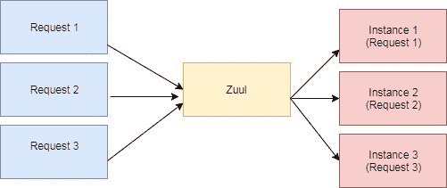

# 使用 Zuul 和 Eureka 进行负载平衡的示例

> 原文：<https://web.archive.org/web/20220930061024/https://www.baeldung.com/zuul-load-balancing>

## 1.概观

在本文中，我们将了解负载平衡如何与 Zuul 和 Eureka 一起工作。

**我们将通过 Zuul 代理**将请求路由到 Spring Cloud Eureka 发现的 REST 服务。

## 2.初始设置

我们需要设置`Eureka server/client` 如文章[所示的春云网飞-尤里卡](/web/20220626090606/https://www.baeldung.com/spring-cloud-netflix-eureka)。

## 3.配置 Zuul

除了许多其他的事情，Zuul 从 Eureka 服务位置获取数据，并进行服务器端负载平衡。

### **3.1。Maven 配置**

首先，我们将把`Zuul Server`和`Eureka dependency`添加到我们的`pom.xml:`中

[PRE0]

### **3.2。与尤里卡的通信**

其次，我们将在 Zuul 的`application.properties` 文件中添加必要的属性:

[PRE1]

在这里，我们告诉 Zuul 在 Eureka 将自己注册为一个服务，并在端口 8762 上运行。

接下来，我们将实现`main class`，用 `@EnableZuulProxy and @EnableDiscoveryClient. @EnableZuulProxy`表示这是 Zuul 服务器，`@EnableDiscoveryClient` 表示这是 Eureka 客户端:

[PRE2]

我们将浏览器指向 [`http://localhost:8762/routes`](https://web.archive.org/web/20220626090606/http://localhost:8762/routes) 。这应该会显示由`Eureka:`发现的`all the routes available for Zuul`

[PRE3]

现在，我们将使用获得的 Zuul 代理路由与 Eureka 客户端通信。将我们的浏览器指向 [`http://localhost:8762/spring-cloud-eureka-client/greeting`](https://web.archive.org/web/20220626090606/http://localhost:8762/spring-cloud-eureka-client/greeting) 应该会产生类似这样的响应:

[PRE4]

## 4.使用 Zuul 实现负载平衡

当 Zuul 收到请求时，它会选择一个可用的物理位置，并将请求转发给实际的服务实例。缓存服务实例的位置并将请求转发到实际位置的整个过程是现成的，不需要额外的配置。

在这里，我们可以看到 Zuul 是如何封装同一服务的三个不同实例的:

在内部，Zuul 使用网飞功能区从服务发现(Eureka 服务器)中查找服务的所有实例。

让我们观察一下当出现多个实例时的这种行为。

### **4.1。注册多个实例**

我们将从运行两个实例(8081 和 8082 端口)开始。

一旦所有实例都启动了，我们可以在日志中观察到实例的物理位置被注册在`DynamicServerListLoadBalancer`中，并且路由被映射到`Zuul Controller`，后者负责将请求转发到实际的实例:

[PRE5]

注意:日志的格式是为了更好的可读性。

### **4.2。负载平衡示例**

让我们将浏览器导航到[http://localhost:8762/spring-cloud-eureka-client/greeting](https://web.archive.org/web/20220626090606/http://localhost:8762/spring-cloud-eureka-client/greeting)几次。

每一次，我们都会看到稍微不同的结果:

[PRE6]

[PRE7]

[PRE8]

Zuul 收到的每个请求都以循环方式转发给不同的实例。

如果我们启动另一个实例并在 Eureka 中注册它，Zuul 将自动注册它并开始向它转发请求:

[PRE9]

我们还可以将 Zuul 的负载平衡策略更改为任何其他网飞 Ribbon 策略——更多信息可以在我们的 Ribbon [文章](/web/20220626090606/https://www.baeldung.com/spring-cloud-rest-client-with-netflix-ribbon)中找到。

### **5。结论**

正如我们所看到的，Zuul 为 Rest 服务的所有实例提供了一个 URL，并进行负载平衡，以循环方式将请求转发给其中一个实例。

一如既往，本文的完整代码可以在 GitHub 上找到[。](https://web.archive.org/web/20220626090606/https://github.com/eugenp/tutorials/tree/master/spring-cloud-modules/spring-cloud-zuul-eureka-integration)