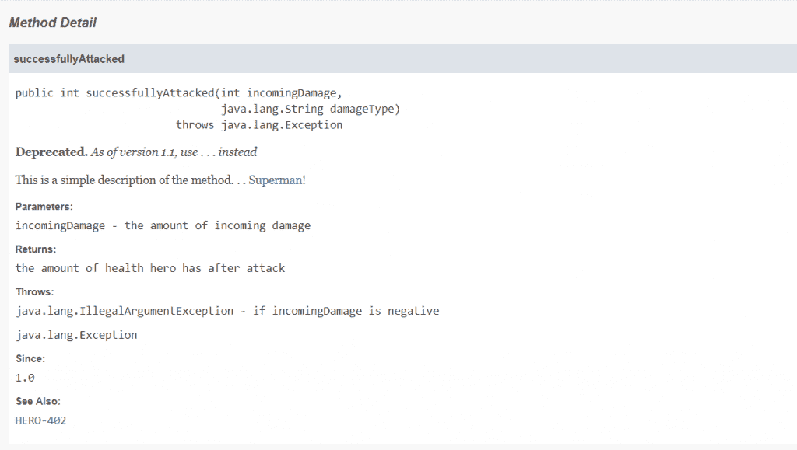

# Javadoc 简介

> 原文：<https://web.archive.org/web/20220930061024/https://www.baeldung.com/javadoc>

## **1。概述**

好的 API 文档是促成软件项目整体成功的众多因素之一。

幸运的是，所有现代版本的 JDK 都提供了 Javadoc 工具——用于从源代码中的注释生成 API 文档。

先决条件:

1.  JDK 1.4 (JDK 7+推荐用于最新版本的 Maven Javadoc 插件)
2.  添加到`PATH`环境变量中的 JDK `/bin`文件夹
3.  (可选)具有内置工具的 IDE

## **2。Javadoc 注释**

先说评论。

**Javadoc 注释结构看起来非常类似于常规的多行注释**，但是关键的区别是在开头多了一个星号:

[PRE0]

Javadoc 风格的注释也可以包含 HTML 标签。

### **2.1。Javadoc 格式**

Javadoc 注释可以放在我们想要记录的任何类、方法或字段之上。

这些注释通常由两部分组成:

1.  我们所评论的描述
2.  描述特定元数据的独立块标签(标有“`@`”符号)

在我们的例子中，我们将使用一些更常见的块标签。欲了解块标签的完整列表，请访问[参考指南](https://web.archive.org/web/20220926200436/https://docs.oracle.com/en/java/javase/11/tools/javadoc.html)。

### **2.2。类级别的 javadoc**

让我们看看类级别的 Javadoc 注释是什么样子的:

[PRE1]

我们有一个简短的描述和两个不同的块标记——独立的和内嵌的:

*   独立标签出现在描述之后，标签作为一行的第一个单词，例如`@author` 标签
*   **行内标签可以出现在任何地方，并用花括号**括起来，例如描述中的`@link`标签

在我们的示例中，我们还可以看到使用了两种类型的块标记:

*   `{@link}`提供指向我们源代码参考部分的内联链接
*   添加被注释的类、方法或字段的作者的名字

### **2.3。字段级的 javadoc**

我们也可以在我们的`SuperHero`类中使用没有任何块标签的描述:

[PRE2]

私有字段不会生成 Javadoc，除非我们显式地将`-private` 选项传递给 Javadoc 命令。

### **2.4。方法级的 javadoc**

方法可以包含各种 Javadoc 块标记。

让我们来看看我们正在使用的一种方法:

[PRE3]

`successfullyAttacked`方法包含一个描述和许多独立的块标签。

有许多块标签来帮助生成适当的文档，我们可以包含各种不同类型的信息。我们甚至可以在评论中使用基本的 HTML 标签。

让我们回顾一下我们在上面的例子中遇到的标签:

*   `@param`提供关于一个方法的参数或输入的任何有用的描述
*   提供了一个方法将会或者能够返回什么的描述
*   `@see`将生成一个类似于`{@link}`标签的链接，但是更多的是在引用的上下文中，而不是内联的
*   `@since`指定添加到项目中的类、字段或方法的版本
*   `@version` 指定软件的版本，通常与%I%和%G%宏一起使用
*   `@throws`用于进一步解释软件预期出现异常的情况
*   解释为什么代码不被推荐使用，什么时候可能不被推荐使用，以及有什么替代方案

尽管这两个部分在技术上是可选的，但我们至少需要一个部分，Javadoc 工具才能生成任何有意义的内容。

## **3。Javadoc 生成**

为了生成 Javadoc 页面，我们想看看 JDK 附带的命令行工具和 Maven 插件。

### **3.1。Javadoc 命令行工具**

Javadoc 命令行工具非常强大，但也有一些复杂性。

在没有任何选项或参数的情况下运行命令`javadoc`将导致一个错误并输出它所期望的参数。

我们至少需要指定我们希望为哪个包或类生成文档。

让我们打开一个命令行并导航到项目目录。

假设这些类都在项目目录的`src`文件夹中:

[PRE4]

这将在用–`d`标志指定的目录`doc`中生成文档。如果存在多个包或文件，我们需要提供所有的包或文件。

当然，使用具有内置功能的 IDE 更容易，并且通常被推荐。

### **3.2。带有 Maven 插件的 Javadoc】**

我们还可以利用 Maven Javadoc 插件:

[PRE5]

在项目的基本目录中，我们运行命令将 Javadocs 生成到 target\site 中的目录:

[PRE6]

Maven 插件非常强大，可以无缝地促进复杂文档的生成。

现在让我们看看生成的 Javadoc 页面是什么样子的:

## 

我们可以看到我们的`SuperHero`类扩展的类的树形视图。我们可以看到我们的描述、字段和方法，还可以点击链接了解更多信息。

我们方法的详细视图如下所示:

### **3.3。自定义 Javadoc 标签**

除了使用预定义的块标签来格式化我们的文档，**我们还可以创建自定义的块标签。**

为此，我们只需要在 Javadoc 命令行中包含一个格式为`<tag-name>:<locations-allowed>:<header>`的`-tag`选项。

为了创建一个名为`@location` allowed anywhere 的定制标记，它显示在我们生成的文档的“显著位置”标题中，我们需要运行:

[PRE7]

为了使用这个标签，我们可以将它添加到 Javadoc 注释的 block 部分:

[PRE8]

Maven Javadoc 插件足够灵活，允许在我们的`pom.xml`中定义我们的定制标签。

为了给我们的项目设置相同的标签，我们可以在插件的`<tags>`部分添加以下内容:

[PRE9]

这种方式允许我们一次指定定制标签，而不是每次都指定。

## **4。结论**

这篇快速入门教程讲述了如何编写基本的 Javadoc 并使用 Javadoc 命令行生成它们。

生成文档的一个更简单的方法是使用任何内置的 IDE 选项，或者将 Maven 插件包含到我们的`pom.xml`文件中，并运行适当的命令。

代码样本一如既往地可以在 GitHub 上找到[。](https://web.archive.org/web/20220926200436/https://github.com/eugenp/tutorials/tree/master/core-java-modules/core-java)