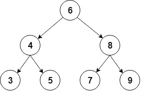

# 用 Java 实现二叉树

> 原文:[https://web . archive . org/web/20220930061024/https://www . bael dung . com/Java-binary-tree](https://web.archive.org/web/20220930061024/https://www.baeldung.com/java-binary-tree)

## **1。简介**

在本教程中，我们将介绍 Java 中二叉树的实现。

出于本教程的考虑，**我们将使用一个包含`int`值**的[排序二叉树](/web/20221006232634/https://www.baeldung.com/cs/binary-search-trees)。

## 延伸阅读:

## [如何打印二叉树图](/web/20221006232634/https://www.baeldung.com/java-print-binary-tree-diagram)

Learn how to print a binary tree diagram.[Read more](/web/20221006232634/https://www.baeldung.com/java-print-binary-tree-diagram) →

## [在 Java 中反转二叉树](/web/20221006232634/https://www.baeldung.com/java-reversing-a-binary-tree)

A quick and practical guide to reversing a binary tree in Java.[Read more](/web/20221006232634/https://www.baeldung.com/java-reversing-a-binary-tree) →

## [Java 中的深度优先搜索](/web/20221006232634/https://www.baeldung.com/java-depth-first-search)

A guide to the Depth-first search algorithm in Java, using both Tree and Graph data structures.[Read more](/web/20221006232634/https://www.baeldung.com/java-depth-first-search) →

## **2。二叉树**

二叉树是一种递归数据结构，其中每个节点最多可以有两个子节点。

二叉树的一种常见类型是[二叉查找树](/web/20221006232634/https://www.baeldung.com/cs/bst-validation)，其中每个节点的值大于或等于左子树中的节点值，小于或等于右子树中的节点值。

这是这种二叉树的直观表示:

[](/web/20221006232634/https://www.baeldung.com/wp-content/uploads/2017/12/Tree-1.jpg)

对于实现，我们将使用一个辅助的`Node`类，它将存储`int`值，并保存对每个孩子的引用:

```
class Node {
    int value;
    Node left;
    Node right;

    Node(int value) {
        this.value = value;
        right = null;
        left = null;
    }
}
```

然后我们将添加树的开始节点，通常称为`root:`

```
public class BinaryTree {

    Node root;

    // ...
}
```

## **3。常见操作**

现在让我们看看我们可以在二叉树上执行的最常见的操作。

### **3.1。插入元素**

我们要介绍的第一个操作是插入新节点。

首先，**我们必须找到我们想要添加新节点的位置，以便保持树的排序**。我们将从根节点开始遵循这些规则:

*   如果新节点的值低于当前节点的值，我们就转到左边的子节点
*   如果新节点的值大于当前节点的值，我们就转到正确的子节点
*   当当前节点是`null,`时，我们到达了一个叶节点，我们可以在那个位置插入新节点

然后，我们将创建一个递归方法来进行插入:

```
private Node addRecursive(Node current, int value) {
    if (current == null) {
        return new Node(value);
    }

    if (value < current.value) {
        current.left = addRecursive(current.left, value);
    } else if (value > current.value) {
        current.right = addRecursive(current.right, value);
    } else {
        // value already exists
        return current;
    }

    return current;
}
```

接下来，我们将创建从`root`节点开始递归的公共方法:

```
public void add(int value) {
    root = addRecursive(root, value);
}
```

让我们看看如何使用这个方法从我们的例子中创建树:

```
private BinaryTree createBinaryTree() {
    BinaryTree bt = new BinaryTree();

    bt.add(6);
    bt.add(4);
    bt.add(8);
    bt.add(3);
    bt.add(5);
    bt.add(7);
    bt.add(9);

    return bt;
}
```

### **3.2。寻找元素**

现在让我们添加一个方法来检查树是否包含一个特定的值。

和以前一样，我们将首先创建一个遍历树的递归方法:

```
private boolean containsNodeRecursive(Node current, int value) {
    if (current == null) {
        return false;
    } 
    if (value == current.value) {
        return true;
    } 
    return value < current.value
      ? containsNodeRecursive(current.left, value)
      : containsNodeRecursive(current.right, value);
}
```

在这里，我们通过与当前节点中的值进行比较来搜索值；然后，我们将根据结果继续研究左边或右边的孩子。

接下来我们将创建从`root`开始的公共方法:

```
public boolean containsNode(int value) {
    return containsNodeRecursive(root, value);
}
```

然后，我们将创建一个简单的测试来验证树确实包含插入的元素:

```
@Test
public void givenABinaryTree_WhenAddingElements_ThenTreeContainsThoseElements() {
    BinaryTree bt = createBinaryTree();

    assertTrue(bt.containsNode(6));
    assertTrue(bt.containsNode(4));

    assertFalse(bt.containsNode(1));
}
```

所有添加的节点都应该包含在树中。

### **3.3。删除一个元素**

另一个常见的操作是从树中删除节点。

首先，我们必须像前面一样找到要删除的节点:

```
private Node deleteRecursive(Node current, int value) {
    if (current == null) {
        return null;
    }

    if (value == current.value) {
        // Node to delete found
        // ... code to delete the node will go here
    } 
    if (value < current.value) {
        current.left = deleteRecursive(current.left, value);
        return current;
    }
    current.right = deleteRecursive(current.right, value);
    return current;
}
```

一旦我们找到要删除的节点，有 3 种主要的不同情况:

*   **一个节点没有子节点——**这是最简单的情况；我们只需要将这个节点替换为其父节点中的`null`
*   **一个节点只有一个子节点—**在父节点中，我们用它唯一的子节点替换这个节点。
*   **一个节点有两个子节点**——这是最复杂的情况，因为它需要树重组

让我们看看当节点是叶节点时，我们将如何实现第一种情况:

```
if (current.left == null && current.right == null) {
    return null;
}
```

现在让我们继续讨论节点只有一个子节点的情况:

```
if (current.right == null) {
    return current.left;
}

if (current.left == null) {
    return current.right;
}
```

这里我们返回了`non-null`子节点，因此它可以被分配给父节点。

最后，我们必须处理节点有两个孩子的情况。

首先，我们需要找到将替换被删除节点的节点。我们将使用即将被删除节点的右侧子树中最小的节点:

```
private int findSmallestValue(Node root) {
    return root.left == null ? root.value : findSmallestValue(root.left);
}
```

然后，我们将最小值分配给要删除的节点，之后，我们将从右边的子树中删除它:

```
int smallestValue = findSmallestValue(current.right);
current.value = smallestValue;
current.right = deleteRecursive(current.right, smallestValue);
return current;
```

最后，我们将创建从`root`开始删除的公共方法:

```
public void delete(int value) {
    root = deleteRecursive(root, value);
}
```

现在让我们检查删除是否如预期的那样工作:

```
@Test
public void givenABinaryTree_WhenDeletingElements_ThenTreeDoesNotContainThoseElements() {
    BinaryTree bt = createBinaryTree();

    assertTrue(bt.containsNode(9));
    bt.delete(9);
    assertFalse(bt.containsNode(9));
}
```

## **4。遍历树**

在这一节中，我们将探索遍历树的不同方式，详细介绍深度优先和广度优先搜索。

我们将使用之前使用的同一棵树，并且我们将检查每种情况下的遍历顺序。

### **4.1。深度优先搜索**

深度优先搜索是一种遍历类型，在探索下一个兄弟之前，在每个孩子中尽可能地深入。

有几种方法可以执行深度优先搜索:按顺序、前顺序和后顺序。

**有序遍历包括首先访问左边的子树，然后是根节点，最后是右边的子树:**

```
public void traverseInOrder(Node node) {
    if (node != null) {
        traverseInOrder(node.left);
        System.out.print(" " + node.value);
        traverseInOrder(node.right);
    }
}
```

如果我们调用这个方法，控制台输出将显示按顺序遍历:

```
3 4 5 6 7 8 9
```

**前序遍历首先访问根节点，然后是左边的子树，最后是右边的子树:**

```
public void traversePreOrder(Node node) {
    if (node != null) {
        System.out.print(" " + node.value);
        traversePreOrder(node.left);
        traversePreOrder(node.right);
    }
}
```

让我们检查控制台输出中的前序遍历:

```
6 4 3 5 8 7 9
```

**后序遍历访问左边的子树、右边的子树和末尾的根节点:**

```
public void traversePostOrder(Node node) {
    if (node != null) {
        traversePostOrder(node.left);
        traversePostOrder(node.right);
        System.out.print(" " + node.value);
    }
}
```

以下是按后顺序排列的节点:

```
3 5 4 7 9 8 6
```

### **4.2。广度优先搜索**

这是另一种常见的遍历类型，即**在进入下一层**之前访问一层的所有节点。

这种遍历也称为级别顺序，从根开始，从左到右访问树的所有级别。

对于实现，我们将使用一个`Queue`来按顺序保存每个级别的节点。我们将从列表中提取每个节点，打印其值，然后将其子节点添加到队列中:

```
public void traverseLevelOrder() {
    if (root == null) {
        return;
    }

    Queue<Node> nodes = new LinkedList<>();
    nodes.add(root);

    while (!nodes.isEmpty()) {

        Node node = nodes.remove();

        System.out.print(" " + node.value);

        if (node.left != null) {
            nodes.add(node.left);
        }

        if (node.right != null) {
            nodes.add(node.right);
        }
    }
}
```

在这种情况下，节点的顺序将是:

```
6 4 8 3 5 7 9
```

## **5。结论**

在本文中，我们学习了如何用 Java 实现排序二叉树，以及它最常见的操作。

GitHub 上的[提供了示例的完整源代码。](https://web.archive.org/web/20221006232634/https://github.com/eugenp/tutorials/tree/master/data-structures)