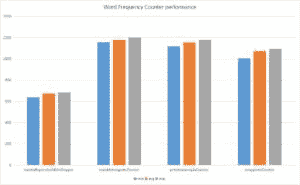

# Java 中高效的词频计算器

> 原文：<https://web.archive.org/web/20220930061024/https://www.baeldung.com/java-word-frequency>

## **1。概述**

在本教程中，我们将展示用 Java 实现单词计数器的各种方法。

## **2。计数器实现**

让我们从简单地计算这个数组中单词的字数开始:

[PRE0]

如果我们想要处理巨大的文件，我们需要选择这里描述的其他选项。

### **2.1。`Map`同`Integers`**

最简单的解决方案之一是创建一个`Map`，将单词存储为键，将出现的次数存储为值:

[PRE1]

我们简单地使用了`Map`的便利的`compute`方法，如果键不存在，该方法递增计数器或者用 1 初始化它。

然而，**这种创建计数器的方法效率不高，因为`Integer`是不可变的，所以每当我们递增计数器时，我们就创建一个新的`Integer`对象。**

### **2.2。流 API**

现在，让我们利用 Java 8 流 API、并行`Streams`和 [`groupingBy` ()](/web/20221003190704/https://www.baeldung.com/java-groupingby-collector) 收集器:

[PRE2]

类似地，我们可以使用一个`parallelStream`:

[PRE3]

### **2.3。`Map`用一个`Integer`数组**

接下来，让我们使用一个`Map`，它将一个计数器包装在一个用作值的`Integer`数组中:

[PRE4]

请注意我们是如何创建一个简单的以 `int arrays`为值的`HashMap`的。

在`counterWithPrimitiveArray`方法中，当迭代数组的每个值时，我们:

*   通过将国家名称作为一个键传递来调用`counterMap`上的`get`
*   检查密钥是否已经存在。如果条目已经存在，我们用单个“1”创建一个原始整数数组的新实例。如果条目不存在，我们增加数组中的计数器值

这种方法比包装器实现–**更好，因为它创建的对象更少。**

### **2.4。`Map`同`MutableInteger`**

接下来，让我们创建一个封装器对象，它嵌入了一个原始整数计数器，如下所示:

[PRE5]

让我们看看如何利用上面的类作为计数器:

[PRE6]

在`mapWithMutableInteger`方法中，当迭代`COUNTRY_NAMES`数组中的每个国家时，我们:

*   通过将国家名称作为键传递来调用对`counterMap`的 get
*   检查密钥是否已经存在。如果没有条目，我们创建一个`MutableInteger`的实例，将计数器值设置为 1。如果国家出现在地图上，我们增加出现在`MutableInteger`中的计数器值

这种创建计数器的方法优于前面的方法-**,因为我们重用了同一个`MutableInteger`,从而创建了更少的对象。**

这就是 Apache Collections `HashMultiSet`的工作方式，它在内部嵌入一个值为`MutableInteger` 的`HashMap`。

## **3。性能分析**

这张图表比较了上面列出的每种方法的性能。

上面的图表是使用 JMH 创建的，下面是创建上面的统计数据的代码:

[PRE7]

## **4。结论**

在这篇简短的文章中，我们举例说明了使用 Java 创建单词计数器的各种方法。

这些例子的实现可以在 GitHub 项目中找到——这是一个基于 Maven 的项目，所以应该很容易导入和运行。