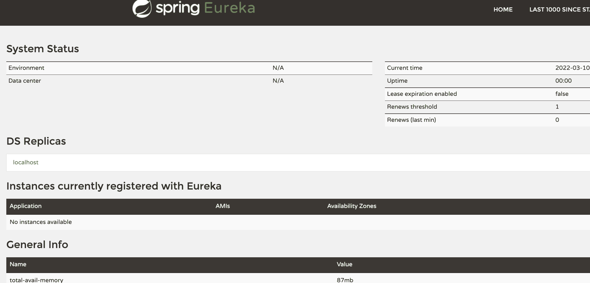

# spring Cloud–禁用带有配置文件的发现客户端

> 原文：<https://web.archive.org/web/20220930061024/https://www.baeldung.com/spring-cloud-disable-discovery-clients>

## 1.概观

在本教程中，我们将了解如何使用配置文件禁用 Spring Cloud 的发现客户端。这在我们希望启用/禁用服务发现而不对代码进行任何更改的情况下非常有用。

## 2.设置 Eureka 服务器和 Eureka 客户端

让我们从创建一个 Eureka 服务器和一个发现客户机开始。

首先，我们可以使用 [Spring Cloud 网飞尤里卡教程](/web/20220524060104/https://www.baeldung.com/spring-cloud-netflix-eureka)的第 2 节来设置我们的尤里卡服务器。

### 2.1.发现客户端设置

下一步是创建另一个将在服务器上注册自己的应用程序。让我们将这个应用程序设置为发现客户机。

让我们将[网络](https://web.archive.org/web/20220524060104/https://search.maven.org/search?q=g:org.springframework.boot%20AND%20a:spring-boot-starter-web)和[尤里卡客户端](https://web.archive.org/web/20220524060104/https://search.maven.org/search?q=spring-cloud-starter-netflix-eureka-client)启动器依赖项添加到我们的`pom.xml`:

[PRE0]

我们还需要确保我们的 cloud starter 出现在依赖项管理部分，并且 Spring Cloud 版本已经设置。

当使用 [Spring Initializr](https://web.archive.org/web/20220524060104/https://start.spring.io/) 创建项目时，这些都已经设置好了。如果没有，我们可以将它们添加到我们的`pom.xml `文件中:

[PRE1]

### 2.2.添加配置属性

一旦我们有了依赖项，我们需要做的就是将新的客户端应用程序的配置属性添加到`application.properties `文件中:

[PRE2]

这将确保当应用程序启动时，它将在 Eureka 服务器上注册自己，该服务器位于上面指定的 URL。它将被称为`spring-cloud-eureka-client.`

我们应该注意，通常，我们也在配置类上使用`@EnableDiscoveryClient`注释来启用发现客户端。然而，如果我们使用 Spring Cloud 启动器，我们不需要注释。默认情况下，发现客户端处于启用状态。另外，当它在类路径上找到网飞尤里卡客户端时，它会自动配置它。

### 2.3.你好世界控制器

为了测试我们的应用程序，我们需要一个可以点击的示例 URL。让我们创建一个将返回问候消息的简单控制器:

[PRE3]

现在，是时候运行 Eureka 服务器和发现客户端了。当我们运行应用程序时，发现客户端将向 Eureka 服务器注册。我们可以在 Eureka 服务器仪表板上看到同样的情况:

## 3.基于配置文件的配置

有些情况下，我们可能希望禁用服务注册。一个原因可能是环境。

例如，我们可能想要在本地开发环境中禁用发现客户端，因为每次我们想要在本地测试时运行 Eureka 服务器可能是不必要的。让我们看看如何实现这一点。

我们将更改`application.properties`文件中的属性，以启用和禁用每个配置文件的发现客户端。

### 3.1.使用单独的属性文件

一种简单而流行的方法是为每个环境使用单独的属性文件。

因此，让我们创建另一个名为`application-dev.properties`的属性文件:

[PRE4]

我们可以使用`spring.cloud.discovery.enabled`属性启用/禁用发现客户端。我们将其设置为`false`以禁用发现客户端。

当`dev` 配置文件激活时，将使用该文件，而不是原来的属性文件。

### 3.2.使用多文档文件

如果我们不想在每个环境中使用单独的文件，另一个选择是使用[多文档属性文件](/web/20220524060104/https://www.baeldung.com/spring-profiles#3-multi-document-files)。

为此，我们将添加两个属性:

[PRE5]

对于这种技术，我们使用`‘#—‘` 将属性文件分成两部分。此外，我们将使用`spring.config.activate.on-profile`属性。这两行结合使用，**指示应用程序** **仅在配置文件激活时读取当前零件中定义的属性**。在我们的例子中，我们将使用`dev`概要文件。

同样，如前所述，我们已经将`spring.cloud.discovery.enabled`属性设置为`false`。

这将禁用`dev`配置文件中的发现客户端，但在配置文件不活动时保持启用。

## 4.测试

现在，是时候运行 Eureka 服务器和 Discovery 客户机并测试一切是否如预期那样工作了。我们尚未添加个人资料。当我们运行应用程序时，发现客户端将向 Eureka 服务器注册。我们可以在 Eureka 服务器仪表板上看到同样的情况:

### 4.1.使用配置文件进行测试

接下来，我们将在运行应用程序时添加概要文件。我们可以添加命令行参数`-Dspring.profiles.active=dev`来启用`dev`概要文件。当我们运行应用程序时，我们可以看到客户机这次没有向 Eureka 服务器注册: 

## 5.结论

在本教程中，我们学习了如何使用属性来添加基于概要文件的配置。我们使用相同的方法来禁用基于活动配置文件的发现客户端。

和往常一样，本教程的代码可以在 GitHub 上找到[。](https://web.archive.org/web/20220524060104/https://github.com/eugenp/tutorials/tree/master/spring-cloud/spring-cloud-eureka)