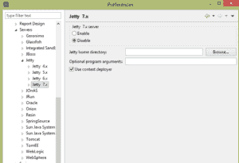

# 在 Jetty 中部署 Web 应用程序

> 原文：<https://web.archive.org/web/20220930061024/https://www.baeldung.com/deploy-to-jetty>

## **1。概述**

在本文中，我们将快速概述 Jetty web 服务器，然后介绍部署 WAR 文件的各种方法。

[Jetty](https://web.archive.org/web/20220701022639/https://www.eclipse.org/jetty/) 是一个开源的 Java HTTP web 服务器和 servlet 容器。Jetty 更常用于 Java 生态系统中的机器对机器通信。

## **2。项目设置**

通过点击[此链接](https://web.archive.org/web/20220701022639/https://www.eclipse.org/jetty/download.html)可以下载最新版本的 Jetty。我们将使用 Maven 从命令行创建一个非常基本的 Java web 应用程序，我们将在我们的示例中使用它。

在本文中，我们使用的是目前最新的版本 Jetty 9.x。

让我们转到控制台，导航到我们选择的位置并运行以下命令:

[PRE0]

该命令将在我们当前位置的新`jetty-app`文件夹中创建一个完整的 Java web 应用程序。这只是用 Maven 创建 Java 应用程序的许多方法之一，它符合我们的目的。

因为我们将处理 WAR 文件，所以让我们导航到项目根目录并构建它:

[PRE1]

使用 Maven 构建:

[PRE2]

然后将在位置`jetty-app/target/jetty-app.war`创建`jetty-app.war`。

## **3。码头结构**

**上下文路径**。指相对于服务器地址的位置，代表 web 应用程序的名称。

例如，如果我们的 web 应用程序被放在`$JETTY_HOME\webapps\myapp`目录下，它将被 URL `http://localhost/myapp`访问，它的上下文路径将是 */myapp* 。

**战争**。是以 ZIP 格式打包 web 应用程序目录层次结构的文件的扩展名，是 Web Archive 的缩写。Java web 应用程序通常打包成 WAR 文件进行部署。WAR 文件可以在命令行上创建，也可以用 Eclipse 之类的 IDE 创建。

## **4。通过复制 WAR 部署**

将 web 应用程序部署到 Jetty server 的最简单方法可能是将 WAR 文件复制到`$JETTY_HOME/webapps`目录中。

复制后，我们可以通过导航到`$JETTY_HOME`并运行命令来启动服务器:

[PRE3]

Jetty 将在启动时扫描其``$JETTY_HOME/webapps``目录，以便部署 web 应用程序。我们的新应用将部署在`/jetty-app`环境中。

当我们从浏览器加载 URL `http://localhost:8080/jetty-app`时，我们应该会看到我们的应用程序运行时，屏幕上会显示`Hello world!`。

## **5。使用上下文文件**进行部署

Jetty web server 为我们提供了一种方法，通过创建一个上下文文件来部署位于文件系统中任意位置的 web 归档文件。

这样，即使我们的 WAR 文件位于桌面上，或者我们选择将它保存在 Maven 放置包的`jetty-app/target`中，我们也可以在`$JETTY_HOME/webapps`中创建它的上下文文件。

让我们通过从`webapps`中删除刚刚部署的`jetty-app.war`来取消部署它。然后，我们将使用以下代码创建`jetty-app.xml`，并将其放在`webapps`中:

[PRE4]

**该上下文文件必须与我们的 WAR** 同名，扩展名为 XML。注意，我们已经将`contextPath`属性设置为`/jetty`。这意味着我们将从网址`http://localhost:8080/jetty`访问我们的网络应用。

这种定制上下文路径的能力是在 Jetty 中部署 WARs 的上下文文件方法的巨大优势之一，因为一些应用程序名称可能不适合这一目的。

## **6。使用 Jetty Maven 插件部署**

### **6.1。默认部署**

jetty Maven 插件帮助我们在构建 Java web 应用程序时进行快速测试和迭代。为了能够用它部署和运行应用程序，我们只需要在`pom.xml`中添加插件:

[PRE5]

最新版本可以通过关注[这个 Maven 链接](https://web.archive.org/web/20220701022639/http://search.maven.org/#search%7Cga%7C1%7Ca%3A%22jetty-Maven-plugin%22)找到。

在执行下一步之前，我们必须确保在端口`8080`上运行的 Jetty 实例已经停止。

为了在添加插件后部署我们的应用程序，我们导航到`pom.xml`所在的根目录并运行以下命令:

[PRE6]

这个命令创建一个新的 jetty 实例，插件将应用程序部署到它上面。我们可以通过加载`http://localhost:8080.`来访问它

jetty Maven 插件持续扫描 web 项目的任何变化，并不断重新部署它。

### **6.2。`ContextPath`变化多端的**

在前面的小节中，应用程序部署在`/`上下文中。然而，如果我们想像以前一样部署在一个给定的上下文路径下，比如`/jetty`，我们将不得不对插件进行不同的配置。

我们将插件声明更改为以下 XML:

[PRE7]

请注意我们是如何添加配置块来进一步定制我们的部署的。根据需要，可以在这个模块中放置几个配置选项。

在这些改变之后，我们可以像以前一样重新运行插件，并通过`http://localhost:8080/jetty`访问我们的应用程序。

### 6.3。改变端口

一种可能面临的情况是端口使用异常。也许我们有一个 jetty 实例运行在端口`8080`上用于生产，但我们仍处于开发阶段，并希望受益于使用 Maven 插件进行部署带来的简单迭代。

在这种情况下，我们必须在不同的端口上运行我们的测试服务器。让我们将插件配置更改为以下 XML:

[PRE8]

当我们重新运行我们的 Maven 插件时，我们将能够从`http://localhost:8888/jetty`访问我们的应用。

值得注意的是，使用 jetty Maven 插件，我们不需要安装并运行 jetty 的实例。相反，它创建自己的 jetty 实例。

## 7 .**。用码头滑道**部署

就像 jetty Maven 插件一样，jetty-runner 提供了一种快速简单的方法来部署和运行我们的 web 应用程序。使用 jetty-runner，我们也不需要安装和运行一个单独的 jetty 服务器实例。

### 7.1。码头滑道设置

要使用 jetty-runner 快速部署和运行我们的 web 应用程序，我们可以通过点击这个 [Maven 链接](https://web.archive.org/web/20220701022639/http://search.maven.org/#search%7Cga%7C1%7Ca%3A%22jetty-runner%22)下载最新版本。

有了 jetty-runner，我们只需要把它下载的 jar 放在我们喜欢的任何地方，并准备好 web 归档的文件系统路径。

我们可以从命令行传入配置参数，也可以在不同的上下文中部署大量应用程序，并且只需一个命令就可以绑定到不同的端口。

我已经将我的 jetty-runner jar 放在与`jetty-app`目录相同的层次结构中。这是包含我们的 web 应用程序的目录。

### 7.2。基本部署

让我们使用 jetty-runner 部署我们的战争:

[PRE9]

这个命令，就像 Maven 插件一样，创建一个 jetty 实例，并将提供的 WAR 部署到它上面。警告路径可以是绝对路径，也可以是相对路径。

我们可以使用`http://localhost:8080`加载这个应用程序。

### 7.3。使用上下文路径部署

如前所述在`/jetty`环境下部署:

[PRE10]

可通过`http://localhost:8080/jetty`进入。

### 7.4。在给定端口上部署

要在给定的端口号上部署:

[PRE11]

可通过`http://localhost:9090`进入。

### **7.5。部署多场战争**

为了用同一个命令部署几个 war，我们使用`–path`参数使每个 war 都是唯一的:

[PRE12]

然后我们将通过`http://localhost:8080/one`访问`one.war`，通过`http://localhost:8080/two`访问`two.war`。

## **8。部署 Cargo Maven 插件**

Cargo 是一个多功能的库，它允许我们以标准的方式操作各种类型的应用程序容器。

### 8.1。货物部署设置

在本节中，我们将了解如何**使用 Cargo 的 Maven 插件将 WAR 部署到 Jetty** ，在本例中，我们将把 WAR 部署到 Jetty 9.x 实例。

为了牢牢把握整个过程，我们将从头开始，从命令行创建一个新的 Java web 应用程序:

[PRE13]

这将在`cargo-deploy`目录中创建一个完整的 Java web 应用程序。如果我们按原样构建、部署和加载这个应用程序，它将在浏览器中打印出`Hello World!`。

因为我们的 web 应用程序不包含任何 servlets，所以我们的`web.xml`文件将非常简单。因此，导航到我们新创建的项目的`WEB-INF`文件夹，并创建一个`web.xml`(如果它还没有自动创建的话),其内容如下:

[PRE14]

为了使 Maven 能够识别 cargo 的命令而无需输入完全限定名，我们需要在 Maven 的`settings.xml.` 中的插件组中添加 cargo Maven 插件

作为根元素`<settings></settings>`的直接子元素，添加以下内容:

[PRE15]

### 8.2。本地部署

在这一小节中，我们将编辑我们的`pom.xml`以适应我们新的部署需求。

如下所示添加插件:

[PRE16]

注意，我们**明确地将打包定义为一个 WAR** ，没有它，我们的构建将会失败。在插件部分，我们添加 cargo maven2 插件。

撰写本文时的最新版本是`1.5.0`。然而，最新版本总能在[这里](https://web.archive.org/web/20220701022639/https://codehaus-cargo.github.io/cargo/Downloads.html)找到。此外，我们添加了一个配置部分，告诉 Maven 我们正在使用 Jetty 容器和一个现有的 Jetty 安装**。**

通过将容器类型设置为`installed`，我们告诉 Maven 我们在机器上安装了一个 Jetty 实例，并且我们提供了这个安装的绝对 URL。

通过将配置类型设置为`existing`，我们告诉 Maven 我们有一个正在使用的现有设置，不需要进一步的配置。

另一种方法是告诉 cargo 下载并设置通过提供 URL 指定的 Jetty 版本。但是，我们的重点是**战争部署**。

值得注意的是，无论我们使用的是 Maven 2.x 还是 Maven 3.x，cargo maven2 插件都适用。

我们现在可以通过执行以下命令来安装我们的应用程序:

[PRE17]

并通过运行以下命令来部署它:

[PRE18]

如果 Maven 和 Jetty 控制台一切顺利，那么我们应该能够通过加载`http://localhost:8080/cargo-deploy.`来运行我们的 web 应用程序

如果我们检查`$JETTY_HOME/webapps`文件夹，我们会发现 cargo 创建的一个部署描述符文件，或者我们之前所说的上下文文件`cargo-deploy.xml`。

### 8.3。远程部署

默认情况下，Jetty 没有提供远程部署的可能性。为了给 Jetty 添加这样的支持，Cargo 使用了 **Jetty 远程部署器** Web 应用程序。

这意味着我们必须下载由货物开发人员预先创建的 web 应用程序 WAR，将这个 WAR 部署到目标 jetty 容器。

每次我们想使用 cargo Maven 插件部署到这个远程服务器时，它都会向远程服务器上的 deployer 应用程序发送一个 HTTP 请求，并附上我们的 WAR 进行部署。

这个远程部署者可以在这里找到[。前往`tools`版块下载`cargo-jetty-7-and-onwards-deployer`战。](https://web.archive.org/web/20220701022639/https://codehaus-cargo.github.io/cargo/Downloads.html)

`**Security considerations**`

为了认证的目的，我们必须在 jetty 中设置一个**安全域**才能工作。在远程 jetty 服务器的`$JETTY_HOME/etc`目录下创建一个名为`realm.properties`的文件。文件内容是:

[PRE19]

`admin`是用户名，客户端可以通过它访问受保护的应用程序，`password` 是密码，`manager`是客户端在被授权访问之前必须拥有的角色。

我们还必须在部署者应用程序中声明我们的安全需求。我们将解压从 jetty 下载页面下载的 WAR，做一些修改，然后打包成一个 WAR。

解包后，转到`WEB-INF/web.xml`，用`Uncomment in order to activate security`注释取消 XML 代码的注释。或者将下面的代码放在那里:

[PRE20]

`**Deploying the deployer**`

我们现在可以将应用程序打包回 WAR 中，并将其复制到远程服务器上的任何位置。然后我们将它部署到 Jetty。

在部署期间，最好使用一个**部署描述符文件**，这样我们就可以创建一个`securityHandler`并向其传递一个`loginService`。所有受保护的应用程序都必须有登录服务，否则 jetty 将无法部署它们。

现在，让我们在远程 jetty 实例的`$JETTY_HOME/webapps`中创建一个上下文文件，记住命名上下文文件的规则。让它和战争同名:

[PRE21]

启动远程 jetty 服务器，如果一切顺利，我们应该可以加载`http://localhost:8080/cargo-jetty-deployer.` 了，然后我们应该可以看到如下内容:

[PRE22]

`**Deploying WAR to remote Jetty**`

要进行远程部署，我们只需更改`pom.xml`的配置部分。远程部署意味着我们没有 Jetty 的本地安装，但是可以对运行在远程服务器上的部署者应用程序进行身份验证。

因此，让我们更改`pom.xml`，使配置部分看起来像这样:

[PRE23]

这次，我们将容器类型从`installed`更改为`remote`，将配置类型从`existing`更改为`runtime`。最后，我们向配置中添加主机名、端口和身份验证属性。

清理项目:

[PRE24]

安装它:

[PRE25]

最后，部署它:

[PRE26]

就是这样。

## **9。从 Eclipse 部署**

Eclipse 允许我们嵌入服务器，以便在正常工作流中添加 web 项目部署，而无需离开 IDE。

### 9.1。在 Eclipse 中嵌入 Jetty

我们可以通过从任务栏中选择`window`项，然后从下拉菜单中选择`preferences`来将 Jetty 安装嵌入到 eclipse 中。

我们将在出现的窗口的左侧面板中找到偏好项的树形网格。然后我们可以导航到 eclipse -> servers，或者在搜索栏中输入 servers。

然后我们选择 Jetty 目录(如果还没有为我们打开),并选择我们下载的 Jetty 版本。

在面板的右侧将出现一个配置页面，我们在其中选择 enable 选项来激活这个 Jetty 版本，并浏览到安装文件夹。

从屏幕截图来看，jetty 7.x 将被我们配置的 jetty 版本所取代。

我们应用更改，下次从 eclipse 的 windows -> show view 子菜单中打开 servers 视图时，新配置的服务器就会出现，我们可以启动、停止和部署应用程序。

### 9.2。在嵌入式 Jetty 中部署 Web 应用程序

要将 web 应用程序部署到嵌入式 Jetty 实例，它必须存在于我们的工作区中。

从>窗口打开`servers`视图，显示视图，寻找服务器。打开后，我们只需右键单击我们配置的服务器，并从出现的上下文菜单中选择`add deployment`。

从出现的`New Deployment`对话框中，打开`project`下拉菜单并选择 web 项目。

当我们选择`Exploded Archive(development mode)`、**时，在`Project`组合框下有一个`Deploy Type`部分，我们在应用程序中的更改将被实时同步，而不必重新部署**，这是开发期间的最佳选择，因为它非常高效。

选择`Packaged Archive(production mode)`将要求我们在每次进行更改时重新部署，并在浏览器中看到它们。这仅适用于生产环境，但 Eclipse 仍然让它变得同样简单。

### 9.3。在外部位置部署 Web 应用程序

我们通常选择通过 Eclipse 部署 WAR，以使调试更容易。可能有一天，我们会希望将它部署到 Eclipse 的嵌入式服务器以外的位置。

最常见的情况是我们的生产服务器在线，我们想要更新 web 应用程序。

**我们可以通过在生产模式下部署并注意到`New Deployment`对话框中的`Deploy Location`并从那里选择战争来绕过这个过程。**

在部署期间，我们可以从嵌入式服务器列表旁边的`servers`视图中选择`<Externally Launched>`选项，而不是选择嵌入式服务器。我们导航到外部码头安装的`$JETTY_HOME` / `webapps`目录。

## 10。从 IntelliJ IDEA 部署

要将 web 应用程序部署到 Jetty，它必须存在，并且已经被下载和安装。

### **10.1。本地配置**

打开`Run`菜单，点击`Edit Configurations`选项。

在左侧面板中搜索`Jetty Server`，如果不存在，点击菜单中的+号，搜索`Jetty` 并选择`Local`。在`name`栏放`Jetty 9`。

点击`Configure…`按钮，在`Jetty Home` 字段中导航到您的安装的初始位置并选择它。

也可以将`Startup`页面设置为`http://localhost:8080/` 和`HTTP port: 8080`，适当改变端口。

转到`Deployment`选项卡并点击+符号，选择您想要添加到服务器的工件并点击 OK

### **10.2。远程配置**

遵循与本地 Jetty 配置相同的说明，但在 server 选项卡中，您必须输入安装的远程位置。

## **11。结论**

在本文中，我们广泛介绍了在 Jetty web server 中部署 WAR 文件的各种方法。