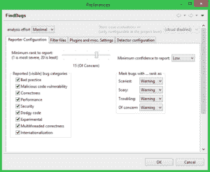
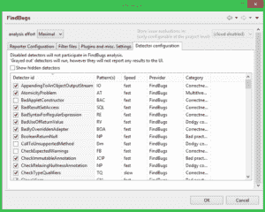
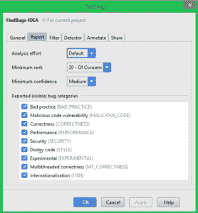
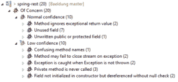

# FindBugs 简介

> 原文：<https://web.archive.org/web/20220930061024/https://www.baeldung.com/intro-to-findbugs>

## **1。概述**

FindBugs 是一个开源工具，用于对 Java 代码执行静态分析。

在本文中，我们将看看如何在 Java 项目上设置 FindBugs，并将其集成到 IDE 和 Maven 构建中。

## **2。FindBugs Maven 插件**

### **2.1。Maven 配置**

为了开始生成静态分析报告，我们首先需要在我们的`pom.xml`中添加 FindBugs 插件:

```
<reporting>
    <plugins>
        <plugin>
            <groupId>org.codehaus.mojo</groupId>
            <artifactId>findbugs-maven-plugin</artifactId>
            <version>3.0.4</version>
        </plugin>
    </plugins>
</reporting>
```

你可以在 Maven Central 上查看插件的[最新版本。](https://web.archive.org/web/20220707143818/https://search.maven.org/classic/#search%7Cgav%7C1%7Cg%3A%22org.codehaus.mojo%22%20AND%20a%3A%22findbugs-maven-plugin%22)

### **2.2。报告生成**

现在我们已经正确配置了 Maven 插件，让我们使用`mvn site`命令生成项目文档。

该报告将在项目目录下的**目标/地点**文件夹中以【findbugs.html 的名称生成。

您还可以运行`mvn findbugs:gui`命令来启动 GUI 界面，以浏览为当前项目生成的报告。

FindBugs 插件也可以被配置为在某些情况下失败——通过将执行目标`check` 添加到我们的配置中:

```
<plugin>
    <groupId>org.codehaus.mojo</groupId>
    <artifactId>findbugs-maven-plugin</artifactId>
    <version>3.0.4</version>
    <configuration>
        <effort>Max</effort>
    </configuration>
    <executions>
        <execution>
            <goals>
                <goal>check</goal>
            </goals>
        </execution>
    </executions>
</plugin>
```

`effort`–当达到极限时，执行更完整和精确的分析，揭示代码中更多的错误，尽管它消耗更多的资源，需要更多的时间来完成。

您现在可以运行命令`mvn verify`，检查构建是否会成功——这取决于运行分析时检测到的缺陷。

您还可以通过向插件声明添加一些基本配置来增强报告生成过程，并对分析进行更多的控制:

```
<configuration>
    <onlyAnalyze>org.baeldung.web.controller.*</onlyAnalyze>
    <omitVisitors>FindNullDeref</omitVisitors>
    <visitors>FindReturnRef</visitors>
</configuration>
```

`onlyAnalyze`选项声明了适合分析的类/包的逗号分隔值。

`visitors` / `omitVisitors`选项也是逗号分隔值，它们用于指定在分析过程中应该/不应该运行哪些检测器——注意 **`visitors`和`omitVisitors`不能同时使用**。

检测器由其类名指定，没有任何包限定。通过点击[这个链接](https://web.archive.org/web/20220707143818/http://findbugs.sourceforge.net/api/edu/umd/cs/findbugs/detect/package-summary.html)可以找到所有可用检测器类名的详细信息。

## **3。FindBugs Eclipse 插件**

### **3.1。安装**

FindBugs 插件的 IDE 安装非常简单——你只需要使用 Eclipse `,`中的软件更新特性，更新站点如下:【http://findbugs.cs.umd.edu/eclipse`.`

为了确保 FindBugs 正确安装在您的 Eclipse 环境中，那么，在 Windows->Preferences->Java 下查找标记为`FindBugs`的选项。

### **3.2。报告浏览**

为了使用 FindBugs Eclipse 插件对项目进行静态分析，您需要在包浏览器中右键单击项目，然后单击标记为 *find bugs* 的选项。

启动后，Eclipse 会在 Bug Explorer 窗口下显示结果，如下图所示:

[](/web/20220707143818/https://www.baeldung.com/wp-content/uploads/2016/11/bug_explorer.png) 
从版本 2 开始，FindBugs 开始用从 1 到 20 的等级对 bug 进行排序，以衡量缺陷的严重程度:

*   **最恐怖**:排名在 1 & 4 之间。
*   **吓人**:排名在 5 名& 9 名之间。
*   **困扰**:排名在 10 名& 14 名之间。
*   **关注度**:排名在 15 名& 20 名之间。

虽然 bug 等级描述了严重性，但是置信因子反映了这些 bug 被标记为真实 bug 的可能性。**置信度最初被称为优先级**，但在新版本中被重新命名。

当然，有些缺陷是可以解释的，它们甚至可以存在而不会对软件的预期行为造成任何伤害。这就是为什么，在现实世界的情况下，我们需要通过选择一组有限的缺陷在一个特定的项目中激活来正确地配置静态分析工具。

### **3.3。Eclipse 配置**

FindBugs 插件通过提供各种方式来过滤警告和限制结果的严格性，使得定制 bug 分析策略变得容易。您可以通过进入窗口->首选项-> Java -> FindBugs 来检查配置界面:

[](/web/20220707143818/https://www.baeldung.com/wp-content/uploads/2016/11/fb_preferences-1.png)

您可以自由地取消不需要的类别，提高报告的最低等级，指定报告的最低置信度，并自定义错误等级的标记——警告、信息或错误。

FindBugs 将缺陷分为许多种类:

*   **正确性**–收集一般性错误，例如无限循环、不恰当使用`equals()`等
*   **不良实践**，例如异常处理、打开的流、字符串比较等
*   **性能**，例如空闲对象
*   **多线程正确性**–收集多线程环境中的同步不一致性和各种问题
*   **国际化**–收集与编码和应用程序国际化相关的问题
*   **恶意代码漏洞**–收集代码中的漏洞，例如可能被潜在攻击者利用的代码片段
*   **安全**–收集与特定协议或 SQL 注入相关的安全漏洞
*   **狡猾的**–收集[代码气味](/web/20220707143818/https://www.baeldung.com/cs/code-smells)，例如无用的比较、空检查、未使用的变量等

在**探测器配置**选项卡下，您可以检查您的项目中应该遵守的规则:

[](/web/20220707143818/https://www.baeldung.com/wp-content/uploads/2016/11/fb_preferences_detector-1.png)

**速度属性反映了分析的成本**。检测器越快，执行它所消耗的资源就越少。

你可以在 **[官方文档页面](https://web.archive.org/web/20220707143818/http://findbugs.sourceforge.net/bugDescriptions.html)** 找到 FindBugs 识别的 bug 的详尽列表。

在 **Filter files** 面板下，您可以创建自定义文件过滤器，以便包含/排除部分代码。这个特性是有用的——例如——当您想要防止“未管理的”或者“垃圾”代码，缺陷在报告中弹出，或者可能从测试包中排除所有的类。

## **4。FindBugs IntelliJ IDEA 插件**

### **4.1。安装**

如果您是 IntelliJ IDEA 的粉丝，并且您想开始使用 FindBugs 检查 Java 代码，您可以简单地从[官方 JetBrains 站点](https://web.archive.org/web/20220707143818/https://plugins.jetbrains.com/plugin/3847?pr=idea)获取插件安装包，并将其解压缩到文件夹% INSTALLATION _ DIRECTORY %/plugins。重启你的 IDE，你就可以开始了。

或者，您可以导航到“设置”->“插件”并在所有存储库中搜索 FindBugs 插件。

在撰写本文时，IntelliJ IDEA 插件的 1.0.1 版本刚刚发布，

要确保 FindBugs 插件安装正确，请检查 Analyze -> FindBugs 下的“分析项目代码”选项。

### **4.2。报告浏览**

为了在 IDEA 中启动静态分析，在 Analyze -> FindBugs 下点击“分析项目代码”,然后寻找 FindBugs-IDEA 面板来检查结果:

[](/web/20220707143818/https://www.baeldung.com/wp-content/uploads/2016/11/Spring-rest-analysis-1.png)

您可以使用屏幕截图左侧的第二列命令，使用不同的因素对缺陷进行分组:

1.  按错误类别分组。
2.  按类分组。
3.  按包分组。
4.  按 bug 等级分组。

也可以通过单击第四列命令中的“导出”按钮，以 XML/HTML 格式导出报告。

### **4.3。配置**

IDEA 中的 FindBugs 插件首选项页面非常简单明了:

[](/web/20220707143818/https://www.baeldung.com/wp-content/uploads/2016/11/IntelliJ-Preferences-1-1.png)

这个设置窗口与我们在 Eclipse 中看到的窗口非常相似，因此您可以以类似的方式执行各种配置，从分析工作量级别、bug 排名、置信度、类过滤等开始。

通过点击 FindBugs-IDEA 面板下的“插件首选项”图标，可以在 IDEA 中访问首选项面板。

## **5。春歇项目报告分析**

在本节中，我们将举例说明对 Github 上的 [spring-rest 项目进行的静态分析:](https://web.archive.org/web/20220707143818/https://github.com/eugenp/tutorials/tree/master/testing-modules/testing-libraries)

[](/web/20220707143818/https://www.baeldung.com/wp-content/uploads/2016/11/Spring-rest-analysis-2.png)

大多数缺陷都是次要的——值得关注，但是让我们看看我们能做些什么来修复其中的一些。

**方法忽略异常返回值:**

```
File fileServer = new File(fileName);
fileServer.createNewFile();
```

正如您可能猜到的，FindBugs 抱怨我们丢弃了`createNewFile()`方法的返回值。一种可能的解决方法是将返回值存储在一个新声明的变量中，然后使用调试日志级别记录一些有意义的内容—例如，如果返回值为真，则记录“T1”。

**该方法可能无法在异常时关闭流:**这个特殊的缺陷说明了异常处理的一个典型用例，它建议**总是关闭`finally`块**中的流:

```
try {
    DateFormat dateFormat 
      = new SimpleDateFormat("yyyy_MM_dd_HH.mm.ss");
    String fileName = dateFormat.format(new Date());
    File fileServer = new File(fileName);
    fileServer.createNewFile();
    byte[] bytes = file.getBytes();
    BufferedOutputStream stream 
      = new BufferedOutputStream(new FileOutputStream(fileServer));
    stream.write(bytes);
    stream.close();
    return "You successfully uploaded " + username;
} catch (Exception e) {
    return "You failed to upload " + e.getMessage();
}
```

当在`stream.close()`指令之前抛出异常时，流永远不会关闭，这就是为什么总是最好使用`finally{}`块来关闭在`try` / `catch`例程期间打开的流。

**一个 `Exception`在`Exception`未抛出**时被捕获:您可能已经知道，捕获`Exception` 是一种糟糕的编码实践，FindBugs 认为您必须捕获一个最特定的异常，因此您可以正确地处理它。所以基本上在 Java 类中操作流，捕捉`IOException` 比捕捉更一般的异常更合适。

**字段没有在构造函数中初始化，但是在没有空值检查的情况下被取消引用**:在构造函数中初始化字段总是一个好主意，否则，我们应该考虑到代码会引发`[NPE](https://web.archive.org/web/20220707143818/https://docs.oracle.com/en/java/javase/11/docs/api/java.base/java/lang/NullPointerException.html).` 的可能性。因此，当我们不确定变量是否被正确初始化时，建议执行空值检查。

## **6。结论**

在本文中，我们已经介绍了在 Java 项目中使用和定制 FindBugs 的基本要点。

如您所见，FindBugs 是一个强大而简单的静态分析工具，它有助于检测系统中潜在的质量漏洞——如果调整和使用正确的话。

最后，值得一提的是，FindBugs 也可以作为一个独立的连续自动代码审查工具的一部分运行，如Sputnik，这对于提高报告的可视性非常有帮助。

我们用于静态分析的示例代码可以从 Github 上的[处获得。](https://web.archive.org/web/20220707143818/https://github.com/eugenp/tutorials/tree/master/testing-modules/testing-libraries)