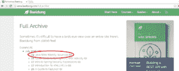

# HtmlUnit 简介

> 原文:[https://web . archive . org/web/20220930061024/https://www . bael dung . com/html unit](https://web.archive.org/web/20220930061024/https://www.baeldung.com/htmlunit)

## **1。简介**

在本文中，我们将介绍 HtmlUnit，简单地说，这是一个允许我们使用 JAVA API 以编程方式与 HTML 站点进行交互和测试的工具。

## **2。关于 HtmlUnit**

HtmlUnit 是一个无图形用户界面的浏览器——一个旨在以编程方式使用而不是由用户直接使用的浏览器。

该浏览器支持 JavaScript(通过 [Mozilla Rhino](https://web.archive.org/web/20220127171802/https://developer.mozilla.org/en-US/docs/Mozilla/Projects/Rhino) 引擎),甚至可以用于具有复杂 AJAX 功能的网站。所有这些都可以通过模拟 Chrome 或 Firefox 等典型的基于 GUI 的浏览器来完成。

HtmlUnit 这个名字可能会让你认为它是一个测试框架，但是虽然它肯定可以用于测试，但它可以做的远不止这些。

也已经[集成到 Spring 4](https://web.archive.org/web/20220127171802/https://docs.spring.io/spring-framework/docs/4.2.x/spring-framework-reference/htmlsingle/#spring-mvc-test-server-htmlunit) 中，可以和 Spring MVC 测试框架无缝配合使用。

## **3。下载和 Maven 依赖**

HtmlUnit 可以从 SourceForge 或者[官网](https://web.archive.org/web/20220127171802/http://htmlunit.sourceforge.net/)下载[。此外，你可以将它包含在你的构建工具中(比如 Maven 或 Gradle 等)，正如你在这里看到的](https://web.archive.org/web/20220127171802/https://sourceforge.net/projects/htmlunit/)。例如，这是您当前可以包含在项目中的 Maven 依赖项:

```
<dependency>
    <groupId>net.sourceforge.htmlunit</groupId>
    <artifactId>htmlunit</artifactId>
    <version>2.23</version>
</dependency> 
```

最新版本可以在这里找到[。](https://web.archive.org/web/20220127171802/https://search.maven.org/classic/#search%7Cga%7C1%7Chtmlunit)

## **4。网络测试**

有很多方法可以测试一个 web 应用程序——其中大部分我们已经在网站上介绍过了。

使用 HtmlUnit，你可以直接解析一个站点的 HTML，像普通用户一样从浏览器与它交互，检查 JavaScript 和 CSS 语法，提交表单并解析响应以查看其 HTML 元素的内容。所有这些都使用纯 Java 代码。

让我们从一个简单的测试开始:创建一个`WebClient`并获得`www.baeldung.com`导航的第一页:

```
private WebClient webClient;

@Before
public void init() throws Exception {
    webClient = new WebClient();
}

@After
public void close() throws Exception {
    webClient.close();
}

@Test
public void givenAClient_whenEnteringBaeldung_thenPageTitleIsOk()
  throws Exception {
    HtmlPage page = webClient.getPage("/");

    Assert.assertEquals(
      "Baeldung | Java, Spring and Web Development tutorials",
        page.getTitleText());
} 
```

如果我们的网站有 JavaScript 或 CSS 问题，你可以在运行测试时看到一些警告或错误。你应该改正它们。

有时，如果您知道您在做什么(例如，如果您发现您仅有的错误来自您不应该修改的第三方 JavaScript 库)，您可以防止这些错误使您的测试失败，用`false`调用`setThrowExceptionOnScriptError`:

```
@Test
public void givenAClient_whenEnteringBaeldung_thenPageTitleIsCorrect()
  throws Exception {
    webClient.getOptions().setThrowExceptionOnScriptError(false);
    HtmlPage page = webClient.getPage("/");

    Assert.assertEquals(
      "Baeldung | Java, Spring and Web Development tutorials",
        page.getTitleText());
}
```

## **5。网页抓取**

你不需要仅仅为你自己的网站使用 HtmlUnit。毕竟，它是一个浏览器:你可以用它浏览任何你喜欢的网站，根据需要发送和检索数据。

从网站获取、解析、存储和分析数据的过程被称为 web 抓取，HtmlUnit 可以帮助您完成获取和解析部分。

前面的例子显示了我们如何进入任何网站并在其中导航，检索我们想要的所有信息。

例如，让我们进入 Baeldung 的全部文章档案，导航到最新的文章并检索其标题(第一个`<h1>`标签)。对于我们的测试，这就足够了；但是，如果我们想要存储更多的信息，我们也可以检索标题(所有的`<h2>`标签),从而对文章的内容有一个基本的概念。

通过 ID 获取元素很容易，但是一般来说，如果需要查找元素，使用 XPath 语法更方便。HtmlUnit 允许我们使用它，所以我们会。

```
@Test
public void givenBaeldungArchive_whenRetrievingArticle_thenHasH1() 
  throws Exception {
    webClient.getOptions().setCssEnabled(false);
    webClient.getOptions().setJavaScriptEnabled(false);

    String url = "/full_archive";
    HtmlPage page = webClient.getPage(url);
    String xpath = "(//ul[@class='car-monthlisting']/li)[1]/a";
    HtmlAnchor latestPostLink 
      = (HtmlAnchor) page.getByXPath(xpath).get(0);
    HtmlPage postPage = latestPostLink.click();

    List<HtmlHeading1> h1  
      = (List<HtmlHeading1>) postPage.getByXPath("//h1");

    Assert.assertTrue(h1.size() > 0);
} 
```

首先注意如何——在这种情况下，我们对 CSS 和 JavaScript 都不感兴趣，只想解析 HTML 布局，所以我们关闭了 CSS 和 JavaScript。

在实际的网络抓取中，你可以以`h1`和`h2`标题为例，结果会是这样的:

```
Java Web Weekly, Issue 135
1\. Spring and Java
2\. Technical and Musings
3\. Comics
4\. Pick of the Week
```

您可以检查检索到的信息是否与 Baeldung 上的最新文章一致:

[](/web/20220127171802/https://www.baeldung.com/wp-content/uploads/2016/12/latestBaeldung.png)

## **6。AJAX 呢？**

AJAX 功能可能是一个问题，因为 HtmlUnit 通常会在 AJAX 调用完成之前检索页面。很多时候，你需要他们来完成正确的测试你的网站或检索你想要的数据。有一些方法可以处理它们:

*   可以用`webClient.setAjaxController(new NicelyResynchronizingAjaxController())`。这将重新同步从主线程执行的调用，并且这些调用是同步执行的，以确保有一个稳定的状态要测试。
*   当进入 web 应用程序的页面时，您可以等待几秒钟，这样就有足够的时间让 AJAX 调用完成。要实现这一点，可以使用`webClient.waitForBackgroundJavaScript(MILLIS)`或者`webClient.waitForBackgroundJavaScriptStartingBefore(MILLIS)`。您应该在检索页面之后、使用页面之前调用它们。
*   您可以等待，直到与 AJAX 调用执行相关的某些预期条件得到满足。例如:

```
for (int i = 0; i < 20; i++) {
    if (condition_to_happen_after_js_execution) {
        break;
    }
    synchronized (page) {
        page.wait(500);
    }
}
```

*   不要创建默认支持最好的 web 浏览器的`new WebClient()`，而是尝试其他浏览器，因为它们可能更适合您的 JavaScript 或 AJAX 调用。例如，这将创建一个使用 Chrome 浏览器的 webClient:

```
WebClient webClient = new WebClient(BrowserVersion.CHROME);
```

## **7。弹簧的例子**

如果我们正在测试我们自己的 Spring 应用程序，那么事情会变得简单一些—**我们不再需要一个正在运行的服务器**。

让我们实现一个非常简单的示例应用程序:只有一个带有接收文本的方法的控制器和一个带有表单的 HTML 页面。用户可以在表单中输入文本，提交表单，文本将显示在表单下方。

在这种情况下，我们将为 HTML 页面使用一个[百里香叶](https://web.archive.org/web/20220127171802/http://www.thymeleaf.org/)模板(你可以在这里看到一个完整的百里香叶示例[):](/web/20220127171802/https://www.baeldung.com/thymeleaf-in-spring-mvc)

```
@RunWith(SpringJUnit4ClassRunner.class)
@WebAppConfiguration
@ContextConfiguration(classes = { TestConfig.class })
public class HtmlUnitAndSpringTest {

    @Autowired
    private WebApplicationContext wac;

    private WebClient webClient;

    @Before
    public void setup() {
        webClient = MockMvcWebClientBuilder
          .webAppContextSetup(wac).build();
    }

    @Test
    public void givenAMessage_whenSent_thenItShows() throws Exception {
        String text = "Hello world!";
        HtmlPage page;

        String url = "http://localhost/message/showForm";
        page = webClient.getPage(url);

        HtmlTextInput messageText = page.getHtmlElementById("message");
        messageText.setValueAttribute(text);

        HtmlForm form = page.getForms().get(0);
        HtmlSubmitInput submit = form.getOneHtmlElementByAttribute(
          "input", "type", "submit");
        HtmlPage newPage = submit.click();

        String receivedText = newPage.getHtmlElementById("received")
            .getTextContent();

        Assert.assertEquals(receivedText, text);     
    }
}
```

这里的关键是使用来自`WebApplicationContext`的`MockMvcWebClientBuilder`构建`WebClient`对象。使用`WebClient`，我们可以获得导航的第一页(注意`localhost`是如何提供的)，并从那里开始浏览。

如您所见，测试解析表单，输入消息(在 ID 为“message”的字段中)，提交表单，在新页面上，它断言收到的文本(ID 为“received”的字段)与我们提交的文本相同。

## **8。结论**

HtmlUnit 是一个很棒的工具，可以让你很容易地测试你的 web 应用程序，填充表单域并提交它们，就像你在浏览器上使用 web 一样。

它与 Spring 4 无缝集成，与 Spring MVC 测试框架一起，它们为您提供了一个非常强大的环境，即使没有 web 服务器，您也可以对所有页面进行集成测试。

此外，使用 HtmlUnit，您可以自动化任何与 web 浏览相关的任务，例如获取、解析、存储和分析数据(web 抓取)。

你可以在 Github 上获得代码[。](https://web.archive.org/web/20220127171802/https://github.com/eugenp/tutorials/tree/master/spring-web-modules/spring-mvc-java)