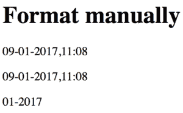
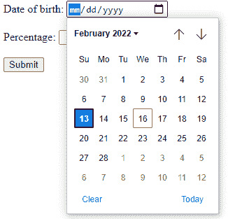

# 如何在百里香叶中处理枣

> 原文：<https://web.archive.org/web/20220930061024/https://www.baeldung.com/dates-in-thymeleaf>

## **1。简介**

百里香叶是一个 Java 模板引擎，可以直接和 Spring 一起工作。关于百里香和春天的介绍，请看[这篇文章](/web/20220908053359/https://www.baeldung.com/thymeleaf-in-spring-mvc)。

除了这些基本功能之外，Thymeleaf 还为我们提供了一组实用程序对象，帮助我们在应用程序中执行常见的任务。

在本教程中，我们将讨论新旧 Java `Date`类的处理和格式化，以及百里香 3.0 的一些特性。

## **2。Maven 依赖关系**

首先，让我们创建将百里香和 Spring 集成到我们的`pom.xml`中的配置:

```
<dependency>
    <groupId>org.thymeleaf</groupId>
    <artifactId>thymeleaf</artifactId>
    <version>3.0.11.RELEASE</version>
</dependency>
<dependency>
    <groupId>org.thymeleaf</groupId>
    <artifactId>thymeleaf-spring5</artifactId>
    <version>3.0.11.RELEASE</version>
</dependency>
```

最新版本的`[thymeleaf](https://web.archive.org/web/20220908053359/https://search.maven.org/classic/#search%7Cgav%7C1%7Cg%3A%22org.thymeleaf%22%20AND%20a%3A%22thymeleaf%22)`和`[thymeleaf-spring5](https://web.archive.org/web/20220908053359/https://search.maven.org/classic/#search%7Cgav%7C1%7Cg%3A%22org.thymeleaf%22%20AND%20a%3A%22thymeleaf-spring5%22)` 可以在 Maven Central 上找到。注意，对于 Spring 4 项目，必须使用`thymeleaf-spring4`库来代替`thymeleaf-spring5`。

此外，为了使用新的 Java 8 `Date` 类，我们需要向我们的`pom.xml`添加另一个依赖项:

```
<dependency>
    <groupId>org.thymeleaf.extras</groupId>
    <artifactId>thymeleaf-extras-java8time</artifactId>
    <version>3.0.4.RELEASE</version>
</dependency>
```

`[thymeleaf extras](https://web.archive.org/web/20220908053359/https://search.maven.org/classic/#search%7Cgav%7C1%7Ca%3A%22thymeleaf-extras-java8time%22)` 是一个可选模块，由官方的百里香团队完全支持，它是为了与 Java 8 Time API 兼容而创建的。它将一个# `temporals`对象添加到`Context`中，作为表达式求值期间的实用程序对象处理器。这意味着它可以用来评估对象图导航语言(OGNL)和 Spring 表达式语言(SpringEL)中的表达式。

## **3。新旧:`java.util`和`java.time`**

`Time`包是 Java SE 平台的一个新的日期、时间和日历 API。这个新 API 和旧的传统`Date` API 的主要区别在于，新 API 区分了机器和人类对时间线的看法。机器视图显示一系列与`epoch`相关的整数值，而人类视图显示一组字段(例如，年、月和日)。

为了使用新的`Time`包，我们需要配置我们的模板引擎来使用新的`Java8TimeDialect`:

```
private ISpringTemplateEngine templateEngine(ITemplateResolver templateResolver) {
    SpringTemplateEngine engine = new SpringTemplateEngine();
    engine.addDialect(new Java8TimeDialect());
    engine.setTemplateResolver(templateResolver);
    return engine;
}
```

这将添加类似于标准方言中的# `temporals`对象，允许从百里香模板格式化和创建`Temporal`对象。

为了测试新旧类的处理，我们将创建以下变量，并将它们作为模型对象添加到控制器类中:

```
model.addAttribute("standardDate", new Date());
model.addAttribute("localDateTime", LocalDateTime.now());
model.addAttribute("localDate", LocalDate.now());
model.addAttribute("timestamp", Instant.now());
```

现在，我们准备使用百里香的`Expression`和`Temporals`工具对象。

### **3.1。格式化日期**

我们要介绍的第一个功能是格式化一个`Date`对象(它被添加到弹簧模型参数中)。我们将使用`ISO8601`格式:

```
<h1>Format ISO</h1>
<p th:text="${#dates.formatISO(standardDate)}"></p>
<p th:text="${#temporals.formatISO(localDateTime)}"></p>
<p th:text="${#temporals.formatISO(localDate)}"></p>
<p th:text="${#temporals.formatISO(timestamp)}"></p>
```

不管我们的`Date`在后端侧是怎么设置的，都会按照选择的标准在百里香里显示。`standardDate`将由# `dates`实用程序处理。新的`LocalDateTime`、`LocalDate`和`Instant`类将由# `temporals`实用程序处理。

此外，如果我们想要手动设置格式，我们可以使用:

```
<h1>Format manually</h1>
<p th:text="${#dates.format(standardDate, 'dd-MM-yyyy HH:mm')}"></p>
<p th:text="${#temporals.format(localDateTime, 'dd-MM-yyyy HH:mm')}"></p>
<p th:text="${#temporals.format(localDate, 'MM-yyyy')}"></p>
```

正如我们所观察到的，我们不能用# *temporals.format(…)* 处理`Instant`类——它将导致`UnsupportedTemporalTypeException`。此外，如果我们只指定特定的日期字段，跳过时间字段，格式化`LocalDate`才是可能的。

让我们看看最后的结果:

[](/web/20220908053359/https://www.baeldung.com/wp-content/uploads/2017/01/Zrzut-ekranu-2017-01-09-11.11.18.png)

### **3.2。获取具体日期字段**

为了获得`java.util.Date`类的特定字段，我们应该使用以下实用程序对象:

```
${#dates.day(date)}
${#dates.month(date)}
${#dates.monthName(date)}
${#dates.monthNameShort(date)}
${#dates.year(date)}
${#dates.dayOfWeek(date)}
${#dates.dayOfWeekName(date)}
${#dates.dayOfWeekNameShort(date)}
${#dates.hour(date)}
${#dates.minute(date)}
${#dates.second(date)}
${#dates.millisecond(date)}
```

对于新的`java.time`包，我们应该坚持使用# `temporals`实用程序:

```
${#temporals.day(date)}
${#temporals.month(date)}
${#temporals.monthName(date)}
${#temporals.monthNameShort(date)}
${#temporals.year(date)}
${#temporals.dayOfWeek(date)}
${#temporals.dayOfWeekName(date)}
${#temporals.dayOfWeekNameShort(date)}
${#temporals.hour(date)}
${#temporals.minute(date)}
${#temporals.second(date)}
${#temporals.millisecond(date)}
```

我们来看几个例子。首先，让我们显示今天是星期几:

```
<h1>Show only which day of a week</h1>
<p th:text="${#dates.day(standardDate)}"></p>
<p th:text="${#temporals.day(localDateTime)}"></p>
<p th:text="${#temporals.day(localDate)}"></p>
```

接下来，让我们显示工作日的名称:

```
<h1>Show the name of the week day</h1>
<p th:text="${#dates.dayOfWeekName(standardDate)}"></p>
<p th:text="${#temporals.dayOfWeekName(localDateTime)}"></p>
<p th:text="${#temporals.dayOfWeekName(localDate)}"></p>
```

最后，让我们显示一天中的当前秒:

```
<h1>Show the second of the day</h1>
<p th:text="${#dates.second(standardDate)}"></p>
<p th:text="${#temporals.second(localDateTime)}"></p>
```

请注意，为了处理时间部分，我们需要使用`LocalDateTime`，因为`LocalDate`会抛出一个错误。

## **4。如何在表单中使用日期选择器**

让我们看看**如何使用日期选择器从百里香表单**提交`Date`值。

首先，让我们创建一个具有`Date`属性的`Student`类:

```
public class Student implements Serializable {
    @DateTimeFormat(pattern = "yyyy-MM-dd")
    private Date birthDate;
}
```

`@DateTimeFormat` 注释声明`birthDate`字段应该被格式化为`a Date`。

接下来，我们将创建一个百里香表单来提交一个`Date`输入:

```
<form th:action="@{/saveStudent}" method="post" th:object="${student}">
    <div>
        <label for="student-birth-date">Date of birth:</label>
        <input type="date" th:field="${student.birthDate}" id="student-birth-date"/>
    </div>
    <div>
        <button type="submit" class="button">Submit</button>
    </div>
</form>
```

当我们提交表单时，一个控制器将截取映射到表单中带有`th:object`属性的`Student`对象。另外， `th:field`属性将输入值与`birthDate`字段绑定在一起。

现在，让我们创建一个控制器来拦截`POST`请求:

```
@RequestMapping(value = "/saveStudent", method = RequestMethod.POST)
public String saveStudent(Model model, @ModelAttribute("student") Student student) {
    model.addAttribute("student", student);
    return "datePicker/displayDate.html";
}
```

提交表单后，我们将在另一个页面上用模式`dd/MM/yyyy`显示`birthDate`值:

```
<h1>Student birth date</h1>
<p th:text="${#dates.format(student.birthDate, 'dd/MM/yyyy')}"></p>
```

结果显示了带有日期选择器的表单:

[](/web/20220908053359/https://www.baeldung.com/wp-content/uploads/2017/01/datePicker.png)

提交表单后，我们将看到所选的日期:

[](/web/20220908053359/https://www.baeldung.com/wp-content/uploads/2022/02/dispay_date.png)

## **5。结论**

在这个快速教程中，我们讨论了在百里香框架 3.0 版中实现的 Java `Date`处理特性。

**怎么考？**我们的建议是首先在浏览器中使用代码，然后检查我们现有的 JUnit 测试。

请注意，我们的示例并未涵盖百里香中所有可用的选项。如果你想了解所有类型的实用程序，那么看看我们的文章，内容包括 [Spring 和百里香 leaf Expressions](/web/20220908053359/https://www.baeldung.com/spring-thymeleaf-3-expressions) 。

本教程的完整实现可以在 GitHub 上找到[。](https://web.archive.org/web/20220908053359/https://github.com/eugenp/tutorials/tree/master/spring-web-modules/spring-thymeleaf "The Full Registration/Authentication Example Project on Github")