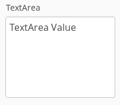
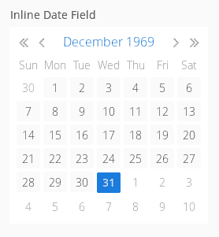
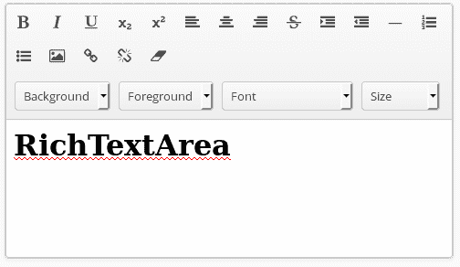
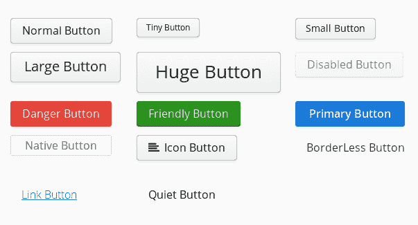
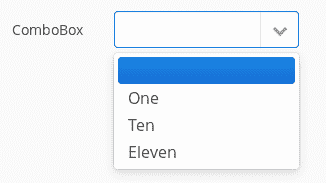
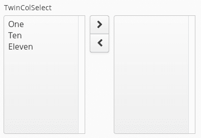

# 瓦丁简介

> 原文：<https://web.archive.org/web/20220930061024/https://www.baeldung.com/vaadin>

## **1。概述**

Vaadin 是一个用于创建 web 用户界面的服务器端 Java 框架。使用它，我们可以使用 Java 特性创建我们的前端。

## **2。Maven 依赖性和设置**

让我们从向我们的`pom.xml`添加以下依赖项开始:

```
<dependency>
    <groupId>com.vaadin</groupId>
    <artifactId>vaadin-server</artifactId>
</dependency>
<dependency>
    <groupId>com.vaadin</groupId>
    <artifactId>vaadin-client-compiled</artifactId>
</dependency>
<dependency>
    <groupId>com.vaadin</groupId>
    <artifactId>vaadin-themes</artifactId>
</dependency> 
```

相关依赖的最新版本可以在这里找到:[vaa din-服务器](https://web.archive.org/web/20220802010221/https://search.maven.org/classic/#search%7Cgav%7C1%7Cg%3A%22com.vaadin%22%20AND%20a%3A%22vaadin-server%22)，[vaa din-客户端-编译](https://web.archive.org/web/20220802010221/https://search.maven.org/classic/#search%7Cgav%7C1%7Cg%3A%22com.vaadin%22%20AND%20a%3A%22vaadin-client-compiled%22)，[vaa din-主题](https://web.archive.org/web/20220802010221/https://search.maven.org/classic/#search%7Cgav%7C1%7Cg%3A%22com.vaadin%22%20AND%20a%3A%22vaadin-themes%22)。

*   包——包括处理所有服务器细节的类，如会话、客户端通信等。
*   `vaadin-client-compiled`–基于 GWT，包括编译客户端所需的软件包
*   包括一些预先制作的主题和所有制作主题的工具

为了编译我们的 Vaadin 小部件，我们需要配置 [maven-war-plugin](https://web.archive.org/web/20220802010221/https://search.maven.org/classic/#search%7Cgav%7C1%7Cg%3A%22org.apache.maven.plugins%22%20AND%20a%3A%22maven-war-plugin%22) 、 [vaadin-maven-plugin](https://web.archive.org/web/20220802010221/https://search.maven.org/classic/#search%7Cgav%7C1%7Cg%3A%22com.vaadin%22%20AND%20a%3A%22vaadin-maven-plugin%22) 和 [maven-clean-plugin](https://web.archive.org/web/20220802010221/https://search.maven.org/classic/#search%7Cgav%7C1%7Cg%3A%22org.apache.maven.plugins%22%20AND%20a%3A%22maven-clean-plugin%22) 。对于完整的 pom，一定要检查源代码中的 pom 文件——在教程的最后。

此外，我们还需要添加 Vaadin 存储库和依赖性管理:

```
<repositories>
    <repository>
        <id>vaadin-addons</id>
        <url>http://maven.vaadin.com/vaadin-addons</url>
    </repository>
</repositories>
<dependencyManagement>
    <dependencies>
        <dependency>
            <groupId>com.vaadin</groupId>
            <artifactId>vaadin-bom</artifactId>
            <version>13.0.9</version>
            <type>pom</type>
            <scope>import</scope>
        </dependency>
    </dependencies>
</dependencyManagement>
```

标签`DependencyManagement` 控制所有 Vaadin `dependencies.`的版本

为了快速运行应用程序，我们将使用 Jetty 插件:

```
<plugin>
    <groupId>org.eclipse.jetty</groupId>
    <artifactId>jetty-maven-plugin</artifactId>
    <version>9.3.9.v20160517</version>
    <configuration>
        <scanIntervalSeconds>2</scanIntervalSeconds>
        <skipTests>true</skipTests>
    </configuration>
</plugin>
```

插件的最新版本可以在这里找到: [jetty-maven-plugin](https://web.archive.org/web/20220802010221/https://search.maven.org/classic/#search%7Cgav%7C1%7Cg%3A%22org.eclipse.jetty%22%20AND%20a%3A%22jetty-maven-plugin%22) 。

有了这个插件，我们可以使用以下命令运行我们的项目:

```
mvn jetty:run
```

## **3。瓦丁是什么？**

**简单来说，Vaadin 是一个用于创建用户界面**的 Java 框架，有主题和组件，还有很多可扩展性选项。

**该框架也覆盖了服务器端**，这意味着你对用户界面所做的每一个更改都会被立即发送到服务器端——所以后端应用程序随时都知道前端发生了什么。

**Vaadin 由客户端和服务器端**组成——客户端构建在众所周知的 Google Widget Toolkit 框架之上，服务器端由`VaadinServlet`处理。

## **4。Servlet**

通常，Vaadin 应用程序不使用`web.xml`文件；相反，它使用注释定义了它的`servlet`:

```
@WebServlet(urlPatterns = "/VAADIN/*", name = "MyUIServlet", asyncSupported = true)
@VaadinServletConfiguration(ui = VaadinUI.class, productionMode = false)
public static class MyUIServlet extends VaadinServlet {}
```

在这种情况下，这个 servlet 从`/VAADIN`路径提供内容。

## **5。主类**

servlet 中引用的`VaadinUI`类必须从框架中扩展 UI 类，并且必须覆盖`init`方法，以完成启用了 Vaadin 的应用程序的引导。

下一步是创建一个布局并将其添加到应用程序的主布局中:

```
public class VaadinUI extends UI {

    @Override
    protected void init(VaadinRequest vaadinRequest) {
        VerticalLayout verticalLayout = new VerticalLayout();
        verticalLayout.setSpacing(true);
        verticalLayout.setMargin(true);
        setContent(verticalLayout);
}
```

## **6。Vaadin 布局管理器**

该框架附带了许多预定义的布局管理器。

### **6.1。`VerticalLayout`**

将组件堆叠在一列上，第一个添加的组件在顶部，最新添加的组件在底部:

```
VerticalLayout verticalLayout = new VerticalLayout();
verticalLayout.setSpacing(true);
verticalLayout.setMargin(true);
setContent(verticalLayout);
```

注意这里的属性是如何松散地借用典型的 CSS 术语的。

### **6.2。`HorizontalLayout`**

这种布局将每个组件从左到右并排放置，类似于垂直布局:

```
HorizontalLayout horizontalLayout = new HorizontalLayout();
```

### **6.3。`GridLayout`**

这种布局将每个小部件放在一个网格中，您需要将网格的列和行作为参数传递:

```
GridLayout gridLayout = new GridLayout(3, 2);
```

### **6.4。`FormLayout`**

表单布局将标题和组件放在两个不同的列中，并且必填字段可以有可选的指示器:

```
FormLayout formLayout = new FormLayout();
```

## **7。Vaadin 组件**

现在布局已经处理好了，让我们看看一些用于构造用户界面的更常见的组件。

### **7.1。`Label`**

[](/web/20220802010221/https://www.baeldung.com/wp-content/uploads/2017/07/label.png)

当然，标签也是众所周知的——只是用来显示文本:

```
Label label = new Label();
label.setId("LabelID");
label.setValue("Label Value");
label.setCaption("Label");
gridLayout.addComponent(label);
```

创建组件后，请注意将它添加到布局的关键步骤。

### **7.2。`Link`**

[](/web/20220802010221/https://www.baeldung.com/wp-content/uploads/2017/07/link.png)

`link`小部件本质上是一个基本的超链接:

```
Link link = new Link("Baeldung",
  new ExternalResource("http://www.baeldung.com/"));
link.setTargetName("_blank");
```

请注意，`<a>`元素的典型 HTML 值都在这里。

### **7.3。`TextField`**

[](/web/20220802010221/https://www.baeldung.com/wp-content/uploads/2017/07/textfield.png)

该小部件用于输入文本:

```
TextField textField = new TextField();
textField.setIcon(VaadinIcons.USER);
```

我们可以进一步定制元素；例如，我们可以通过`setIcon()` API 向小部件快速添加图像。

另外，注意 **Font Awesome 是和框架**一起开箱即用的；它被定义为一个枚举，我们可以很容易地利用它。

### **7.4。`TextArea`**

[](/web/20220802010221/https://www.baeldung.com/wp-content/uploads/2017/07/textarea.png)

正如您所料，`TextArea`位于传统 HTML 元素的旁边:

```
TextArea textArea = new TextArea();
```

### **7.5。`DateField`和`InlineDateField`**

[](/web/20220802010221/https://www.baeldung.com/wp-content/uploads/2017/07/datefield.png)

这个强大的组件用于挑选日期；date 参数是要在小部件中选择的当前日期:

```
DateField dateField = new DateField("DateField", LocalDate.ofEpochDay(0));
```

[](/web/20220802010221/https://www.baeldung.com/wp-content/uploads/2017/07/inlinedatefield.png)

我们可以更进一步，将它嵌套在一个`combo box`控件中以节省空间:

```
InlineDateField inlineDateField = new InlineDateField();
```

### **7.6。`PasswordField`**

[](/web/20220802010221/https://www.baeldung.com/wp-content/uploads/2017/07/passwordfield.png)

这是标准的屏蔽密码输入:

```
PasswordField passwordField = new PasswordField();
```

### **7.7。`RichTextArea`**

[](/web/20220802010221/https://www.baeldung.com/wp-content/uploads/2017/07/richtextarea.png)

有了这个组件，我们可以显示格式化的文本，它提供了一个界面来操纵这样的文本，用按钮来控制字体、大小、对齐等。

```
RichTextArea richTextArea = new RichTextArea();
richTextArea.setCaption("Rich Text Area");
richTextArea.setValue("<h1>RichTextArea</h1>");
richTextArea.setSizeFull();
Panel richTextPanel = new Panel();
richTextPanel.setContent(richTextArea);
```

### **7.8。`Button`**

[](/web/20220802010221/https://www.baeldung.com/wp-content/uploads/2017/07/buttons.png)

按钮用于捕捉用户输入，有各种大小和颜色。

为了创建一个按钮，我们像往常一样实例化 widget 类:

```
Button normalButton = new Button("Normal Button");
```

改变风格我们可以有一些不同的按钮:

```
tinyButton.addStyleName("tiny");
smallButton.addStyleName("small");
largeButton.addStyleName("large");
hugeButton.addStyleName("huge");
dangerButton.addStyleName("danger");
friendlyButton.addStyleName("friendly");
primaryButton.addStyleName("primary");
borderlessButton.addStyleName("borderless");
linkButton.addStyleName("link");
quietButton.addStyleName("quiet");
```

我们可以创建一个禁用按钮:

```
Button disabledButton = new Button("Disabled Button");
disabledButton.setDescription("This button cannot be clicked");
disabledButton.setEnabled(false);
buttonLayout.addComponent(disabledButton);
```

使用浏览器外观的本机按钮:

```
NativeButton nativeButton = new NativeButton("Native Button");
buttonLayout.addComponent(nativeButton);
```

和一个带图标的按钮:

```
Button iconButton = new Button("Icon Button");
iconButton.setIcon(VaadinIcons.ALIGN_LEFT);
buttonLayout.addComponent(iconButton);
```

### **7.9。`CheckBox`**

[](/web/20220802010221/https://www.baeldung.com/wp-content/uploads/2017/07/checkbox.png)

该复选框是一个变更状态元素，已选中或未选中:

```
CheckBox checkbox = new CheckBox("CheckBox");        
checkbox.setValue(true);
checkbox.addValueChangeListener(e ->
  checkbox.setValue(!checkbox.getValue()));
formLayout.addComponent(checkbox);
```

### **7.10。`Lists`**

Vaadin 有一些有用的小部件来处理列表。

首先，我们创建一个要放入小部件的项目列表:

```
List<String> numbers = new ArrayList<>();
numbers.add("One");
numbers.add("Ten");
numbers.add("Eleven");
```

`ComboBox`是一个下拉列表:

[](/web/20220802010221/https://www.baeldung.com/wp-content/uploads/2017/07/combobox.png)

```
ComboBox comboBox = new ComboBox("ComboBox");
comboBox.addItems(numbers);
formLayout.addComponent(comboBox);
```

`ListSelect` 垂直放置项目并在溢出时使用滚动条:

[](/web/20220802010221/https://www.baeldung.com/wp-content/uploads/2017/07/listselect.png)

```
ListSelect listSelect = new ListSelect("ListSelect");
listSelect.addItems(numbers);
listSelect.setRows(2);
formLayout.addComponent(listSelect);
```

`NativeSelect`与`ComboBox`相似，但具有浏览器的外观和感觉:

[](/web/20220802010221/https://www.baeldung.com/wp-content/uploads/2017/07/nativeselect.png)

```
NativeSelect nativeSelect = new NativeSelect("NativeSelect");
nativeSelect.addItems(numbers);
formLayout.addComponent(nativeSelect);
```

`TwinColSelect`是一个双重列表，我们可以在这两个窗格之间改变项目；每个项目一次只能位于一个窗格中:

[](/web/20220802010221/https://www.baeldung.com/wp-content/uploads/2017/07/twincolselect.png)

```
TwinColSelect twinColSelect = new TwinColSelect("TwinColSelect");
twinColSelect.addItems(numbers);
```

### **7.11。`Grid`**

网格用于以矩形方式显示数据；你有行和列，可以为数据定义页眉和页脚:

[](/web/20220802010221/https://www.baeldung.com/wp-content/uploads/2017/07/grid.png)

```
Grid<Row> grid = new Grid(Row.class);
grid.setColumns("column1", "column2", "column3");
Row row1 = new Row("Item1", "Item2", "Item3");
Row row2 = new Row("Item4", "Item5", "Item6");
List<Row> rows = new ArrayList();
rows.add(row1);
rows.add(row2);
grid.setItems(rows);
```

上面的`Row`类是一个简单的 POJO，我们添加它来表示一行:

```
public class Row {
    private String column1;
    private String column2;
    private String column3;

    // constructors, getters, setters
}
```

## **8。服务器推送**

另一个有趣的特性是能够从服务器向 UI 发送消息。

要使用服务器推送，我们需要将以下依赖项添加到我们的`pom.xml:`

```
<dependency>
    <groupId>com.vaadin</groupId>
    <artifactId>vaadin-push</artifactId>
    <versionId>8.8.5</versionId>
</dependency>
```

依赖关系的最新版本可以在这里找到: [vaadin-push](https://web.archive.org/web/20220802010221/https://search.maven.org/classic/#search%7Cgav%7C1%7Cg%3A%22com.vaadin%22%20AND%20a%3A%22vaadin-push%22) 。

此外，我们需要将`@Push`注释添加到表示 UI 的类中:

```
@Push
@Theme("mytheme")
public class VaadinUI extends UI {...}
```

我们创建一个标签来捕获服务器推送消息:

```
private Label currentTime;
```

然后我们创建一个`ScheduledExecutorService`，它将时间从服务器发送到`label`:

```
ScheduledExecutorService scheduleExecutor = Executors.newScheduledThreadPool(1);
Runnable task = () -> {
    currentTime.setValue("Current Time : " + Instant.now());
};
scheduleExecutor.scheduleWithFixedDelay(task, 0, 1, TimeUnit.SECONDS);
```

`ScheduledExecutorService`运行在应用程序的服务器端，每次运行时，用户界面都会更新。

## **9。数据绑定**

我们可以将用户界面绑定到业务类。

首先，我们创建一个 Java 类:

```
public class BindData {

    private String bindName;

    public BindData(String bindName){
        this.bindName = bindName;
    }

    // getter & setter
}
```

然后，我们将只有一个字段的类绑定到用户界面中的一个`TextField`:

```
Binder<BindData> binder = new Binder<>();
BindData bindData = new BindData("BindData");
binder.readBean(bindData);
TextField bindedTextField = new TextField();
binder.forField(bindedTextField).bind(BindData::getBindName, BindData::setBindName);
```

首先，我们使用之前创建的类创建一个`BindData`对象，然后`Binder`将字段绑定到`TextField.`

## 10。验证器

我们可以创建`Validators`来验证输入字段中的数据。为此，我们将验证器附加到我们想要验证的字段:

```
BindData stringValidatorBindData = new BindData("");
TextField stringValidator = new TextField();
Binder<BindData> stringValidatorBinder = new Binder<>();
stringValidatorBinder.setBean(stringValidatorBindData);
stringValidatorBinder.forField(stringValidator)
  .withValidator(new StringLengthValidator("String must have 2-5 characters lenght", 2, 5))
  .bind(BindData::getBindName, BindData::setBindName);
```

然后，我们在使用数据之前对其进行验证:

```
Button buttonStringValidator = new Button("Validate String");
buttonStringValidator.addClickListener(e -> stringValidatorBinder.validate());
```

在这种情况下，我们使用`StringLengthValidator`来验证`String`的长度，但是 Vaadin 提供了其他有用的验证器，并且允许我们创建自己的自定义验证器。

## **11。总结**

当然，这篇快速的文章仅仅触及了皮毛；该框架不仅仅是用户界面小部件，Vaadin 提供了使用 Java 创建现代 web 应用程序所需的一切。

和往常一样，代码可以在 Github 上找到[。](https://web.archive.org/web/20220802010221/https://github.com/eugenp/tutorials/tree/master/vaadin)