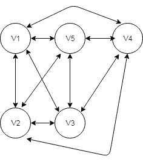
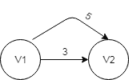
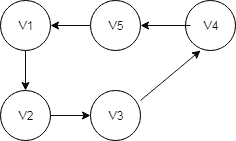
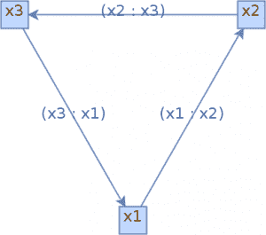

# JGraphT 简介

> 原文：<https://web.archive.org/web/20220930061024/https://www.baeldung.com/jgrapht>

## **1。概述**

大多数时候，当我们实现基于图的算法时，我们还需要实现一些效用函数。

JGraphT 是一个开源的 Java 类库，它不仅为我们提供了各种类型的图形，还提供了许多有用的算法来解决最常见的图形问题。

在本文中，我们将看到如何创建不同类型的图形，以及使用提供的实用程序有多方便。

## **2。Maven 依赖关系**

让我们从向 Maven 项目添加依赖项开始:

```
<dependency>
    <groupId>org.jgrapht</groupId>
    <artifactId>jgrapht-core</artifactId>
    <version>1.0.1</version>
</dependency>
```

最新版本可以在 [Maven Central](https://web.archive.org/web/20221208143830/https://search.maven.org/classic/#search%7Cga%7C1%7Cg%3A%22org.jgrapht%22) 找到。

## **3。创建图表**

JGraphT 支持各种类型的图形。

### **3.1。简单图形**

首先，让我们创建一个顶点类型为`String`的简单图形:

```
Graph<String, DefaultEdge> g 
  = new SimpleGraph<>(DefaultEdge.class);
g.addVertex(“v1”);
g.addVertex(“v2”);
g.addEdge(v1, v2);
```

### **3.2。有向/无向图**

它还允许我们创建有向/无向图。

在我们的示例中，我们将创建一个有向图，并使用它来演示其他效用函数和算法:

[](/web/20221208143830/https://www.baeldung.com/wp-content/uploads/2017/10/Directed_graph-300x232.png)

```
DirectedGraph<String, DefaultEdge> directedGraph 
  = new DefaultDirectedGraph<>(DefaultEdge.class);
directedGraph.addVertex("v1");
directedGraph.addVertex("v2");
directedGraph.addVertex("v3");
directedGraph.addEdge("v1", "v2");
// Add remaining vertices and edges
```

### **3.3。完整图表**

同样，我们也可以生成一个完整的图形:

[](/web/20221208143830/https://www.baeldung.com/wp-content/uploads/2017/10/complete_graph.png)

```
public void createCompleteGraph() {
    completeGraph = new SimpleWeightedGraph<>(DefaultEdge.class);
    CompleteGraphGenerator<String, DefaultEdge> completeGenerator 
      = new CompleteGraphGenerator<>(size);
    VertexFactory<String> vFactory = new VertexFactory<String>() {
        private int id = 0;
        public String createVertex() {
            return "v" + id++;
        }
    };
    completeGenerator.generateGraph(completeGraph, vFactory, null);
}
```

### **3.4。多图表**

[](/web/20221208143830/https://www.baeldung.com/wp-content/uploads/2017/10/multigraph-1.png)

除了简单图，API 还为我们提供了多重图(在两个顶点之间有多条路径的图)。

此外，我们可以在任何图中拥有加权/未加权或用户定义的边。

让我们创建一个带加权边的多重图:

```
public void createMultiGraphWithWeightedEdges() {
    multiGraph = new Multigraph<>(DefaultWeightedEdge.class);
    multiGraph.addVertex("v1");
    multiGraph.addVertex("v2");
    DefaultWeightedEdge edge1 = multiGraph.addEdge("v1", "v2");
    multiGraph.setEdgeWeight(edge1, 5);

    DefaultWeightedEdge edge2 = multiGraph.addEdge("v1", "v2");
    multiGraph.setEdgeWeight(edge2, 3);
}
```

除此之外，我们可以有不可修改(只读)和可列表(允许外部监听器跟踪修改)的图以及子图。此外，我们总是可以创建这些图形的所有组成。

更多 API 细节可以在[这里](https://web.archive.org/web/20221208143830/http://jgrapht.org/javadoc/)找到。

## **4。API 算法**

现在，我们已经有了完整的图形对象，让我们看看一些常见的问题及其解决方案。

### **4.1。图形迭代**

我们可以根据需要使用各种迭代器遍历图，比如`BreadthFirstIterator`、`DepthFirstIterator`、`ClosestFirstIterator`、`RandomWalkIterator`。
我们只需要通过传递图形对象来创建各自迭代器的实例:

```
DepthFirstIterator depthFirstIterator 
  = new DepthFirstIterator<>(directedGraph);
BreadthFirstIterator breadthFirstIterator 
  = new BreadthFirstIterator<>(directedGraph);
```

一旦我们得到迭代器对象，我们就可以使用`hasNext()`和`next()` 方法执行迭代。

### **4.2。寻找最短路径**

它在`org.jgrapht.alg.shortestpath`包中提供了各种算法的实现，如 [Dijkstra、Bellman-Ford、Astar 和 FloydWarshall](/web/20221208143830/https://www.baeldung.com/cs/prim-dijkstra-difference) 。

让我们使用 Dijkstra 的算法找到最短路径:

```
@Test
public void whenGetDijkstraShortestPath_thenGetNotNullPath() {
    DijkstraShortestPath dijkstraShortestPath 
      = new DijkstraShortestPath(directedGraph);
    List<String> shortestPath = dijkstraShortestPath
      .getPath("v1","v4").getVertexList();

    assertNotNull(shortestPath);
}
```

同样，要使用贝尔曼-福特算法获得最短路径:

```
@Test
public void 
  whenGetBellmanFordShortestPath_thenGetNotNullPath() {
    BellmanFordShortestPath bellmanFordShortestPath 
      = new BellmanFordShortestPath(directedGraph);
    List<String> shortestPath = bellmanFordShortestPath
      .getPath("v1", "v4")
      .getVertexList();

    assertNotNull(shortestPath);
}
```

### **4.3。寻找强连通子图**

在我们进入实现之前，让我们简单地看一下强连通子图是什么意思。只有当一个子图的每对顶点之间都有一条路时，这个子图才被称为强连通的。

在我们的例子中，{v1，v2，v3，v4}可以被认为是强连通子图，如果我们可以遍历任何顶点，而不管当前顶点是什么。

我们可以为上图所示的有向图列出四个这样的子图:
{v9}、{v8}、{v5、v6、v7}、{v1、v2、v3、v4}

列出所有强连通子图的实现:

```
@Test
public void 
  whenGetStronglyConnectedSubgraphs_thenPathExists() {

    StrongConnectivityAlgorithm<String, DefaultEdge> scAlg 
      = new KosarajuStrongConnectivityInspector<>(directedGraph);
    List<DirectedSubgraph<String, DefaultEdge>> stronglyConnectedSubgraphs 
      = scAlg.stronglyConnectedSubgraphs();
    List<String> stronglyConnectedVertices 
      = new ArrayList<>(stronglyConnectedSubgraphs.get(3)
      .vertexSet());

    String randomVertex1 = stronglyConnectedVertices.get(0);
    String randomVertex2 = stronglyConnectedVertices.get(3);
    AllDirectedPaths<String, DefaultEdge> allDirectedPaths 
      = new AllDirectedPaths<>(directedGraph);

    List<GraphPath<String, DefaultEdge>> possiblePathList 
      = allDirectedPaths.getAllPaths(
        randomVertex1, randomVertex2, false,
          stronglyConnectedVertices.size());

    assertTrue(possiblePathList.size() > 0);
}
```

### 4.4。 **欧拉回路**

图 *G* 中的欧拉回路是包括 *G* 的所有顶点和边的回路。有它的图是欧拉图。

让我们看一下图表:

[](/web/20221208143830/https://www.baeldung.com/wp-content/uploads/2017/10/eulerian_circuit-1.png)

```
public void createGraphWithEulerianCircuit() {
    SimpleWeightedGraph<String, DefaultEdge> simpleGraph 
      = new SimpleWeightedGraph<>(DefaultEdge.class);
    IntStream.range(1,5)
      .forEach(i-> simpleGraph.addVertex("v" + i));
    IntStream.range(1,5)
      .forEach(i-> {
        int endVertexNo = (i + 1) > 5 ? 1 : i + 1;
        simpleGraph.addEdge("v" + i,"v" + endVertexNo);
    });
}
```

现在，我们可以使用 API 测试一个图是否包含欧拉回路:

```
@Test
public void givenGraph_whenCheckEluerianCycle_thenGetResult() {
    HierholzerEulerianCycle eulerianCycle 
      = new HierholzerEulerianCycle<>();

    assertTrue(eulerianCycle.isEulerian(simpleGraph));
}
@Test
public void whenGetEulerianCycle_thenGetGraphPath() {
    HierholzerEulerianCycle eulerianCycle 
      = new HierholzerEulerianCycle<>();
    GraphPath path = eulerianCycle.getEulerianCycle(simpleGraph);

    assertTrue(path.getEdgeList()
      .containsAll(simpleGraph.edgeSet()));
}
```

### **4.5。哈密顿电路**

恰好访问每个顶点一次的`GraphPath`称为哈密尔顿路径。

哈密尔顿圈(或哈密尔顿回路)是哈密尔顿路径，使得从路径的最后一个顶点到第一个顶点存在边(在图中)。

用`HamiltonianCycle.getApproximateOptimalForCompleteGraph()` 方法可以找到完全图的最优哈密顿圈。

该方法将返回一个近似的最小旅行推销员行程(哈密尔顿循环)。最优解是 NP 完全的，因此这是一个在多项式时间内运行的合适的近似:

```
public void 
  whenGetHamiltonianCyclePath_thenGetVerticeSequence() {
    List<String> verticeList = HamiltonianCycle
      .getApproximateOptimalForCompleteGraph(completeGraph);

    assertEquals(verticeList.size(), completeGraph.vertexSet().size());
}
```

### 4.6。周期检测器

我们还可以检查图中是否有循环。目前，`CycleDetector` 仅支持有向图:

```
@Test
public void whenCheckCycles_thenDetectCycles() {
    CycleDetector<String, DefaultEdge> cycleDetector 
      = new CycleDetector<String, DefaultEdge>(directedGraph);

    assertTrue(cycleDetector.detectCycles());
    Set<String> cycleVertices = cycleDetector.findCycles();

    assertTrue(cycleVertices.size() > 0);
}
```

## **5。图形可视化**

**JGraphT 允许我们生成图形的可视化，并将它们保存为图像**，首先让我们从 Maven Central 添加 [jgrapht-ext](https://web.archive.org/web/20221208143830/https://search.maven.org/search?q=a:jgrapht-ext%20AND%20g:org.jgrapht) 扩展依赖:

```
<dependency>
    <groupId>org.jgrapht</groupId>
    <artifactId>jgrapht-ext</artifactId>
    <version>1.0.1</version>
</dependency>
```

接下来，让我们创建一个具有 3 个顶点和 3 条边的简单有向图:

```
@Before
public void createGraph() {

    File imgFile = new File("src/test/resources/graph.png");
    imgFile.createNewFile();

    DefaultDirectedGraph<String, DefaultEdge> g = 
      new DefaultDirectedGraph<String, DefaultEdge>(DefaultEdge.class);

    String x1 = "x1";
    String x2 = "x2";
    String x3 = "x3";

    g.addVertex(x1);
    g.addVertex(x2);
    g.addVertex(x3);

    g.addEdge(x1, x2);
    g.addEdge(x2, x3);
    g.addEdge(x3, x1);
}
```

我们现在可以看到这个图表:

```
@Test
public void givenAdaptedGraph_whenWriteBufferedImage_thenFileShouldExist() throws IOException {

    JGraphXAdapter<String, DefaultEdge> graphAdapter = 
      new JGraphXAdapter<String, DefaultEdge>(g);
    mxIGraphLayout layout = new mxCircleLayout(graphAdapter);
    layout.execute(graphAdapter.getDefaultParent());

    BufferedImage image = 
      mxCellRenderer.createBufferedImage(graphAdapter, null, 2, Color.WHITE, true, null);
    File imgFile = new File("src/test/resources/graph.png");
    ImageIO.write(image, "PNG", imgFile);

    assertTrue(imgFile.exists());
}
```

这里我们创建了一个`JGraphXAdapter`，它接收我们的图作为构造函数参数，我们对它应用了一个`mxCircleLayout `。这以一种循环的方式展示了可视化。

此外，我们使用一个`mxCellRenderer`来创建一个`BufferedImage`，然后将可视化结果写入一个 png 文件。

我们可以在浏览器或我们最喜欢的渲染器中看到最终的图像:

[](/web/20221208143830/https://www.baeldung.com/wp-content/uploads/2017/10/graph-300x265.png)

我们可以在[官方文档](https://web.archive.org/web/20221208143830/https://jgraph.github.io/mxgraph/docs/manual_javavis.html)中找到更多细节。

## **6。结论**

JGraphT 提供了几乎所有类型的图形和各种图形算法。我们讲述了如何使用一些流行的 API。但是，你总是可以在[官方页面](https://web.archive.org/web/20221208143830/http://jgrapht.org/)上探索图书馆。

所有这些例子和代码片段的实现都可以在 Github 上找到[。](https://web.archive.org/web/20221208143830/https://github.com/eugenp/tutorials/tree/master/algorithms-modules/algorithms-miscellaneous-2)