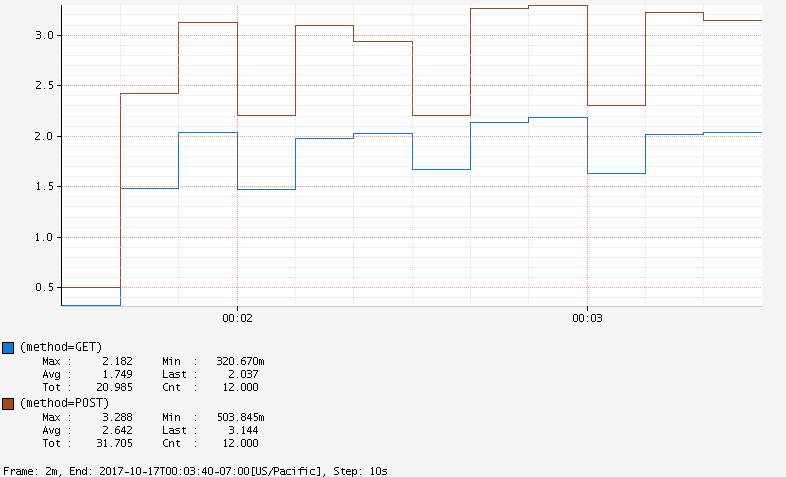
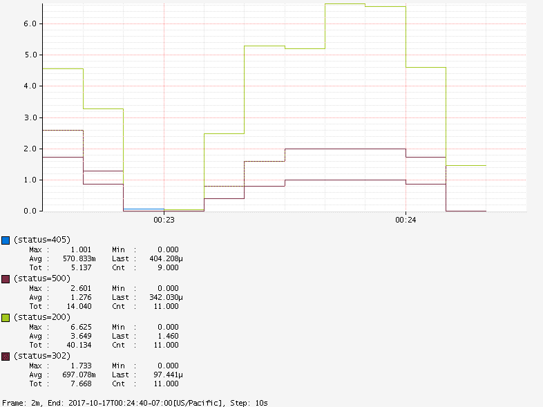
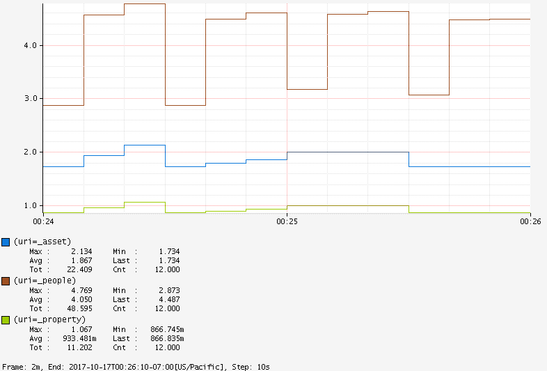
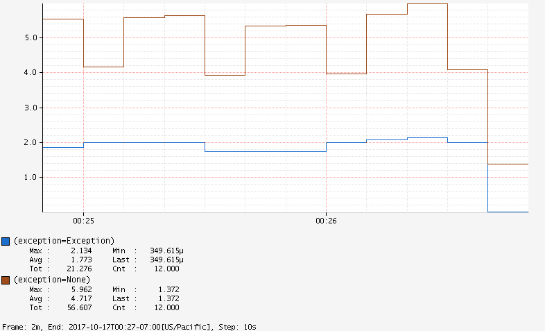

# 千分尺快速指南

> 原文：<https://web.archive.org/web/20220930061024/https://www.baeldung.com/micrometer>

## **1。简介**

[**千分尺**](https://web.archive.org/web/20220727020637/https://github.com/micrometer-metrics/micrometer-docs) **为许多流行的监控系统提供了一个简单的仪表客户端。**目前支持以下监控系统:Atlas、Datadog、Graphite、Ganglia、Influx、JMX、Prometheus。

在本教程中，我们将介绍千分尺的基本用法及其与 Spring 的集成。

为了简单起见，我们将以 Micrometer Atlas 为例来演示我们的大多数用例。

## **2。Maven 依赖关系**

首先，让我们向`pom.xml`添加以下依赖项:

[PRE0]

最新版本可以在这里找到[。](https://web.archive.org/web/20220727020637/https://search.maven.org/classic/#search%7Cga%7C1%7Ca%3A%22micrometer-registry-atlas%22%20AND%20g%3A%20%22io.micrometer%22)

## **3。`MeterRegistry`**

在千分尺中， [`MeterRegistry`](https://web.archive.org/web/20220727020637/https://github.com/micrometer-metrics/micrometer/blob/master/micrometer-core/src/main/java/io/micrometer/core/instrument/MeterRegistry.java#L41) 是用来记录仪表的核心部件。我们可以遍历注册中心，进一步遍历每一个指标，在后端生成一个时间序列，其中包含指标及其维度值的组合。

注册表最简单的形式是 [`SimpleMeterRegistry`](https://web.archive.org/web/20220727020637/https://github.com/micrometer-metrics/micrometer/blob/master/micrometer-core/src/main/java/io/micrometer/core/instrument/simple/SimpleMeterRegistry.java#L31) 。但是，在大多数情况下，我们应该使用一个 [`MeterRegistry`](https://web.archive.org/web/20220727020637/https://github.com/micrometer-metrics/micrometer/blob/master/micrometer-core/src/main/java/io/micrometer/core/instrument/MeterRegistry.java#L41) 明确地为我们的监控系统设计；对于图集来说，是 [`AtlasMeterRegistry`](https://web.archive.org/web/20220727020637/https://github.com/micrometer-metrics/micrometer/blob/master/implementations/micrometer-registry-atlas/src/main/java/io/micrometer/atlas/AtlasMeterRegistry.java#L36) 。

[`CompositeMeterRegistry`](https://web.archive.org/web/20220727020637/https://github.com/micrometer-metrics/micrometer/blob/master/micrometer-core/src/main/java/io/micrometer/core/instrument/composite/CompositeMeterRegistry.java#L37) 允许添加多个注册表。它提供了一种解决方案，可以同时向各种支持的监控系统发布应用程序指标。

我们可以添加将数据上传到多个平台所需的任何`MeterRegistry`:

[PRE1]

有静态全局注册表支持，单位为微米， [`Metrics.globalRegistry`](https://web.archive.org/web/20220727020637/https://github.com/micrometer-metrics/micrometer/blob/master/micrometer-core/src/main/java/io/micrometer/core/instrument/Metrics.java#L31) 。此外，还提供了一组基于该全局注册表的静态构建器来生成 [`Metrics`](https://web.archive.org/web/20220727020637/https://github.com/micrometer-metrics/micrometer/blob/master/micrometer-core/src/main/java/io/micrometer/core/instrument/Metrics.java#L30) 中的计量表:

[PRE2]

## **4。`Tags`和`Meters`**

### **4.1。`Tags`**

[`Meter`](https://web.archive.org/web/20220727020637/https://github.com/micrometer-metrics/micrometer/blob/master/micrometer-core/src/main/java/io/micrometer/core/instrument/Meter.java#L24) 的标识符由名称和标签组成。**我们应该遵循用点分隔单词的命名约定，以帮助保证指标名称在多个监控系统之间的可移植性。**

[PRE3]

[`Tags`](https://web.archive.org/web/20220727020637/https://github.com/micrometer-metrics/micrometer/blob/master/micrometer-core/src/main/java/io/micrometer/core/instrument/Tag.java#L23) 可用于对度量值进行切片推理。在上面的代码中，`page.visitors`是电表的名称，标签是`age=20s`。在这种情况下，计数器会计算年龄在 20 到 30 岁之间的访问者。

对于一个大型系统，我们可以在注册表中添加公共标签。例如，假设指标来自特定区域:

[PRE4]

### **4.2。`Counter`**

一个 [`Counter`](https://web.archive.org/web/20220727020637/https://github.com/micrometer-metrics/micrometer/blob/master/micrometer-core/src/main/java/io/micrometer/core/instrument/Counter.java#L25) 仅仅报告一个应用的特定属性的计数。我们可以用 fluent builder 或任何`MetricRegistry`的 helper 方法构建一个自定义计数器:

[PRE5]

如上面的片段所示，我们试图将计数器减 1，但是**我们只能将计数器单调递增一个固定的正数。**

### **4.3。`Timers`**

为了测量系统中事件的延迟或频率，我们可以使用`[Timers](https://web.archive.org/web/20220727020637/https://github.com/micrometer-metrics/micrometer/blob/master/micrometer-core/src/main/java/io/micrometer/core/instrument/Timer.java#L34)`。一个`Timer`将至少报告特定时间序列的总时间和事件计数。

例如，我们可以记录一个持续几秒钟的应用程序事件:

[PRE6]

为了记录长时间运行的事件，我们使用 [`LongTaskTimer`](https://web.archive.org/web/20220727020637/https://github.com/micrometer-metrics/micrometer/blob/master/micrometer-core/src/main/java/io/micrometer/core/instrument/LongTaskTimer.java#L26) :

[PRE7]

### **4.4。`Gauge`**

仪表显示仪表的当前值。

[`Gauges`](https://web.archive.org/web/20220727020637/https://github.com/micrometer-metrics/micrometer/blob/master/micrometer-core/src/main/java/io/micrometer/core/instrument/Gauge.java#L23) 与其他仪表不同，应该只报告观测时的数据。`Gauges`在监控缓存或收集的统计数据时非常有用:

[PRE8]

### **4.5。`DistributionSummary`**

事件分布及简单摘要由 [`DistributionSummary`](https://web.archive.org/web/20220727020637/https://github.com/micrometer-metrics/micrometer/blob/master/micrometer-core/src/main/java/io/micrometer/core/instrument/DistributionSummary.java#L29) 提供:

[PRE9]

此外，`DistributionSummary`和`Timers`可以增加百分位数:

[PRE10]

现在，在上面的代码片段中，带有标签`percentile=0.3`、`percentile`、`=0.5,`和`percentile`、`=0.95`的三个量表将在注册表中可用，分别指示 95%、50%和 30%的观察值低于哪个值。

为了查看这些百分点的作用，让我们添加一些记录:

[PRE11]

然后，我们可以通过提取这三个百分点`Gauges`中的值来验证:

[PRE12]

此外，千分尺还支持[服务级别目标](https://web.archive.org/web/20220727020637/https://en.wikipedia.org/wiki/Service-level_objective)(直方图):

[PRE13]

类似于百分位数，在追加几条记录后，我们可以看到直方图很好地处理了计算:

[PRE14]

一般来说，直方图有助于说明不同时段中的直接比较。直方图也可以按时间缩放，这对于分析后端服务响应时间非常有用:

[PRE15]

## **5。活页夹**

Micrometer 有多个内置绑定器来监控 JVM、缓存、`ExecutorService,`和日志服务。

说到 JVM 和系统监控，我们可以监控类加载器指标( [`ClassLoaderMetrics`](https://web.archive.org/web/20220727020637/https://github.com/micrometer-metrics/micrometer/blob/main/micrometer-core/src/main/java/io/micrometer/core/instrument/binder/jvm/ClassLoaderMetrics.java) )、JVM 内存池( [`JvmMemoryMetrics`](https://web.archive.org/web/20220727020637/https://github.com/micrometer-metrics/micrometer/blob/main/micrometer-core/src/main/java/io/micrometer/core/instrument/binder/jvm/JvmMemoryMetrics.java) )和 GC 指标( [`JvmGcMetrics`](https://web.archive.org/web/20220727020637/https://github.com/micrometer-metrics/micrometer/blob/main/micrometer-core/src/main/java/io/micrometer/core/instrument/binder/jvm/JvmGcMetrics.java) )、线程和 CPU 利用率( [`JvmThreadMetrics`](https://web.archive.org/web/20220727020637/https://github.com/micrometer-metrics/micrometer/blob/main/micrometer-core/src/main/java/io/micrometer/core/instrument/binder/jvm/JvmThreadMetrics.java) 、 [`ProcessorMetrics`](https://web.archive.org/web/20220727020637/https://github.com/micrometer-metrics/micrometer/blob/main/micrometer-binders/src/main/java/io/micrometer/binder/system/ProcessorMetrics.java) )。

通过使用 [`GuavaCacheMetrics`](https://web.archive.org/web/20220727020637/https://github.com/micrometer-metrics/micrometer/blob/main/micrometer-core/src/main/java/io/micrometer/core/instrument/binder/cache/GuavaCacheMetrics.java) 、 [`EhCache2Metrics`](https://web.archive.org/web/20220727020637/https://github.com/micrometer-metrics/micrometer/blob/main/micrometer-core/src/main/java/io/micrometer/core/instrument/binder/cache/EhCache2Metrics.java) 、 [`HazelcastCacheMetrics`](https://web.archive.org/web/20220727020637/https://github.com/micrometer-metrics/micrometer/blob/main/micrometer-core/src/main/java/io/micrometer/core/instrument/binder/cache/HazelcastCacheMetrics.java) 和 [`CaffeineCacheMetrics`](https://web.archive.org/web/20220727020637/https://github.com/micrometer-metrics/micrometer/blob/main/micrometer-core/src/main/java/io/micrometer/core/instrument/binder/cache/CaffeineCacheMetrics.java) 进行插装来支持缓存监控(目前仅支持 Guava、EhCache、Hazelcast 和咖啡因)。为了监控日志返回服务，我们可以将 [`LogbackMetrics`](https://web.archive.org/web/20220727020637/https://github.com/micrometer-metrics/micrometer/blob/main/micrometer-core/src/main/java/io/micrometer/core/instrument/binder/logging/LogbackMetrics.java) 绑定到任何有效的注册表:

[PRE16]

上述活页夹的使用与`LogbackMetrics,`非常相似，而且都相当简单，所以我们在此不再赘述。

## **6。弹簧集成**

**Spring Boot 致动器为测微计提供相关性管理和自动配置。**现在 Spring Boot 2.0/1.x 和 Spring Framework 5.0/4.x 都支持

我们将需要以下依赖项(最新版本可以在这里找到):

[PRE17]

在不对现有代码做任何进一步修改的情况下，我们已经用千分尺启用了弹簧支持。我们的 Spring 应用程序的 JVM 内存指标将自动在全局注册表中注册，并发布到默认的 atlas 端点:`http://localhost:7101/api/v1/publish`。

从`spring.metrics.atlas.*`开始，有几个可配置的属性可用于控制指标导出行为。勾选 [`AtlasConfig`](https://web.archive.org/web/20220727020637/https://github.com/Netflix/spectator/blob/master/spectator-reg-atlas/src/main/java/com/netflix/spectator/atlas/AtlasConfig.java) 查看图集发布的配置属性完整列表。

如果我们需要绑定更多的指标，只需将它们作为`@Bean`添加到应用程序上下文中。

说我们需要`JvmThreadMetrics`:

[PRE18]

至于 web 监控，它是为我们应用程序中的每个端点自动配置的，但是可以通过配置属性`spring.metrics.web.autoTimeServerRequests`进行管理。

默认实现为端点提供了四个维度的指标:HTTP 请求方法、HTTP 响应代码、端点 URI 和异常信息。

当请求得到响应时，与请求方法(`GET`、`POST`等)相关的度量。)将在 Atlas 中出版。

使用 [Atlas Graph API](https://web.archive.org/web/20220727020637/https://github.com/Netflix/atlas/wiki/Graph) ，我们可以生成一个图表来比较不同方法的响应时间:

默认情况下，还会报告`20x`、`30x`、`40x`、`50x`的响应代码:

我们还可以比较不同的 URIs:

或者检查异常指标:

注意，我们还可以在控制器类或特定端点方法上使用 [`@Timed`](https://web.archive.org/web/20220727020637/https://github.com/micrometer-metrics/micrometer/blob/master/micrometer-core/src/main/java/io/micrometer/core/annotation/Timed.java#L24) 来定制指标的标签、长任务、分位数和百分位数:

[PRE19]

基于上面的代码，我们可以通过检查 Atlas 端点`http://localhost:7101/api/v1/tags/name`看到以下标签:

[PRE20]

Micrometer 也在 Spring Boot 2.0 中引入的功能 web 框架中工作。我们可以通过过滤`RouterFunction`来启用指标:

[PRE21]

我们还可以从数据源和计划任务中收集指标。查看[官方文档](https://web.archive.org/web/20220727020637/https://micrometer.io/docs/registry/atlas#_timers)了解更多详情。

## **7。结论**

在本文中，我们介绍了 metrics facade 千分尺。通过在公共语义下抽象和支持多个监控系统，该工具使得不同监控平台之间的切换变得非常容易。

和往常一样，本文的完整实现代码可以在 Github 上找到[。](https://web.archive.org/web/20220727020637/https://github.com/eugenp/tutorials/tree/master/metrics)