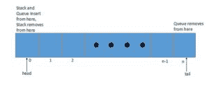
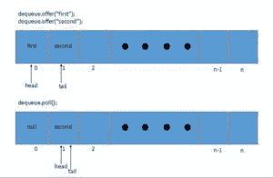

# Java ArrayDeque 简介

> 原文：<https://web.archive.org/web/20220930061024/https://www.baeldung.com/java-array-deque>

## **1。概述**

在本教程中，我们将展示如何使用 Java 的`ArrayDeque`类——它是`Deque`接口的一个实现。

`ArrayDeque`(也称为“数组双端队列”，读作“Array deck”)**是一种特殊的可增长数组，它允许我们从两端添加或删除元素。**

一个`ArrayDeque`实现可以被用作一个`Stack`(后进先出)或者一个`Queue`(先进先出)。

## **2。API 一览**

对于每个操作，我们基本上有两种选择。

第一组由在操作失败时抛出异常的方法组成。另一组返回状态或值:

| 操作 | 方法 | 方法引发异常 |
| 从头部插入 | `offerFirst(e)` | `addFirst(e)` |
| 从头部移除 | `pollFirst()` | `removeFirst()` |
| 从头检索 | `peekFirst()` | `getFirst()` |
| 从尾部插入 | `offerLast(e)` | `addLast(e)` |
| 从尾部移除 | `pollLast()` | `removeLast()` |
| 从尾部检索 | `peekLast()` | `getLast()` |

## **3。使用方法**

让我们看几个简单的例子来说明如何利用`ArrayDeque`。

### **3.1。使用`ArrayDeque`作为`Stack`和**

我们将从一个例子开始，说明如何将类视为一个`Stack`——并推送一个元素:

[PRE0]

让我们看看如何从`ArrayDeque`中弹出一个元素——当作为堆栈使用时:

[PRE1]

当堆栈为空时，`pop`方法抛出`NoSuchElementException`。

### **3.2。使用`ArrayDeque`作为`Queue`和**

现在让我们从一个简单的例子开始，展示我们如何在一个`ArrayDeque`中提供一个元素——当作为一个简单的`Queue`使用时:

[PRE2]

让我们看看如何从一个`ArrayDeque`轮询一个元素，当它被用作一个`Queue`时:

[PRE3]

如果队列为空，`poll`方法返回一个`null`值。

## **4。`ArrayDeque`是如何实施的**

 
在引擎盖下， **`ArrayDeque`由一个数组支持，当它被填满时，它的大小会翻倍。**

最初，数组的大小初始化为 16。它被实现为一个双端队列，其中维护两个指针，即头部和尾部。

让我们来看看这种逻辑的运行情况——在较高的层面上。

### **4.1。`ArrayDeque`作栈**

 
可以看出，当用户使用`push`方法添加一个元素时，它会将头部指针移动一位。

当我们弹出一个元素时，它将头部位置的元素设置为`null`,这样该元素可以被垃圾收集，然后将头部指针向后移动一位。

### **4.2。`ArrayDeque`作`Queue`**

 
当我们使用`offer`方法添加一个元素时，它将尾部指针移动一位。

而当用户轮询一个元素时，它将头部位置的元素设置为 null，这样该元素就可以被垃圾收集，然后移动头部指针。

### **4.3。`ArrayDeque`上的注释**

最后，关于这个特定的实现，还有一些值得理解和记住的地方:

*   它不是线程安全的
*   不接受空元素
*   工作速度明显快于同步`Stack`
*   是一个比`LinkedList`更快的队列，因为它具有更好的引用局部性
*   大多数操作都有固定的时间复杂度
*   由`ArrayDeque`返回的`Iterator`是快速失效的
*   `ArrayDeque`添加元素时，当头尾指针相遇时，自动将数组的大小加倍

## **5。结论**

在这篇短文中，我们举例说明了`ArrayDeque`中方法的用法。

所有这些例子的实现都可以在[GitHub 项目](https://web.archive.org/web/20221126223607/https://github.com/eugenp/tutorials/tree/master/core-java-modules/core-java-collections "ArrayDeque in Java on Github")中找到；这是一个基于 Maven 的项目，因此应该很容易导入和运行。