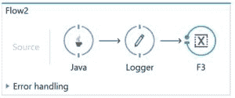

# Mule ESB 入门

> 原文：<https://web.archive.org/web/20220930061024/https://www.baeldung.com/mule-esb>

## **1。概述**

Mule ESB 是一个轻量级的基于 Java 的企业服务总线。它允许开发人员通过交换不同格式的数据将多个应用程序连接在一起。它以消息的形式传送数据。

ESB 通过提供许多服务来提供强大的功能，例如:

*   服务创建和托管
*   服务中介
*   信息发送
*   数据转换

如果我们需要将多个应用程序集成在一起，或者如果我们有在未来添加更多应用程序的想法，我们会发现 ESB 很有用。

ESB 还用于处理多种类型的通信协议，以及需要消息路由功能的时候。

让我们使用`AnyPoint Studio`在第 5 节创建一个示例项目，可以从这里下载[。](https://web.archive.org/web/20220803035136/https://www.mulesoft.com/lp/dl/studio)

## 2.**骡子消息结构**

简单地说，ESB 的主要目的是在服务之间进行中介，并将消息路由到各个端点。因此，它需要处理不同类型的内容或有效载荷。

消息结构分为两部分:

*   报头，其中包含消息元数据
*   有效负载，包含特定于业务的数据

**消息嵌入在消息对象中。**我们可以从上下文中检索消息对象。我们可以在 Mule flow 中使用定制的 Java 组件和转换器来改变它的属性和有效负载。

每个应用程序由一个或多个流组成。

在流中，我们可以使用组件来访问、过滤或更改消息及其不同的属性。

例如，我们可以使用 Java 组件获得消息的实例。这个组件类实现了来自`org.mule.api.lifecycle`包的`Callable`接口:

[PRE0]

## **3。属性和变量**

消息元数据由属性组成。变量表示关于消息的数据。属性和变量如何在消息的生命周期中应用是由其作用域定义的。基于它们的作用域，属性可以有两种类型:入站和出站。

**入站属性**包含元数据，该元数据防止消息在穿过流时被打乱。入站属性是不可变的，用户不能更改。它们只在流的持续时间内存在，一旦消息退出流，入站属性就不再存在。

**出库属性**可以由 Mule 自动设置，也可以由用户通过流程配置来设置。这些属性是可变的。当邮件越过传输障碍进入另一个流时，它们成为入站属性。

我们可以通过在各自的范围内调用相关的 setter 和 getter 方法来分别设置和获取出站和入站属性:

[PRE1]

有两种类型的变量可以在应用程序中声明。

一个是流变量，它是 Mule 流的本地变量，可以在流、子流和私有流之间使用。

会话变量一旦声明，就可以在整个应用程序中使用。

## **4。`flow-ref`运输障碍和**

传输障碍是 HTTP 连接器、VMs、JMS 或类似的连接器，它们需要路径或端点来路由消息。**流变量在跨运输障碍时不可用，但会话变量在跨项目的所有流中都可用。**

当我们需要创建子流或私有流时，我们可以使用`flow-ref`组件从父流或另一个流中引用该流。**流变量和会话变量在使用`flow-ref`引用的子流和私有流中都可用。**

## **5。示例项目**

让我们在 Anypoint Studio 中创建一个包含多个流的应用程序，这些流通过入站和出站连接器相互通信。

让我们看看第一个流程:

我们可以将 HTTP 侦听器配置为:

[PRE2]

流组件必须在`<flow>`标记内。因此，具有多个组件的示例流程如下:

[PRE3]

在流内部，我们提供了对一个已配置的 HTTP 侦听器的引用。然后我们保留一个日志记录器来记录 HTTP 侦听器通过 POST 方法接收的有效负载。

之后，放置一个定制的 Java transformer 类，它在接收到消息后转换有效负载:

[PRE4]

**transformer 类必须扩展** `**AbstractMessageTransformer**.` 我们还在类内部设置了一个出站属性。

现在，我们已经转换了消息对象中的有效负载，并使用 logger 将其记录在控制台中。我们正在设置一个流变量和一个会话变量。

最后，我们通过出站 VM 连接器发送我们的有效负载。**VM 连接器中的路径决定了接收端点:**

由初始流携带和转换的消息通过入站 VM 端点到达`Flow1`。

Java 组件检索由第一个流设置的出站属性，并返回成为消息有效负载的对象。

该任务的`transformMessage()`方法:

[PRE5]

然后，将流和会话变量设置为第二个流。之后，我们使用`flow-ref` 组件得到了对`Flow2`的引用。

在`Flow2,` 中，我们已经使用 Java 组件类转换了消息，并将其记录在控制台中。我们还设置了一个流量变量`F3`。

使用`flow-ref, Flow1`调用`Flow2`后，将在`Flow2`T3 中等待消息被处理。

**在`Flow1` 和`Flow2`中设置的任何流量变量都将在两个流量中可用，因为这些流量没有被任何运输障碍分开。**

最后，消息通过 VMs 发送回 HTTP 请求者。我们将所有虚拟机配置为请求-响应。

我们可以通过在主体中发布任何 JSON 数据，从任何 REST 客户机调用这个应用程序。URL 将是 HTTP 侦听器中配置的`localhost:8081`。

## **6。Maven 原型**

我们可以使用 Mulesoft 的 Maven 原型构建一个 Mule ESB 项目。

在 Maven 的`settings.xml`文件中，我们首先需要添加`org.mule.tools`插件组:

[PRE6]

然后，我们需要添加一个`profile` 标签，说明 Maven 应该在哪里寻找 Mulesoft 工件:

[PRE7]

最后，我们可以使用`mule-project-archetype:create`创建项目:

[PRE8]

在配置我们的项目之后，我们可以使用`mvn package`创建一个可部署的档案。

之后，我们将档案部署到任何独立 Mule 服务器的`apps` 文件夹中。

## **7。通过 MuleSoft 的 Maven 库的独立 Mule 服务器**

正如刚才提到的，我们刚刚创建的项目需要一个独立的 Mule 服务器。

如果我们还没有，我们可以编辑我们的`pom.xml ` [从 MuleSoft 的 Maven 资源库](https://web.archive.org/web/20220803035136/https://repository.mulesoft.org/nexus/content/repositories/releases/org/mule/tools/maven/mule-maven-plugin/)中提取一个:

[PRE9]

## 8.结论

在本文中，我们介绍了在 Mule 中构建 ESB 应用程序的不同必要概念。我们已经创建了一个示例项目来说明所有描述的概念。

我们现在可以开始使用 Anypoint Studio 创建 ESB 应用程序来满足我们的各种需求。

像往常一样，完整的项目可以在 GitHub 上找到[。](https://web.archive.org/web/20220803035136/https://github.com/eugenp/tutorials/tree/master/muleesb)