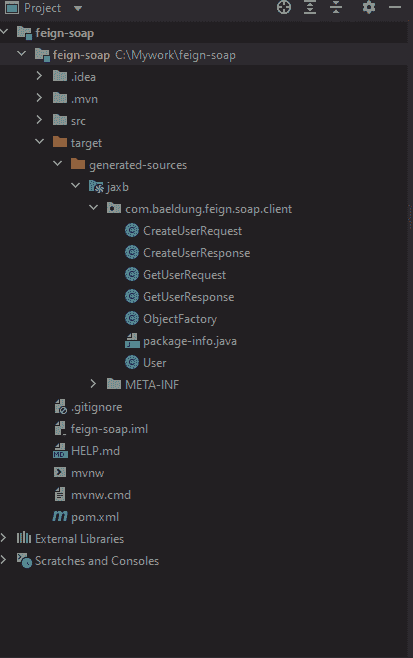

# 用假装客户端发送一个 SOAP 对象

> 原文：<https://web.archive.org/web/20220930061024/https://www.baeldung.com/java-feign-send-soap>

## 1.概观

[佯称](https://web.archive.org/web/20220524062502/https://github.com/OpenFeign/feign)抽象出 HTTP 调用，并使它们成为声明性的。通过这样做，Feign 隐藏了底层细节，如 HTTP 连接管理、硬编码的 URL 和其他样板代码。使用 Feign clients 的显著优点是 HTTP 调用变得简单，并消除了大量代码。通常，我们使用 Feign for REST API`application/json` 媒体类型。然而，Feign 客户端可以很好地处理其他媒体类型，如`text/xml`、多部分请求等。,

在本教程中，让我们学习如何使用 Feign 调用基于 SOAP 的 web 服务(`text/xml`)。

## 2.SOAP Web 服务

让我们假设有一个 [SOAP web 服务](/web/20220524062502/https://www.baeldung.com/spring-boot-soap-web-service)，它有两个操作——`getUser`和`createUser`。

让我们使用 [cURL](https://web.archive.org/web/20220524062502/https://man7.org/linux/man-pages/man1/curl.1.html) 来调用操作`createUser`:

```
curl -d @request.xml -i -o -X POST --header 'Content-Type: text/xml'
  http://localhost:18080/ws/users
```

这里，`request.xml`包含 SOAP 有效负载:

```
<soapenv:Envelope xmlns:soapenv="http://schemas.xmlsoap.org/soap/envelope/"
  xmlns:feig="http://www.baeldung.com/springbootsoap/feignclient">
    <soapenv:Header/>
    <soapenv:Body>
         <feig:createUserRequest>
             <feig:user>
                 <feig:id>1</feig:id>
                 <feig:name>john doe</feig:name>
                 <feig:email>[[email protected]](/web/20220524062502/https://www.baeldung.com/cdn-cgi/l/email-protection)</feig:email>
            </feig:user>
         </feig:createUserRequest>
    </soapenv:Body>
</soapenv:Envelope>
```

如果所有配置都正确，我们将得到一个成功的响应:

```
<SOAP-ENV:Envelope xmlns:SOAP-ENV="http://schemas.xmlsoap.org/soap/envelope/">
    <SOAP-ENV:Header/>
    <SOAP-ENV:Body>
        <ns2:createUserResponse xmlns:ns2="http://www.baeldung.com/springbootsoap/feignclient">
            <ns2:message>Success! Created the user with id - 1</ns2:message>
        </ns2:createUserResponse>
    </SOAP-ENV:Body>
</SOAP-ENV:Envelope>
```

类似地，其他操作`getUser` 也可以使用 cURL 调用。

## 3.属国

接下来，让我们看看如何使用[假装](/web/20220524062502/https://www.baeldung.com/intro-to-feign)来调用这个 SOAP web 服务。让我们开发两个不同的客户端来调用 SOAP 服务。Feign 支持多个现有的 HTTP 客户端，如 [Apache HttpComponents](https://web.archive.org/web/20220524062502/https://hc.apache.org/) 、 [OkHttp](https://web.archive.org/web/20220524062502/https://square.github.io/okhttp/) 、`java.net.URL`等。让我们使用 Apache `HttpComponents` 作为我们的底层 HTTP 客户端。首先，让我们为[open feign Apache http components](https://web.archive.org/web/20220524062502/https://search.maven.org/search?q=g:io.github.openfeign%20a:feign-hc5)添加依赖项:

```
<dependency>
    <groupId>io.github.openfeign</groupId>
    <artifactId>feign-hc5</artifactId>
    <version>11.8</version>
</dependency>
```

在接下来的小节中，让我们学习几种使用 Feign 调用 SOAP web 服务的方法。

## 4.纯文本形式的 SOAP 对象

我们可以以纯文本的形式发送 SOAP 请求，将`content-type`和`accept`头设置为`text/xml`。现在让我们开发一个演示这种方法的客户端:

```
public interface SoapClient {
    @RequestLine("POST")
    @Headers({"SOAPAction: createUser", "Content-Type: text/xml;charset=UTF-8",
      "Accept: text/xml"})
    String createUserWithPlainText(String soapBody);
}
```

这里，`createUserWithPlainText` 接受一个`String` SOAP 有效负载。注意，我们明确定义了`accept` 和`content-type` 头。这是因为当以文本形式发送 SOAP 消息体时，必须提到作为`text/xml.` 的`Content-Type`和`Accept` 报头

这种方法的一个缺点是我们应该事先知道 SOAP 的有效负载。幸运的是，如果 WSDL 可用，那么可以使用像 [SoapUI](https://web.archive.org/web/20220524062502/https://www.soapui.org/) 这样的开源工具来生成有效载荷。一旦有效负载准备就绪，让我们使用 Feign 调用 SOAP web 服务:

```
@Test
void givenSOAPPayload_whenRequest_thenReturnSOAPResponse() throws Exception {
    String successMessage="Success! Created the user with id";
    SoapClient client = Feign.builder()
       .client(new ApacheHttp5Client())
       .target(SoapClient.class, "http://localhost:18080/ws/users/");

    assertDoesNotThrow(() -> client.createUserWithPlainText(soapPayload()));

    String soapResponse= client.createUserWithPlainText(soapPayload());

    assertNotNull(soapResponse);
    assertTrue(soapResponse.contains(successMessage));
} 
```

Feign 支持 SOAP 消息和其他 HTTP 相关信息的日志记录。该信息对于调试至关重要。因此，让我们启用假装日志记录。记录这些消息需要一个额外的`[feign-slf4j](https://web.archive.org/web/20220524062502/https://search.maven.org/search?q=g:io.github.openfeign%20a:feign-slf4j)`依赖关系:

```
<dependency>
    <groupId>io.github.openfeign</groupId>
    <artifactId>feign-slf4j</artifactId>
    <version>11.8</version>
</dependency>
```

让我们增强我们的测试用例，以包括日志信息:

```
SoapClient client = Feign.builder()
  .client(new ApacheHttp5Client())
  .logger(new Slf4jLogger(SoapClient.class))
  .logLevel(Logger.Level.FULL)
  .target(SoapClient.class, "http://localhost:18080/ws/users/");
```

现在，当我们运行测试时，我们有类似于以下内容的日志:

```
18:01:58.295 [main] DEBUG org.apache.hc.client5.http.wire - http-outgoing-0 >> "SOAPAction: createUser[\r][\n]"
18:01:58.295 [main] DEBUG org.apache.hc.client5.http.wire - http-outgoing-0 >> "<soapenv:Envelope xmlns:soapenv="http://schemas.xmlsoap.org/soap/envelope/"
  xmlns:feig="http://www.baeldung.com/springbootsoap/feignclient">[\n]"
18:01:58.295 [main] DEBUG org.apache.hc.client5.http.wire - http-outgoing-0 >> " <soapenv:Header/>[\n]"
18:01:58.295 [main] DEBUG org.apache.hc.client5.http.wire - http-outgoing-0 >> " <soapenv:Body>[\n]"
18:01:58.295 [main] DEBUG org.apache.hc.client5.http.wire - http-outgoing-0 >> " <feig:createUserRequest>[\n]"
18:01:58.295 [main] DEBUG org.apache.hc.client5.http.wire - http-outgoing-0 >> " <feig:user>[\n]"
18:01:58.295 [main] DEBUG org.apache.hc.client5.http.wire - http-outgoing-0 >> " <feig:id>1</feig:id>[\n]"
18:01:58.295 [main] DEBUG org.apache.hc.client5.http.wire - http-outgoing-0 >> " <feig:name>john doe</feig:name>[\n]"
18:01:58.296 [main] DEBUG org.apache.hc.client5.http.wire - http-outgoing-0 >> " <feig:email>[[email protected]](/web/20220524062502/https://www.baeldung.com/cdn-cgi/l/email-protection)</feig:email>[\n]"
18:01:58.296 [main] DEBUG org.apache.hc.client5.http.wire - http-outgoing-0 >> " </feig:user>[\n]"
18:01:58.296 [main] DEBUG org.apache.hc.client5.http.wire - http-outgoing-0 >> " </feig:createUserRequest>[\n]"
18:01:58.296 [main] DEBUG org.apache.hc.client5.http.wire - http-outgoing-0 >> " </soapenv:Body>[\n]"
18:01:58.296 [main] DEBUG org.apache.hc.client5.http.wire - http-outgoing-0 >> "</soapenv:Envelope>"
18:01:58.300 [main] DEBUG org.apache.hc.client5.http.wire - http-outgoing-0 << "<SOAP-ENV:Envelope xmlns:SOAP-ENV="http://schemas.xmlsoap.org/soap/envelope/"><SOAP-ENV:Header/><SOAP-ENV:Body><ns2:createUserResponse xmlns:ns2="http://www.baeldung.com/springbootsoap/feignclient"><ns2:message>Success! Created the user with id - 1</ns2:message></ns2:createUserResponse></SOAP-ENV:Body></SOAP-ENV:Envelope>" 
```

## 5.假装 SOAP 编解码器

调用 SOAP Webservice 的一种更干净、更好的方法是使用 [Feign 的 SOAP 编解码器](https://web.archive.org/web/20220524062502/https://github.com/OpenFeign/feign/tree/master/soap)。编解码器帮助编组 SOAP 消息(Java 到 SOAP)/解组(SOAP 到 Java)。然而，编解码器需要一个额外的`[feign-soap](https://web.archive.org/web/20220524062502/https://search.maven.org/search?q=g:io.github.openfeign%20a:feign-soap)`依赖项。因此，让我们声明这种依赖性:

```
<dependency>
    <groupId>io.github.openfeign</groupId>
    <artifactId>feign-soap</artifactId>
    <version>11.8</version>
</dependency>
```

Feign SOAP codec 使用 [`JAXB`](/web/20220524062502/https://www.baeldung.com/jaxb) 和 [`SoapMessage`](https://web.archive.org/web/20220524062502/https://docs.oracle.com/javase/8/docs/api/javax/xml/soap/SOAPMessage.html) 对 SOAP 对象进行编码和解码，`JAXBContextFactory` 提供所需的编组器和解组器。

接下来，基于我们创建的 XSD，让我们[生成](/web/20220524062502/https://www.baeldung.com/maven-wsdl-stubs)域类。JAXB 需要这些域类来编组和解组 SOAP 消息。首先，让我们给我们的`pom.xml`添加一个插件:

```
<plugin>
    <groupId>org.jvnet.jaxb2.maven2</groupId>
    <artifactId>maven-jaxb2-plugin</artifactId>
    <version>0.14.0</version>
    <executions>
        <execution>
            <id>feign-soap-stub-generation</id>
            <phase>compile</phase>
            <goals>
                <goal>generate</goal>
            </goals>
            <configuration>
                <schemaDirectory>target/generated-sources/jaxb</schemaDirectory>
                <schemaIncludes>
                    <include>*.xsd</include>
                </schemaIncludes>
                <generatePackage>com.baeldung.feign.soap.client</generatePackage>
                <generateDirectory>target/generated-sources/jaxb</generateDirectory>
            </configuration>
        </execution>
    </executions>
</plugin>
```

这里，我们将插件配置为在`compile` 阶段运行。现在，让我们生成存根:

```
mvn clean compile
```

成功构建后，`target`文件夹包含源代码:

[](/web/20220524062502/https://www.baeldung.com/wp-content/uploads/2022/03/soap-clients-1.png)

接下来，让我们使用这些存根并假装调用 SOAP web 服务。但是，首先，让我们给我们的`SoapClient`添加一个新方法:

```
@RequestLine("POST")
@Headers({"Content-Type: text/xml;charset=UTF-8"})
CreateUserResponse createUserWithSoap(CreateUserRequest soapBody);
```

接下来，让我们测试 SOAP web 服务:

```
@Test
void whenSoapRequest_thenReturnSoapResponse() {
    JAXBContextFactory jaxbFactory = new JAXBContextFactory.Builder()
      .withMarshallerJAXBEncoding("UTF-8").build();
    SoapClient client = Feign.builder()
      .encoder(new SOAPEncoder(jaxbFactory))
      .decoder(new SOAPDecoder(jaxbFactory))
      .target(SoapClient.class, "http://localhost:18080/ws/users/");
    CreateUserRequest request = new CreateUserRequest();
    User user = new User();
    user.setId("1");
    user.setName("John Doe");
    user.setEmail("[[email protected]](/web/20220524062502/https://www.baeldung.com/cdn-cgi/l/email-protection)");
    request.setUser(user);
    CreateUserResponse response = client.createUserWithSoap(request);

    assertNotNull(response);
    assertNotNull(response.getMessage());
    assertTrue(response.getMessage().contains("Success")); 
}
```

让我们增强我们的测试用例来记录 HTTP 和 SOAP 消息:

```
SoapClient client = Feign.builder()
  .encoder(new SOAPEncoder(jaxbFactory))
  .errorDecoder(new SOAPErrorDecoder())
  .logger(new Slf4jLogger())
  .logLevel(Logger.Level.FULL)
  .decoder(new SOAPDecoder(jaxbFactory))
  .target(SoapClient.class, "http://localhost:18080/ws/users/"); 
```

这段代码生成了我们前面看到的类似日志。

最后，让我们来处理 SOAP 错误。Feign 提供了一个 [`SOAPErrorDecoder`](https://web.archive.org/web/20220524062502/https://javadoc.io/static/io.github.openfeign/feign-soap/10.3.0/feign/soap/SOAPErrorDecoder.html) ，它返回一个 SOAP 错误作为`SOAPFaultException`。因此，让我们将这个 `SOAPErrorDecoder`设置为一个假装的错误解码器，并处理 SOAP 错误:

```
SoapClient client = Feign.builder()
  .encoder(new SOAPEncoder(jaxbFactory))
  .errorDecoder(new SOAPErrorDecoder())  
  .decoder(new SOAPDecoder(jaxbFactory))
  .target(SoapClient.class, "http://localhost:18080/ws/users/");
try {
    client.createUserWithSoap(request);
} catch (SOAPFaultException soapFaultException) {
    assertNotNull(soapFaultException.getMessage());
    assertTrue(soapFaultException.getMessage().contains("This is a reserved user id"));
}
```

这里，如果 SOAP web 服务抛出一个 SOAP 错误，它将由`SOAPFaultException`处理。

## 6.结论

在本文中，我们学习了使用 Feign 调用 SOAP web 服务。Feign 是一个声明性的 HTTP 客户端，它使得调用 SOAP/REST web 服务变得很容易。使用 Feign 的好处是它减少了代码的行数。较少的代码行导致较少的错误和较少的单元测试。

和往常一样，完整的源代码可以在 GitHub 上找到[。](https://web.archive.org/web/20220524062502/https://github.com/eugenp/tutorials/tree/master/feign/src/main/java/com/baeldung/feign)