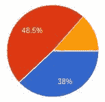
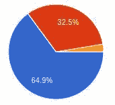

# 调查结果–Java 8、Spring 4 和 Spring Boot 的采用情况

> 原文：<https://web.archive.org/web/20220930061024/https://www.baeldung.com/java-8-spring-4-and-spring-boot-adoption>

> 以下是新 Java 8/Spring 4/http://t.co/ylEBUBmaLh Spring Boot 采用调查的结果:(超过 1500 票)
> 
> —bael dung(@ bael dung)[2015 年 6 月 1 日](https://web.archive.org/web/20220703143336/https://twitter.com/baeldung/status/605353043295629312)

Java 开发人员是一群动态的、不断变化的人。

在过去的几周里，我在 Baeldung 上做了一个行业调查，看看 Java 8、Spring 4 和更新的 Spring Boot 是如何在行业中被采用和使用的。

**我们收到了超过 1500 份调查答案**——得出了一些非常酷的数字:

#### [> >查看全部调查结果](https://web.archive.org/web/20220703143336/https://docs.google.com/forms/d/1u5g5d1gt1tkmitJkS9dR85_1hiRDq1T4OUBiNG4AKzY/viewanalytics)

## 1。Java 8 的采用

让我们从 Java 开始，这里我们编号如下:

*   #### 38%–Java 8

*   #### 48.5%–Java 7

*   #### 13.5%–Java 6

社区显然正以非常快的速度向 Java 8 迁移—[一项类型安全调查](https://web.archive.org/web/20220703143336/https://www.typesafe.com/company/news/survey-of-more-than-3000-developers-reveals-java-8-adoption-ahead-of-previous-forecasts)显示，2014 年 10 月，Java 8 的采用率徘徊在 26%左右。

**2015 年 5 月**，仅 7 个月后，我们的采用率就达到了近 40%,这是相当可观的。

## 2。春天 4 采用

第四季已经在 2013 年 12 月上映。让我们来看看今天它在整个行业中被采用的程度:

*   #### 65%–spring 4

*   #### 32.5% –spring 3

*   #### 2.5% –spring 2

数字非常清楚——**生态系统正走向第四春**。

**回到 2014 年 6 月**——差不多一年前—[的领养看起来](https://web.archive.org/web/20220703143336/https://docs.google.com/forms/d/1QSRoNtk7F4_KamnQk08_ajlrTF0hPdXT_aQAiQeM6XY/viewanalytics)完全不同:

*   **37%**–弹簧 4
*   **57%**–弹簧 3
*   **6%**–弹簧 2

## 3。Spring Boot 领养

最后——Spring Boot 在 2014 年 4 月被释放。让我们看看它在过去一年中的应用情况:

*   #### 34%—现在使用 Spring Boot

*   #### 66%–No

    yet

## 4。结论

早期版本——Java 7 和 Spring 3——明显呈下降趋势，但确实拥有稳固的市场份额。有趣的是，旧版本——**Java 6 和 Spring 2 几乎消失了(**,或者下降到个位数。

总的来说，对于 Java 8 和更新的 Spring 技术来说，采用的步伐似乎很快。