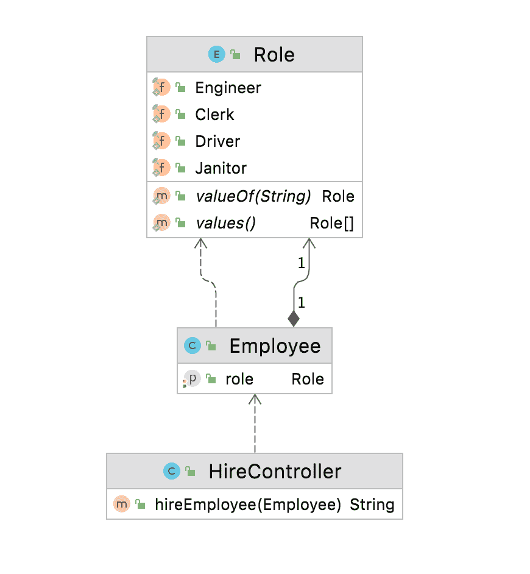
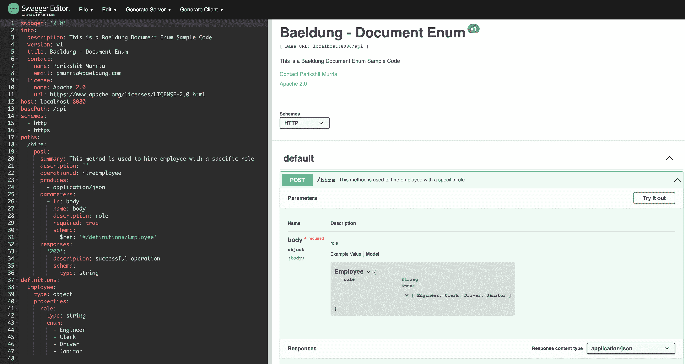

# 大摇大摆地记录枚举

> 原文:[https://web . archive . org/web/20220930061024/https://www . bael dung . com/swagger-enum](https://web.archive.org/web/20220930061024/https://www.baeldung.com/swagger-enum)

## 1.概观

在本教程中，我们将学习如何使用 [`swagger-maven-plugin`](https://web.archive.org/web/20220716222627/https://search.maven.org/search?q=a:swagger-maven-plugin%20AND%20g:io.swagger.core.v3) 在 swagger 中记录 enum，并在 Swagger 编辑器中验证生成的 JSON 文档。

## 2。什么是霸气？

A [Swagger](/web/20220716222627/https://www.baeldung.com/spring-boot-rest-client-swagger-codegen) 是一个用于定义基于 rest 的 API 的开源工具。在当今世界，大多数组织都在朝着微服务和 API 优先的方法发展。Swagger 对于设计和记录 API 来说非常方便。它还提供了各种工具，如 Swagger Editor、Swagger UI 和 Swagger CodeGen，来帮助 API 开发。

**同样，Swagger 是`OpenAPI`规范或`OAS`、**的实现，它定义了 rest API 开发的一套标准；因此，它帮助全球的组织标准化编写 API 的过程。

我们的应用程序生成的 JSON 文件也将遵循`OpenAPI`规范。

让我们试着理解一下 [Enum](/web/20220716222627/https://www.baeldung.com/a-guide-to-java-enums) 在 Swagger 中的重要性。一些 API 需要用户坚持使用一组特定的预定义值。这些预定义的常数值称为 enum。类似地，当 Swagger 公开 API 时，我们希望确保用户从这个预定义的集合中选择一个值，而不是自由文本。**换句话说，我们需要在我们的`swagger.json`文件中记录枚举，以便用户知道可能的值。**

## 3.履行

让我们以 REST API 为例，直接跳到实现。**我们将实现一个 POST API 来为一个组织雇佣特定角色的员工。但是，角色只能是下列之一:`Engineer`、`Clerk`、`Driver`或`Janitor`。**

我们将用 employee role 的所有可能值创建一个名为`Role`的枚举，并创建一个将 role 作为其属性之一的类`Employee`。让我们看一下 UML 图，以便更好地理解这些类及其关系:

[](/web/20220716222627/https://www.baeldung.com/wp-content/uploads/2022/02/UML-HireController.png)

为了在 Swagger 中记录这一点，首先，我们将在我们的应用程序中导入并配置 [`swagger-maven-plugin`](https://web.archive.org/web/20220716222627/https://search.maven.org/search?q=a:swagger-maven-plugin%20AND%20g:io.swagger.core.v3) 。其次，我们将在代码中添加所需的注释，最后，我们将构建项目并在 swagger 编辑器中验证生成的 swagger 文档或`swagger.json`。

### 3.1.导入和配置插件

我们将使用 [`swagger-maven-plugin`](https://web.archive.org/web/20220716222627/https://search.maven.org/search?q=a:swagger-maven-plugin%20AND%20g:io.swagger.core.v3) ，，并且我们需要将它作为依赖项添加到我们的应用程序的`pom.xml`中:

```
<dependency>
    <groupId>com.github.kongchen</groupId>
    <artifactId>swagger-maven-plugin</artifactId>
    <version>3.1.1</version>
</dependency>
```

此外，为了配置和启用这个插件，我们将把它添加到`pom.xml`的插件部分:

*   `locations`:这个标签指定了包含由分号分隔的`@Api`的包或类
*   `info`:这个标签为 API 提供元数据。Swagger-ui 使用这些数据来显示信息
*   `swaggerDirectory`:该标签定义了`swagger.json`文件的路径

```
<plugin>
    <groupId>com.github.kongchen</groupId>
    <artifactId>swagger-maven-plugin</artifactId>
    <version>3.1.1</version>
    <configuration>
        <apiSources>
            <apiSource>
                <springmvc>false</springmvc>
                <locations>com.baeldung.swaggerenums.controller</locations>
                <schemes>http,https</schemes>
                <host>baeldung.com</host>
                <basePath>/api</basePath>
                <info>
                    <title>Baeldung - Document Enum</title>
                    <version>v1</version>
                    <description>This is a Baeldung Document Enum Sample Code</description>
                    <contact>
                        <email>[[email protected]](/web/20220716222627/https://www.baeldung.com/cdn-cgi/l/email-protection)</email>
                        <name>Test</name>
                    </contact>
                    <license>
                        <url>https://www.apache.org/licenses/LICENSE-2.0.html</url>
                        <name>Apache 2.0</name>
                    </license>
                </info>
                <swaggerDirectory>generated/swagger-ui</swaggerDirectory>
            </apiSource>
        </apiSources>
    </configuration>
    <executions>
        <execution>
            <phase>compile</phase>
            <goals>
                <goal>generate</goal>
            </goals>
        </execution>
     </executions>
 </plugin>
```

### 3.2.记录枚举

为了在 Swagger 中记录一个枚举，**我们需要使用注释`@ApiModel.`** 来声明模型

在这个例子中，我们创建了一个具有四个可能值的枚举`Role`—`Engineer, Clerk, Driver, and Janitor`。因为我们需要记录这个枚举，我们将把`@ApiModel`添加到枚举`Role`中。换句话说，这会让大摇大摆的人知道模特的存在。在`Employee`类中，我们将用`@ApiModel`注释`Employee`，用`@ApiModelProperty`注释`Role`。

我们的`Employee,` `Role,` 和`HireController`会是什么样子:

```
@ApiModel
public class Employee {
    @ApiModelProperty
    public Role role;

   // standard setters and getters
}
```

```
@ApiModel
public enum Role {
    Engineer, Clerk, Driver, Janitor;
}
```

接下来，我们将创建一个将`@Path`作为`“/hire”`的 API，并使用`Employee`模型作为`hireEmployee`方法的输入参数。我们必须将`@Api`添加到我们的`HireController`中，以便 [`swagger-maven-plugin`](https://web.archive.org/web/20220716222627/https://search.maven.org/search?q=a:swagger-maven-plugin%20AND%20g:io.swagger.core.v3) 知道并应该考虑它来记录:

```
@Api
@Path(value="/hire")
@Produces({"application/json"})
public class HireController {

    @POST
    @ApiOperation(value = "This method is used to hire employee with a specific role")
    public String hireEmployee(@ApiParam(value = "role", required = true) Employee employee) {
        return String.format("Hired for role: %s", employee.role.name());
    }
}
```

### 3.3.生成 Swagger 文档

要构建我们的项目并生成 swagger 文档，请运行以下命令:

`mvn clean install`

一旦构建完成，插件将在`generated/swagger-ui`或插件中配置的位置生成`swagger.json`文件。在定义下，我们会看到 employee 属性中记录的枚举`Role`及其所有可能的值。

```
"definitions" : {
  "Employee" : {
    "type" : "object",
    "properties" : {
      "role" : {
        "type" : "string",
        "enum" : [ "Engineer", "Clerk", "Driver", "Janitor" ]
      }
    }
  }
}
```

现在，我们将使用[在线 swagger 编辑器](https://web.archive.org/web/20220716222627/https://editor.swagger.io/)可视化生成的 JSON，并寻找 enum `Role`:

## [](/web/20220716222627/https://www.baeldung.com/wp-content/uploads/2022/02/Swagger-Json-in-editor.png)

## 4.结论

在本教程中，我们讨论了什么是 Swagger，并了解了`OpenAPI`规范及其在组织的 API 开发中的重要性。此外，我们使用 [`swagger-maven-plugin`](https://web.archive.org/web/20220716222627/https://search.maven.org/search?q=a:swagger-maven-plugin%20AND%20g:io.swagger.core.v3) 创建并记录了包含 enum 的示例 API。最后，为了验证输出，我们使用 swagger 编辑器来可视化生成的 JSON 文档。

这个实现可以在 GitHub 上找到。