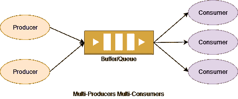

# Java 中的生产者-消费者问题示例

> 原文：<https://web.archive.org/web/20220930061024/https://www.baeldung.com/java-producer-consumer-problem>

## 1.概观

在本教程中，我们将学习如何用 Java 实现生产者-消费者问题。这个问题就是**也称为有界缓冲区问题**。

关于这个问题的更多细节，我们可以参考[生产者-消费者问题](https://web.archive.org/web/20220524053111/https://en.wikipedia.org/wiki/Producer%E2%80%93consumer_problem) wiki 页面。对于 Java 线程/并发基础知识，请务必访问我们的 [Java 并发](/web/20220524053111/https://www.baeldung.com/java-concurrency)文章。

## 2.生产者-消费者问题

生产者和消费者是两个独立的过程。两个进程共享一个公共缓冲区或队列。生产者不断地产生某些数据并将其推送到缓冲区，而消费者则从缓冲区消费这些数据。

让我们来看一个展示这个简单场景的图表:

**本来这个问题处理起来就有一定的复杂性**:

*   生产者和消费者都可能试图同时更新队列。这可能会导致数据丢失或不一致。
*   生产者可能比消费者慢。在这种情况下，消费者会快速处理元素并等待。
*   在某些情况下，消费者可能比生产者慢。这种情况会导致队列溢出问题。
*   在真实的场景中，我们可能有多个生产者、多个消费者，或者两者都有。这可能会导致不同的使用者处理相同的消息。

下图描述了一个有多个生产者和多个消费者的案例:

我们需要处理资源共享和同步，以解决一些复杂问题:

*   添加和删除数据时对队列进行同步
*   当队列为空时，使用者必须等待，直到生产者将新数据添加到队列中
*   当队列已满时，生产者必须等待，直到消费者使用数据并且队列有一些空缓冲区

## 3.使用线程的 Java 示例

我们为问题的每个实体定义了一个单独的类。

### 3.1.`Message`阶级

`Message`类保存产生的数据:

[PRE0]

数据可以是任何类型。它可能是一个 JSON 字符串，一个复杂的对象，或者只是一个数字。此外，将数据包装到一个`Message`类中并不是强制性的。

### 3.2.`DataQueue`阶级

共享队列和相关对象被包装到`DataQueue`类中:

[PRE1]

要制作有界缓冲区，需要一个`queue`和它的`maxSize`。

在 Java 中，`synchronized`块使用一个对象来实现线程同步。**每个对象都有一个固有的锁。**只有首先获得锁的线程才被允许执行`synchronized`块。

这里，我们创建了两个引用，`FULL_QUEUE`和`EMPTY_QUEUE`，用于同步。由于这些句柄没有其他用途，我们使用`Object`类初始化它们。

当队列满时，生产者等待`FULL_QUEUE`对象。并且，消费者一消费消息就通知。

生产者进程调用`waitOnFull`方法:

[PRE2]

消费者流程通过`notifyAllForFull`方法通知生产者:

[PRE3]

如果队列是空的，消费者就等待`EMPTY_QUEUE`对象。而且，一旦有消息添加到队列中，生产者就会通知它。

消费者进程使用`waitOnEmpty`方法等待:

[PRE4]

生产者使用`notifyAllForEmpty`方法通知消费者:

[PRE5]

生产者使用`add()`方法将消息添加到队列中:

[PRE6]

消费者调用`remove`方法从队列中检索消息:

[PRE7]

### 3.3.`Producer`阶级

`Producer`类实现了`Runnable`接口来启用线程创建:

[PRE8]

构造函数使用共享的`dataQueue`参数。**成员变量`runFlag`有助于优雅地停止生产者进程。**初始化为`true`。

线程开始调用`produce()`方法:

[PRE9]

生产者在`while`循环中连续运行步骤。当`runFlag`为`false`时，该循环中断。

在每次迭代中，它都会生成一条消息。然后，它检查队列是否已满，并根据需要等待。使用一个`while`循环代替`if`块来检查队列是否已满。**这是为了避免从等待状态虚假唤醒。**

当生产者从等待中醒来时，它检查它是否仍然需要继续或者从过程中中断。它向队列中添加一条消息，并通知在空队列中等待的消费者。

`stop`()方法优雅地终止进程:

[PRE10]

将`runFlag`更改为`false`后，通知所有处于“队列已满”状态的生产者。这确保了所有生产者线程终止。

### 3.4.消费者阶层

`Consumer`类实现`Runnable`来启用线程创建:

[PRE11]

它的构造函数有一个共享的`dataQueue`作为参数。`runFlag`被初始化为`true`。该标志在需要时停止消费进程。

**线程启动时，运行`consume`方法**:

[PRE12]

它有一个连续运行的`while` 循环。并且，当`runFlag`是`false`时，这个过程优雅地停止。

每次迭代检查队列是否为空。**如果队列为空，消费者等待消息产生**。此等待也被`while`循环用来避免虚假唤醒。

当消费者从等待中醒来时，它检查`runFlag`。如果标志是`false`，那么它就跳出循环。否则，它会从队列中读取一条消息，并通知生成器它正在“满队列”状态下等待。最后，它消耗消息。

为了优雅地停止进程，它使用了`stop()`方法:

[PRE13]

在`runFlag`被设置为`false`之后，所有处于空队列状态等待的消费者被通知。这确保了所有消费者线程都终止。

### 3.5.运行生产者线程和消费者线程

让我们创建一个具有最大所需容量的`dataQueue`对象:

[PRE14]

现在，让我们创建`producer`对象和一个线程:

[PRE15]

然后，我们将初始化一个`consumer`对象和一个线程:

[PRE16]

最后，我们启动线程来启动进程:

[PRE17]

它会持续运行，直到我们想要停止那些线程。阻止他们很简单:

[PRE18]

### 3.6.运行多个生产者和消费者

运行多个生产者和消费者类似于单个生产者和消费者的情况。我们只需要创建所需数量的线程并启动它们。

让我们创建多个生成器和线程并启动它们:

[PRE19]

接下来，让我们创建所需数量的消费者对象和线程:

[PRE20]

我们可以通过在生产者和消费者对象上调用`stop()`方法来优雅地停止这个过程:

[PRE21]

## 4.使用`BlockingQueue`的简化示例

Java 提供了一个线程安全的`BlockingQueue`接口。换句话说，**多个线程可以在这个队列中添加和删除，而没有任何并发问题**。

如果队列已满，它的`put()`方法会阻塞调用线程。类似地，如果队列为空，它的`take()`方法会阻塞调用线程。

### 4.1.创建有界的`BlockingQueue`

我们可以使用构造函数中的容量值创建一个有界的`BlockingQueue`:

[PRE22]

### 4.2.简化`produce`方法

在`produce()`方法中，我们可以避免队列的显式同步:

[PRE23]

这个方法不断地产生对象，并将它们添加到队列中。

### 4.3.简化`consume`方法

`consume()`方法没有明确使用同步:

[PRE24]

它只是从队列中取一个值，并不断地使用它。

### 4.4.运行生产者和消费者线程

我们可以根据需要创建任意多的生产者和消费者线程:

[PRE25]

## 5.结论

在本文中，我们学习了如何使用 Java 线程实现生产者-消费者问题。此外，我们还学习了如何运行多个生产者和消费者的场景。

完整的代码样本可以在 GitHub 上找到[。](https://web.archive.org/web/20220524053111/https://github.com/eugenp/tutorials/tree/master/core-java-modules/core-java-concurrency-advanced-4)