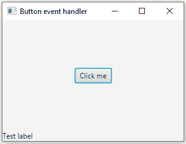

# 将 EventHandler 添加到 JavaFX 按钮

> 原文:[https://web . archive . org/web/20220930061024/https://www . bael dung . com/Java FX-button-eventhandler](https://web.archive.org/web/20220930061024/https://www.baeldung.com/javafx-button-eventhandler)

## 1.概观

在这个简短的教程中，我们将**看看 [JavaFX](/web/20221111042236/https://www.baeldung.com/javafx) `Button`组件，看看我们如何处理用户交互**。

## 2.应用程序设置

首先，**让我们创建一个小应用程序来关注事件处理程序**。让我们从创建一个包含按钮的简单 [FXML](/web/20221111042236/https://www.baeldung.com/javafx#fxml) 布局开始:

```
<?xml version="1.0" encoding="UTF-8"?>

<?import javafx.scene.control.*?>
<?import javafx.scene.layout.*?>
<BorderPane xmlns:fx="http://javafx.com/fxml"

    fx:controller="com.baeldung.button.eventhandler.ButtonEventHandlerController"
    prefHeight="200.0" prefWidth="300.0">
    <center>
        <Button fx:id="button" HBox.hgrow="ALWAYS"/>
    </center>

    <bottom>
        <Label fx:id="label" text="Test label"/>
    </bottom>
</BorderPane>
```

让我们创建`ButtonEventHandlerController`类。**负责连接 UI 元素和应用程序逻辑**。我们将在`initialize`方法中设置按钮的标签:

```
public class ButtonEventHandlerController {

    private static final Logger logger = LoggerFactory.getLogger(ButtonEventHandlerController.class);

    @FXML
    private Button button;

    @FXML
    private Label label;

    @FXML
    private void initialize() {
        button.setText("Click me");
    }
}
```

让我们启动应用程序。我们应该会在中间看到一个标题为“单击我”的按钮，在窗口底部看到一个测试标签:

[](/web/20221111042236/https://www.baeldung.com/wp-content/uploads/2022/01/javafx_button_event_handler_app_preview-1.png)

## 3.点击事件

让我们从处理简单的单击事件开始，并向 initialize 方法添加一个事件处理程序:

```
button.setOnAction(new EventHandler<ActionEvent>() {
    @Override
    public void handle(ActionEvent event) {
        logger.info("OnAction {}", event);
    }
});
```

现在让我们来测试一下。当我们点击按钮时，会出现一条新的日志消息:

```
INFO c.b.b.e.ButtonEventHandlerController - OnAction javafx.event.ActionEvent[source=Button[id=searchButton, styleClass=button]'Click me']
```

**因为事件处理程序接口只有一个方法，我们可以将其视为一个[功能接口](/web/20221111042236/https://www.baeldung.com/java-8-functional-interfaces)，并用一个 lambda 表达式替换这些行，以使我们的代码更容易阅读**:

```
searchButton.setOnAction(event -> logger.info("OnAction {}", event));
```

让我们尝试添加另一个 click 事件处理程序。我们可以简单地复制这一行并更改日志消息，以便在测试应用程序时能够看到不同之处:

```
button.setOnAction(event -> logger.info("OnAction {}", event));
button.setOnAction(event -> logger.info("OnAction2 {}", event));
```

现在，当我们点击按钮时，我们只能看到“OnAction 2”消息。这是因为第二个*setOnAction*方法调用用第二个事件处理程序替换了第一个事件处理程序。

## 4.不同的事件

我们还可以处理其他类型的事件，比如鼠标按下/释放、拖动和键盘事件。

让我们为按钮添加一个悬停效果。我们将在光标开始悬停在按钮上时显示阴影，并在光标离开按钮时移除该效果:

```
Effect shadow = new DropShadow();
searchButton.setOnMouseEntered(e -> searchButton.setEffect(shadow));
searchButton.setOnMouseExited(e -> searchButton.setEffect(null)); 
```

## 5.重用事件处理程序

在某些情况下，我们可能希望多次使用同一个事件处理程序。让我们创建一个事件处理程序，当我们单击鼠标辅助按钮时，它将增加按钮的字体大小:

```
EventHandler<MouseEvent> rightClickHandler = event -> {
    if (MouseButton.SECONDARY.equals(event.getButton())) {
        button.setFont(new Font(button.getFont().getSize() + 1));
    }
};
```

然而，它没有任何功能，因为我们没有将它与任何事件相关联。让我们使用这个事件处理程序来处理按钮和标签的鼠标按下事件:

```
button.setOnMousePressed(rightClickHandler);
label.setOnMousePressed(rightClickHandler);
```

现在，当我们测试应用程序并在标签或按钮上单击鼠标辅助按钮时，我们看到字体大小增加了。

## 6.结论

我们学习了如何向 JavaFX 按钮添加事件处理程序，并根据事件类型执行不同的操作。

与往常一样，GitHub 上的[提供了代码实现。](https://web.archive.org/web/20221111042236/https://github.com/eugenp/tutorials/tree/master/javafx)