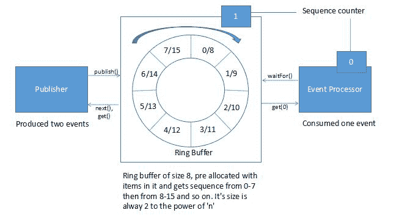

# LMAX 中断器的并发性——简介

> 原文：<https://web.archive.org/web/20220930061024/https://www.baeldung.com/lmax-disruptor-concurrency>

## **1。概述**

本文介绍了 [LMAX 中断器](https://web.archive.org/web/20220820212829/https://lmax-exchange.github.io/disruptor/)，并讨论了它如何帮助实现低延迟的软件并发。我们还将看到颠覆者库的基本用法。

## **2。什么是颠覆者？**

Disruptor 是由 LMAX 编写的开源 Java 库。它是一个用于处理大量事务的并发编程框架，具有低延迟(并且没有并发代码的复杂性)。性能优化是通过利用底层硬件效率的软件设计来实现的。

### **2.1。机械共鸣**

让我们从[机械共鸣](https://web.archive.org/web/20220820212829/https://www.infoq.com/presentations/mechanical-sympathy)的核心概念开始——这完全是关于理解底层硬件如何操作，以及以最适合该硬件的方式进行编程。

例如，让我们看看 CPU 和内存组织如何影响软件性能。CPU 和主存之间有几层缓存。当 CPU 执行操作时，它首先在 L1 中寻找数据，然后是 L2，然后是 L3，最后是主存。走得越远，手术时间就越长。

如果对一段数据多次执行相同的操作(例如，循环计数器)，将该数据加载到离 CPU 非常近的地方是有意义的。

高速缓存未命中成本的一些指示性数字:

| 从 CPU 到的延迟 | CPU 周期 | 时间 |
| 主存储器 | 多重 | 约 60-80 纳秒 |
| L3 缓存 | 大约 40-45 个周期 | 约 15 纳秒 |
| L2 高速缓存 | 大约 10 个周期 | 大约 3 纳秒 |
| L1 高速缓存 | 大约 3-4 个周期 | 大约 1 纳秒 |
| 注册 | 1 个周期 | 非常非常快 |

### **2.2。为什么不排队**

队列实现往往在头、尾和大小变量上有写争用。由于消费者和生产者之间的速度差异，队列通常总是接近满或接近空。他们很少在一个平衡的中间地带运作，在那里生产和消费的比率是势均力敌的。

为了处理写争用，队列经常使用锁，这可能导致上下文切换到内核。当这种情况发生时，相关的处理器很可能会丢失缓存中的数据。

为了获得最佳的缓存行为，设计应该只有一个内核写入任何内存位置(多个读取器是可以的，因为处理器通常在它们的缓存之间使用特殊的高速链接)。队列不符合单写入者原则。

如果两个单独的线程正在写入两个不同的值，每个内核都会使另一个内核的高速缓存行无效(数据以固定大小的块(称为高速缓存行)在主内存和高速缓存之间传输)。这是两个线程之间的写争用，即使它们正在写入两个不同的变量。这被称为假共享，因为每次头被访问时，尾也被访问，反之亦然。

### **2.3。干扰器如何工作**

Disruptor 具有基于阵列的循环数据结构(环形缓冲区)。这是一个指向下一个可用槽的数组。它填充了预先分配的传输对象。生产者和消费者在没有锁定或争用的情况下执行对环的数据写入和读取。

在中断器中，所有事件都发布给所有消费者(多播)，以便通过单独的下游队列进行并行消费。由于消费者的并行处理，有必要协调消费者之间的依赖关系(依赖关系图)。

生产者和消费者都有一个序列计数器来指示它当前正在缓冲区中的哪个槽上工作。每个生产者/消费者可以写自己的序列计数器，但可以读取其他人的序列计数器。生产者和消费者读取计数器，以确保它想要写入的槽是可用的，没有任何锁。

## **3。使用干扰器库**

### **3.1。Maven 依赖关系**

让我们从在`pom.xml`中添加中断器库依赖开始:

[PRE0]

依赖关系的最新版本可以在[这里](https://web.archive.org/web/20220820212829/https://search.maven.org/classic/#search%7Cgav%7C1%7Cg%3A%22com.lmax%22%20AND%20a%3A%22disruptor%22)查看。

### **3.2。定义事件**

让我们定义携带数据的事件:

[PRE1]

`EventFactory`让中断器预分配事件。

### **3.3。消费者**

消费者从环形缓冲区读取数据。让我们定义一个将处理事件的消费者:

[PRE2]

在我们的例子中，消费者只是打印日志。

### **3.4。构建干扰器**

构建干扰器:

[PRE3]

在 Disruptor 的构造函数中，定义了以下内容:

*   事件工厂——负责生成对象，这些对象将在初始化期间存储在环形缓冲区中
*   环形缓冲区的大小——我们将环形缓冲区的大小定义为 16。它必须是 2 的幂，否则初始化时会抛出异常。这一点很重要，因为使用逻辑二进制运算符很容易执行大多数运算，例如模运算
*   线程工厂–为事件处理器创建线程的工厂
*   生产者类型–指定我们将有单个还是多个生产者
*   等待策略——定义我们如何处理跟不上制作人步伐的慢速订阅者

连接消费者处理程序:

[PRE4]

可以向多个消费者提供中断器来处理生产者产生的数据。在上面的例子中，我们只有一个消费者事件处理程序。

### **3.5。启动干扰器**

要启动干扰器:

[PRE5]

### 3.6。制作和发布事件

生产者将数据按顺序放入环形缓冲区。生产者必须知道下一个可用的槽，以便他们不会覆盖尚未使用的数据。

使用 Disruptor 中的`RingBuffer`进行发布:

[PRE6]

在这里，生产者正在按顺序生产和发布项目。这里需要注意的是，Disruptor 的工作方式类似于两阶段提交协议。它读取新的`sequenceId`并发布。下一次它应该得到`sequenceId` + 1 作为下一个 `sequenceId.`

## **4。结论**

在本教程中，我们了解了什么是颠覆者，以及它如何以低延迟实现并发。我们已经了解了机械共鸣的概念，以及如何利用它来实现低延迟。然后我们看到了一个使用 Disruptor 库的例子。

示例代码可以在 GitHub 项目中找到——这是一个基于 Maven 的项目，所以它应该很容易导入和运行。