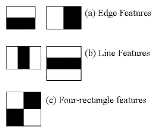

# Java OpenCV 简介

> 原文：<https://web.archive.org/web/20220930061024/https://www.baeldung.com/java-opencv>

## 1.介绍

在本教程中，我们将**学习如何安装和使用 OpenCV 计算机视觉库，并将其应用于实时人脸检测。**

## 2.装置

为了在我们的项目中使用 OpenCV 库，我们需要将[`opencv`Maven 依赖](https://web.archive.org/web/20221009043517/https://search.maven.org/search?q=g:org.openpnp%20a:opencv)添加到我们的`pom.xml`:

[PRE0]

对于 Gradle 用户，我们需要将依赖关系添加到我们的`build.gradle`文件中:

[PRE1]

将这个库添加到我们的依赖项之后，我们就可以使用 OpenCV 提供的特性了。

## 3.使用图书馆

要开始使用 OpenCV，**我们需要初始化库**，这可以在我们的`main` 方法中完成:

[PRE2]

**`OpenCV` 是一个类，包含与加载 OpenCV 库为各种平台和架构所需的原生包**相关的方法。

值得注意的是[文档](https://web.archive.org/web/20221009043517/https://opencv-java-tutorials.readthedocs.io/)做的事情略有不同:

[PRE3]

这两个方法调用实际上会加载所需的本地库。

这里的区别是**后者需要安装本地库**。但是，如果在给定的机器上没有这些库，前者可以将它们安装到一个临时文件夹中。由于这种差异，**`loadShared `方法通常是去**的最好方法。

现在我们已经初始化了库，让我们看看我们可以用它做什么。

## 4.加载图像

首先，**让我们使用 OpenCV** 从磁盘加载样本图像:

[PRE4]

这个方法将把给定的图像作为一个矩阵表示的对象加载。

为了保存之前加载的图像，我们可以使用`Imgcodecs`类的`imwrite()`方法:

[PRE5]

## 5.哈尔级联分类器

在深入研究面部识别之前，让我们先了解一下让这成为可能的核心概念。

简单地说，**分类器是一个程序，它试图根据过去的经验将新的观察结果**放入一个组中。**级联分类器使用几个分类器的级联来实现这一点。**每个后续分类器都使用前一个分类器的输出作为附加信息，极大地改进了分类。

### 5.1.哈尔特征

OpenCV 中的人脸检测由基于 Haar 特征的级联分类器完成。

**[哈尔特征](https://web.archive.org/web/20221009043517/https://docs.opencv.org/3.4/db/d28/tutorial_cascade_classifier.html)是用于检测图像上的边缘和线条的过滤器。**滤镜看起来是黑白颜色的方块: 

这些滤镜会逐个像素地多次应用于一幅图像，结果会作为单个值收集起来。该值是黑色方块下的像素总和与白色方块下的像素总和之间的差值。

## 6.人脸检测

一般来说，级联分类器需要预先训练，以便能够检测任何东西。

由于训练过程可能会很长，并且需要很大的数据集，我们将使用 OpenCV 提供的[预训练模型之一。为了方便访问，我们将这个 XML 文件放在我们的`resources `文件夹中。](https://web.archive.org/web/20221009043517/https://github.com/opencv/opencv/tree/master/data/haarcascades)

**让我们一步一步地了解检测人脸的过程:**

我们将尝试用一个红色矩形来勾勒出面部轮廓，以此来检测面部。

首先，我们需要从源路径加载`Mat `格式的图像:

[PRE6]

然后，我们将声明一个`MatOfRect `对象来存储我们找到的人脸:

[PRE7]

接下来，我们需要初始化`CascadeClassifier `来进行识别:

[PRE8]

上面，参数 1.1 表示我们想要使用的比例因子，指定在每个图像比例下图像大小减少多少。下一个参数`3`是`minNeighbors.`这是一个候选矩形为了保留它应该拥有的邻居的数量。

最后，我们将遍历这些面并保存结果:

[PRE9]

当我们输入我们的源图像时，我们现在应该收到输出图像，所有的面都标有一个红色的矩形:

## 7.使用 OpenCV 访问摄像机

到目前为止，我们已经看到了如何在加载的图像上执行人脸检测。但大多数时候，我们希望实时完成。为了做到这一点，我们需要访问摄像头。

然而，为了能够显示来自相机的图像，除了显而易见的东西之外，我们还需要一些额外的东西——相机。为了显示图像，我们将使用 JavaFX。

因为我们将使用一个`ImageView` 来显示我们的相机拍摄的照片，我们需要一种方法**将一个 OpenCV `Mat `转换成一个 JavaFX `Image`** :

[PRE10]

这里，我们将我们的`Mat `转换成字节，然后将字节转换成一个`Image `对象。

我们将从将摄像机视图流式传输到 JavaFX `Stage.`开始

现在，让我们使用`loadShared `方法初始化这个库:

[PRE11]

接下来，我们将**创建带有`VideoCapture `和`ImageView `的舞台**，以显示`Image`:

[PRE12]

这里，`0` 是我们要用的相机的 ID。我们还需要**创建一个** `**AnimationTimer** `来处理设置图像:

[PRE13]

最后，我们的`getCapture `方法处理**将`Mat `转换为`Image`** :

[PRE14]

**应用程序现在应该创建一个窗口，然后将视图从摄像机实时传输到`imageView`窗口。**

## 8.实时人脸检测

最后，我们可以将所有的点连接起来，创建一个实时检测人脸的应用程序。

上一节中的代码负责从相机中获取图像并显示给用户。现在，我们所要做的就是在使用我们的`CascadeClassifier` 类在屏幕上显示之前处理抓取的图像。

**让我们简单地修改一下我们的`getCapture `方法，也执行面部检测:**

[PRE15]

现在，如果我们运行我们的应用程序，脸应该用红色矩形标记。

我们也可以看到级联分类器的缺点。如果我们把脸转向任何方向太多，那么红色矩形就会消失。这是因为**我们使用了一个特定的分类器，这个分类器只被训练来检测人脸的正面**。

## 9.摘要

在本教程中，我们学习了如何在 Java 中使用 OpenCV。

我们使用预先训练的级联分类器来检测图像上的人脸。在 JavaFX 的帮助下，我们成功地让分类器利用摄像头拍摄的图像实时检测人脸。

像往常一样，所有的代码样本都可以在 GitHub 上找到[。](https://web.archive.org/web/20221009043517/https://github.com/eugenp/tutorials/tree/master/image-processing)