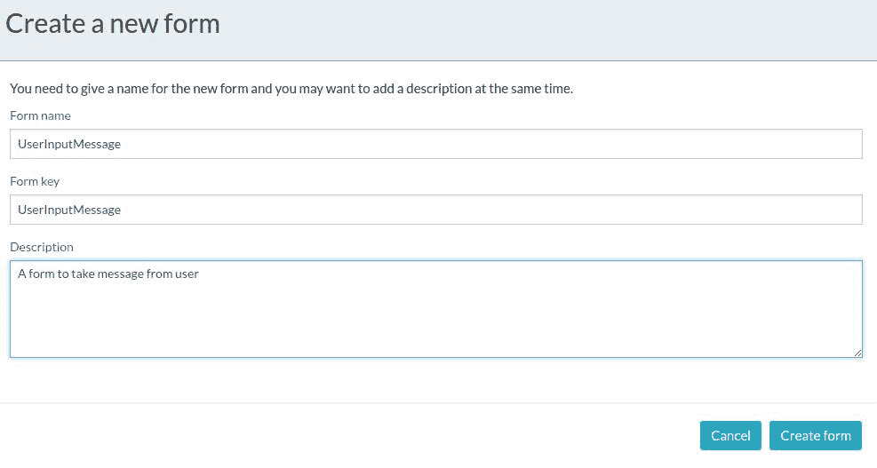

# activity kickstarter app 和 activity rest webapp

> 原文：<https://web.archive.org/web/20220930061024/https://www.baeldung.com/activiti-kickstart-and-rest-apps>

## 1。概述

在我们之前的文章中(基于 Activiti API 和 [Java](/web/20220626211128/https://www.baeldung.com/java-activiti) 和[Spring】](/web/20220626211128/https://www.baeldung.com/spring-activiti)，我们看到了如何以编程方式管理流程。如果我们想设置一个演示，以及 Activiti 的 UI，我们有两个 webapps 可以让我们在几分钟内完成。

**`activiti-app`提供一个用户界面，用户可以通过该界面执行任何与身份管理和任务管理相关的操作**，创建用户和组。

类似的， **`activiti-rest`是一个 webapp，提供了对流程、任务、流程**等执行任何操作的 REST API。

在本文中，我们将研究如何使用这些 webapps，以及它们提供了哪些功能。

## 2。下载量

我们可以从 [Activiti 网站](https://web.archive.org/web/20220626211128/https://www.activiti.org/download-links)本身下载两个 webapps 的`war`文件。

对于 v6.0.0，我们只需下载`activiti-6.0.0.zip`，将其解压，`war`文件可以在`activiti-6.0.0/wars`目录下找到。

## 3。Activiti Kickstart 应用

我们需要一个有效的 Java 运行时和一个 Apache Tomcat 安装来部署这个应用。任何 web 容器都可以工作，但是 Activiti 主要是在 Tomcat 上测试的。

现在，我们只需要在 Tomcat 上部署 war 并使用`http://localhost:8080/activiti-app`访问它。

主页应该是这样的:

[](/web/20220626211128/https://www.baeldung.com/wp-content/uploads/2017/10/activiti.png)

### 3.1。数据库

默认情况下，它使用 H2 内存数据库。如果我们想要更改 DB 配置，我们可以检查出[代码](https://web.archive.org/web/20220626211128/https://github.com/Activiti/Activiti/tree/6.x)并修改 [activiti-app.properties](https://web.archive.org/web/20220626211128/https://github.com/Alfresco/activiti-custom-reports/blob/master/src/test/resources/activiti-app.properties) 文件。

完成这些之后，我们需要重新生成 war 文件，这可以通过运行 [start.sh](https://web.archive.org/web/20220626211128/https://github.com/Activiti/Activiti/blob/6.x/modules/activiti-ui/start.sh) 脚本来完成。这将构建`activiti-app`以及所需的依赖项。

### 3.2。Kickstart 应用程序

当我们点击 Kickstart 应用程序时，我们会看到使用`Process.`的选项，我们可以在这里创建/导入流程并运行它们。

让我们创建一个只有一个`User Task`的小流程，它接收来自用户的消息。进入 Kickstart 应用程序后，要创建流程，请选择`Processes`选项卡，然后点击`Create Process`:

[](/web/20220626211128/https://www.baeldung.com/wp-content/uploads/2017/10/activiti-app-createnewmodel.png)

流程编辑器将打开，我们可以在其中拖放开始事件、各种类型的任务和结束事件的各种符号，以定义一个`Process.`

当我们向流程添加一个`User Task`时，我们需要将它分配给某个人。我们可以通过从该任务的选项中点击 assignments 并选择一个`Assignee.`来完成

为简单起见，让我们将任务分配给流程发起人:

[](/web/20220626211128/https://www.baeldung.com/wp-content/uploads/2017/10/activiti-app-assign-task.png)

我们还希望这个`User Task`从用户那里获得输入消息。为了实现这一点，我们需要将一个`Form,`与一个文本字段和这个任务相关联。

选择`User Task`并选择`Referenced Form`。目前，没有与该任务相关联的`Form`，因此单击`New Form`，并添加所需的详细信息:

[](/web/20220626211128/https://www.baeldung.com/wp-content/uploads/2017/10/activiti-create-form.jpg)

在这之后，它将把我们带到`Forms`部分，在那里我们可以拖放表单中我们想要的各种字段，并为它们设置标签:

[](/web/20220626211128/https://www.baeldung.com/wp-content/uploads/2017/10/activiti-create-form-2.jpg)

请注意，我们已经勾选了`Required,`，这意味着不进入`Message.`就无法完成`User`任务

完成后，我们将保存并转到`Apps`选项卡。为了能够运行我们创建的流程，我们需要创建一个流程应用程序。

在流程 App 中，我们可以添加一个或多个`Process Definitions`。这样做之后，我们需要发布这个应用程序，以便其他用户可以使用`Processes`:

[](/web/20220626211128/https://www.baeldung.com/wp-content/uploads/2017/10/activiti-app-publish-app.png)

### 3.3。任务应用

在任务 App 中，有两个标签页:`Tasks`——当前正在运行的任务，和`Processes`——当前正在运行的`Processes.`

一旦我们点击`Processes`选项卡中的`Start Process`,就会得到我们可以运行的可用流程列表。从这个列表中，我们将选择我们的流程并点击`start`按钮:

[](/web/20220626211128/https://www.baeldung.com/wp-content/uploads/2017/10/activiti-app-start-process.png)

我们的流程只包含一个任务，它是一个`User Task`。因此，该流程正在等待用户完成此任务。当我们单击流程正在等待的任务时，我们可以看到我们创建的表单:

[](/web/20220626211128/https://www.baeldung.com/wp-content/uploads/2017/10/activiti-give-user-input.jpg)

如果我们点击`Show Diagram`，不仅会显示`Process`图，还会突出显示已完成的任务和未完成的任务。在我们的案例中,`User Task`仍然悬而未决，这是突出显示的:

[](/web/20220626211128/https://www.baeldung.com/wp-content/uploads/2017/10/activiti-app-process-diagram.png)

要完成这项任务，我们可以点击`Complete`按钮到`n.`按钮。如前所述，我们需要输入`Message,`，因为我们已经将它设为必填项。于是，进入`Message,`后我们就可以`Complete`执行任务了。

### 3.4。身份管理应用

除了管理流程，我们还有一个身份管理应用，允许我们添加用户和组。我们还可以为用户定义角色。

## 4。活动休息

**Activiti 为 Activiti 引擎**提供了一个 REST API，可以通过将`activiti-rest.war`文件部署到像 Apache Tomcat 这样的 servlet 容器来安装。

默认情况下，Activiti 引擎将连接到内存中的 H2 数据库。就像我们在`activiti-app`中看到的一样，这里我们可以更改`WEB-INF/classes`文件夹中的`db.properties`文件中的数据库设置，并重新创建 war 文件。

随着应用程序的启动和运行，我们可以对所有请求使用这个基本 URL:

```
http://localhost:8080/activiti-rest/service/
```

默认情况下，所有 REST 资源都需要一个有效的 Activiti 用户进行身份验证。每个 REST 调用都应该使用基本的 HTTP 访问认证。

### 4.1。创建和运行流程

要创建流程，首先，我们需要流程的 BPMN 文件。我们既可以像我们之前的文章中描述的那样基于 Java 的 [Activiti 创建文件，也可以从 Kickstart 应用的 Process 部分下载。](/web/20220626211128/https://www.baeldung.com/java-activiti)

我们需要发出一个 POST 请求，以及`contentType: multipart/form-data`，在这里我们将为我们的新流程上传 BPMN 文件:

```
POST repository/deployments
```

当我们通过为我们创建的进程传递 BPMN 文件来进行这个调用时，它将给出以下输出:

```
{    
    "id": "40",
    "name": "user_msg.bpmn20.xml",
    "deploymentTime": "2017-10-04T17:28:07.963+05:30",
    "category": null,
    "url": "http://localhost:8080/activiti-rest/service/repository/deployments/40",
    "tenantId": ""
}
```

现在，如果我们得到所有的过程定义，我们可以看到我们的过程定义被列出:

```
GET repository/process-definitions
```

接下来，我们可以使用我们在 BPMN 文件中提到的`processKey`来运行这个过程:

```
POST /runtime/process-instances 
```

使用此请求主体:

```
{
    "processDefinitionKey":"user_msg"
} 
```

回应将是:

```
{
    "id": "44",
    "url": "http://localhost:8080/activiti-rest/service/runtime/process-instances/44",
    "businessKey": null,
    "suspended": false,
    "ended": false,
    "processDefinitionId": "user_msg:1:43",
    "processDefinitionUrl": "http://localhost:8080/activiti-rest/service/repository/process-definitions/user_msg:1:43",
    "processDefinitionKey": "user_msg",
    //other details...
} 
```

我们可以使用先前响应返回的流程实例的`id`来查看我们正在运行的流程图:

```
GET runtime/process-instances/44/diagram 
```

如前所述，流程正在等待用户任务完成，因此它在图中被突出显示:

[](/web/20220626211128/https://www.baeldung.com/wp-content/uploads/2017/10/activiti-rest-diagram.png)

### 4.2。完成任务

现在让我们来看看我们的未决任务，使用:

```
GET runtime/tasks 
```

响应将有一个未完成任务的列表。目前，只有一个任务——我们的`User Task`:

```
{
    "data": [
        {
            "id": "49",
            "url": "http://localhost:8080/activiti-rest/service/runtime/tasks/49",
            "owner": null,
            "assignee": "$INITIATOR",
            "delegationState": null,
            "name": "User Input Message",
            "description": "User Task to take user input",
            "createTime": "2017-10-04T17:33:07.205+05:30",
            "dueDate": null,
            // other details...
        }
} 
```

最后，让我们使用任务`id 49`来完成这个任务:

```
POST runtime/tasks/49 
```

这是一个 POST 请求，我们需要发送`action`字段来指示我们想要对该任务做什么。我们可以“解决”、“完成”或“删除”任务。此外，我们可以传递任务完成所需的变量数组。

在我们的例子中，我们必须传递一个“message”字段，它是 out User Message 文本字段。所以我们的请求体是:

```
{
    "action": "complete",
     "variables": [{
         "name": "message",
         "value": "This is a User Input Message"
     }]
} 
```

## 5.结论

在本文中，我们讨论了如何使用 Activiti Kickstart 应用程序和提供的 REST API。

关于`activiti-rest`的更多信息可以在[用户指南](https://web.archive.org/web/20220626211128/https://www.activiti.org/userguide/#_rest_api)中找到，关于`activiti-app`的详细信息可以在 Alfresco 的[文档中找到。](https://web.archive.org/web/20220626211128/https://docs.alfresco.com/activiti/docs/user-guide/1.5.0/#_using_kickstart_app)