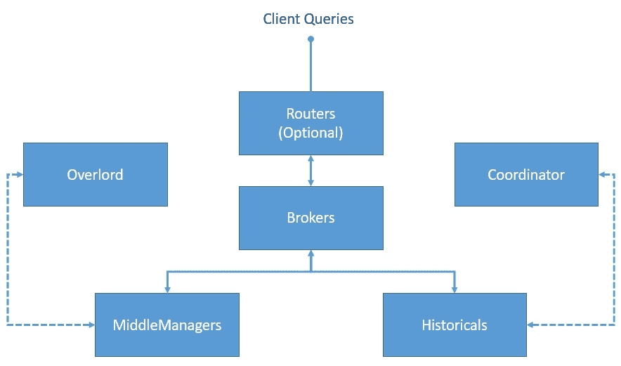
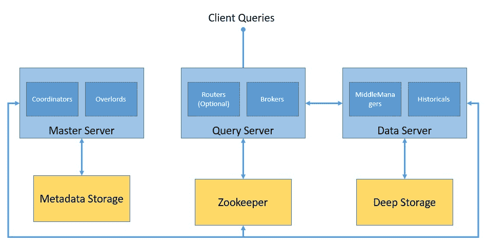

# 使用 Apache Druid 的事件驱动数据

> 原文：<https://web.archive.org/web/20220930061024/https://www.baeldung.com/apache-druid-event-driven-data>

## 1.介绍

在本教程中，我们将了解如何处理事件数据和 [Apache Druid](https://web.archive.org/web/20220921074633/https://druid.apache.org/) 。我们将介绍事件数据和德鲁伊架构的基础知识。作为其中的一部分，我们将利用 Druid 的各种特性创建一个简单的数据管道，涵盖各种数据接收模式和查询准备好的数据的不同方式。

## 2.基本概念

在深入探讨 Apache Druid 的操作细节之前，我们先来过一遍一些基本概念。我们感兴趣的领域是大规模事件数据的实时分析。

因此，必须理解我们所说的事件数据的含义，以及在大规模实时分析它们需要什么。

### 2.1.什么是事件数据？

事件数据是指**在特定时间点**发生变化的信息。事件数据在当今的应用程序中几乎无处不在。从传统的应用程序日志到现代由事物生成的传感器数据，它几乎无处不在。这些通常以大规模生成的机器可读信息为特征。

它们支持多种功能，例如预测、自动化、通信和集成等。此外，它们在事件驱动架构中也很重要。

### 2.2.什么是阿帕奇德鲁伊？

Apache Druid 是一个实时分析数据库，旨在对面向事件的数据进行快速分析。Druid 始于 2011 年，2012 年在 GPL 许可下开源，2015 年迁移到 Apache 许可。它由 Apache 基金会管理，社区成员来自几个组织。它提供实时接收、快速查询性能和高可用性。

Druid 这个名字指的是这样一个事实，即它的架构可以转变为解决不同类型的数据问题。它通常用于商业智能应用程序，以分析大量的实时和历史数据。

## 3.德鲁伊建筑

Druid 是用 Java 编写的面向列的分布式数据源。它能够接收大量的事件数据，并在这些数据的基础上提供低延迟查询。此外，它还提供了任意分割数据的可能性。

理解 Druid 架构如何支持这些特性是相当有趣的。在这一节中，我们将介绍德鲁伊建筑的一些重要部分。

### 3.1.数据存储设计

理解 Druid 如何构造和存储数据很重要，这样可以进行分区和分发。默认情况下，Druid **在处理过程中对数据进行分区，并将它们存储成块**和段:

[](/web/20220921074633/https://www.baeldung.com/wp-content/uploads/2020/06/Druid-Data-Storage.jpg)

Druid **将数据存储在我们所知的“data source”**中，这在逻辑上类似于关系数据库中的表。一个 Druid 集群可以并行处理来自不同来源的多个数据源。

每个数据源都是分区的——默认情况下基于时间，如果配置了其他属性，还会进一步基于其他属性。一个**时间范围的数据称为一个“块”** —例如，如果数据是按小时划分的，则是一个小时的数据。

每个**块被进一步划分成一个或多个“段”**，这些段是由许多行数据组成的单个文件。一个数据源可能有几个段到几百万个段。

### 3.2.德鲁伊进程

德鲁伊有多进程和分布式架构。因此，每个流程都可以独立扩展，从而允许我们创建灵活的集群。让我们了解一下作为德鲁伊一部分的重要流程:

[](/web/20220921074633/https://www.baeldung.com/wp-content/uploads/2020/06/Druid-Processes.jpg)

*   **协调器**:该流程主要负责段的管理和分配，并与历史流程进行通信，根据配置加载或删除段
*   **霸王**:这是负责接受任务、协调任务分配、围绕任务创建锁、向调用者返回状态的主进程
*   **Broker** :这是将所有查询发送到分布式集群中执行的过程；它从 Zookeeper 收集元数据，并将查询路由到具有正确段的进程
*   **Router** :这是一个可选的进程，可以用来将查询路由到不同的代理进程，从而为更重要数据的查询提供查询隔离
*   **历史**:这些是存储可查询数据的进程；它们与 Zookeeper 保持持续的连接，并监视它们必须加载和提供的段信息
*   **MiddleManager** :这些是执行提交任务的工作进程；它们将任务转发给在单独的 JVM 中运行的 Peons，从而提供资源和日志隔离

### 3.3.外部依赖性

除了核心进程之外，Druid **还依赖于几个外部依赖项来使其集群按照预期**运行。

让我们看看 Druid 集群是如何与核心流程和外部依赖项一起形成的:

[](/web/20220921074633/https://www.baeldung.com/wp-content/uploads/2020/06/Druid-Cluster.jpg)

Druid 使用**深度存储来存储已经被**吸收到系统中的任何数据。它们不用于响应查询，而是用作数据备份和在进程间传输数据。这些可以是任何东西，从本地文件系统到分布式对象存储，如 S3 和 HDFS。

**元数据存储用于保存共享的系统元数据**，如段使用信息和任务信息。然而，它从来没有被用来存储实际的数据。它是一个类似 Apache Derby、PostgreSQL 或 MySQL 的关系数据库。

德鲁伊使用 Apache **Zookeeper 来管理当前集群状态**。它促进了 Druid 集群中的许多操作，如协调者/霸主领袖选举、段发布协议和段加载/丢弃协议。

## 4.德鲁伊设置

Druid 被设计成可伸缩的、容错的集群。然而，**建立一个生产级的德鲁伊集群可不是小事**。正如我们前面看到的，有许多流程和外部依赖项需要设置和配置。因为可以以灵活的方式创建集群，所以我们必须注意我们的需求，以适当地设置各个进程。

此外，Druid **只在类 Unix 环境中受支持，在 Windows** 上不受支持。此外，运行 Druid 流程需要 Java 8 或更高版本。有几种单服务器配置可用于在单台机器上设置 Druid 来运行教程和示例。但是，对于运行生产工作负载，建议使用多台机器建立一个成熟的 Druid 集群。

出于本教程的目的，我们将在 Docker Hub 上发布的[官方 Docker 镜像的帮助下**在一台机器上设置 Druid。这也使我们能够在 Windows 上运行 Druid，正如我们前面所讨论的，这在其他方面不受支持。有一个**](https://web.archive.org/web/20220921074633/https://hub.docker.com/r/apache/druid) **[Docker 合成文件](https://web.archive.org/web/20220921074633/https://github.com/apache/druid/blob/master/distribution/docker/docker-compose.yml)可用，它为每个 Druid 进程及其外部依赖项创建一个容器。**

我们必须**将配置值作为环境变量**提供给德鲁伊。实现这一点最简单的方法是在 Docker compose 文件所在的目录中为[提供一个名为“环境”](https://web.archive.org/web/20220921074633/https://github.com/apache/druid/blob/master/distribution/docker/environment)的文件。

一旦我们准备好 Docker compose 和环境文件，启动 Druid 就像在同一个目录中运行一个命令一样简单:

```java
docker-compose up
```

这将显示单机 Druid 设置所需的所有容器。我们必须小心为 Docker 机器提供足够的内存，因为 Druid 会消耗大量的资源。

## 5.摄取数据

使用 Druid 构建数据管道的第一步是将数据加载到 Druid 中。这个**过程在 Druid 架构**中被称为数据摄取或索引。我们必须找到一个合适的数据集来继续本教程。

现在，正如我们到目前为止所收集的，我们必须**挑选事件数据并具有一些时间性质**，以充分利用 Druid 基础设施。

德鲁伊官方指南使用简单优雅的[数据，包含特定日期](https://web.archive.org/web/20220921074633/https://github.com/apache/druid/blob/master/examples/quickstart/tutorial/wikiticker-2015-09-12-sampled.json.gz)的维基百科页面编辑。在我们的教程中，我们将继续使用它。

### 5.1.数据模型

让我们从检查我们拥有的数据的结构开始。我们创建的大多数数据管道对数据异常非常敏感，因此，有必要尽可能地清理数据。

虽然有复杂的方法和工具来执行数据分析，但我们将从目视检查开始。快速分析显示**输入数据包含以 JSON 格式捕获的事件，单个事件包含典型属性**:

```java
{
  "time": "2015-09-12T02:10:26.679Z",
  "channel": "#pt.wikipedia",
  "cityName": null,
  "comment": "Houveram problemas na última edição e tive de refazê-las, junto com as atualizações da página.",
  "countryIsoCode": "BR",
  "countryName": "Brazil",
  "isAnonymous": true,
  "isMinor": false,
  "isNew": false,
  "isRobot": false,
  "isUnpatrolled": true,
  "metroCode": null,
  "namespace": "Main",
  "page": "Catarina Muniz",
  "regionIsoCode": null,
  "regionName": null,
  "user": "181.213.37.148",
  "delta": 197,
  "added": 197,
  "deleted": 0
}
```

虽然有相当多的属性定义了这个事件，但是有几个是我们在使用德鲁伊时特别感兴趣的:

*   时间戳
*   规模
*   韵律学

Druid 需要**一个特定的属性来标识时间戳列**。在大多数情况下，Druid 的数据解析器能够自动检测最佳候选对象。但是我们总是有选择的余地，尤其是当我们的数据中没有合适的属性时。

**维度是德鲁伊原样存储的属性**。我们可以将它们用于任何目的，比如分组、过滤或应用聚合器。我们可以选择摄取规范中的维度，这将在教程中进一步讨论。

**与维度不同，指标是默认情况下以聚合形式存储的属性**。我们可以为德鲁伊选择一个聚合函数，在摄取期间应用于这些属性。与启用的上滚一起，这些可以产生紧凑的数据表示。

### 5.2.摄入方法

现在，我们将讨论在 Druid 中执行数据摄取的各种方法。通常，事件驱动的数据在本质上是流式的，这意味着它们会随着时间的推移以不同的速度生成，就像维基百科的编辑一样。

然而，我们可能会在一段时间内分批检查数据，其中数据在本质上更加静态，就像去年发生的所有维基百科编辑一样。

我们可能还需要解决不同的数据用例，Druid 对其中的大多数都有很好的支持。让我们回顾一下在数据管道中使用 Druid 的两种最常见的方式:

*   流式摄取
*   分批摄入

在德鲁伊中最常见的获取数据的方式是通过 Apache 流媒体服务，德鲁伊可以直接从 Kafka 读取数据。德鲁伊也支持其他平台，比如 Kinesis。我们必须在过载过程上启动监控器，它创建并管理 Kafka 索引任务。我们可以通过在重载流程的 HTTP POST 命令上提交一个 supervisor spec 作为 JSON 文件来启动 supervisor。

或者，我们可以**批量接收数据——例如，从本地或远程文件**。它为基于 Hadoop 的批处理接收提供了一种选择，以 Hadoop 文件格式从 Hadoop 文件系统接收数据。更常见的是，我们可以顺序或并行选择本机批处理摄取。这是一种更方便、更简单的方法，因为它没有任何外部依赖性。

### 5.3.定义任务规范

对于本教程，我们将**为我们拥有的输入数据**设置一个本地批处理摄取任务。我们可以选择从 Druid 控制台配置任务，这为我们提供了一个直观的图形界面。或者，我们**可以将任务规范定义为 JSON 文件，并使用脚本或命令行将其提交给霸王进程**。

让我们首先定义一个简单的任务规范，将我们的数据接收到一个名为`wikipedia-index.json`的文件中:

```java
{
  "type" : "index_parallel",
  "spec" : {
    "dataSchema" : {
      "dataSource" : "wikipedia",
      "dimensionsSpec" : {
        "dimensions" : [
          "channel",
          "cityName",
          "comment",
          "countryIsoCode",
          "countryName",
          "isAnonymous",
          "isMinor",
          "isNew",
          "isRobot",
          "isUnpatrolled",
          "metroCode",
          "namespace",
          "page",
          "regionIsoCode",
          "regionName",
          "user",
          { "name": "added", "type": "long" },
          { "name": "deleted", "type": "long" },
          { "name": "delta", "type": "long" }
        ]
      },
      "timestampSpec": {
        "column": "time",
        "format": "iso"
      },
      "metricsSpec" : [],
      "granularitySpec" : {
        "type" : "uniform",
        "segmentGranularity" : "day",
        "queryGranularity" : "none",
        "intervals" : ["2015-09-12/2015-09-13"],
        "rollup" : false
      }
    },
    "ioConfig" : {
      "type" : "index_parallel",
      "inputSource" : {
        "type" : "local",
        "baseDir" : "quickstart/tutorial/",
        "filter" : "wikiticker-2015-09-12-sampled.json.gz"
      },
      "inputFormat" : {
        "type": "json"
      },
      "appendToExisting" : false
    },
    "tuningConfig" : {
      "type" : "index_parallel",
      "maxRowsPerSegment" : 5000000,
      "maxRowsInMemory" : 25000
    }
  }
}
```

让我们根据前面小节中介绍的基础知识来理解这个任务规范:

*   我们选择了`index_parallel`任务，它为我们提供了并行的本地批处理摄取
*   我们将在这个任务中使用的数据源名为“w `ikipedia”`
*   我们数据的时间戳来自属性“时间”
*   我们添加了许多数据属性作为维度
*   在当前任务中，我们没有对数据使用任何指标
*   对于此任务，应该禁用默认情况下启用的汇总
*   任务的输入源是一个名为`wikiticker-2015-09-12-sampled.json.gz`的本地文件
*   我们没有使用任何二级分区，这可以在`tuningConfig`中定义

这个任务规范**假设我们已经下载了数据文件** `wikiticker-2015-09-12-sampled.json.gz`并把它保存在运行 Druid 的本地机器上。当我们将 Druid 作为 Docker 容器运行时，这可能会更棘手。幸运的是，德鲁伊**在默认情况下在位置`quickstart/tutorial`带有这个样本数据**。

### 5.4.提交任务规范

最后，我们可以使用类似于`curl`的工具通过命令行将这个任务规范提交给霸王流程:

```java
curl -X 'POST' -H 'Content-Type:application/json' -d @wikipedia-index.json http://localhost:8081/druid/indexer/v1/task
```

正常情况下，**如果提交成功，上述命令返回任务**的 ID。我们可以通过 Druid 控制台或者通过执行查询来验证我们的摄取任务的状态，这将在下一节中介绍。

### 5.5.高级摄入概念

当我们需要处理大规模的数据时——当然不是我们在本教程中看到的那种数据 Druid 是最适合的。现在，为了实现大规模的特性，Druid 架构必须提供合适的工具和技巧。

虽然我们不会在本教程中使用它们，但让我们快速讨论一下汇总和分区。

事件数据的大小很快会增长到海量，这会影响我们可以实现的查询性能。在许多情况下，我们可能**有可能总结一段时间内的数据**。这就是我们在德鲁伊中所说的上卷。当 roll up 被启用时，Druid 在摄取期间努力**卷起具有相同维度和时间戳的行**。虽然它可以节省空间，但 roll-up 确实会导致查询精度的损失，因此，我们必须合理地使用它。

面对不断增长的数据量，实现更好性能的另一个潜在方法是分配数据，从而分配工作负载。默认情况下，Druid **根据时间戳将数据划分为包含一个或多个片段的时间块**。此外，我们可以决定使用自然维度进行二次分区，以提高数据局部性。此外，Druid 首先根据时间戳，然后根据我们配置的其他维度对每个段中的数据进行排序。

## 6.查询数据

一旦我们成功地执行了数据接收，就应该可以进行查询了。在 Druid 中有多种方法可以查询数据。在 Druid 中执行查询的最简单方式是通过 Druid 控制台。然而，我们也可以通过发送 HTTP 命令或使用命令行工具来执行查询。

在 Druid 中构造查询的两种主要方式是原生查询和类似 SQL 的查询。我们将通过这两种方式用**构建一些基本的查询，并使用`curl`通过 HTTP** 发送它们。让我们看看如何对我们之前在 Druid 中获取的数据创建一些简单的查询。

### 6.1.本地查询

Druid **中的本地查询使用 JSON 对象，我们可以将这些对象发送给代理或路由器进行处理**。我们可以通过 HTTP POST 命令发送查询，还有其他方法，来做同样的事情。

让我们创建一个名为`simple_query_native.json`的 JSON 文件:

```java
{
  "queryType" : "topN",
  "dataSource" : "wikipedia",
  "intervals" : ["2015-09-12/2015-09-13"],
  "granularity" : "all",
  "dimension" : "page",
  "metric" : "count",
  "threshold" : 10,
  "aggregations" : [
    {
      "type" : "count",
      "name" : "count"
    }
  ]
}
```

这是一个简单的查询，获取 2019 年 9 月 12 日至 13 日期间收到页面编辑数量最多的前十个页面。

让我们使用`curl`通过 HTTP 发布这个消息:

```java
curl -X 'POST' -H 'Content-Type:application/json' -d @simple_query_native.json http://localhost:8888/druid/v2?pretty
```

该响应包含 JSON 格式的前十个页面的详细信息:

```java
[ {
  "timestamp" : "2015-09-12T00:46:58.771Z",
  "result" : [ {
    "count" : 33,
    "page" : "Wikipedia:Vandalismusmeldung"
  }, {
    "count" : 28,
    "page" : "User:Cyde/List of candidates for speedy deletion/Subpage"
  }, {
    "count" : 27,
    "page" : "Jeremy Corbyn"
  }, {
    "count" : 21,
    "page" : "Wikipedia:Administrators' noticeboard/Incidents"
  }, {
    "count" : 20,
    "page" : "Flavia Pennetta"
  }, {
    "count" : 18,
    "page" : "Total Drama Presents: The Ridonculous Race"
  }, {
    "count" : 18,
    "page" : "User talk:Dudeperson176123"
  }, {
    "count" : 18,
    "page" : "Wikipédia:Le Bistro/12 septembre 2015"
  }, {
    "count" : 17,
    "page" : "Wikipedia:In the news/Candidates"
  }, {
    "count" : 17,
    "page" : "Wikipedia:Requests for page protection"
  } ]
} ]
```

### 6.2.德鲁伊 SQL

Druid 有一个**内置的 SQL 层，它为我们提供了在熟悉的类似 SQL 的结构中构造查询的自由**。它利用 Apache 方解石来解析和规划查询。但是，在将 SQL 查询发送到数据流程之前，Druid SQL 会在查询代理上将它们转换成本地查询。

让我们看看如何创建与之前相同的查询，但是使用 Druid SQL。和以前一样，我们将创建一个名为`simple_query_sql.json`的 JSON 文件:

```java
{
  "query":"SELECT page, COUNT(*) AS counts /
    FROM wikipedia WHERE \"__time\" /
    BETWEEN TIMESTAMP '2015-09-12 00:00:00' AND TIMESTAMP '2015-09-13 00:00:00' /
    GROUP BY page ORDER BY Edits DESC LIMIT 10"
}
```

请注意，为了便于阅读，查询被分成了多行，但它应该出现在一行中。同样，和以前一样，我们将通过 HTTP 发送这个查询，但是发送到不同的端点:

```java
curl -X 'POST' -H 'Content-Type:application/json' -d @simple_query_sql.json http://localhost:8888/druid/v2/sql
```

输出应该非常类似于我们之前使用原生查询所获得的结果。

### 6.3.查询类型

在前面的章节中，我们看到了一种类型的查询**，其中我们根据间隔**获取了指标“计数”的前十个结果。这只是 Druid 支持的查询类型之一，它被称为`TopN`查询。当然，我们可以通过使用过滤器和聚合让这个简单的`TopN`查询变得更有趣。但是这不在本教程的范围之内。然而，我们可能会对 Druid 中的其他几个查询感兴趣。

一些流行的包括 Timeseries 和 GroupBy。

`Timeseries`查询返回一个 JSON 对象数组，其中每个对象代表一个值，如时序查询中所述——例如，过去一个月维度的日平均值。

`GroupBy`查询返回一个 JSON 对象数组，其中每个对象代表一个分组，如 group-by 查询中所述。例如，我们可以查询按另一个维度分组的某个维度过去一个月的日平均值。

还有其他几种查询类型，包括`Scan`、`Search`、`TimeBoundary`、`SegmentMetadata`和`DatasourceMetadata`。

### 6.4.高级查询概念

Druid 提供了一些复杂的方法来创建复杂的查询，以创建有趣的数据应用程序。其中包括各种分割数据的方法，同时仍然能够提供令人难以置信的查询性能。

虽然对它们的详细讨论超出了本教程的范围，但是让我们来讨论一下**一些重要的特性，比如连接和查找、多租户和查询缓存**。

Druid 支持两种连接数据的方式。第一个是连接操作符，第二个是查询时查找。然而，为了获得更好的查询性能，建议避免查询时连接。

多租户指的是在同一 Druid 基础设施上支持多个租户，同时仍然为他们提供逻辑隔离的特性。在 Druid 中，可以通过每个租户单独的数据源或租户的数据分区来实现这一点。

最后，查询缓存是数据密集型应用程序性能的关键。Druid 支持段和查询结果级别的查询结果缓存。此外，高速缓存数据可以驻留在存储器或外部永久存储器中。

## 7.语言绑定

尽管 Druid 对在 JSON 中创建摄取规范和定义查询有很好的支持，但是在 JSON 中定义这些查询有时可能会很乏味，尤其是当查询变得复杂时。不幸的是，在这方面，Druid 没有提供任何特定语言的客户端库来帮助我们。但是**社区已经开发了相当多的语言绑定**。Java 也有这样一个客户端库。

我们将很快看到如何使用这个 Java 客户端库来构建我们之前使用的`TopN`查询。

让我们从在 Maven 中定义[所需的依赖关系开始:](https://web.archive.org/web/20220921074633/https://search.maven.org/artifact/in.zapr.druid/druidry/2.14/jar)

```java
<dependency>
    <groupId>in.zapr.druid</groupId>
    <artifactId>druidry</artifactId>
    <version>2.14</version>
</dependency>
```

在这之后，我们应该能够使用客户端库并创建我们的`TopN`查询:

```java
DateTime startTime = new DateTime(2015, 9, 12, 0, 0, 0, DateTimeZone.UTC);
DateTime endTime = new DateTime(2015, 9, 13, 0, 0, 0, DateTimeZone.UTC);
Interval interval = new Interval(startTime, endTime);
Granularity granularity = new SimpleGranularity(PredefinedGranularity.ALL);
DruidDimension dimension = new SimpleDimension("page");
TopNMetric metric = new SimpleMetric("count");
DruidTopNQuery query = DruidTopNQuery.builder()
  .dataSource("wikipedia")
  .dimension(dimension)
  .threshold(10)
  .topNMetric(metric)
  .granularity(granularity)
  .filter(filter)
  .aggregators(Arrays.asList(new LongSumAggregator("count", "count")))
  .intervals(Collections.singletonList(interval)).build();
```

在这之后，我们可以简单地生成所需的 JSON 结构，我们可以在 HTTP POST 调用中使用它:

```java
ObjectMapper mapper = new ObjectMapper();
String requiredJson = mapper.writeValueAsString(query);
```

## 8.结论

在本教程中，我们学习了事件数据和 Apache Druid 架构的基础知识。

此外，我们在本地机器上使用 Docker 容器建立了一个主 Druid 集群。然后，我们还经历了使用本地批处理任务在 Druid 中获取样本数据集的过程。之后，我们看到了在 Druid 中查询数据的不同方式。最后，我们通过 Java 客户端库来构建 Druid 查询。

我们只是触及了德鲁伊必须提供的特性的表面。Druid 可以帮助我们构建数据管道和创建数据应用程序，这有几种可能性。为了有效地利用 Druid 的能力，高级的摄取和查询特性显然是下一步要学习的内容。

此外，创建一个合适的 Druid 集群，根据需要扩展各个流程，应该是最大化收益的目标。