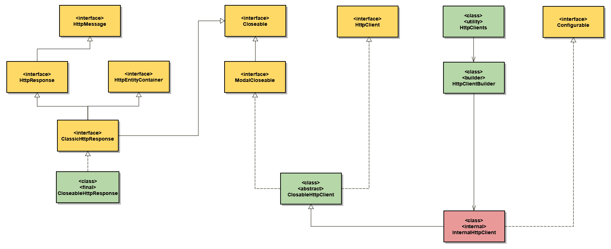

# Apache HttpClient 与 CloseableHttpClient

> 原文：<https://web.archive.org/web/20220930061024/https://www.baeldung.com/apache-httpclient-vs-closeablehttpclient>

## 1.概观

Apache HttpClient 是一个流行的 Java 库，它提供了高效且功能丰富的包，实现了最新 HTTP 标准的客户端。该库是为扩展而设计的**，同时为基本 HTTP 方法提供了强大的支持**。

在本教程中，我们将研究 Apache HttpClient API 设计。我们将解释`HttpClient`和`CloseableHttpClient`的区别。此外，我们将检查如何使用`HttpClients`或`HttpClientBuilder`创建`CloseableHttpClient`实例。

最后，我们将推荐在我们的定制代码中应该使用哪一个提到的 API。此外，我们将查看哪些 API 类实现了`Closeable` 接口，因此需要我们关闭它们的实例来释放资源。

## 2.API 设计

让我们先来看看 API 是如何设计的，重点是它的高级类和接口。在下面的类图中，我们将展示传统执行 HTTP 请求和处理 HTTP 响应所需的 API 的一部分:

[](/web/20220524060337/https://www.baeldung.com/wp-content/uploads/2022/04/apache_httpclient7.png)

此外，Apache HttpClient API 还支持[异步](/web/20220524060337/https://www.baeldung.com/httpasyncclient-tutorial) HTTP 请求/响应交换，以及使用 [RxJava](/web/20220524060337/https://www.baeldung.com/rx-java) 的反应式消息交换。

## 3.`HttpClient`对`CloseableHttpClient`

`HttpClient`是一个**高级接口，代表 HTTP 请求执行**的基本契约。它对请求执行过程没有任何限制。此外，它将状态管理、身份验证和重定向等细节留给了单个客户端实现。

我们可以将任何客户端实现转换成`HttpClient`接口。因此，我们可以使用它通过默认的客户端实现来执行基本的 HTTP 请求:

```java
HttpClient httpClient = HttpClients.createDefault();
HttpGet httpGet = new HttpGet(serviceUrl);
HttpResponse response = httpClient.execute(httpGet);
assertThat(response.getCode()).isEqualTo(HttpStatus.SC_OK);
```

然而，上面的代码将导致 [SonarQube](/web/20220524060337/https://www.baeldung.com/sonar-qube) 上的[拦截器问题](https://web.archive.org/web/20220524060337/https://rules.sonarsource.com/java/RSPEC-2095)。原因是默认的客户端实现返回了一个`Closeable` `HttpClient`的实例，需要关闭。

`CloseableHttpClient`是一个抽象类，表示`HttpClient`接口的**基本实现。然而，它也实现了`Closeable`接口。因此，我们应该在使用后关闭它的所有实例。我们可以通过使用 [`try-with-resources`](/web/20220524060337/https://www.baeldung.com/java-try-with-resources) 或者通过调用`finally`子句中的`close`方法来关闭它们:**

```java
try (CloseableHttpClient httpClient = HttpClients.createDefault()) {
    HttpGet httpGet = new HttpGet(serviceUrl);
    HttpResponse response = httpClient.execute(httpGet);
    assertThat(response.getCode()).isEqualTo(HttpStatus.SC_OK);
}
```

因此，在我们的自定义代码中，我们应该使用`CloseableHttpClient`类，而不是`HttpClient`接口`.`

## 4.`HttpClients`对`HttpClientBuilder`

在上面的例子中，我们使用了一个来自`HttpClients`类的静态方法来获得一个默认的客户端实现。`HttpClients`是一个**工具类，包含创建`CloseableHttpClient`实例**的工厂方法:

```java
CloseableHttpClient httpClient = HttpClients.createDefault();
```

我们可以使用`HttpClientBuilder`类实现同样的功能`. HttpClientBuilder`是[构建器设计模式](/web/20220524060337/https://www.baeldung.com/creational-design-patterns#builder)的**实现，用于创建`CloseableHttpClient`实例**:

```java
CloseableHttpClient httpClient = HttpClientBuilder.create().build();
```

在内部，`HttpClients`使用`HttpClientBuilder`来创建客户端实现实例。因此，我们应该更喜欢在自定义代码中使用`HttpClients`。鉴于它是一个更高级别的类，它的内部结构可能会随着新版本而改变。

## 5.资源管理

一旦`CloseableHttpClient`实例超出范围，我们需要关闭它们的原因是为了关闭相关的连接管理器。此外，我们还应该**使用`CloseableHttpResponse`来确保系统资源**的正确分配。

### 5.1.`Closeable` `HttpResponse`

`CloseableHttpResponse`是实现`ClassicHttpResponse`接口的类。然而，`ClassicHttpResponse`也扩展了`HttpResponse`、`HttpEntityContainer`和`Closeable`接口。

底层的 **HTTP 连接由响应对象持有，以允许响应内容直接从网络套接字**流出。因此，我们应该在自定义代码中使用`CloseableHttpResponse`类，而不是`HttpResponse`接口。一旦我们使用了响应，我们还需要确保调用`close`方法:

```java
try (CloseableHttpClient httpClient = HttpClientBuilder.create().build()) {
    HttpGet httpGet = new HttpGet(serviceUrl);
    try (CloseableHttpResponse response = httpClient.execute(httpGet)) {
        HttpEntity entity = response.getEntity();
        EntityUtils.consume(entity);
    }
}
```

我们应该注意，当响应内容没有被完全使用时，底层连接不能被安全地重用。在这种情况下，连接将被连接管理器关闭并丢弃。

### 5.2.重用客户端

关闭一个`CloseableHttpClient`实例并为每个请求创建一个新实例可能是一个开销很大的操作。相反，**我们可以重用一个`CloseableHttpClient`实例来发送多个请求**:

```java
try (CloseableHttpClient httpClient = HttpClientBuilder.create().build()) {
    HttpGet httpGetOne = new HttpGet(serviceOneUrl);
    try (CloseableHttpResponse responseOne = httpClient.execute(httpGetOne)) {
        HttpEntity entityOne = responseOne.getEntity();
        EntityUtils.consume(entityOne);
        assertThat(responseOne.getCode()).isEqualTo(HttpStatus.SC_OK);
    }

    HttpGet httpGetTwo = new HttpGet(serviceTwoUrl);
    try (CloseableHttpResponse responseTwo = httpClient.execute(httpGetTwo)) {
        HttpEntity entityTwo = responseTwo.getEntity();
        EntityUtils.consume(entityTwo);
        assertThat(responseTwo.getCode()).isEqualTo(HttpStatus.SC_OK);
    }
}
```

因此，我们避免了关闭内部关联的连接管理器并创建一个新的连接管理器。

## 6.结论

在本文中，**我们** **探索了 Apache HttpClient** 的经典 HTTP API，这是一个流行的 Java 客户端 HTTP 库。

我们学习了`HttpClient`和`CloseableHttpClient`的区别。此外，我们建议在自定义代码中使用`CloseableHttpClient`。接下来，我们看到了如何使用`HttpClients`或`HttpClientBuilder`创建`CloseableHttpClient`实例。

最后，我们看到`CloseableHttpClient`和`CloseableHttpResponse`类`,` 都实现了`Closeable`接口。我们看到，为了释放资源，应该关闭它们的实例。

和往常一样，完整的源代码可以在 GitHub 上找到[。](https://web.archive.org/web/20220524060337/https://github.com/eugenp/tutorials/tree/master/apache-httpclient-2)