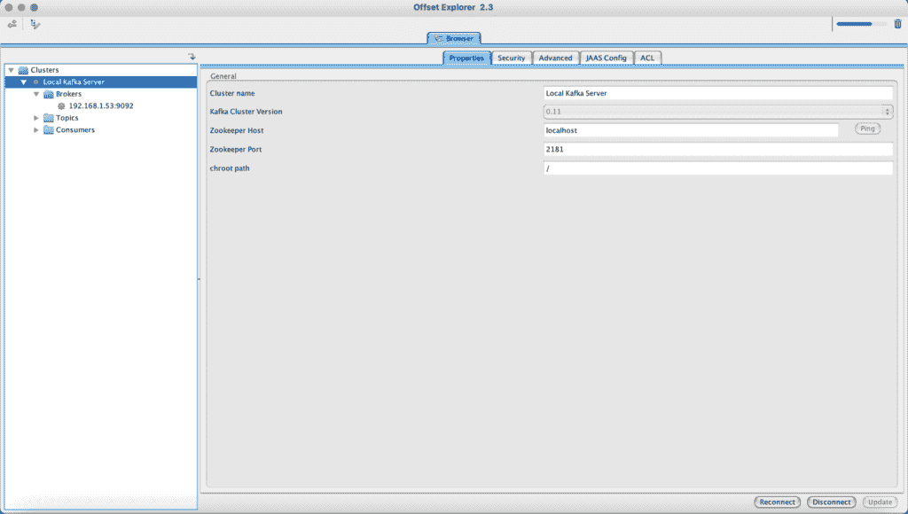

# 检查 Apache Kafka 服务器是否正在运行的指南

> 原文：<https://web.archive.org/web/20220930061024/https://www.baeldung.com/apache-kafka-check-server-is-running>

## 1.概观

使用 Apache Kafka 的客户端应用程序通常属于两个类别，即生产者和消费者。**生产者和消费者都要求底层 Kafka 服务器启动并运行，然后他们才能开始各自的生产和消费工作**。

在本文中，我们将学习一些策略来确定 Kafka 服务器是否正在运行。

## 2.使用 Zookeeper 命令

查明是否有活跃经纪人的最快方法之一是使用 Zookeeper 的`dump`命令。****`dump`命令是可用于管理 Zookeeper 服务器**的 [4LW](https://web.archive.org/web/20221008180708/https://zookeeper.apache.org/doc/r3.4.10/zookeeperAdmin.html#sc_zkCommands) 命令之一。**

 **让我们继续使用 [`nc`](/web/20221008180708/https://www.baeldung.com/linux/netcat-command) 命令，通过正在监听 2181 端口的 Zookeeper 服务器发送转储命令:

```
$ echo dump | nc localhost 2181 | grep -i broker | xargs
/brokers/ids/0
```

在执行该命令时，我们会看到一个向 Zookeeper 服务器注册的临时代理 id 列表。如果不存在临时 id，则没有代理节点在运行。

此外，需要注意的是，`dump`命令需要在通常位于`zookeeper.properties`或`zoo.cfg`配置文件中的配置中被明确允许:

```
lw.commands.whitelist=dump
```

或者，我们也可以使用 Zookeeper APIs 来查找活动代理的列表。

## 3.用阿帕奇卡夫卡的`AdminClient`

**如果我们的生产者或消费者是 Java 应用，那么我们可以使用 Apache Kafka 的 [`AdminClient`](https://web.archive.org/web/20221008180708/https://kafka.apache.org/28/javadoc/org/apache/kafka/clients/admin/Admin.html) 类来了解 Kafka 服务器是否启动**。

让我们定义`KafkaAdminClient`类来包装`AdminClient`类的实例，这样我们可以快速测试我们的代码:

```
public class KafkaAdminClient {
    private final AdminClient client;

    public KafkaAdminClient(String bootstrap) {
        Properties props = new Properties();
        props.put("bootstrap.servers", bootstrap);
        props.put("request.timeout.ms", 3000);
        props.put("connections.max.idle.ms", 5000);

        this.client = AdminClient.create(props);
    }
} 
```

接下来，让我们在`KafkaAdminClient`类中定义`verifyConnection()`方法，以验证客户端是否可以连接正在运行的代理服务器:

```
public boolean verifyConnection() throws ExecutionException, InterruptedException {
    Collection<Node> nodes = this.client.describeCluster()
      .nodes()
      .get();
    return nodes != null && nodes.size() > 0;
}
```

最后，让我们通过连接到一个正在运行的 Kafka 集群来测试我们的代码:

```
@Test
void givenKafkaIsRunning_whenCheckedForConnection_thenConnectionIsVerified() throws Exception {
    boolean alive = kafkaAdminClient.verifyConnection();
    assertThat(alive).isTrue();
}
```

## 4.使用`kcat`实用程序

我们可以使用 [`kcat`](https://web.archive.org/web/20221008180708/https://manpages.ubuntu.com/manpages/focal/man1/kafkacat.1.html) (以前的`kafkacat`)命令来查找是否有正在运行的 Kafka broker 节点。为此，让我们**使用`-L`选项来显示现有主题的元数据**:

```
$ kcat -b localhost:9092 -t demo-topic -L
Metadata for demo-topic (from broker -1: localhost:9092/bootstrap):
 1 brokers:
  broker 0 at 192.168.1.53:9092 (controller)
 1 topics:
  topic "demo-topic" with 1 partitions:
    partition 0, leader 0, replicas: 0, isrs: 0
```

接下来，让我们在代理节点关闭时执行相同的命令:

```
$ kcat -b localhost:9092 -t demo-topic -L -m 1
%3|1660579562.937|FAIL|rdkafka#producer-1| [thrd:localhost:9092/bootstrap]: localhost:9092/bootstrap: Connect to ipv4#127.0.0.1:9092 failed: Connection refused (after 1ms in state CONNECT)
% ERROR: Failed to acquire metadata: Local: Broker transport failure (Are the brokers reachable? Also try increasing the metadata timeout with -m <timeout>?)
```

对于这种情况，我们得到“连接被拒绝”错误，因为没有正在运行的代理节点。此外，我们必须注意，通过使用`-m`选项将请求超时限制为 1 秒，我们能够快速失败。

## 5.使用用户界面工具

对于不需要自动检查的实验性概念验证项目，我们可以依靠 UI 工具，如[偏移资源管理器](https://web.archive.org/web/20221008180708/https://www.kafkatool.com/)。但是，如果我们想要验证企业级 Kafka 客户端的代理节点的状态，不推荐使用这种方法。

让我们使用偏移资源管理器连接到 Kafka 集群，使用 Zookeeper 主机和端口细节: [](/web/20221008180708/https://www.baeldung.com/wp-content/uploads/2022/08/Offset-Explorer-Check-Connection.png)

我们可以在左侧窗格中看到正在运行的代理列表。就是这样。我们点击一下按钮就得到它。

## 6.结论

在本教程中，我们探索了一些使用 Zookeeper 命令、Apache 的`AdminClient`和`kcat`实用程序的命令行方法，然后是一个基于 UI 的方法来确定 Kafka 服务器是否启动。

和往常一样，该教程的完整源代码可以在 GitHub 上的[处获得。](https://web.archive.org/web/20221008180708/https://github.com/eugenp/tutorials/tree/master/apache-kafka-2)**