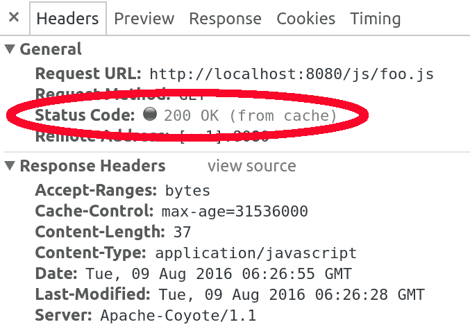

# 使用 Spring MVC 的可缓存静态资产

> 原文：<https://web.archive.org/web/20220930061024/https://www.baeldung.com/cachable-static-assets-with-spring-mvc>

## 1。概述

本文主要讨论在 Spring Boot 和 Spring MVC 中缓存静态资产(比如 Javascript 和 CSS 文件)的问题。

我们还将触及“完美缓存”的概念，本质上是确保当文件更新时，旧版本不会被错误地从缓存中提供。

## 2。缓存静态资产

为了使静态资产可缓存，我们需要配置其相应的资源处理程序。

这里有一个简单的例子来说明如何做到这一点——在对`max-age=31536000`的响应上设置`Cache-Control`头，这将导致浏览器使用文件的缓存版本一年:

```java
@EnableWebMvc
public class MvcConfig implements WebMvcConfigurer {
    @Override
    public void addResourceHandlers(ResourceHandlerRegistry registry) {
        registry.addResourceHandler("/js/**") 
                .addResourceLocations("/js/") 
                .setCacheControl(CacheControl.maxAge(365, TimeUnit.DAYS));
    }
}
```

我们有这么长的缓存有效期的原因是我们希望客户端使用文件的缓存版本，直到文件被更新，并且根据针对`Cache-Control`头的 [RFC，365 天是我们可以使用的最大值。](https://web.archive.org/web/20221012201738/https://www.ietf.org/rfc/rfc2616.txt)

**因此，当客户端第一次请求`foo.js`**时，他将通过网络接收整个文件(在本例中为 37 个字节),并带有状态代码`200 OK.` 。响应将具有以下标头以控制缓存行为:

```java
Cache-Control: max-age=31536000
```

作为以下响应的结果，这将指示浏览器缓存有效期为一年的文件:

[](/web/20221012201738/http://www.baeldung.com/wp-content/uploads/2016/08/cache.png)

**当客户端第二次请求同一个文件**时，浏览器不会再向服务器发出请求。相反，它将直接从缓存中提供文件，并避免网络往返，因此页面加载速度会快得多:

[](/web/20221012201738/http://www.baeldung.com/wp-content/uploads/2016/08/cache-highlighted.png)

Chrome 浏览器用户在测试时需要小心，因为如果你通过按屏幕上的刷新按钮或按 F5 键来刷新页面，Chrome 不会使用缓存。您需要在地址栏上按 enter 来观察缓存行为。更多信息请点击。

### 2.1.Spring Boot

为了在 Spring Boot 中定制`Cache-Control `头，我们可以使用`[spring.resources.cache.cachecontrol](https://web.archive.org/web/20221012201738/https://github.com/spring-projects/spring-boot/tree/main/spring-boot-project/spring-boot-autoconfigure/src/main/java/org/springframework/boot/autoconfigure/web) `属性名称空间下的属性。例如，要将`max-age `更改为一年，我们可以在`application.properties`中添加以下内容:

```java
spring.resources.cache.cachecontrol.max-age=365d
```

**这适用于[Spring Boot](https://web.archive.org/web/20221012201738/https://github.com/spring-projects/spring-boot/blob/master/spring-boot-project/spring-boot-autoconfigure/src/main/java/org/springframework/boot/autoconfigure/web/servlet/WebMvcAutoConfiguration.java#L307)**服务的所有静态资源。因此，如果我们只想对请求子集应用缓存策略，我们应该使用普通的 Spring MVC 方法。

除了`max-age, `之外，还可以定制其他 [`Cache-Control `参数](https://web.archive.org/web/20221012201738/https://developer.mozilla.org/en-US/docs/Web/HTTP/Headers/Cache-Control)，例如具有类似配置属性的`no-store or no-cache `。

## 3。版本化静态资产

使用缓存为静态资产提供服务使得页面加载非常快，但是有一个重要的警告。当您更新文件时，客户端将不会获得文件的最新版本，因为它不会检查服务器文件是否是最新的，而只是从浏览器缓存中提供文件。

下面是我们需要做的事情，以使浏览器仅在文件更新时从服务器获取文件:

*   在包含版本的 URL 下提供文件。例如，`foo.js`应在`/js/foo-46944c7e3a9bd20cc30fdc085cae46f2.js`下送达
*   用新的 URL 更新文件的链接
*   每当文件更新时，更新 URL 的版本部分。例如，当`foo.js`被更新时，它现在应该在`/js/foo-a3d8d7780349a12d739799e9aa7d2623.js.`下被提供

客户端会在文件更新时向服务器请求文件，因为页面会有一个指向不同 URL 的链接，所以浏览器不会使用它的缓存。如果一个文件没有更新，它的版本(因此它的 URL)不会改变，客户端将继续使用该文件的缓存。

通常情况下，我们需要手动完成所有这些，但是 Spring 支持开箱即用，包括计算每个文件的哈希并将它们附加到 URL。让我们看看如何配置我们的 Spring 应用程序来为我们完成所有这些工作。

### 3.1。在版本为的 URL 下提供服务

我们需要向路径添加一个`VersionResourceResolver` ,以便在它的 URL 中为其下的文件提供更新的版本字符串:

```java
@Override
public void addResourceHandlers(ResourceHandlerRegistry registry) {
    registry.addResourceHandler("/js/**")
            .addResourceLocations("/js/")
            .setCacheControl(CacheControl.maxAge(365, TimeUnit.DAYS))
            .resourceChain(false)
            .addResolver(new VersionResourceResolver().addContentVersionStrategy("/**"));
} 
```

这里我们使用内容版本策略。文件夹中的每个文件将在一个 URL 下提供，该 URL 具有根据其内容计算的版本。这叫做指纹识别。例如，`foo.js`现在将在 URL `/js/foo-46944c7e3a9bd20cc30fdc085cae46f2.js.`下提供

利用这种配置，当客户端发出对`http://localhost:8080/js/`46944c7e3a9bd20cc30fdc085cae46f2.js:`` 的请求时

```java
curl -i http://localhost:8080/js/foo-46944c7e3a9bd20cc30fdc085cae46f2.js
```

服务器将使用缓存控制头进行响应，告诉客户端浏览器将文件缓存一年:

```java
HTTP/1.1 200 OK
Server: Apache-Coyote/1.1
Last-Modified: Tue, 09 Aug 2016 06:43:26 GMT
Cache-Control: max-age=31536000
```

### 3.2.Spring Boot

为了在 Spring Boot 实现相同的基于内容的版本控制，我们只需在 [`spring.resources.chain.strategy.content`](https://web.archive.org/web/20221012201738/https://github.com/spring-projects/spring-boot/blob/bb568c5bffcf70169245d749f3642bfd9dd33143/spring-boot-project/spring-boot-autoconfigure/src/main/java/org/springframework/boot/autoconfigure/web/servlet/WebMvcAutoConfiguration.java#L532) 属性名称空间下使用一些配置。例如，我们可以通过添加以下配置来实现与之前相同的结果:

```java
spring.resources.chain.strategy.content.enabled=true
spring.resources.chain.strategy.content.paths=/**
```

与 Java 配置类似，这为所有与`/** `路径模式匹配的资产启用了基于内容的版本控制。

### 3.3。用新的 URL 更新链接

在我们将 version 插入 URL 之前，我们可以使用一个简单的`script`标签来导入`foo.js`:

```java
<script type="text/javascript" src="/js/foo.js">
```

既然我们在 URL 下提供了带有版本的相同文件，我们需要在页面上反映它:

```java
<script type="text/javascript" 
  src="<em>/js/foo-46944c7e3a9bd20cc30fdc085cae46f2.js</em>"> 
```

处理所有这些长路径变得很乏味。Spring 为这个问题提供了一个更好的解决方案。我们可以使用`ResourceUrlEncodingFilter`和 JSTL 的`url`标签来重写版本化链接的 URL。

`ResourceURLEncodingFilter`可以照常在`web.xml`下注册:

```java
<filter>
    <filter-name>resourceUrlEncodingFilter</filter-name>
    <filter-class>
        org.springframework.web.servlet.resource.ResourceUrlEncodingFilter
    </filter-class>
</filter>
<filter-mapping>
    <filter-name>resourceUrlEncodingFilter</filter-name>
    <url-pattern>/*</url-pattern>
</filter-mapping>
```

在我们可以使用`url`标签之前，需要将 JSTL 核心标签库导入到我们的 JSP 页面上:

```java
<%@ taglib uri="http://java.sun.com/jsp/jstl/core" prefix="c" %>
```

然后，我们可以使用`url`标签来导入`foo.js`,如下所示:

```java
<script type="text/javascript" src="<c:url value="/js/foo.js" />">
```

当这个 JSP 页面被呈现时，文件的 URL 被正确地重写以包含其中的版本:

```java
<script type="text/javascript" src="/js/foo-46944c7e3a9bd20cc30fdc085cae46f2.js">
```

### 3.4。更新 URL 的版本部分

每当文件被更新时，它的版本被再次计算，并且该文件在包含新版本的 URL 下被提供。我们不需要为此做任何额外的工作，`VersionResourceResolver`为我们处理这些。

## 4。修复 CSS 链接

CSS 文件可以通过使用`@import` 指令导入其他 CSS 文件。例如，`myCss.css`文件导入`another.css`文件:

```java
@import "another.css";
```

这通常会导致版本化静态资产的问题，因为浏览器会请求`another.css`文件，但是该文件是在版本化路径下提供的，例如`another-9556ab93ae179f87b178cfad96a6ab72.css.`

为了解决这个问题并向正确的路径发出请求，我们需要将`CssLinkResourceTransformer`引入资源处理程序配置:

```java
@Override
public void addResourceHandlers(ResourceHandlerRegistry registry) {
    registry.addResourceHandler("/resources/**")
            .addResourceLocations("/resources/", "classpath:/other-resources/")
            .setCacheControl(CacheControl.maxAge(365, TimeUnit.DAYS))
            .resourceChain(false)
            .addResolver(new VersionResourceResolver().addContentVersionStrategy("/**"))
            .addTransformer(new CssLinkResourceTransformer());
}
```

这将修改`myCss.css`的内容，并将导入语句替换为:

```java
@import "another-9556ab93ae179f87b178cfad96a6ab72.css";
```

## 5。结论

利用 HTTP 缓存对网站性能是一个巨大的提升，但是在使用缓存时避免提供陈旧的资源可能很麻烦。

在本文中，我们实现了一个很好的策略来使用 HTTP 缓存，同时使用 Spring MVC 服务静态资产，并在文件更新时破坏缓存。

你可以在 [GitHub](https://web.archive.org/web/20221012201738/https://github.com/eugenp/tutorials/tree/master/spring-static-resources) 上找到这篇文章的源代码。