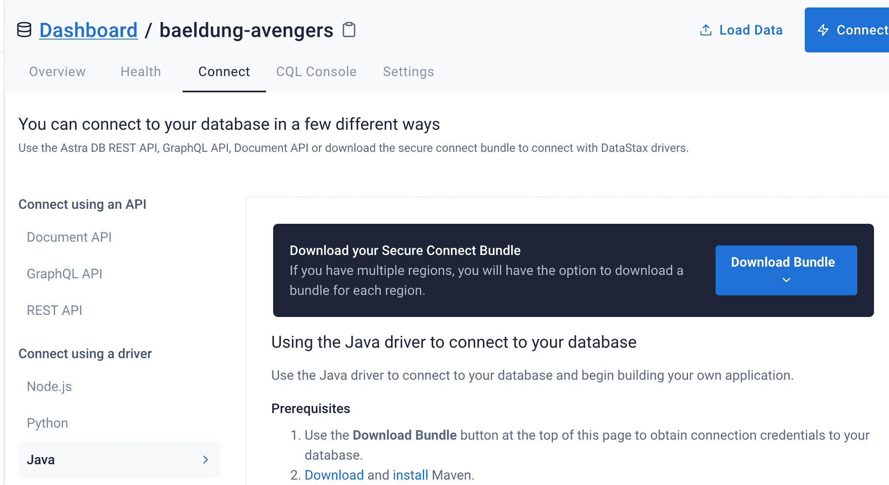
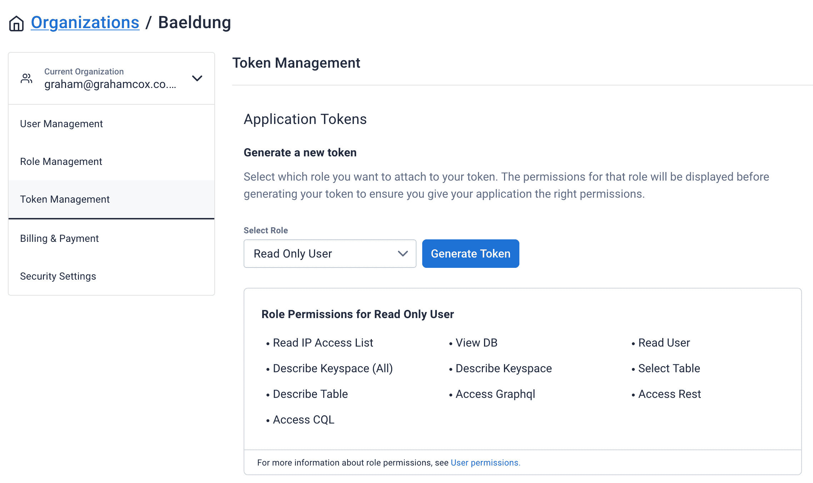
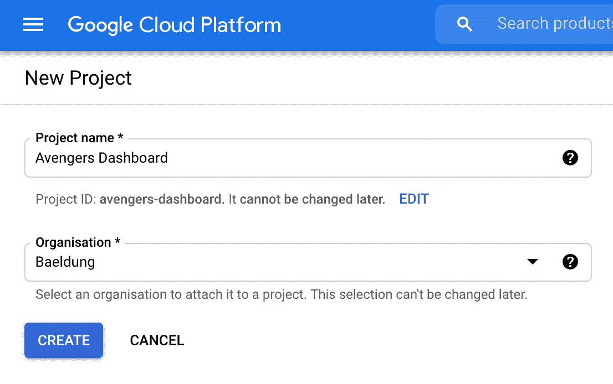
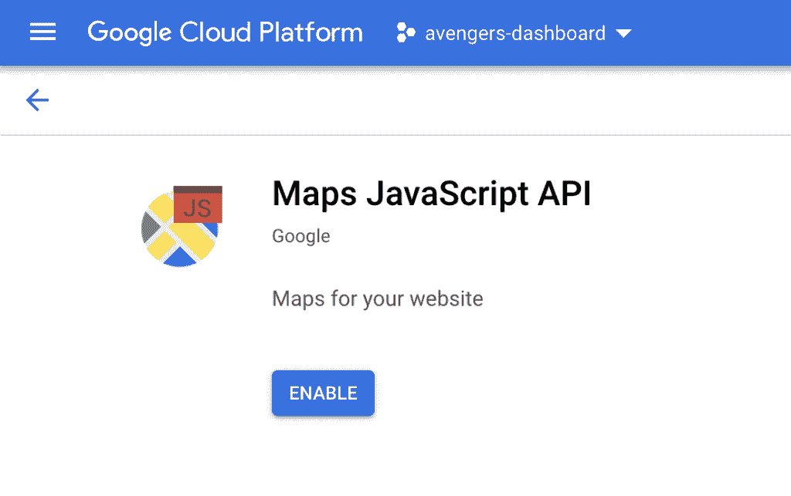
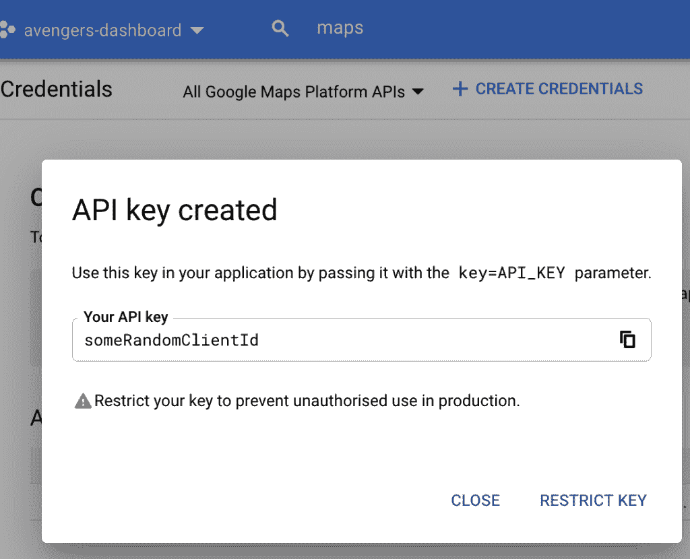

# 用卡珊德拉、阿斯特拉和 CQL 构建一个仪表板——映射事件数据

> 原文：<https://web.archive.org/web/20220930061024/https://www.baeldung.com/cassandra-astra-rest-dashboard-map>

## 1。简介

在我们的[上一篇文章](/web/20221127034840/https://www.baeldung.com/cassandra-astra-rest-dashboard-updates)中，我们研究了如何使用 [DataStax Astra](https://web.archive.org/web/20221127034840/https://dtsx.io/3s0pgsH) 来扩充我们的仪表板，以存储和显示复仇者联盟的单个事件，这是一个由 [Apache Cassandra](https://web.archive.org/web/20221127034840/https://cassandra.apache.org/) 提供支持的无服务器 DBaaS，使用 [Stargate](https://web.archive.org/web/20221127034840/https://stargate.io/?utm_medium=referral&utm_source=baeldung&utm_campaign=series-1-of-3&utm_content=avengers-dash-series-1) 来提供额外的 API 以与它一起工作。

在本文中，我们将以不同的方式使用完全相同的数据。我们将允许用户选择显示哪个复仇者，感兴趣的时间段，然后在交互式地图上显示这些事件。与前一篇文章不同，这将允许用户看到在地理和时间上相互交互的数据。

为了理解本文，我们假设您已经阅读了本系列的第[篇第](/web/20221127034840/https://www.baeldung.com/cassandra-astra-stargate-dashboard)篇和第[篇第](/web/20221127034840/https://www.baeldung.com/cassandra-astra-rest-dashboard-updates)篇文章，并且您已经掌握了 Java 16、Spring 的应用知识，并且至少了解了 Cassandra 可以为数据存储和访问提供什么。将来自 [GitHub](https://web.archive.org/web/20221127034840/https://github.com/Baeldung/datastax-cassandra/) 的代码放在文章旁边也更容易理解。

## 2。服务设置

**我们将使用 CQL API 检索数据，使用 [Cassandra 查询语言](https://web.archive.org/web/20221127034840/https://docs.datastax.com/en/cql-oss/3.3/index.html)中的查询。**这需要一些额外的设置，以便我们能够与服务器对话。

### 2.1。下载安全连接包。

**为了通过 CQL 连接到 DataStax Astra 托管的 Cassandra 数据库，我们需要下载“安全连接包”。**这是一个 zip 文件，包含该数据库的 SSL 证书和连接详细信息，允许安全地建立连接。

这可以从 Astra 仪表板上找到，它位于我们数据库的“连接”选项卡下，然后是“使用驱动程序连接”下的“Java”选项:

[](/web/20221127034840/https://www.baeldung.com/wp-content/uploads/2021/10/astra-secure-connect.png)

出于实用的原因，我们将把这个文件放到`src/main/resources`中，这样我们就可以从类路径中访问它。在正常的部署情况下，您需要能够提供不同的文件来连接到不同的数据库，例如，为开发和生产环境提供不同的数据库。

### 2.2。创建客户端凭证

为了连接到我们的数据库，我们还需要一些客户凭证。与我们在以前的文章中使用的使用访问令牌的 API 不同，CQL API 需要“用户名”和“密码”。这些实际上是我们从“组织”下的“管理令牌”部分生成的客户端 ID 和客户端密码:

[](/web/20221127034840/https://www.baeldung.com/wp-content/uploads/2021/10/astra-client-credentials.png)

完成后，我们需要将生成的客户端 ID 和客户端密码添加到我们的`application.properties`:

```java
ASTRA_DB_CLIENT_ID=clientIdHere
ASTRA_DB_CLIENT_SECRET=clientSecretHere
```

### 2.3。谷歌地图 API 键

为了渲染我们的地图，我们将使用谷歌地图。这将需要一个 Google API 密钥来使用这个 API。

注册一个谷歌账号后，我们需要访问[谷歌云平台仪表盘](https://web.archive.org/web/20221127034840/https://console.cloud.google.com/)。在这里，我们可以创建一个新项目:

[](/web/20221127034840/https://www.baeldung.com/wp-content/uploads/2021/10/maps-api-key.png)

然后，我们需要为这个项目启用 Google Maps JavaScript API。搜索此项并启用它:

[](/web/20221127034840/https://www.baeldung.com/wp-content/uploads/2021/10/map-js-api.png)

最后，我们需要一个 API 密匙来使用它。为此，我们需要导航到侧边栏上的“凭据”窗格，单击顶部的“创建凭据”并选择 API 密钥:

[](/web/20221127034840/https://www.baeldung.com/wp-content/uploads/2021/10/maps-key-created.png)

我们现在需要将这个键添加到我们的`application.properties` 文件中:

```java
GOOGLE_CLIENT_ID=someRandomClientId
```

## 3.使用 Astra 和 CQL 构建客户端层

为了通过 CQL 与数据库通信，我们需要编写我们的客户端层。这将是一个名为 CqlClient 的类，它封装了 data tax CQL API，抽象出连接细节:

```java
@Repository
public class CqlClient {
  @Value("${ASTRA_DB_CLIENT_ID}")
  private String clientId;

  @Value("${ASTRA_DB_CLIENT_SECRET}")
  private String clientSecret;

  public List<Row> query(String cql, Object... binds) {
    try (CqlSession session = connect()) {
      var statement = session.prepare(cql);
      var bound = statement.bind(binds);
      var rs = session.execute(bound);

      return rs.all();
    }
  }

  private CqlSession connect() {
    return CqlSession.builder()
      .withCloudSecureConnectBundle(CqlClient.class.getResourceAsStream("/secure-connect-baeldung-avengers.zip"))
      .withAuthCredentials(clientId, clientSecret)
      .build();
  }
} 
```

这为我们提供了一个连接到数据库并执行任意 CQL 查询的公共方法，允许向它提供一些绑定值。

**连接到数据库使用了我们之前生成的安全连接包和客户端凭证。**安全连接包需要放在`src/main/resources/secure-connect-baeldung-avengers.zip`中，客户端 ID 和密码需要放在`application.properties`中，并带有适当的属性名。

请注意，这个实现将查询中的每一行都加载到内存中，并在完成之前将它们作为单个列表返回。这只是为了本文的目的，但并不像在其他情况下那样有效。例如，我们可以在返回每一行时分别获取和处理它们，甚至可以将整个查询包装在一个要处理的`java.util.streams.Stream`中。

## 4。获取所需数据

一旦我们的客户端能够与 CQL API 交互，我们就需要我们的服务层来获取我们将要显示的数据。

首先，我们需要一个 Java 记录来表示我们从数据库中获取的每一行:

```java
public record Location(String avenger, 
  Instant timestamp, 
  BigDecimal latitude, 
  BigDecimal longitude, 
  BigDecimal status) {} 
```

然后我们需要我们的服务层来检索数据:

```java
@Service
public class MapService {
  @Autowired
  private CqlClient cqlClient;

  // To be implemented.
} 
```

为此，我们将编写函数来实际查询数据库——使用我们刚刚编写的`CqlClient`——并返回适当的细节。

### 4.1。生成复仇者名单

我们的第一个功能是获取所有复仇者的列表，我们可以显示其详细信息:

```java
public List<String> listAvengers() {
  var rows = cqlClient.query("select distinct avenger from avengers.events");

  return rows.stream()
    .map(row -> row.getString("avenger"))
    .sorted()
    .collect(Collectors.toList());
} 
```

**这只是从我们的`events`表中获取了`avenger`列中不同值的列表。**因为这是我们的分区键，所以效率非常高。只有在分区键上有过滤器时，CQL 才允许我们对结果进行排序，所以我们用 Java 代码进行排序。这很好，因为我们知道返回的行数很少，所以排序的开销不会很大。

### 4.2。生成位置详细信息

我们的另一个功能是获取我们希望在地图上显示的所有位置细节的列表。**这是一个复仇者的列表，一个开始和结束时间，并返回他们所有的事件，这些事件被适当地分组:**

```java
public Map<String, List<Location>> getPaths(List<String> avengers, Instant start, Instant end) {
  var rows = cqlClient.query("select avenger, timestamp, latitude, longitude, status from avengers.events where avenger in ? and timestamp >= ? and timestamp <= ?", 
    avengers, start, end);

  var result = rows.stream()
    .map(row -> new Location(
      row.getString("avenger"), 
      row.getInstant("timestamp"), 
      row.getBigDecimal("latitude"), 
      row.getBigDecimal("longitude"),
      row.getBigDecimal("status")))
    .collect(Collectors.groupingBy(Location::avenger));

  for (var locations : result.values()) {
    Collections.sort(locations, Comparator.comparing(Location::timestamp));
  }

  return result;
} 
```

CQL 绑定自动扩展出 IN 子句，以正确处理多个复仇者，并且我们再次通过分区和聚类键进行过滤的事实使其执行起来更高效。然后，我们将这些解析到我们的`Location`对象中，按照`avenger`字段将它们分组，并确保每个分组都按照时间戳排序。

## 5。显示地图

既然我们有能力获取数据，我们需要让用户看到它。这将首先涉及编写获取数据的控制器:

### 5.1。地图控制器

```java
@Controller
public class MapController {
  @Autowired
  private MapService mapService;

  @Value("${GOOGLE_CLIENT_ID}")
  private String googleClientId;

  @ModelAttribute("googleClientId")
  String getGoogleClientId() {
    return googleClientId;
  }

  @GetMapping("/map")
  public ModelAndView showMap(@RequestParam(name = "avenger", required = false) List<String> avenger,
  @RequestParam(required = false) String start, @RequestParam(required = false) String end) throws Exception {
    var result = new ModelAndView("map");
    result.addObject("inputStart", start);
    result.addObject("inputEnd", end);
    result.addObject("inputAvengers", avenger);

    result.addObject("avengers", mapService.listAvengers());

    if (avenger != null && !avenger.isEmpty() && start != null && end != null) {
      var paths = mapService.getPaths(avenger, 
        LocalDateTime.parse(start).toInstant(ZoneOffset.UTC), 
        LocalDateTime.parse(end).toInstant(ZoneOffset.UTC));

      result.addObject("paths", paths);
    }

    return result;
  }
} 
```

**它使用我们的服务层来获取复仇者的列表，如果我们提供了输入，那么它也会获取这些输入的位置列表。**我们也有一个`ModelAttribute`将为视图提供谷歌客户端 ID 供其使用。

### 5.1。地图模板

一旦我们编写了控制器，我们需要一个模板来实际呈现 HTML。这将像在以前的文章中一样使用百里香叶来编写:

```java
<!doctype html>
<html lang="en">

<head>
  <meta charset="utf-8" />
  <meta name="viewport" content="width=device-width, initial-scale=1" />

  <link href="https://cdn.jsdelivr.net/npm/[[email protected]](/web/20221127034840/https://www.baeldung.com/cdn-cgi/l/email-protection)/dist/css/bootstrap.min.css" rel="stylesheet"
    integrity="sha384-eOJMYsd53ii+scO/bJGFsiCZc+5NDVN2yr8+0RDqr0Ql0h+rP48ckxlpbzKgwra6" crossorigin="anonymous" />

  <title>Avengers Status Map</title>
</head>

<body>
  <nav class="navbar navbar-expand-lg navbar-dark bg-dark">
    <div class="container-fluid">
      <a class="navbar-brand" href="#">Avengers Status Map</a>
    </div>
  </nav>

  <div class="container-fluid mt-4">
    <div class="row">
      <div class="col-3">
        <form action="/map" method="get">
          <div class="mb-3">
            <label for="avenger" class="form-label">Avengers</label>
            <select class="form-select" multiple name="avenger" id="avenger" required>
              <option th:each="avenger: ${avengers}" th:text="${avenger}" th:value="${avenger}"
                th:selected="${inputAvengers != null && inputAvengers.contains(avenger)}"></option>
            </select>
          </div>
          <div class="mb-3">
            <label for="start" class="form-label">Start Time</label>
            <input type="datetime-local" class="form-control" name="start" id="start" th:value="${inputStart}"
              required />
          </div>
          <div class="mb-3">
            <label for="end" class="form-label">End Time</label>
            <input type="datetime-local" class="form-control" name="end" id="end" th:value="${inputEnd}" required />
          </div>
          <button type="submit" class="btn btn-primary">Submit</button>
        </form>
      </div>
      <div class="col-9">
        <div id="map" style="width: 100%; height: 40em;"></div>
      </div>
    </div>
  </div>

  <script src="https://cdn.jsdelivr.net/npm/[[email protected]](/web/20221127034840/https://www.baeldung.com/cdn-cgi/l/email-protection)/dist/js/bootstrap.bundle.min.js"
    integrity="sha384-JEW9xMcG8R+pH31jmWH6WWP0WintQrMb4s7ZOdauHnUtxwoG2vI5DkLtS3qm9Ekf" crossorigin="anonymous">
    </script>
  <script type="text/javascript" th:inline="javascript">
    /*<![CDATA[*/
    let paths = /*[[${paths}]]*/ {};

    let map;
    let openInfoWindow;

    function initMap() {
      let averageLatitude = 0;
      let averageLongitude = 0;

      if (paths) {
        let numPaths = 0;

        for (const path of Object.values(paths)) {
          let last = path[path.length - 1];
          averageLatitude += last.latitude;
          averageLongitude += last.longitude;
          numPaths++;
        }

        averageLatitude /= numPaths;
        averageLongitude /= numPaths;
      } else {
        // We had no data, so lets just tidy things up:
        paths = {};
        averageLatitude = 40.730610;
        averageLongitude = -73.935242;
      }

      map = new google.maps.Map(document.getElementById("map"), {
        center: { lat: averageLatitude, lng: averageLongitude },
        zoom: 16,
      });

      for (const avenger of Object.keys(paths)) {
        const path = paths[avenger];
        const color = getColor(avenger);

        new google.maps.Polyline({
          path: path.map(point => ({ lat: point.latitude, lng: point.longitude })),
          geodesic: true,
          strokeColor: color,
          strokeOpacity: 1.0,
          strokeWeight: 2,
          map: map,
        });

        path.forEach((point, index) => {
          const infowindow = new google.maps.InfoWindow({
            content: "<dl><dt>Avenger</dt><dd>" + avenger + "</dd><dt>Timestamp</dt><dd>" + point.timestamp + "</dd><dt>Status</dt><dd>" + Math.round(point.status * 10000) / 100 + "%</dd></dl>"
          });

          const marker = new google.maps.Marker({
            position: { lat: point.latitude, lng: point.longitude },
            icon: {
              path: google.maps.SymbolPath.FORWARD_CLOSED_ARROW,
              strokeColor: color,
              scale: index == path.length - 1 ? 5 : 3
            },
            map: map,
          });

          marker.addListener("click", () => {
            if (openInfoWindow) {
              openInfoWindow.close();
              openInfoWindow = undefined;
            }

            openInfoWindow = infowindow;
            infowindow.open({
              anchor: marker,
              map: map,
              shouldFocus: false,
            });
          });

        });
      }
    }

    function getColor(avenger) {
      return {
        wanda: '#ff2400',
        hulk: '#008000',
        hawkeye: '#9370db',
        falcon: '#000000'
      }[avenger];
    }

    /*]]>*/
  </script>

  <script
    th:src="${'https://maps.googleapis.com/maps/api/js?key=' + googleClientId + '&callback;=initMap&libraries;=&v;=weekly'}"
    async></script>
</body>

</html>
```

我们正在注入从卡珊德拉取回的数据，以及其他一些细节。百里叶自动处理将`script`块中的对象转换成有效的 JSON。一旦完成，我们的 JavaScript 就会使用 Google Maps API 呈现一张地图，并在上面添加一些路线和标记来显示我们选择的数据。

至此，我们有了一个完全正常工作的应用程序。在这里我们可以选择一些复仇者来显示，感兴趣的日期和时间范围，并查看我们的数据发生了什么:

[](/web/20221127034840/https://www.baeldung.com/wp-content/uploads/2021/10/avengers-map.png)

## 6。结论

在这里，我们看到了另一种可视化从我们的 Cassandra 数据库中检索到的数据的方法，并展示了用于获取这些数据的阿斯特拉 CQL API。

本文的所有代码都可以在 GitHub 上找到[。](https://web.archive.org/web/20221127034840/https://github.com/Baeldung/datastax-cassandra/tree/main/avengers-dashboard)