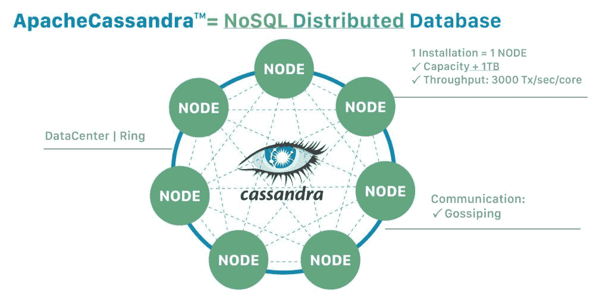
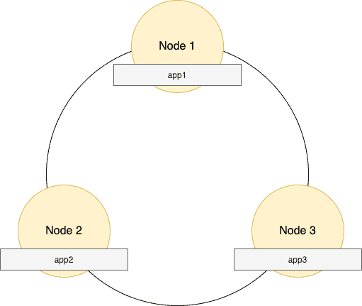
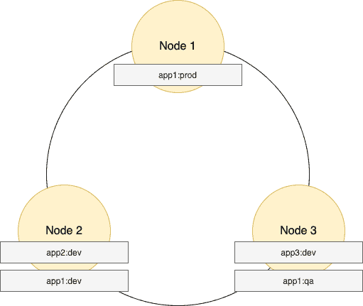

# Cassandra 分区键、组合键和聚集键

> 原文：<https://web.archive.org/web/20220930061024/https://www.baeldung.com/cassandra-keys>

## 1.概观

卡珊德拉 NoSQL 数据库中的数据分布和数据建模不同于传统的关系数据库。

在本文中，我们将了解分区键、组合键和聚集键是如何形成主键的。我们还将看到它们的不同之处。因此，我们将触及 Cassandra 中的数据分布架构和数据建模主题。

## 延伸阅读:

## [使用 Cassandra、Astra 和 Stargate 构建仪表板](/web/20221018135614/https://www.baeldung.com/cassandra-astra-stargate-dashboard)

了解如何使用 DataStax Astra(一种由 Apache Cassandra 和 Stargate APIs 支持的数据库即服务)构建仪表板。[阅读更多](/web/20221018135614/https://www.baeldung.com/cassandra-astra-stargate-dashboard) →

## [用 Cassandra、Astra、REST&graph QL——记录状态更新](/web/20221018135614/https://www.baeldung.com/cassandra-astra-rest-dashboard-updates)

用 Cassandra 存储时序数据的例子。[阅读更多信息](/web/20221018135614/https://www.baeldung.com/cassandra-astra-rest-dashboard-updates) →

## [用卡珊德拉、阿斯特拉和 CQL 构建一个仪表板——绘制事件数据](/web/20221018135614/https://www.baeldung.com/cassandra-astra-rest-dashboard-map)

了解如何根据存储在阿斯特拉数据库中的数据在交互式地图上显示事件。[阅读更多](/web/20221018135614/https://www.baeldung.com/cassandra-astra-rest-dashboard-map) →

## 2.阿帕奇卡桑德拉架构

Apache Cassandra 是一个开源的 NoSQL 分布式数据库，旨在实现高可用性和线性可伸缩性，而不会影响性能。

这里是高层 Cassandra 架构[图](https://web.archive.org/web/20221018135614/https://cassandra.apache.org/_/cassandra-basics.html):

[](/web/20221018135614/https://www.baeldung.com/wp-content/uploads/2021/08/apache-cassandra-diagrams-01-scaled.jpeg)

在 Cassandra 中，数据分布在一个集群中。此外，集群可能由安装在跨地理区域的数据中心的机架中的[个节点环组成。](/web/20221018135614/https://www.baeldung.com/cassandra-cluster-datacenters-racks-nodes)

在更精细的层面上，称为 [`vnodes`](https://web.archive.org/web/20221018135614/https://docs.datastax.com/en/archived/cassandra/3.x/cassandra/architecture/archDataDistributeVnodesUsing.html) 的虚拟节点将数据所有权分配给物理机。Vnodes 通过使用一种叫做[一致散列](https://web.archive.org/web/20221018135614/https://docs.datastax.com/en/cassandra-oss/3.x/cassandra/architecture/archDataDistributeHashing.html)的技术来分发数据，使得每个节点拥有多个小的分区范围成为可能。

分区器是一个函数，它对分区密钥进行哈希运算以生成令牌。这个标记值代表一行，用于标识它在节点中所属的分区范围。

然而，Cassandra 客户端将集群视为一个统一的整体数据库，并使用 Cassandra 驱动程序库与之通信。

## 3.Cassandra 数据建模

通常，数据建模是分析应用程序需求、识别实体及其关系、组织数据等的过程。在关系数据建模中，查询通常是整个数据建模过程中的事后想法。

然而，在 Cassandra 中，数据访问查询驱动[数据建模](https://web.archive.org/web/20221018135614/https://cassandra.apache.org/doc/latest/cassandra/data_modeling/intro.html)。反过来，查询是由应用程序工作流驱动的。

此外，Cassandra 数据模型中没有表连接，这意味着查询中所有需要的数据都必须来自单个表。因此，表中的数据是非规范化格式的。

接下来，在逻辑数据建模步骤中，我们**通过定义键空间、表甚至表列**来指定实际的数据库模式。然后，在物理数据建模步骤中，我们使用 Cassandra 查询语言(CQL)来创建物理键空间——在一个集群中包含所有数据类型的表。

## 4.主关键字

Cassandra 中主键的工作方式是一个需要掌握的重要概念。

Cassandra 中的主键**由一个或多个分区键和零个或多个集群键组件**组成。这些组件的顺序总是将分区键放在第一位，然后是聚集键。

除了使数据具有唯一性之外，主键的分区键组件在数据的放置中还扮演着一个额外的重要角色。因此，它提高了跨群集中多个节点的数据读写性能。

现在，让我们来看看主键的每个组成部分。

### 4.1.分区键

分区键的主要目标是将数据均匀地分布在集群中，并高效地查询数据。

分区键除了唯一标识数据外，还用于数据放置，并且始终是主键定义中的第一个值。

让我们用一个例子来理解这一点—一个包含应用程序日志和一个主键的简单表格:

```java
CREATE TABLE application_logs (
  id                    INT,
  app_name              VARCHAR,
  hostname              VARCHAR,
  log_datetime          TIMESTAMP,
  env                   VARCHAR,
  log_level             VARCHAR,
  log_message           TEXT,
  PRIMARY KEY (app_name)
);
```

上表中有一些示例数据:

[](/web/20221018135614/https://www.baeldung.com/wp-content/uploads/2021/08/SampleTableDataPK.png)

正如我们前面所学的，Cassandra 使用一致的散列技术来生成分区键(`app_name`)的散列值，并将行数据分配给节点内的分区范围。

让我们看看可能的数据存储:

[](/web/20221018135614/https://www.baeldung.com/wp-content/uploads/2021/08/DataDistributionNodes.png)

上图是一个可能的场景，其中`app1`、`app2`和`app3`的哈希值导致每一行分别存储在三个不同的节点中——`Node1`、`Node2`和`Node3`。

所有`app1`日志到`Node1`，`app2`日志到`Node2`，`app3`日志到`Node3`。

在`where`子句中没有分区键的数据获取查询会导致低效的全集群扫描。

另一方面，通过在`where`子句中使用分区键，Cassandra 使用一致散列技术来识别集群中节点的确切节点和确切分区范围。因此，获取数据查询既快速又高效:

```java
select * application_logs where app_name = 'app1';
```

### 4.2.复合分区键

如果我们需要组合多个列值来形成一个分区键，我们使用复合分区键。

这里，除了惟一地标识数据之外，复合分区键的目标还是用于数据放置。结果，数据的存储和检索变得高效。

下面是一个表定义的例子，它将`app_name`和`env`列组合在一起，形成一个复合分区键:

```java
CREATE TABLE application_logs (
  id                    INT,
  app_name              VARCHAR,
  hostname              VARCHAR,
  log_datetime          TIMESTAMP,
  env                   VARCHAR,
  log_level             VARCHAR,
  log_message           TEXT,
  PRIMARY KEY ((app_name, env))
);
```

**在上面的定义中，需要注意的是`app_name`和`env `主键定义**周围的内括号。这个内括号指定`app_name`和`env`是分区键的一部分，而不是聚类键。

**如果我们去掉内括号，只有一个括号，那么`app_name`成为分区键，`env`成为聚类键组件**。

以下是上表的示例数据:

[](/web/20221018135614/https://www.baeldung.com/wp-content/uploads/2021/08/CompositeSampleTableDataPK.png)

我们来看看上面样本数据可能的数据分布。请注意:Cassandra 为`app_name`和`env`列组合生成哈希值:

[](/web/20221018135614/https://www.baeldung.com/wp-content/uploads/2021/08/CompositeDataDistributionNodes.png)

正如我们在上面看到的，`app1:prod, app1:dev, app1:qa` 的哈希值导致这三行分别存储在三个独立的节点中的可能场景— `Node1`、`Node2`和`Node3`。

来自`prod`环境的所有`app1`日志都转到`Node1`，而来自`dev`环境的`app1`日志转到`Node2`，来自`qa`环境的`app1`日志转到`Node3`。

最重要的是，**为了有效地检索数据，fetch 查询中的`where`子句必须按照主键定义**中指定的顺序包含所有组合分区键:

```java
select * application_logs where app_name = 'app1' and env = 'prod';
```

### 4.3.聚类键

正如我们上面提到的，分区是识别数据所在节点内的分区范围的过程。相比之下，**集群是存储引擎对分区内的数据进行排序的过程，它基于定义为集群关键字**的列。

此外，需要提前确定聚集键列——这是因为我们对聚集键列的选择取决于我们希望如何在应用程序中使用数据。

分区中的所有数据都存储在连续存储中，通过聚集键列进行排序。因此，对所需分类数据的检索非常有效。

让我们看一个例子表定义，它有聚集键和复合分区键:

```java
CREATE TABLE application_logs (
  id                    INT,
  app_name              VARCHAR,
  hostname              VARCHAR,
  log_datetime          TIMESTAMP,
  env                   VARCHAR,
  log_level             VARCHAR,
  log_message           TEXT,
  PRIMARY KEY ((app_name, env), hostname, log_datetime)
);
```

让我们来看一些样本数据:

[](/web/20221018135614/https://www.baeldung.com/wp-content/uploads/2021/08/CompositeSampleTableData.png)

正如我们在上面的表定义中看到的，我们已经将`hostname`和`log_datetime`作为集群键列。假设来自`app1`和`prod`环境的所有日志都存储在`Node1`中，Cassandra 存储引擎按照分区内的`hostname`和`log_datetime` 对这些日志进行词汇排序。

默认情况下，Cassandra 存储引擎按照聚类键列的升序对数据进行排序，但是**我们可以通过使用表定义**中的`WITH CLUSTERING ORDER BY `子句来控制聚类列的排序顺序:

```java
CREATE TABLE application_logs (
  id                    INT,
  app_name              VARCHAR,
  hostname              VARCHAR,
  log_datetime          TIMESTAMP,
  env                   VARCHAR,
  log_level             VARCHAR,
  log_message           TEXT,
  PRIMARY KEY ((app_name,env), hostname, log_datetime)
) 
WITH CLUSTERING ORDER BY (hostname ASC, log_datetime DESC);
```

根据上面的定义，在一个分区内，Cassandra 存储引擎将按照`hostname`的词法升序存储所有日志，但是在每个`hostname`组内按照`log_datetime`的降序存储。

现在，让我们看一个在`where`子句中对列进行聚类的数据获取查询示例:

```java
select * application_logs 
where 
app_name = 'app1' and env = 'prod' 
and hostname = 'host1' and log_datetime > '2021-08-13T00:00:00';
```

这里需要注意的是,`where`子句应该按照主键子句中定义的顺序包含列。

## 5.结论

在本文中，我们了解到 Cassandra 使用分区键或复合分区键来确定数据在集群中的位置。聚集键提供了存储在分区中的数据的排序顺序。所有这些键也唯一地标识数据。

我们还谈到了 Cassandra 架构和数据建模主题。

有关 Cassandra 的更多信息，请访问 [DataStax](https://web.archive.org/web/20221018135614/https://docs.datastax.com/en/landing_page/doc/landing_page/current.html) 和 [Apache Cassandra](https://web.archive.org/web/20221018135614/https://cassandra.apache.org/doc/latest/cassandra/data_modeling/intro.html) 文档。