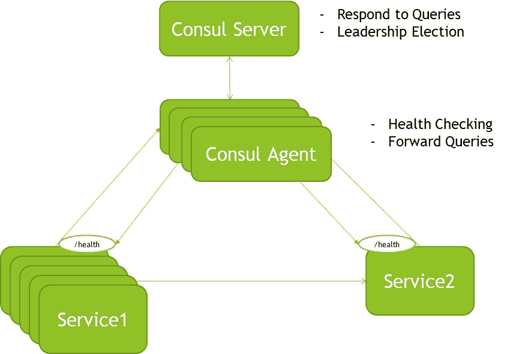

# 执政官领导选举

> 原文：<https://web.archive.org/web/20220930061024/https://www.baeldung.com/consul-leadership-election>

## 1.概观

在本教程中，**我们将了解 Consul 领导选举如何帮助确保数据稳定性。**我们将提供一个如何在并发应用中管理分布式锁定的实际例子。

## 2.领事是什么？

Consul 是一个开源工具，提供基于健康检查的服务注册和发现。此外，它还包括一个 Web 图形用户界面(GUI ),用于查看 Consul 并与之轻松交互。它还包括会话管理和键值(KV)存储的额外功能。

在接下来的章节中，我们将关注如何**使用 Consul 的会话管理和 KV store 来选择具有多个实例的应用中的领导者**。

## 3.领事基础知识

**[Consul 代理](https://web.archive.org/web/20220625162504/https://www.consul.io/docs/agent)是运行在 Consul 集群每个节点上的最重要的组件。**负责健康检查；注册、发现和解析服务；存储配置数据；还有更多。

Consul agent 可以运行在**两种不同的模式** —服务器和代理。

咨询服务器的主要**职责是响应来自代理的查询并选出领导者。使用[共识协议](https://web.archive.org/web/20220625162504/https://www.consul.io/docs/internals/consensus.html)选择领导层，以基于 [Raft 算法](https://web.archive.org/web/20220625162504/https://raft.github.io/raft.pdf)提供[一致性(如 CAP 所定义)](https://web.archive.org/web/20220625162504/https://en.wikipedia.org/wiki/CAP_theorem)。**

关于共识如何工作的细节不在本文的讨论范围之内。然而，值得一提的是，节点可以处于三种状态之一:领导者、候选人或追随者。它还存储数据并响应来自代理的查询。

**代理比 Consul 服务器更轻量级**。它负责运行已注册服务的健康检查，并将查询转发给服务器。让我们来看一个 Consul 集群的简单示意图:

[](/web/20220625162504/https://www.baeldung.com/wp-content/uploads/2020/08/consul-cluster.jpg)

Consul 还可以在其他方面提供帮助——例如，在一个实例必须是领导者的并发应用程序中。

在接下来的章节中，让我们看看 Consul 是如何通过会话管理和 KV store 来提供这一重要功能的。

## 4.执政官领导选举

在分布式部署中，持有锁的服务是领导者。因此，对于高可用性系统，管理锁和领导者至关重要。

Consul 提供了一个易于使用的 KV 存储和[会话管理](https://web.archive.org/web/20220625162504/https://www.consul.io/docs/internals/sessions.html)。这些功能用于[构建领袖选举](https://web.archive.org/web/20220625162504/https://learn.hashicorp.com/consul/developer-configuration/elections)，所以让我们学习它们背后的原理。

### 4.1.领导权之争

属于分布式系统的所有实例做的第一件事是争夺领导权。成为领导者的竞争包括一系列步骤:

1.  所有的实例必须同意一个共同的密钥来竞争。
2.  接下来，实例通过 Consul 会话管理和 KV 功能使用商定的密钥创建一个会话。
3.  第三，他们应该获得会话。如果返回值是`true`，锁属于实例，如果是`false`，实例是从者。
4.  **实例需要不断地观察会话，以便在失败或释放的情况下重新获得领导权**。
5.  最后，领导者可以释放会话，流程重新开始。

一旦选出领导者，其余的实例使用 Consul KV 和会话管理通过以下方式发现领导者:

*   检索约定的密钥
*   获取会话信息以了解领导者

### 4.2.实际例子

我们需要在运行多个实例的 Consul 中创建键和值以及会话。为此，我们将使用[king uin Digital Limited Leadership consult](https://web.archive.org/web/20220625162504/https://jitpack.io/p/kinguinltdhk/leadership-consul)开源 Java 实现。

首先，让我们包括依赖性:

```java
<dependency>
   <groupId>com.github.kinguinltdhk</groupId>
   <artifactId>leadership-consul</artifactId>
   <version>${kinguinltdhk.version}</version>
   <exclusions>
       <exclusion>
           <groupId>com.ecwid.consul</groupId> 
           <artifactId>consul-api</artifactId>
       </exclusion>
   </exclusions>
</dependency>
```

我们排除了`consul-api`依赖性，以避免在 Java 的不同版本上发生冲突。

对于公共密钥，我们将使用:

```java
services/%s/leader
```

让我们用一个简单的片段来测试所有的过程:

```java
new SimpleConsulClusterFactory()
    .mode(SimpleConsulClusterFactory.MODE_MULTI)
    .debug(true)
    .build()
    .asObservable()
    .subscribe(i -> System.out.println(i));
```

然后，我们创建一个包含多个实例的集群，并使用`asObservable()`来帮助订阅者访问事件。领导者在 Consul 中创建一个会话，所有实例验证该会话以确认领导。

**最后，我们定制 consul 配置和会话管理**，以及实例之间协商好的密钥来选举领导者:

```java
cluster:
  leader:
    serviceName: cluster
    serviceId: node-1
    consul:
      host: localhost
      port: 8500
      discovery:
        enabled: false
    session:
      ttl: 15
      refresh: 7
    election:
      envelopeTemplate: services/%s/leader
```

### 4.3.如何测试

安装 Consul 和[运行代理](/web/20220625162504/https://www.baeldung.com/spring-cloud-consul#prerequisites)有几种选择。

部署 Consul 的可能性之一是通过[容器](/web/20220625162504/https://www.baeldung.com/docker-images-vs-containers#running-images)。我们将使用 Docker Hub 中的[领事 Docker 图像](https://web.archive.org/web/20220625162504/https://hub.docker.com/_/consul)，Docker Hub 是世界上最大的容器图像存储库。

我们将通过运行以下命令使用 Docker 部署 Consul:

```java
docker run -d --name consul -p 8500:8500 -e CONSUL_BIND_INTERFACE=eth0 consul
```

领事现在正在运行，应该在`localhost:8500`就可以了。

让我们执行代码片段并检查完成的步骤:

1.  领导在 Consul 中创建了一个会话。
2.  **然后就当选了(`elected.first`)。**
3.  **其余的实例一直观察到会话被释放**:

```java
INFO: multi mode active
INFO: Session created e11b6ace-9dc7-4e51-b673-033f8134a7d4
INFO: Session refresh scheduled on 7 seconds frequency 
INFO: Vote frequency setup on 10 seconds frequency 
ElectionMessage(status=elected, vote=Vote{sessionId='e11b6ace-9dc7-4e51-b673-033f8134a7d4', serviceName='cluster-app', serviceId='node-1'}, error=null)
ElectionMessage(status=elected.first, vote=Vote{sessionId='e11b6ace-9dc7-4e51-b673-033f8134a7d4', serviceName='cluster-app', serviceId='node-1'}, error=null)
ElectionMessage(status=elected, vote=Vote{sessionId='e11b6ace-9dc7-4e51-b673-033f8134a7d4', serviceName='cluster-app', serviceId='node-1'}, error=null) 
```

Consul 还在`http://localhost:8500/ui`提供了一个 Web GUI。

让我们打开一个浏览器，单击“key-value”部分，确认会话已创建:

[](/web/20220625162504/https://www.baeldung.com/wp-content/uploads/2020/08/consul-leadership-election.jpg)

因此，其中一个并发实例使用应用程序的约定密钥创建了一个会话。只有当会话被释放时，流程才能重新开始，新的实例才能成为领导者。

## 5.结论

在本文中，我们通过多个实例展示了高性能应用程序中的领导选举基础。我们展示了 Consul 的会话管理和 KV 存储功能如何帮助获取锁和选择领导者。

和往常一样，代码可以在 GitHub 的[上获得。](https://web.archive.org/web/20220625162504/https://github.com/eugenp/tutorials/tree/master/spring-cloud-modules/spring-cloud-consul)