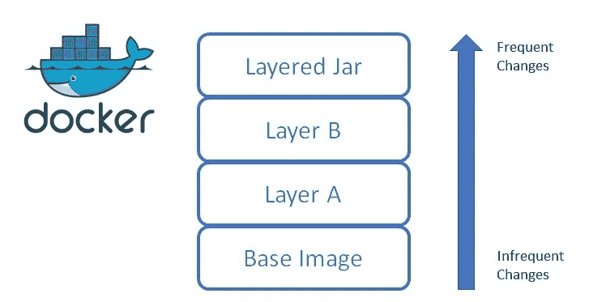
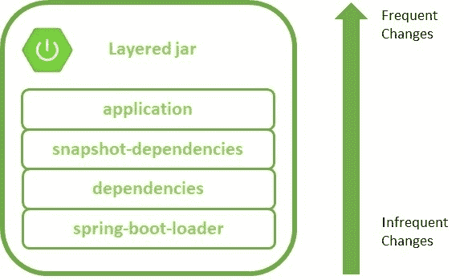

# 使用 Spring Boot 重用 Docker 层

> 原文：<https://web.archive.org/web/20220930061024/https://www.baeldung.com/docker-layers-spring-boot>

## 1.介绍

Docker 是创建自包含应用程序的事实上的标准。从版本 2.3.0 开始， [Spring Boot](/web/20220727020706/https://www.baeldung.com/spring-boot-docker-images) 包含了一些增强功能，帮助我们创建高效的 Docker 映像。因此，它**允许将应用程序分解成不同的层**。

换句话说，源代码驻留在它自己的层中。因此，它可以独立重建，提高效率和启动时间。在本教程中，我们将看到如何利用 Spring Boot 的新功能来重用 Docker 层。

## 2.Docker 中的分层罐

Docker 容器由基本图像和附加层组成。一旦构建了图层，它们将保持缓存状态。因此，后续几代会快得多:

[](/web/20220727020706/https://www.baeldung.com/wp-content/uploads/2020/11/docker-layers.jpg)

较低级别的层中的变化也会重建较高级别的层。因此，不常变化的层应该留在底部，而经常变化的层应该放在顶部。

同样，Spring Boot 允许将工件的内容映射到层中。让我们看看层的默认映射:

[](/web/20220727020706/https://www.baeldung.com/wp-content/uploads/2020/11/spring-boot-layers.jpg)

正如我们所看到的，应用程序有自己的层。修改源代码时，只重新构建独立层。加载程序和依赖项仍然被缓存，减少了 Docker 映像的创建和启动时间。让我们看看 Spring Boot 是如何做到的！

## 3.用 Spring Boot 创造高效的码头工人形象

在建立 Docker 形象的传统方式中，Spring Boot 使用了 [fat jar 方法](/web/20220727020706/https://www.baeldung.com/spring-boot-docker-images#traditional-docker-builds)。因此，单个工件嵌入了所有的依赖项和应用程序源代码。因此，我们源代码中的任何变化都会迫使我们重新构建整个层。

### 3.1.Spring Boot 层配置

Spring Boot 版本 2.3.0 引入了**两个新特性来改进 Docker 图像生成:**

*   **[Buildpack 支持](/web/20220727020706/https://www.baeldung.com/spring-boot-docker-images#buildpacks)** 为应用程序提供 Java 运行时，因此现在可以跳过 Docker 文件，自动构建 Docker 映像
*   分层坛子帮助我们最大限度地利用 Docker 层代

在本教程中，我们将扩展分层 jar 方法。

最初，我们将在 Maven 中设置[分层 jar。当打包工件时，我们将生成层。让我们检查一下 jar 文件:](/web/20220727020706/https://www.baeldung.com/spring-boot-docker-images#1-creating-layered-jars)

```
jar tf target/spring-boot-docker-0.0.1-SNAPSHOT.jar
```

我们可以看到，新的图层 [`.idx`](/web/20220727020706/https://www.baeldung.com/spring-boot-docker-images#layered-jars) 文件在 fat jar 里面的 BOOT-INF 文件夹中被创建。当然，它将依赖关系、资源和应用程序源代码映射到独立的层:

```
BOOT-INF/layers.idx
```

同样，该文件的内容会分解存储的不同层:

```
- "dependencies":
  - "BOOT-INF/lib/"
- "spring-boot-loader":
  - "org/"
- "snapshot-dependencies":
- "application":
  - "BOOT-INF/classes/"
  - "BOOT-INF/classpath.idx"
  - "BOOT-INF/layers.idx"
  - "META-INF/"
```

### 3.2.与层交互

让我们列出工件内部的层:

```
java -Djarmode=layertools -jar target/docker-spring-boot-0.0.1.jar list 
```

结果提供了对`layers.idx`文件内容的简单视图:

```
dependencies
spring-boot-loader
snapshot-dependencies
application
```

我们还可以将图层提取到文件夹中:

```
java -Djarmode=layertools -jar target/docker-spring-boot-0.0.1.jar extract 
```

然后，我们可以重用 docker 文件中的文件夹，我们将在下一节中看到:

```
$ ls
application/
snapshot-dependencies/
dependencies/
spring-boot-loader/ 
```

### 3.3.Dockerfile 文件配置

为了充分利用 Docker 的功能，我们需要将图层添加到我们的图像中。

首先，让我们将 fat jar 文件添加到基本映像中:

```
FROM adoptopenjdk:11-jre-hotspot as builder
ARG JAR_FILE=target/*.jar
COPY ${JAR_FILE} application.jar 
```

其次，让我们提取工件的层:

```
RUN java -Djarmode=layertools -jar application.jar extract 
```

最后，让我们复制提取的文件夹，以添加相应的 Docker 层:

```
FROM adoptopenjdk:11-jre-hotspot
COPY --from=builder dependencies/ ./
COPY --from=builder snapshot-dependencies/ ./
COPY --from=builder spring-boot-loader/ ./
COPY --from=builder application/ ./
ENTRYPOINT ["java", "org.springframework.boot.loader.JarLauncher"]
```

使用这种配置，当我们更改源代码时，我们将只重新构建应用层。其余的将保持缓存。

## 4.自定义图层

似乎一切都很顺利。但是如果我们仔细观察，**依赖层并没有在我们的构建**之间共享。也就是说，所有的都到了一层，即使是内部的。因此，如果我们改变一个内部库的类，我们将再次重建所有的依赖层。

### 4.1.使用 Spring Boot 进行自定义图层配置

在 Spring Boot，可以通过单独的配置文件调整[自定义层](https://web.archive.org/web/20220727020706/https://docs.spring.io/spring-boot/docs/current/maven-plugin/reference/html/#repackage-layers-configuration):

```
<layers 
    xmlns:xsi="http://www.w3.org/2001/XMLSchema-instance"
    xsi:schemaLocation="http://www.springframework.org/schema/boot/layers
                     https://www.springframework.org/schema/boot/layers/layers-2.3.xsd">
    <application>
        <into layer="spring-boot-loader">
            <include>org/springframework/boot/loader/**</include>
        </into>
        <into layer="application" />
    </application>
    <dependencies>
        <into layer="snapshot-dependencies">
            <include>*:*:*SNAPSHOT</include>
        </into>
        <into layer="dependencies" />
    </dependencies>
    <layerOrder>
        <layer>dependencies</layer>
        <layer>spring-boot-loader</layer>
        <layer>snapshot-dependencies</layer>
        <layer>application</layer>
    </layerOrder>
</layers>
```

如我们所见，我们正在将依赖项和资源映射和排序到层中。此外，我们可以添加任意多的自定义层。

让我们将我们的文件命名为`layers.xml`。然后，在 Maven 中，我们可以配置这个文件来定制层:

```
<plugin>
    <groupId>org.springframework.boot</groupId>
    <artifactId>spring-boot-maven-plugin</artifactId>
    <configuration>
        <layers>
            <enabled>true</enabled>
            <configuration>${project.basedir}/src/layers.xml</configuration>
        </layers>
    </configuration>
</plugin>
```

如果我们打包工件，结果将类似于默认行为。

### 4.2.添加新层

让我们创建一个添加应用程序类的内部依赖关系:

```
<into layer="internal-dependencies">
    <include>com.baeldung.docker:*:*</include>
</into>
```

此外，我们将订购新图层:

```
<layerOrder>
    <layer>internal-dependencies</layer>
</layerOrder>
```

因此，如果我们列出 fat jar 中的层，就会出现新的内部依赖关系:

```
dependencies
spring-boot-loader
internal-dependencies
snapshot-dependencies
application 
```

### 4.3.Dockerfile 文件配置

提取完成后，我们可以将新的内层添加到 Docker 图像中:

```
COPY --from=builder internal-dependencies/ ./
```

因此，如果我们生成图像，我们将看到 Docker 如何构建内部依赖关系作为一个新层:

```
$ mvn package
$ docker build -f src/main/docker/Dockerfile . --tag spring-docker-demo
....
Step 8/11 : COPY --from=builder internal-dependencies/ ./
 ---> 0e138e074118
..... 
```

之后，我们可以在历史记录中检查 Docker 图像中图层的组成:

```
$ docker history --format "{{.ID}} {{.CreatedBy}} {{.Size}}" spring-docker-demo
c0d77f6af917 /bin/sh -c #(nop)  ENTRYPOINT ["java" "org.s… 0B
762598a32eb7 /bin/sh -c #(nop) COPY dir:a87b8823d5125bcc4… 7.42kB
80a00930350f /bin/sh -c #(nop) COPY dir:3875f37b8a0ed7494… 0B
0e138e074118 /bin/sh -c #(nop) COPY dir:db6f791338cb4f209… 2.35kB
e079ad66e67b /bin/sh -c #(nop) COPY dir:92a8a991992e9a488… 235kB
77a9401bd813 /bin/sh -c #(nop) COPY dir:f0bcb2a510eef53a7… 16.4MB
2eb37d403188 /bin/sh -c #(nop)  ENV JAVA_HOME=/opt/java/o… 0B
```

正如我们所看到的，该层现在包括了项目的内部依赖关系。

## 5.结论

在本教程中，我们展示了如何生成高效的 Docker 图像。简而言之，我们使用新的 Spring Boot 功能来创建分层罐。对于简单的项目，我们可以使用默认配置。我们还演示了一个更高级的配置来重用这些层。

和往常一样，代码可以在 GitHub 的[上获得。](https://web.archive.org/web/20220727020706/https://github.com/eugenp/tutorials/tree/master/docker-modules/docker-spring-boot)