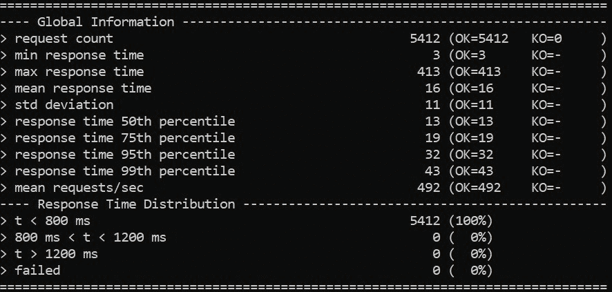
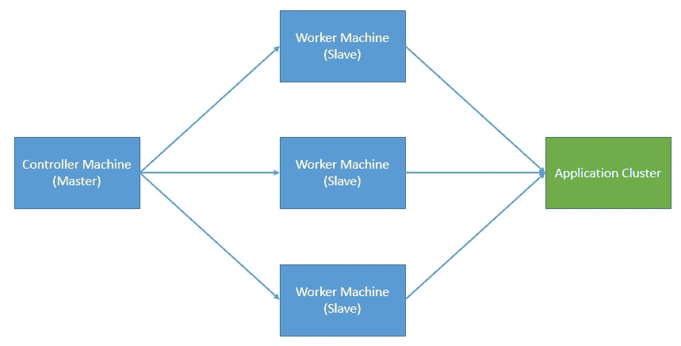

# 用加特林进行分布式性能测试

> 原文：<https://web.archive.org/web/20220930061024/https://www.baeldung.com/gatling-distributed-perf-testing>

## 1.介绍

在本教程中，我们将了解如何使用 [Gatling](https://web.archive.org/web/20221211111403/https://gatling.io/) 进行分布式性能测试。在这个过程中，我们将创建一个简单的应用程序来用 Gatling 进行测试，理解使用分布式性能测试的基本原理，最后，理解 Gatling 中有哪些支持来实现它。

## 2.用加特林进行性能测试

性能测试**是一种测试实践，评估系统在特定工作负载下的响应性和稳定性**。有几种类型的测试通常属于性能测试。这些测试包括负载测试、压力测试、浸泡测试、峰值测试等。所有这些都有自己的具体目标要实现。

然而，任何性能测试的一个常见方面是模拟工作负载，像 [Gatling](/web/20221211111403/https://www.baeldung.com/introduction-to-gatling) 、 [JMeter](/web/20221211111403/https://www.baeldung.com/jmeter) 和 [K6](https://web.archive.org/web/20221211111403/https://k6.io/) 这样的工具可以帮助我们做到这一点。但是，在我们继续之前，我们需要一个可以测试性能的应用程序。

然后，我们将为该应用程序的性能测试开发一个简单的工作负载模型。

### 2.1.创建应用程序

对于本教程，**我们将使用 Spring CLI 创建一个简单的 Spring Boot web 应用程序**:

```
spring init --dependencies=web my-application
```

接下来，我们将创建一个简单的 REST API，根据请求提供一个随机数:

```
@RestController
@SpringBootApplication
public class Application {
    public static void main(String[] args) {
        SpringApplication.run(Application.class, args);
    }

    @GetMapping("/api/random")
    public Integer getRandom() {
        Random random = new Random();
        return random.nextInt(1000);
    }
}
```

这个 API 没有什么特别之处——它只是在每次调用时返回一个 0 到 999 之间的随机整数。

使用 Maven 命令启动这个应用程序非常简单:

```
mvnw spring-boot:run
```

### 2.2.创建工作负载模型

如果我们需要将这个简单的 API 部署到产品中，我们需要确保它能够处理预期的负载，并且仍然提供期望的服务质量。这是我们需要执行各种性能测试的地方。**工作负载模型通常会识别一个或多个工作负载配置文件，以模拟实际使用情况**。

对于具有用户界面的 web 应用程序来说，定义一个合适的工作负载模型可能相当具有挑战性。但是对于我们简单的 API，我们可以对负载测试的负载分布进行假设。

Gatling 提供了 **Scala DSL 来创建场景，以便在模拟**中进行测试。让我们首先为我们之前创建的 API 创建一个基本场景:

```
package randomapi

import io.gatling.core.Predef._
import io.gatling.core.structure.ScenarioBuilder
import io.gatling.http.Predef._
import io.gatling.http.protocol.HttpProtocolBuilder

class RandomAPILoadTest extends Simulation {
    val protocol: HttpProtocolBuilder = http.baseUrl("http://localhost:8080/")
    val scn: ScenarioBuilder = scenario("Load testing of Random Number API")
      .exec(
        http("Get Random Number")
          .get("api/random")
          .check(status.is(200))
      )

    val duringSeconds: Integer = Integer.getInteger("duringSeconds", 10)
    val constantUsers: Integer = Integer.getInteger("constantUsers", 10)
    setUp(scn.inject(constantConcurrentUsers(constantUsers) during (duringSeconds))
      .protocols(protocol))
      .maxDuration(1800)
      .assertions(global.responseTime.max.lt(20000), global.successfulRequests.percent.gt(95))
}
```

让我们讨论一下这个基本模拟的要点:

*   我们首先添加一些必要的 Gatling DSL 导入
*   接下来，我们定义 HTTP 协议配置
*   然后，我们定义一个对我们的 API 只有一个请求的场景
*   最后，我们为我们想要注入的负载创建一个模拟定义；这里，我们使用 10 个并发用户注入负载 10 秒钟

为具有用户界面的更复杂的应用程序创建这种场景可能相当复杂。谢天谢地，加特林还附带了另一个[工具，叫做记录器](/web/20221211111403/https://www.baeldung.com/introduction-to-gatling)。**使用这个记录器，我们可以通过让它代理浏览器和服务器之间的交互**来创建场景。它还可以消耗一个 [HAR (HTTP archive)](https://web.archive.org/web/20221211111403/https://w3c.github.io/web-performance/specs/HAR/Overview.html) 文件来创建场景。

### 2.3.执行模拟

现在，我们准备好执行我们的负载测试了。为此，我们可以将我们的模拟文件“RandomAPILoadTest.scala”放在目录`“%GATLING_HOME%/user-file/randomapi/”.`中。请注意，这不是执行模拟的唯一方法，但肯定是最简单的方法之一。

我们可以通过运行以下命令来启动 Gatling:

```
$GATLING_HOME/bin/gatling.sh
```

这将提示我们选择要运行的模拟:

```
Choose a simulation number:
     [0] randomapi.RandomAPILoadTest
```

在选择模拟时，它将运行模拟并生成一个带有摘要的输出:

[](/web/20221211111403/https://www.baeldung.com/wp-content/uploads/2021/02/Gatling-Output-1.jpg)

此外，它在目录“%GATLING_HOME%/results”中生成一个 HTML 格式的报告:

[](/web/20221211111403/https://www.baeldung.com/wp-content/uploads/2021/02/Gatling-Report.jpg)

这只是生成的报告的一部分，但是我们可以清楚地看到结果的摘要。这个挺详细的，很好理解。

## 3.分布式性能测试

到目前为止，一切顺利。但是，如果我们回想一下，性能测试的目的是模拟现实生活中的工作负载。对于流行的应用程序来说，这个**可能比我们在这里的小例子**中看到的负载要高得多。如果我们在测试总结中注意到，我们设法实现了大约 500 个请求/秒的吞吐量。对于现实生活中的应用程序，处理现实生活中的工作负载，这可能要高出许多倍！

我们如何使用任何性能工具来模拟这种工作负载？仅仅从单台机器注入负载真的有可能达到这些数字吗？也许不是。即使负载注入工具可以处理高得多的负载，**底层操作系统和网络也有自己的局限性**。

这就是我们必须在多台机器上分配负载注入的地方。当然，像任何其他分布式计算模型一样，这也带来了自己的挑战:

*   我们如何在参与的机器之间分配工作负载？
*   谁来协调它们的完成和从可能发生的任何错误中恢复？
*   我们如何为合并报告收集和总结结果？

分布式性能测试的典型架构使用主节点和从节点来解决这些问题:

[](/web/20221211111403/https://www.baeldung.com/wp-content/uploads/2021/02/Gatling-Distributed-Testing.jpg)

但是，在这里，如果主设备发生故障，会发生什么呢？解决分布式计算的所有[问题不在本教程的范围之内，但是在选择分布式模型进行性能测试时，我们必须强调它们的含义。](/web/20221211111403/https://www.baeldung.com/cs/distributed-systems-guide)

## 4.用加特林进行分布式性能测试

既然我们已经理解了分布式性能测试的需要，我们将看看如何使用 Gatling 来实现这一点。**集群模式是加特林前线**的内置特性。然而，Frontline 是加特林的企业版，不能作为开源软件使用。Frontline 支持在内部或任何流行的云供应商上部署注入器。

然而，**用加特林开源软件**还是有可能实现的。但是，我们将不得不自己做大部分繁重的工作。在这一节中，我们将介绍实现它的基本步骤。这里，我们将使用前面定义的相同模拟来生成多机器负载。

### 4.1.设置

我们将从**创建一个控制器机器和几个远程工作机器**开始，要么在本地，要么在任何云供应商上。我们必须在所有这些机器上执行某些先决条件。这些包括在所有工人机器上安装 Gatling 开源，并设置一些控制器机器环境变量。

为了获得一致的结果，我们应该在所有工作机器上安装相同版本的 Gatling，并且在每台机器上安装相同的配置。这包括我们安装 Gatling 的目录和我们创建来安装它的用户。

让我们看看需要在控制器机器上设置的重要环境变量:

```
HOSTS=( 192.168.x.x 192.168.x.x 192.168.x.x)
```

我们还要定义远程工作机的列表，我们将使用这些机器来注入负载:

```
GATLING_HOME=/gatling/gatling-charts-highcharts-1.5.6
GATLING_SIMULATIONS_DIR=$GATLING_HOME/user-files/simulations
SIMULATION_NAME='randomapi.RandomAPILoadTest'
GATLING_RUNNER=$GATLING_HOME/bin/gatling.sh
GATLING_REPORT_DIR=$GATLING_HOME/results/
GATHER_REPORTS_DIR=/gatling/reports/
```

一些变量指向启动模拟所需的 Gatling 安装目录和其他脚本。它还提到了我们希望生成报告的目录。我们稍后会看到在哪里使用它们。

值得注意的是**我们假设机器有一个类似 Linux 的环境**。但是，我们可以很容易地将该过程应用于其他平台，如 Windows。

### 4.2.分配负载

在这里，我们将**将相同的场景复制到我们之前创建的多个工作机**。有几种方法可以将模拟复制到远程主机。最简单的方法是对支持的主机使用 [`scp`](https://web.archive.org/web/20221211111403/https://www.ssh.com/ssh/scp/) 。我们还可以使用一个 shell 脚本来实现自动化:

```
for HOST in "${HOSTS[@]}"
do
  scp -r $GATLING_SIMULATIONS_DIR/* [[email protected]](/web/20221211111403/https://www.baeldung.com/cdn-cgi/l/email-protection)$HOST:$GATLING_SIMULATIONS_DIR
done
```

以上命令将本地主机上的目录内容复制到远程主机上的目录。对于 windows 用户来说， [PuTTY](https://web.archive.org/web/20221211111403/https://www.putty.org/) 是一个更好的选项，它也带有 PSCP (PuTTY 安全复制协议)。我们可以使用 [PSCP 在 Windows 客户端和 Windows 或 Unix 服务器之间传输文件](https://web.archive.org/web/20221211111403/https://www.ssh.com/ssh/putty/putty-manuals/0.68/Chapter5.html)。

### 4.3.执行模拟

一旦我们将模拟复制到工作机器上，我们就可以启动它们了。获得并发用户总数的关键是**在所有主机上几乎同时**执行模拟。

我们可以使用一个 shell 脚本再次自动化这个步骤:

```
for HOST in "${HOSTS[@]}"
do
  ssh -n -f [[email protected]](/web/20221211111403/https://www.baeldung.com/cdn-cgi/l/email-protection)$HOST \
    "sh -c 'nohup $GATLING_RUNNER -nr -s $SIMULATION_NAME \
    > /gatling/run.log 2>&1 &'"
done
```

我们使用`ssh`来触发远程工作机器上的模拟。这里需要注意的关键点是**我们使用了“无报告”选项** (-nr)。这是因为我们在这个阶段只对收集日志感兴趣，稍后我们将通过合并来自所有工作机的日志来创建报告。

### 4.4.收集结果

现在，我们需要**收集所有工作机**上模拟生成的日志文件。同样，这也是我们可以使用 shell 脚本自动化并从控制器机器上执行的事情:

```
for HOST in "${HOSTS[@]}"
do
  ssh -n -f [[email protected]](/web/20221211111403/https://www.baeldung.com/cdn-cgi/l/email-protection)$HOST \
    "sh -c 'ls -t $GATLING_REPORT_DIR | head -n 1 | xargs -I {} \
    mv ${GATLING_REPORT_DIR}{} ${GATLING_REPORT_DIR}report'"
  scp [[email protected]](/web/20221211111403/https://www.baeldung.com/cdn-cgi/l/email-protection)$HOST:${GATLING_REPORT_DIR}report/simulation.log \
    ${GATHER_REPORTS_DIR}simulation-$HOST.log
done
```

对于我们这些不熟悉 shell 脚本的人来说，这些命令可能看起来很复杂。但是，当我们把它们分成几个部分时，就没那么复杂了。首先，我们`ssh`进入一台远程主机，按时间倒序列出加特林报告目录中的所有文件，并取第一个文件。

然后，我们将选定的日志文件从远程主机复制到控制器机器，并将其重命名为附加主机名。这很重要，因为我们将有来自不同主机的多个同名日志文件。

### 4.5.生成报告

最后，我们必须**从不同工作机**上执行的模拟中收集的所有日志文件中生成一个报告。谢天谢地，加特林做了所有的重活:

```
mv $GATHER_REPORTS_DIR $GATLING_REPORT_DIR
$GATLING_RUNNER -ro reports
```

我们将所有日志文件复制到标准 Gatling 报告目录中，并执行 gate 命令来生成报告。这假设我们已经在控制器机器上安装了 Gatling。最终报告与我们之前看到的类似:

[](/web/20221211111403/https://www.baeldung.com/wp-content/uploads/2021/02/Gatling-Report-Combined-1024x329-1.jpg)

在这里，我们甚至没有意识到负载实际上是从多台机器注入的！我们可以清楚地看到，当我们使用三台工作机时，请求的数量几乎增加了两倍。然而，在现实生活中，这种比例并不是完美的线性关系！

## 5.扩展性能测试的注意事项

我们已经看到，分布式性能测试是一种扩展性能测试以模拟真实工作负载的方法。现在，尽管分布式性能测试很有用，但它也有其细微之处。因此，**我们肯定应该尝试尽可能纵向扩展负载注入能力**。只有当我们在单台机器上达到垂直极限时，我们才应该考虑使用分布式测试。

通常，机器上扩展负载注入的限制因素来自底层操作系统或网络。我们可以优化某些事情，让它变得更好。在类似 Linux 的环境中，负载注入器可以产生的并发用户的数量通常受到打开文件限制的限制。我们可以考虑使用 [`ulimit`命令](https://web.archive.org/web/20221211111403/https://ss64.com/bash/ulimit.html)来增加它。

另一个重要因素涉及机器上可用的资源。例如，负载注入通常会消耗大量网络带宽。如果机器的网络吞吐量是限制因素，可以考虑升级。类似地，机器上可用的 CPU 或内存也可能是其他限制因素。**在基于云的环境中，切换到更强大的机器是相当容易的**。

最后，我们在模拟中包括的场景应该是有弹性的，因为我们不应该总是在负载下假设积极的响应。因此，我们应该小心谨慎地写下我们对回应的断言。同样，**我们应该将断言的数量保持在最低限度**以节省我们增加吞吐量的努力。

## 6.结论

在本教程中，我们学习了使用 Gatling 执行分布式性能测试的基础知识。我们创建了一个简单的应用程序来测试，用 Gatling 开发了一个简单的模拟，然后理解了如何在多台机器上执行这个。

在这个过程中，我们也理解了分布式性能测试的需求以及与之相关的最佳实践。