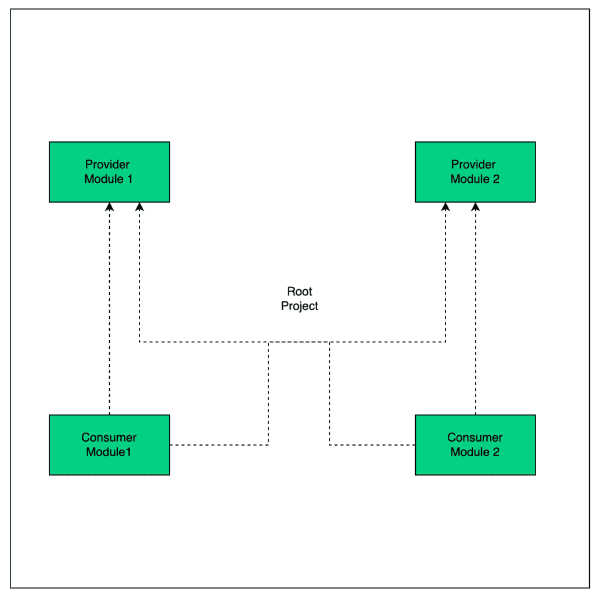

# 如何在 Gradle 中配置条件依赖

> 原文：<https://web.archive.org/web/20220930061024/https://www.baeldung.com/gradle-conditional-dependencies>

## 1.概观

在本教程中，我们将了解如何在 Gradle 项目中配置条件依赖。

## 2.项目设置

我们将为演示设置一个多模块项目。让我们前往`[start.spring.io](https://web.archive.org/web/20220929232326/https://start.spring.io/)`并创建我们的根项目`conditional-dependency-demo`。我们将使用 Gradle 和 Java 以及 Spring Boot。

让我们再添加两个提供者模块`provider1`和`provider2,` 以及两个消费者模块`consumer1`和`consumer2` :
[](/web/20220929232326/https://www.baeldung.com/wp-content/uploads/2022/08/conditional-dependency-project-structure.png)

## 3.配置条件依赖关系

假设，基于一个项目属性，我们想要包含两个提供者模块中的一个。对于我们的`consumer1`模块，如果指定了属性`isLocal` ，我们希望包含`provider1`模块。否则，应该包括`provider2`模块。

为此，让我们在`consumer1`模块的`gradle.settings.kts `文件中添加以下内容:

```java
plugins {
    id("java")
}

group = "com.baeldung.gradle"
version = "0.0.1-SNAPSHOT"

repositories {
    mavenCentral()
}

dependencies {
    testImplementation("org.junit.jupiter:junit-jupiter-api:5.7.0")
    testRuntimeOnly ("org.junit.jupiter:junit-jupiter-engine:5.7.0")

    if (project.hasProperty("isLocal")) {
        implementation("com.baeldung.gradle:provider1")
    } else {
        implementation("com.baeldung.gradle:provider2")
    }
}

tasks.getByName<Test>("test") {
    useJUnitPlatform()
}
```

现在，让我们运行 dependencies 任务，看看选择了哪个提供者模块:

```java
gradle -PisLocal dependencies --configuration implementation
```

```java
> Task :consumer1:dependencies

------------------------------------------------------------
Project ':consumer1'
------------------------------------------------------------

implementation - Implementation only dependencies for source set 'main'. (n)
\--- com.baeldung.gradle:provider1 (n)

(n) - Not resolved (configuration is not meant to be resolved)

A web-based, searchable dependency report is available by adding the --scan option.

BUILD SUCCESSFUL in 591ms
1 actionable task: 1 executed 
```

正如我们所看到的，传递属性导致了`provider1`模块的包含。现在，让我们在不指定任何属性的情况下运行依赖项任务:

```java
gradle dependencies --configuration implementation
```

```java
> Task :consumer1:dependencies

------------------------------------------------------------
Project ':consumer1'
------------------------------------------------------------

implementation - Implementation only dependencies for source set 'main'. (n)
\--- com.baeldung.gradle:provider2 (n)

(n) - Not resolved (configuration is not meant to be resolved)

A web-based, searchable dependency report is available by adding the --scan option.

BUILD SUCCESSFUL in 649ms
1 actionable task: 1 executed 
```

正如我们所看到的，`provider2`现在被包含在内。

## 4.通过模块替换配置条件依赖

让我们看看另一种通过依赖替换来有条件地配置依赖的方法。对于我们的`consumer2` 模块，如果指定了`isLocal`属性，我们希望包含`provider2` 模块。否则，应使用模块`provider1`。

让我们将以下配置添加到我们的`consumer2`模块中来实现这一目标:

```java
plugins {
    id("java")
}

group = "com.baeldung.gradle"
version = "0.0.1-SNAPSHOT"

repositories {
    mavenCentral()
}

configurations.all {
    resolutionStrategy.dependencySubstitution {
        if (project.hasProperty("isLocal"))
            substitute(project("com.baeldung.gradle:provider1"))
              .using(project(":provider2"))
              .because("Project property override(isLocal).")
    }
}

dependencies {
    implementation(project(":provider1"))

    testImplementation("org.junit.jupiter:junit-jupiter-api:5.7.0")
    testRuntimeOnly("org.junit.jupiter:junit-jupiter-engine:5.7.0")
}

tasks.getByName<Test>("test") {
    useJUnitPlatform()
} 
```

现在，如果我们再次运行相同的命令，我们应该会得到类似的结果。让我们首先运行指定的`isLocal` 属性:

```java
gradle -PisLocal dependencies --configuration compilePath
```

```java
> Task :consumer2:dependencies

------------------------------------------------------------
Project ':consumer2'
------------------------------------------------------------

compileClasspath - Compile classpath for source set 'main'.
\--- project :provider1 -> project :provider2

A web-based, searchable dependency report is available by adding the --scan option.

BUILD SUCCESSFUL in 1s
1 actionable task: 1 executed 
```

果然，我们看到`provider1`项目被`provider2`项目所取代。现在让我们在没有指定属性的情况下尝试一下:

```java
gradle dependencies --configuration compilePath
```

```java
> Task :consumer2:dependencies

------------------------------------------------------------
Project ':consumer2'
------------------------------------------------------------

compileClasspath - Compile classpath for source set 'main'.
\--- project :provider1

A web-based, searchable dependency report is available by adding the --scan option.

BUILD SUCCESSFUL in 623ms
1 actionable task: 1 executed 
```

不出所料，这次没有换人，包含了`provider1` 。

## 5.两种方法的区别

正如我们在上面的演示中看到的，这两种方法都帮助我们实现了有条件地配置依赖关系的目标。让我们来谈谈这两种方法之间的一些差异。

首先，与第二种方法相比，直接编写条件逻辑看起来更简单，配置更少。

其次，尽管第二种方法涉及更多的配置，但它看起来更习惯。在第二种方法中，我们利用 Gradle 本身提供的替换机制。它还允许我们指定替换的原因。此外，在日志中，我们可以注意到发生了替换，这与第一种方法不同，在第一种方法中没有这样的信息:

```java
compileClasspath - Compile classpath for source set 'main'. 
\--- project :provider1 -> project :provider2
```

我们还注意到，在第一种方法中，不需要依赖解析。我们可以通过以下方式获得结果:

```java
gradle -PisLocal dependencies --configuration implementation
```

而在第二种方法中，如果我们检查`implementation`配置，我们将看不到预期的结果。原因是它仅在依赖关系解析发生时起作用。因此，它可以使用`compilePath`配置:

```java
gradle -PisLocal dependencies --configuration compilePath
```

## 6.结论

至此，我们可以结束这篇文章了。在本文中，我们看到了在 Gradle 中有条件地配置依赖关系的两种方法。我们也分析了两者的区别。

Gradle 提供的依赖替换配置似乎是更惯用的方法。和往常一样，GitHub 上的[提供了完整的代码和 Gradle 配置。](https://web.archive.org/web/20220929232326/https://github.com/eugenp/tutorials/tree/master/gradle-modules/gradle-7)